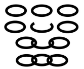

# BOJ

## 그리디 2785 체인
[문제로 이동!](https://www.acmicpc.net/problem/2785)

## 문제

희원이는 그의 다락방에서 N개의 체인을 찾았다. 각각의 체인은 몇 개의 고리로 연결되어 있는데, 각각의 고리는 최대 두 개의 인접한 고리를 가질 수 있다. 각각의 고리는 열고 닫을 수 있다. 그래서, 체인을 분리하거나 두 체인을 연결하여 하나의 긴 체인으로 만들 수 있다. 희원이는 가능한 한 적은 고리를 열고 닫아서, 모든 체인을 하나의 긴 체인으로 연결하려고 한다.

예를 들어, 희원이가 세 개의 체인을 가지고 있고, 각 체인이 고리 하나로만 이루어져 있다면, 그 중 하나를 열어서 나머지 두 개를 연결하고 닫으면 된다.

체인의 개수와 각각의 체인의 길이가 주어지면, 하나의 긴 체인으로 모든 체인을 묶기 위해 희원이가 열고 닫아야할 최소한의 고리 수를 찾아라.

## 입력

첫 번째 줄에는 체인의 개수를 나타내는 양의 정수 N (2 ≤ N ≤ 500000)이 주어진다. 두 번째 줄에는 각각의 체인의 길이를 나타내는 N개의 양의 정수 Li(1 ≤ Li ≤ 1000000)가 주어진다.

## 예제 입력



    """
    case 1:
    입력
    2
    3 3
    출력
    1
    
    case 2:
    입력
    5
    4 3 5 7 9
    출력
    3
    """



## 풀이
> 문제 해석을 case1을 예를 들면, 체인 3개가 연결되어 있는 체인이 총 두개 존재하고 있는 것이다. 그렇다면 우선 연결된 체인이 제일 적은 체인을 소모 하는 것이 체인을 최소로 사용하고
> 모든 체인을 연결할 수 있는 key point가 된다. 이후 적게 연결된 체인부터 확인해가며 전체 체인을 연결하였는지 살펴보면 된다. 예를들어 3,4,5,7,9 가 있다면, 3을 소모해 4,5,7,9를 모두 연결할 수 있다.
> 또한 2,5,6,7,8 이라면 2를 소모해 6,7,8을 연결하면 5와 (6,7,8) 이렇게 두 체인만 남게된다. 이것의 관계를 전체 n 개수와 체인이 담겨진 리스트를 반복문을 돌며 둘의 관계를 따지며 해결한다.

### solution
1. 우선 체인이 담긴 리스트 chains를 오름차순으로 정렬한다.
2. 하나의 체인에 연결된 모든 체인을 소모해도 하나의 전체 체인을 만들지 못했을 때 소모한 체인을 count하기 위한 use_chain 변수를 생성한다.
3. 반복문을 돌며 chains에서 chain을 하나씩 검사한다.
4. 만약 chain을 다 소모해도 체인을 만들지 못하면, 소모한 chain을 use_chain에 저장하고, 전체 개수 n에서 소모된 chain과 연결된 chain을 빼주어서 현재 전체 체인의 개수를 n에 저장한다.
5. 만약 chain이 n-1보다 크면 해당 체인으로 자기 자신과 다른 모든 체인을 연결해야하기 때문에 use_chain + n - 1로 리턴한다.
6. 만약 chain이 n-1과 같다면 자기 자신을 모두 소모하고 나머지 체인들이 연결되기 때문에 use_chain + chain으로 리턴한다.

### solution2
> solution2는 정답은 맞았지만, 시간초과가 뜬 풀이법이다. 내장함수를 자주 사용해서 코드를 작성하지 말자!

## 코드



    def solution(n, chains):
        count = 0
        chains.sort()
        use_chain = 0
        for chain in chains:
            if chain == n - 1:
                return use_chain + chain
            elif chain > n - 1:
                return use_chain + n - 1
            else:
                n -= (chain + 1)
                use_chain += chain
    
        return count
    
    def solution2(n, length):
        count = 0
        length.sort()
        while len(length) > 1:
            if length[0] == 0:
                length = length[1:]
            if len(length) == 2:
                count += 1
                break
            if len(length) == 1:
                break
            length[0] -= 1
            length.append(length.pop() + length.pop())
            count += 1
    
        return count
    
    if __name__ == "__main__":
        n = int(input())
        chains = list(map(int, input().split()))
        print(solution(n, chains))
