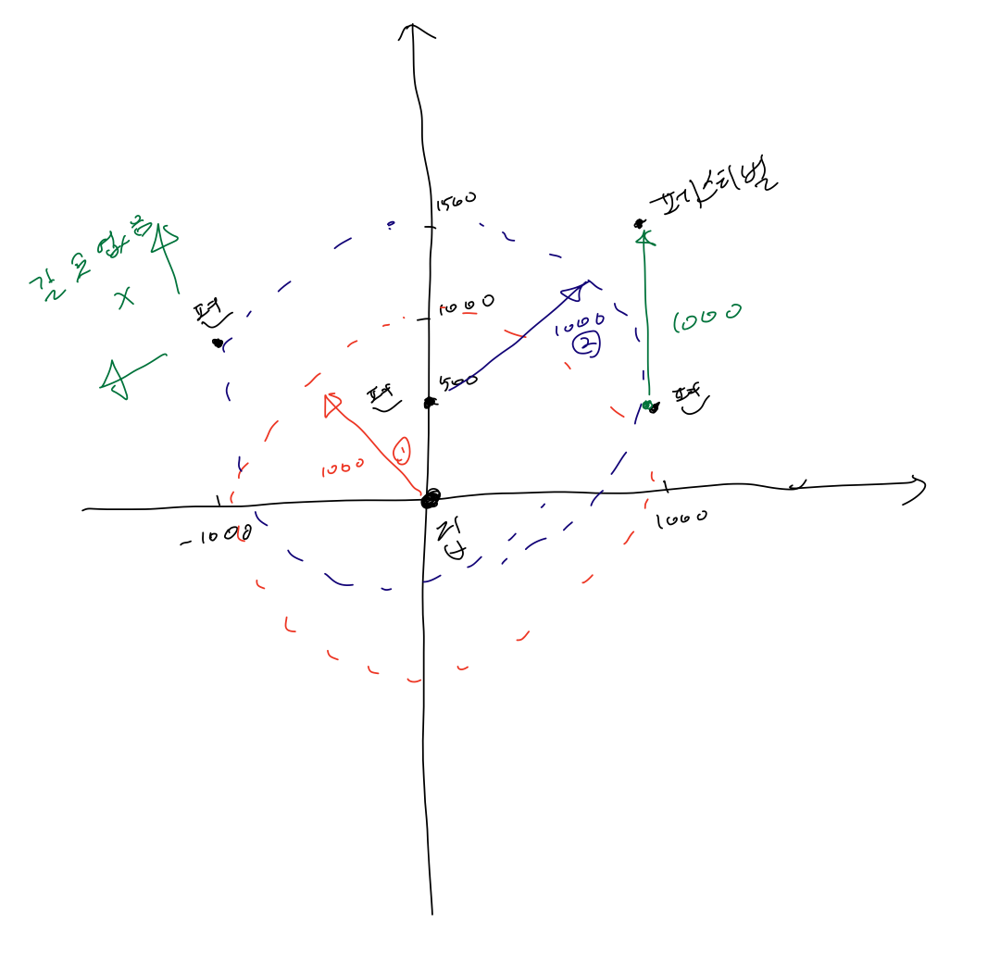

# BOJ

## DFS/BFS 9205 맥주 마시면서 걸어가기
[문제로 이동!](https://www.acmicpc.net/problem/9205)

## 문제

송도에 사는 상근이와 친구들은 송도에서 열리는 펜타포트 락 페스티벌에 가려고 한다. 올해는 맥주를 마시면서 걸어가기로 했다. 출발은 상근이네 집에서 하고, 맥주 한 박스를 들고 출발한다. 맥주 한 박스에는 맥주가 20개 들어있다. 목이 마르면 안되기 때문에 50미터에 한 병씩 마시려고 한다. 즉, 50미터를 가려면 그 직전에 맥주 한 병을 마셔야 한다.

상근이의 집에서 페스티벌이 열리는 곳은 매우 먼 거리이다. 따라서, 맥주를 더 구매해야 할 수도 있다. 미리 인터넷으로 조사를 해보니 다행히도 맥주를 파는 편의점이 있다. 편의점에 들렸을 때, 빈 병은 버리고 새 맥주 병을 살 수 있다. 하지만, 박스에 들어있는 맥주는 20병을 넘을 수 없다. 편의점을 나선 직후에도 50미터를 가기 전에 맥주 한 병을 마셔야 한다.

편의점, 상근이네 집, 펜타포트 락 페스티벌의 좌표가 주어진다. 상근이와 친구들이 행복하게 페스티벌에 도착할 수 있는지 구하는 프로그램을 작성하시오.

## 입력

첫째 줄에 테스트 케이스의 개수 t가 주어진다. (t ≤ 50)

각 테스트 케이스의 첫째 줄에는 맥주를 파는 편의점의 개수 n이 주어진다. (0 ≤ n ≤ 100).

다음 n+2개 줄에는 상근이네 집, 편의점, 펜타포트 락 페스티벌 좌표가 주어진다. 각 좌표는 두 정수 x와 y로 이루어져 있다. (두 값 모두 미터, -32768 ≤ x, y ≤ 32767)

송도는 직사각형 모양으로 생긴 도시이다. 두 좌표 사이의 거리는 x 좌표의 차이 + y 좌표의 차이 이다. (맨해튼 거리)

## 예제 입력


    """
    case 1:
    입력2
    2
    0 0
    1000 0
    1000 1000
    2000 1000
    2
    0 0
    1000 0
    2000 1000
    2000 2000
    출력
    happy
    sad
    """


## 풀이
> 처음은 그리디 정렬로 접근 하였다. 하지만, 정렬로 접근하면 음수값에서 큰 오류가 발생한다. 그렇기 때문에 원점(상근이의 집)과 각 편의점끼리 갈 수 있는 거리인지 조사를 해야한다.
> 원점과 각 편의점이 노드이고 갈 수 있는 거리(1000m)가 조건이다. 원점부터 1000m 거리에 있는 편의점들을 큐에 넣고, 해당 편의점에서 또 갈 수 있는 편의점들을 큐에 넣다보면,
> 어느새 페스티벌에 갈 수 있는지 갈 수 없는지를 판단할 수 있다. visited 배열을 통해서 한번 갔던 편의점들은 방문처리를 해서 재방문을 하지 않도록 한다.

- 그리디 정렬에서 해결할 수 없는 예제


1
2
0 500
-1000 1000
1000 500
1000 1500

  
### solution
1. 각각의 테스트를 반복문을 통해 하나씩 bfs 함수를 호출하고 print 해준다.
2. bfs에서 상근이의 집(start) 좌표를 큐에 넣는다.
3. 큐가 빌 때까지 while문을 돈다.
4. 큐에서 x, y 좌표를 꺼낸다.
5. test(편의점과 페스티벌 도착 위치가 담겨져 있는 리스트)를 반복문을 돌면서 하나씩 꺼내서 x, y 좌표와 비교한다.
6. 1000 이하라면, 해당 test의 좌표를 큐에 넣고 방문처리한다.
7. 만약 페스티벌이 방문처리되면 즉시 리턴한다.

## 코드



    from collections import deque
     

    def bfs(start, test, length):
        queue = deque()
        queue.append((start))
        while queue:
            x, y = queue.popleft()
            for i in range(length):
                if not visited[i]:
                    if abs(x-test[i][0]) + abs(y-test[i][1]) <= 1000:
                        queue.append(test[i])
                        visited[i] = True
                        if visited[length-1]:
                            return True
    
    
    if __name__ == "__main__":
        n = int(input())
        tests = []
        starts = []
        ends = []
        for _ in range(n):
            x = []
            m = int(input())
            starts.append(list(map(int, input().split())))
            for _ in range(m+1):
                x.append(list(map(int, input().split())))
            tests.append(x)
    
        for start, test in zip(starts, tests):
            length = len(test)
            visited = [False] * (length+1)
            if bfs(start, test, length):
                print("happy")
            else:
                print("sad")
