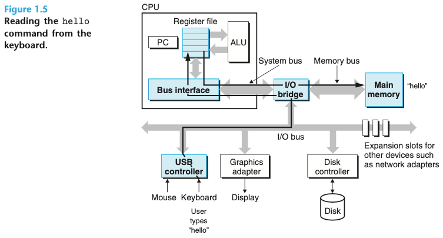
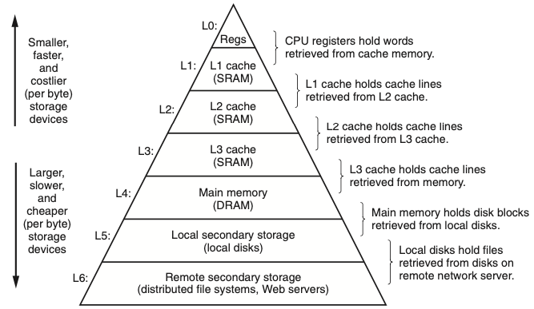

# CS:APP
Computer Systems A Programmer's Perspective, CSAPP로도 잘 알려져있는 컴퓨터 구조론의 바이블이다. 이 책을 통해서 컴퓨터구조론을 다시 공부해볼 생각이다.
군대 전역 직후 2학년 2학기로 복학해서 컴퓨터 구조론 전공 수업을 들었지만 학점을 위한 공부만 해서 남아있는게 없는 것 같다. 인턴 생활을 하면서 다양한 부분에서 어려움을 겪었는데
기초를 몰라서 헤메고 있다는 느낌을 굉장히 많이 받았다. 

첫 페이지를 읽었을 때 이 책으로 정하길 정말 잘했다는 생각이 들었다. 전공 수업때 사용했던 컴퓨터구조론 책은 제작자의 관점에서 기술 되었다는 느낌을 강하게 받았었다.
하지만, CSAPP는 프로그래머의 관점에서 기술하였고, 컴퓨터구조론의 시스템들을 어떻게 사용해서 좋은 프로그램을 개발할 수 있는지를 배울 수 있다고 한다. 
인턴 생활을 하면서 실제 현업을 겪고 느꼇던 강한 의문들을 해결할 수 있을 것 같은 느낌이다.

책의 목차는 정보의 표현과 처리로 시작하여 프로그램의 기계어 표현, 프로세서 구조, 프로그램 성능 최적화, 메모리 계층구조, 링커, 예외적인 제어흐름, 가상메모리, 시스템 수준 입출력, 네트워크 프로그래밍, 동시성 프로그래밍 
순서로 이어져 있다. 많은 사람들은 6장 메모리 계층구조, 7장 링커의 전까지 읽어도 좋다고 하지만, 가능하다면 12장 동시성 프로그래밍까지 읽어볼 생각이다.

# Chapter 01. 컴퓨터 시스템으로의 여행
- 시스템 구현방식은 변하지만 근본적인 개념들은 변하지 않는다.
- 프로그래머들로 하여금 컴포넌트들이 어떻게 동작하고 프로그램 성능과 정확성에 어떤 영향을 주는지 알 수 있다.

### 1.1 정보는 비트와 컨텍스트로 이루어진다.
- 텍스트 문자 -> 아스키(ASCII) 표준 사용하여 표현 -> 각 문자를 바이트 길이의 정수 값으로 표현 -> 연속된 바이트 파일 저장 

### 1.2 프로그램은 다른 프로그램에 의해 다른 형태로 번역된다.
- hello.c 실행 -> 저급 기계어 인스트럭션들로 번역 -> (실행가능 목적 프로그램)으로 합쳐져 바이너리 디스크 파일로 저장 
  -> 컴파일러 드라이브는 유닉스 시스템에서 소스파일에서 오브젝트 파일로 변경 -> 4개의 단계를 거쳐서 실행
    - 4개의 단계:
        1. 전처리기
        2. 컴파일러
        3. 어셈블러
        4. 링커 
    
### 1.3 컴파일 시스템이 어떻게 동작하는지 이해하는 것은 중요하다.
- 프로그램 성능 최적화하기
    - eg1) switch문은 if-else문을 연속해서 사용하는 것보다 효율적인가?
    - eg2) while 루프는 for 루프보다 더 효율적일까?
    - eg3) 포인터 참조가 배열 인덱스보다 더 효율적인가?
- 링크 에러 이해하기
    - eg1) 정적변수와 전역변수의 차이는 무엇인가?
    - eg2) 다른 파일에 동일한 이름의 두 개의 전역변수를 정의한다면 무슨 일이 일어나는가?
- 보안 약점 피하기
    - eg1) 프로그램 스택에 데이터와 제어 정보가 저장되는 방식은 무엇인가? 
    
### 1.4 프로세서는 메모리에 저장된 인스트럭션을 읽고 해석한다.
> 인스트럭션이란 : 컴퓨터에게 일을 시키는 단위(기계어)

- 시스템의 하드웨어 조직
    - 버스 : 시스템 내를 관통하는 전기적 배선군
    - 입출력 장치 : 시스템과 외부세계외의 연결 담당
    - 메인 메모리 : 프로세서가 프로그램을 실행하는 동안 데이터와 프로그램을 모두 저장하는 임시 저장장치
    - 프로세서 : 인스트럭션들을 해독(실행)하는 엔진
        - 인스트럭션의 요청에 의해 CPU(프로세서)가 실행하는 단순한 작업의 예
            - 적재(load), 저장(store), 작업(operate), 점프(jump)
    
- 프로그램의 실행
  
    
   

### 1.5 캐시가 중요하다.
- hello 프로그램의 기계어 인스트럭션들은 본래 하드디스크에 저장되어 있다.
- 프로그램이 로딩될 때 이들은 메인 메모리로 복사된다.
- 이 작업이 시간이 너무 오래 걸려서 "단기간에 필요로 할 가능성이 높은 정보를 임시로 저장하는" 캐시 메모리가 설계 되었다.
- 캐시 시스템의 이면에 깔려 있는 아이디어는 프로그램이 지엽적인 영역의 코드와 데이터를 액세스하는 경향인 지역성을 활용하였다. 

### 1.6 저장장치들은 계층구조를 이룬다.
- 모든 컴퓨터 시스템의 저장장치즈들은 메모리 계층구조로 구성되어 있다.

    

### 1.7 운영체제는 하드웨어를 관리한다.
- 운영체제는 두 가지 주요 목적을 가지고 있다.
    1. 제멋대로 동작하는 응용프로그램들이 하드웨어를 잘못 사용하는 것을 막기 위해
    2. 응용프로그램들이 단순하고 균일한 메커니즘을 사용하여 복잡하고 매우 다른 저수준 하드웨어 장치들을 조작할 수 있도록 하기 위해 
- 위 두가지 목표를 위해 근본적인 추상화를 통해 달성하고 있다.
- 추상화 결과
    - 프로세스 : 프로세서, 메인 메모리, 입출력장치 모두의 추상화 결과
    - 가상 메모리 : 메인 메모리와 디스크 입출력 장치의 추상화
    - 파일 : 입출력장치의 추상화

### 1.8 시스템은 네트워크를 사용하여 다른 시스템과 통신한다.
- 네트워크는 또 다른 입력장치로 볼 수 있다.
- 시스템이 메인 메모리로부터 네트워크 어댑터로 일련의 바이트를 복사할 때, 데이터는 로컬디스크 드라이브 대신에 네트워크를 통해서 다른 컴퓨터로 이동된다.

### 1.9 중요한 주제들
- Amdahl의 법칙
    - 우리가 어떤 시스템의 한 부분의 성능을 개선할 때, 전체 시스템 성능에 대한 효과는 구 부분이 얼마나 중요한가와 이 부분이 얼마나 빨라졌는가에 관계된다.
- 동시성과 병렬성
    - 동시성 : 다수의 동시에 벌어지는 일을 갖는 시스템에 관한 일반적인 개념
    - 병렬성 : 동시성을 사용해서 시스템을 보다 더 빠르게 동작하도록 하는 것
    - 쓰레드 수준 동시성 
        - 쓰레드를 이용하면 한 개의 프로세스 내에서 실행되는 다수의 제어흐름을 가질 수 있음
    - 인스트럭션 수준 병렬성
        - 프로세서들은 훨씬 낮은 수준에서의 추상화로 여러 개의 인스트럭션을 한 번에 실행할 수 있음
- 컴퓨터 시스템에서 추상화의 중요성
    - 추상화의 사용은 전산학에서 가장 중요한 개념!
    
### 1.10 요약
1. 컴퓨터 내의 정보는 비트들의 그룹으로 표시
2. 컴파일러와 링커에 의해 바이너리 실행파일들로 번역
3. 프로세서는 메인 메모리에 저장된 바이너리 인스트럭션을 읽고 해석
4. 컴퓨터는 대부분의 시간을 메모리, 입출력장치, CPU 레지스터 간에 데이터를 복사하고 쓰는 데 사용
5. 위와 같은 이유로 시스템의 저장장치들은 계층구조 형성
6. 운영체제 커널은 응용프로그램과 하드웨어 사이에서 중간자 역할 수행
7. 네트워크는 컴퓨터 시스템이 서로 통신할 수 있는 방법 제공

  
