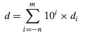
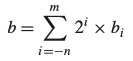
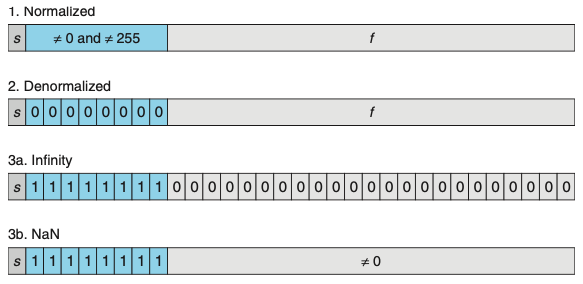

# Chapter 02. 정보의 표현과 처리
- 2.1 정보의 저장
    - 컴퓨터는 데이터, 인스트럭션등을 어떻게 저장하는지
- 2.2 정수의 표시
    - 인코딩, 비부호형 및 2의보수
- 2.3 정수의 산술연산
    - 비부호형 및 2의보수의 덧셈,뺄셈,곱셉,나눗셈

  

# 2.4 부동소수점 
- 부동소수점 표현은 V = x*2^y 형태의 소수를 인코딩한다.
- 거의 모든 컴퓨터가 IEEE 부동소수점이라고 알려지게 된 방식을 지원한다.

  

## 2.4.1 비율이진수(Fractional Binary Numbers)
- 부동소수점에 대해서 이해하기 위한 첫 단계는 비율 이진수에 대해 생각해보는 것이다.
    - 숫자들의 자리값은 십진 소수점 부호('.')에 상대적으로 정의된다.
    
    
  
- 위와 같은 방식으로 binary 표기법으로 생각해보자.
    - 부호 '.'는 이진 소수점이 되고, 좌측의 브트들은 비음수의 2의 제곱을 자리값으로 가지며, 우측은 2의 음의 제곱을 자리값으로 갖는다.
    - 이진 소수점을 한 자리 우측으로 이동하면 2로 곱한 효과, 좌측으로 이동하면 2로 나눈 효과를 가진다.
  
    
- 이진수 표기는 x*2^y로 나타낼 수 있는 수만 표시할 수 있다. 
- 이진 표시를 길게 늘려서 정확도를 높이도록 근사해야 한다.

  

## 2.4.2 IEEE 부동소수점 표시
- IEEE 부동소수점 표준은 수를 V = (-1)^s*M*2^E 형태로 나타낸다
    - s는 음수와 양수를 결정한다.
    - 유효숫자 M은 비율 이진수다.
    - 지수 E는 2의 제곱으로 자리값을 제공한다.
- 부동소수점 수의 비트 표시는 이 값들을 인코딩하기 위해 세 개의 필드로 나누어진다.
    - 한 개의 부호 비트 s는 부호 s를 직접 인코딩한다.
    - k비트 지수 필드 exp = ek-1...e1e0는 지수 E를 인코딩한다.
    - n비트 비율 필드 frac = fn-1 ... f1f0는 유효숫자 M을 인코딩한다.
  

- Case 1: 정규화 값 Normalized Values
    - 가장 일반적인 경우
    - exp의 비트 패턴이 모두 0은 아니며, 모두 1이 아니어야 한다.
    - E = e - Bias (Bias = 2^(k-1) - 1)
    - 비율 필드 frac은 비율 값 f
    - 유효 숫자 M = 1 + f 로 정의
- Case 2: 비정규화 값 Denormalized Values
    - 지수 필드가 모두 0일 때 나타낸 수는 비정규화 형태를 갖는다.
    - E = 1 - Bias
    - M = f = 0
    - 비정규화 숫자들의 기능은 0.0에 매우 가까운 값들을 나타냄
        - 이들은 점증적 언더플로우라고 알려진 특성을 제공 (가능한 숫자 값들이 0.0 근처에서 같은 간격을 갖는다는 의미)
- Case 3: 특수 값 Special Values
    - 지수 필드가 모두 1인 경우
        - 비율 필드가 모두 0이면, 결과값은 무한대를 나타냄
        - 비율 필드가 0이 아니면 NaN(not a numbuer)
  

    

  

## 2.4.3 숫자 예제

## 2.4.4 근사법 Rounding
- 부동소수점 산술연산은 표시방법이 제한된 범위와 정밀도를 갖기 때문에 실제 연산의 근사값을 사용할 수밖에 없다.
- "가장 유사한" 값 x를 체계적으로 계산하는 방법을 근사rounding 연산이다.
- 네가지 근사 모드를 정의함
  - 짝수근사법(round-to-even): 가장 가까운 값, 중간에 위치할 경우 짝수를 향해 근사함 
  - 영방향근사 모드(round toward-zero): 양수 값을 아래쪽으로, 음수를 위쪽으로 근사함
  - 하향근사 모드(round-down): 양수와 음수를 모두 아래쪽으로 근사함
  - 상향근사 모드(round-up): 양수와 음수를 모두 위쪽으로 근사함
  
  

## 2.4.5 부동소수점 연산
- 부동소수점 값 x,y를 실수로 보고, 일부 연산이 실수들에 대해 정의된다면 Round(x,y)가 되는데, 이것은 실수 연산의 정확한 결과 값을 근사한 것이다.
- 부동소수점 덧셈에서 결합법칙이 성립하지 않는 것은 그룹의 특징 중에서 빠진 가장 중요한 부분이다.
- 교환법칙은 성립하지만, 결합벅칙은 성립 되지 않는다.

  

## C에서 부동소수점 
- C는 짝수 근사모드를 사용한다.
- int에서 float로, 숫자는 오버플로우할 수 없지만, 근사될 수 있다.
- int나 float에서 double로, 정확한 수치 값은 보존될 수 있다.
- double에서 float로 범위가 더 작아지기 때문에 값이 오버플로우하여 무한대가 될 수 있따.
- float나 double에서 int로, 값은 0 방향으로 근사된다

  

# 2.5 요약
- 정보를 비트로 인코딩하며, 이들은 일반적으로 연속된 바이트들로 구성된다.
- 대부분의 머신들은 정수를 인코딩하기 위해 2의 보수를 사용하고 부동소수점을 인코딩하기 위해 IEEE 표준 754를 사용한다.
- 부호형 및 비부호형 정수를 캐스팅할 때 비트 패턴을 유지하려고 하는데, T2U, U2T 함수들에 의해 나타난다.
- 제한된 길이는 숫자들이 나타낼 수 있는 범위를 넘어설 때 오버플로우를 발생시킨다.
- 비부호형과 2의 보수 산술연산은 결합법칙, 교환법칙, 분배법칙 등의 정수 산술연산의 많은 특성을 만족한다.
- 결합법칙, 교환법칙, 분배법칙 특성을 쉬프트와 2의 제곱의 곱셈 간 관계와 함께 사용된다.
- 부동소수점 산술연산은 매우 조심스럽게 사용해야한다.
  - 제한된 범위와 정밀도를 갖기 때문이며, 결합법칙 같은 일반적인 수학 법칙을 따르지 않기 때문이다.
  
  

> 부동소수점을 마지막으로 Chapter2 정보의 표현과 처리를 마무리하였다. 데이터 엔지니어링 인턴 포지션에서 ETL 작업을 하며 소수점 데이터에 접근 했을 때 
> R코드와 Python의 소수 처리 방식이 달라서 해당 오류를 잡는데 많은 시간이 걸린 경험이 있었다. 그 때 당시에는 대충 방식이 다르구나~ 로 끝났지만, 이번 챕터를
> 공부하게 되면서 아 부동소수점의 표현 방식 때문에(책은 C를 기준으로 하고 있지만,,,) 그런 오류가 잡혔던 거구나 하고 시야가 조금 더 넓어진 것 같다. 
> 2.2절의 캐스팅과 2.4절의 부동소수점을 공부하면서 꽤 많은 애를 먹었지만, 앞으로 코딩을 하면서 캐스팅이나 소수점을 다룰 때 더 주의 깊게 다룰 수 있을 것 같다.