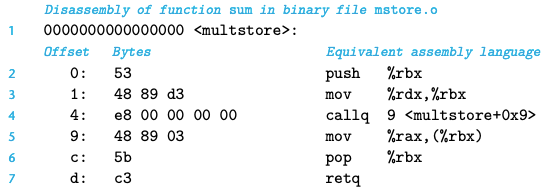
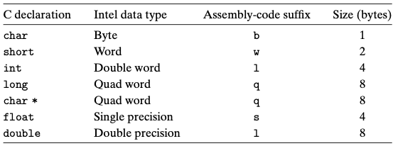
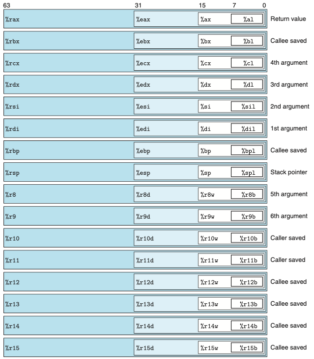
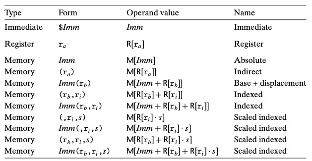
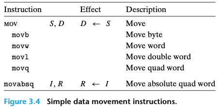
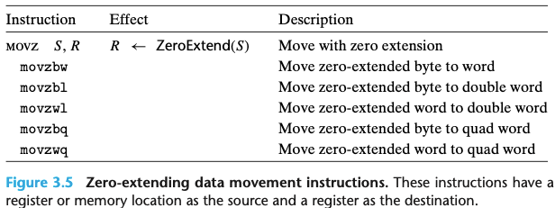
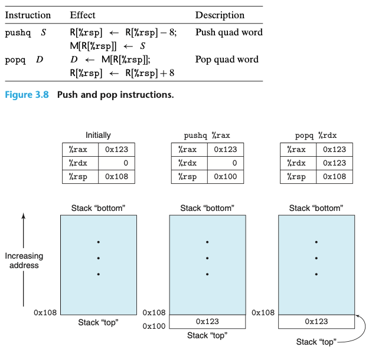

# Chapter 03. 프로그램의 기계수준 표현
- 컴퓨터는 데이터를 처리하고, 메모리를 관리하고, 저장장치에 데이터를 읽거나 쓰고, 네트워크를 통해 통신하는 등의 하위 동작들을 인코딩한 연속되 바이트인 기계어 코드를 실행한다.
- 컴파일러는 프로그램 언어의 규칙, 대상 컴퓨터의 인스트럭션 집합, 운영체제의 관례 등에 따라 기계어 코드를 생성한다.
- 어셈블러 코드로 프로그램을 짤 때는 프로그래머가 계산을 하기 위해 사용해야 하는 저급 인스트럭션들을 명시해야 한다.
- 기계어 코드를 배우면 컴파일러의 최적화 성능을 알 수 있으며, 코드에 내제된 비효율성을 분석할 수 있다.
- 이 장은 X86-64에 기초하고 있다.

  

# 3.1 역사적 관점
- x86이라고 통칭하는 인텔 프로세서 제품군은 오랜 기간 진화를 통한 개발을 해왔다.
> 대충 엄청 많은 프로세서들이 나열 되는데, 팬티엄4E(2004, 125M 트랜지스터) 하이퍼쓰레딩 기법의 추가와 AMD사에서 개발한 IA32의 64비트 확장 구현인 EM64T가
> 추가된 해당 모델을 x86-64라고 부른다고 한다.

  

# 3.2 프로그램의 인코딩
- C 언어에서 gcc 명령은 소스 코드(test.c)를 실행 코드로 변환하기 위해 일련의 프로그램들을 호출한다.
    1. C 전처리가 #include로 명시된 파일을 코드에 삽입해 주고 #define으로 선언된 매크로를 확장해준다.
    2. 컴파일러는 소스파일의 어셈블러 버전(test.s)를 생성한다.
    3. 어셈블러는 어셈블리 코드를 바이너리 목적코드인(test.o)로 변환한다.
        - 목적코드는 기계어 코드의 한 유형이다. - 모든 인스트럭션과 바이너리 표현을 포함하고 있지만 전역 값들의 주소는 아직 채워지지 않았다.
    4. 마지막으로 링커가 목적코드 파일을 라이브러리 함수들을 구현한 코드와 함께 합쳐서 최종 실행 파일인 p를 생성한다.
- 커맨드 라인 옵션으로 -0g를 주면 C 코드의 전체 구조를 따르는 기계어 코드를 생성하는 최적호 수준을 적용한다.
    - 높은 수준의 최적화를 적용하면 만들어진 코드가 너무 많이 변경되어 본래의 코드와 생성된 기계어 코드 간의 관계를 이해하기 어렵다.

  

## 3.2.1 기계수준 코드
- 컴퓨터 시스템은 보다 간단한 추상화 모델을 이용해서 세부 구현내용을 감추면서 추상화의 여러 가지 다른 형태를 사용하고 있다.
    1. 기계수준 프로그램의 형식과 동작은 인스트럭션 집합구조 즉 "ISA"에 의해 정의된다.
        - 프로세서의 상태, 인스트럭션의 형식, 프로세서 상태에 대한 각 인스트럭션들의 영향들을 정의한다.
    2. 기계수준 프로그램이 사용하는 주소는 가상주소이며, 메모리가 매우 큰 바이트 배열인 것처럼 보이게 하는 메모리 모델을 제공한다.
- 컴파일러는 추상화된 실행모델로 표현된 프로그램을 프로세서가 실행하는 매우 기초적인 인스트럭션들로 변환하는 대부분의 일을 수행한다.

  

## 3.2.2 코드 예제

- 기계어 코드의 몇몇 특징과 이들의 역어셈블된 표현에 주목할 필요가 있다.
    - x86-64 인스트럭션들은 1에서 15바이트 길이를 갖는다.
    - 인스트럭션의 형식은 주어진 시작 위치에서부터 바이트들을 기계어 인스트럭션으로 유일하게 디코딩할 수 있도록 설계한다.
    - 역어셈블러는 기계어 코드 파일의 바이트 순서에만 전적으로 의존한다.

  

# 3.3 데이터의 형식
- 인텔 프로세서들이 근본적으로 16비트 구조를 사용하다가 추후에 32비트로 확장했기 때문에 인텔은 "워드"라는 단어를 16비트 데이터 타입을 말할 때 사용한다.

  

# 3.4 정보 접근하기
- x86-64 주처리장치 CPU는 64비트 값을 저장할 수 있는 16개의 범용 레지스터를 보유하고 있다.
    - 이들 레지스터는 정수 데이터와 포인터를 저장하는데 사용한다.

  

## 3.4.1 오퍼랜드 식별자 specifier
- 대부분의 인스트럭션은 하나 이상의 오퍼랜드를 가진다. 
- 오퍼랜드는 연산을 수행할 소스 값과 그 결과를 저장할 목적지의 위치를 명시한다.
- 소스 값은 상수로 주어지거나 레지스터나 메모리로부터 읽을 수 있다. 결과 값은 레지스터나 메모리에 저장된다.
- 세가지 타입으로 나뉘어짐
    1. immediate로, 상수값을 말한다.
    2. register는 레지스터의 내용을 나타내며
    3. Memory, 메모리 참조로 유효주소라고 부르는 계산된 주소에 의해 메모리 위치에 접근하게 된다.

  

## 3.4.2 데이터 이동 인스트럭션
- 가장 많이 사용되는 인스트럭션은 데이터를 한 위치에서 다른 위치로 복사하는 명령어다.
    - MOV 클래스 : 소스 위치에서 데이터를 목적지 위치로 어떤 변환도 하지 않고 복사한다.
- 소스 오퍼랜드는 상수, 레지스터 저장 값, 메모리 저장 값을 표시한다.
- 목적 오퍼랜드는 레지스터 또는 메모리 주소의 위치를 지정한다.
- x86-64는 데이터 이동 인스트럭션에서 두 개의 오퍼랜드 모두가 메모리 위치에 올 수 없도록 제한하고 있다.

  

## 3.4.3 코드 예제

> - C언어에서 "포인터"라고 부르는 것이 어셈블리어에서는 단순히 주소를 나타낸다.
> - 포인터를 역참조하는 것은 포인터를 레지스터에 복사하고, 이 레지스터를 메모리 참조에 사용하는 과정으로 이루어진다.
> - 지역변수들은 메모리에 저장되기보다는 종종 레지스터에 저장된다.

  

## 3.4.4 스택 데이터의 저장과 추출 push,pop
- push와 pop은 프로그램 스택에 데이터를 저장(push)하거나 스택에서 데이터를 추출(pop)하기 위해 사용한다.
- 스택은 프로시저 호출을 처리하는 데 중요한 역할을 한다.
- 프로그램 스택은 메모리의 특정 영역에 위치한다.
- 스택의 탑top 원소가 모든 스택 원소 중에서 가장 낮은 주소를 갖는 형태다.
- 스택은 pop이 되어도 stack의 top을 표현하는 주소가 올라간거지 값은 여전히 pop이 된 위치에 남아있다.
- 스택이 프로그램 코드와 다른 형태의 프로그램 데이터와 동일한 메모리에 저장되기 때문에 프로그램들은 표준 메모리 주소지정 방법을 사용해서 스택 내 임의의 위치에 접근할 수 있다.

