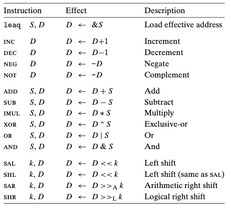
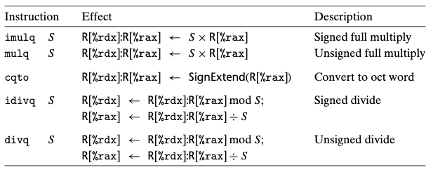
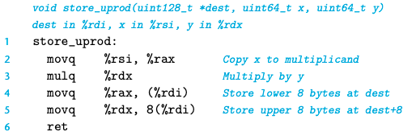

# Chapter 03. 프로그램의 기계수준 표현
- 3.1 역사적 관점
- 3.2 프로그램의 인코딩
- 3.3 데이터의 형식
- 3.4 정보 접근하기
- 3.5 산술연산과 논리연산

# 3.5 산술연산과 논리연산

- 위 그림은 x86-64 정수와 논리연산의 리스트를 보여준다. 오퍼랜드의 길이에 따른 다양한 변형이 가능하기 때문에 대부분의 연산을 인스트럭션 클래스에 따라 나열하였다.
- 인스트럭션 클래스 ADD는 네 개의 덧셈 인스트럭션으로 이루어져 있다.
    - addb, addw, addl, addq로 각각 바이트, 워드, 어블워드, 쿼드워드를 의미한다.
- 연산들은 네 개의 그룹으로 나누어진다.
    - 유효주소 적재, 단항unary, 이항binary, 쉬프트
        - 이항 연산은 두 개의 오퍼랜드를 가진다.
        - 단항 연산은 한 개의 오퍼랜드를 가진다.

## 3.5.1 유효주소 적재 Load Effective Address
- 유효주소 적재 인스트럭션 leaq는 실제로는 movq 인스트럭션의 변형이다.
- 메모리에서 레지스터로 읽어들이는 인스트럭션의 형태를 갖지만, 메모리를 전혀 참조하지 않는다.
- 가리키는 위치에서 읽기를 수행하는 대신에 유효주소를 목적지에 복사한다.
- 이 인스트럭션은 나중의 메모리 참조에 사용하게 되는 포인터를 생성하기 위해 사용한다.
- 또한 일반적인 산술연산을 간결하게 설명하기 위해 사용된다
    - ex) %rdx가 x를 가지고 있다면, leaq 7(%rdx, %rdx, 7)은 %rdx에 5x+7을 저장한다.
- 목적 오퍼랜드는 반드시 레지스터만 올 수 있다.

## 3.5.2 단항 및 이항 연산
- 단항 연산
    - 하나의 오퍼랜드가 소스와 목적지로 동시에 사용되는 단항 연산이다.
    - 오퍼랜드는 레지스터나 메모리 위치가 될 수 있다.
    - ex) incq(%rsp)는 스택 탑의 8바이트 원소의 값을 증가시켜준다. -> C에서의 ++, -- 연산자
- 이항 연산
    - 첫 번째 오퍼랜드는 상수나 레지스터, 메모리 위치가 올 수 있고 두 번째 오퍼랜드는 소스이면서 목적지로 사용된다.
    - C에서 x -= y와 유사하다.
    - 두 개의 오퍼랜드가 모두 메모리 위치가 될 수 없다.
    - 두 번째 오퍼랜드가 메모리 위치일 때 프로세서가 메모리에서 값을 읽고, 연산을 하고, 그 결과를 다시 메모리에 써야 한다는 점에 유의해야 한다.

## 3.5.3 쉬프트 연산
- 쉬프트하는 크기를 먼저 주고, 쉬프트할 값을 두 번째로 준다.
- 산술과 논리형 우측 쉬프트가 모두 가능하다.
- 쉬프트 인스트럭션들은 쉬프트할 양을 즉시 값이나 단일 바이트 레지스터 %cl로 명시할 수 있다.
- 좌측 쉬프트 인스트럭션에는 두 가지 이름이 있다.
    - SAR: 산술 쉬프트, 부호비트를 복사해서 채운다
    - SHR: 논리 쉬프트, 0으로 채운다
- 쉬프트 연산의 목적 오퍼랜드는 레지스터나 메모리 위치가 될 수 있다.

## 3.5.4 토의
- 인스트럭션들은 비부호형과 2의 보수 산술연산에 사용될 수 있다.
- 오직 우측 쉬프트만이 부호형과 비부호형 데이터를 구분하는 인스트럭션을 요구한다.
- 이것이 부호형 정수 산술연산을 구현하는 방식으로 2의 보수 산술연산을 선호하는 주요 특징이다.

## 3.5.5 특수 산술연산

- 두 개의 64비트 부호형 또는 비부호형 정수들 간의 곱셈 결과값을 표시하기 위해 128비트를 필요로한다. 
- x86064 인스트럭션 집합은 128비트 숫자와 관련된 연산에 대해서는 제한적인 지원을 제공한다.
    - 워드(2바이트), 더블워드(4바이트), 쿼드워드(8바이트), 인텔은 16바이트 워드를 옥트워드oct word라고 명명한다.
- IMUL 인스트럭션 클래스의 멤버인 형태
  - 이 형식은 두 개의 64비트 오퍼랜드로부터 64비트 곱을 생성하는 "2 오퍼랜드" 곱셈 인스트럭션을 제공한다.
- 추가적으로 x86-64는 두 개의 다른 "단일 오퍼랜드" 곱셈 인스트럭션을 제공하며 64비트 값의 완전한 128비트 곱을 계산한다.
  - 하나는 비부호형(mulq), 다른 하나는 2의 보수(imulq) 곱셈이다.
  - 이들 모두 한 개의 인자는 레지스터 %rax에 보관해야 하고 다른 하나는 인스트럭션 소스 오퍼랜드로 주어진다.
  - 곱은 레지스터 %rdx(상위 64비트)와  %rax(하위 64비트)에 저장된다.
- 곱을 저장하기 위해서는 아래의 그림처럼 두 개의 movq 인스트럭션이 필요하다.

     
- 단일 오퍼랜드 곱셈 인스트럭션과 비슷한 단일 오퍼랜드 나눈셈 인스트럭션으로 제공된다.
- 나눗셈 인스트럭션 idviq은 피제수dividened를 128비트로 레지스터 %rdx(상위 64비트)와 %rax(하위 64비트)에 저장한다. 
- 제수divisor는 인스트럭션의 오퍼랜드로 주어진다.
- 인스트럭션은 몫은 레지스터 %rax에, 나머지는 레지스터 %rdx에 저장한다.

  

  

    
    
