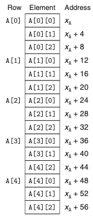
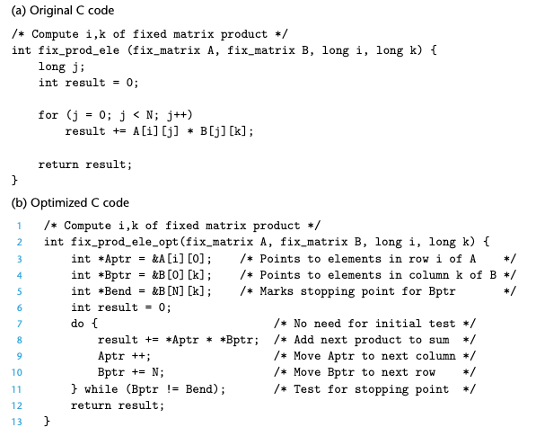
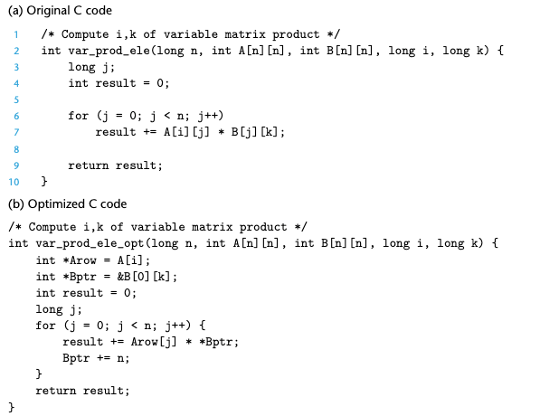

# Chapter 03. 프로그램의 기계수준 표현
- 3.1 역사적 관점
- 3.2 프로그램의 인코딩
- 3.3 데이터의 형식
- 3.4 정보 접근하기
- 3.5 산술연산과 논리연산
- 3.6 제어문
- 3.7 프로시져
- 3.8 배열의 할당과 접근

# 3.8 배열의 할당과 접근

C에서 배열은 스칼라 데이터를 보다 큰 자료형으로 연계시키는 수단이다.

## 3.8.1 기본 원리

- 자료형 T와 정수형 상수 N에 대해서 다음과 같은 선언에 대해 생각해보자.
    - T A[N]; 
- 시작하는 위치를 Xa로 표시하자. 이 선언은 두가지 효과를 갖는다.
    1. 이것은 L*N 바이트의 연속적인 공간을 메모리에 할당하며, 여기서 L(바이트 단위)은 자료형 T의 크기를 나타낸다.
    2. 새로운 식별자 a를 통해서 배열이 시작하는 위치의 포인터로 사용한다.
- 배열의 각 원소는 0에서 N-1 사이의 정수형 인덱스를 사용해서 접근할 수 있다.
- 배열의 원소 i는 주소 Xa +L*i에 저장된다.

## 3.8.2 포인터 연산

- C는 포인터 간에 연산을 허용하며, 계산된 값은 포인터가 참조하게 되는 자료형의 크기에 따라 그 값이 확대된다.
- 어떤 객체를 나타내는 식 Expr에 대해 &Expr는 그 객체의 주소를 주는 포인터이다.
- 주소를 나타내는 식 A Expr에 대해 *A Expr는 그 주소에 위치한 값을 준다.

## 3.8.3 다중 배열

- 배열 할당과 참조에 관한 일반적인 원칙들은 심지어 배열의 배열을 생성할 때도 적용된다.
- 배열의 원소들은 메모리에 "행 우선row major" 순서로 저장된다.

## 3.8.4 고정크기의 배열

- C 컴파일러는 고정크기의 다차원 배열을 위한 코드에 대해 다양한 최적화를 수행할 수 있다.
- 아래의 그림은 고정길이 배열에 대한 행렬 곱셈의 원소 i,k를 계산하는 최초의 코드와 최적화된 코드이다. 컴파일러는 이런 최적화를 자동으로 실행한다.

 
## 3.8.5 가변크기의배열

- 가변크기 배열을 원하는 프로그래머는 배열들을 위한 저장공간을 mallock이나 calloc 같은 함수를 사용해서 할당해야한다.
- 아래의 그림은 가변크기 배열에 대한 행렬 곱셈의 원소 i,k를 계산하는 최초의 코드와 최적화된 코드이다. 컴파일러는 이런 최적화를 자동으로 실행한다.

  
> 다중배열의 원소들을 접근할 때 발생하는 패턴을 인식할 수 있다는 것을 살펴보았다. 
> 곱셈을 회피하는 코드를 생성할 수 있다. 
> 이런 최적화들은 프로그램 성능을 상당히 개선하게 된다