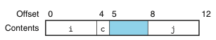

# Chapter 03. 프로그램의 기계수준 표현
- 3.1 역사적 관점
- 3.2 프로그램의 인코딩
- 3.3 데이터의 형식
- 3.4 정보 접근하기
- 3.5 산술연산과 논리연산
- 3.6 제어문
- 3.7 프로시져
- 3.8 배열의 할당과 접근
- 3.9 이기종 자료구조
- 3.10 기계수준 프로그램에서 제어와 데이터의 결합

# 3.9 이기종 자료구조

- C는 서로 다른 유형의 객체를 연결해서 자료형을 만드는 두 가지 방법을 제공한다.
    - struct 키워드를 사용해서 선언하는 구조체
        - 다수의 객체를 하나의 단위로 연결한다.
    - union으로 선언하는 공용체
        - 하나의 객체를 여러 개의 다른 자료형으로 참조될 수 있도록 한다.
    
## 3.9.1 구조체

- 서로 다른 유형의 객체들을 하나의 객체로 묶어주는 자료형을 생성한다.
- 구조체의 구현은 구조체의 모든 컴포넌트들이 메모리의 연속된 영역에 저장된다.
- 구조체의 포인터가 첫 번째 바이트의 주소라는 점에서 배열과 유사하다.

  
## 3.9.2 공용체

- C언어의 자료형 체제를 회피해서 하나의 객체가 다수의 자료형에 따라 참조될 수 있도록 해준다.
- 공용체를 선언하는 문법은 구조체와 동일하나 그 의미는 매우 다르다.
    - 다른 필드들이 메모리의 다른 블록을 참조하는 것이 아니라 동일한 블록을 참조한다.

## 3.9.3 데이터의 정렬

- 많은 컴퓨터 시스템들은 기본 자료형들에 대해 사용 가능한 주소를 제한하고 있어서 어떤 객체의 주소는 어떤 값 K의 배수가 되도록 요구한다.
- 이러한 정렬제한은 프로세서와 메모리 시스템 간의 인터페이스를 구성하는 하드웨어의 설계를 단순화한다.
- 이들의 정렬 규칙은 모든 K의 원시 객체들은 K의 배수를 주소로 가져야 한다는 원칙에 기초한다.
- 정렬은 자료형 내의 모든 객체들이 각각의 정렬 제한사항을 만족하는 방법으로 조직되고 할당되도록 강요된다.
- 아래의 그림처럼 컴파일러는 c와 j 사이에 3바이트 공간을 삽입한다.

- 추가로, 컴파일러는 구조체의 마지막에 0을 채워서 구조체 배열에서 각 원소가 각각의 정렬 요건을 만족하도록 해준다.

# 3.10 기계수준 프로그램에서 제어와 데이터의 결합

- 데이터와 자료가 상호작용 하는 방식을 살펴본다.
- C 프로그래밍 언어에서 가장 심오한 개념인 포인터를 자세히 살펴본다.
- 기계수준 프로그램의 상세한 동작을 심벌 디버거인 GDB를 사용해서 검토한다.
- 실제 시스템에서 중요한 보안취약성인 버퍼 오브펄로우를 어떻게 이해할 수 있는지 살펴본다.
- 함수가 요구하는 스택 저장공간의 양이 실행때마다 달라지는 경우를 기계수준 프로그램이 어떻게 구현하는지 살펴본다.

## 3.10.1 포인터 이해하기

- 다른 자료구조 내 원소들에 대한 참조를 생성하는 통일된 방법으로서의 역할을 수행한다.
- 포인터의 일부 주요 원리
    - 포인터는 연관된 자료형을 갖는다.
    - 모든 포인터는 특정 값을 가진다.
    - 포인터는 &연산자를 사용해서 만든다.
    - ㅍ포인터는 *연산자를 사용해서 역참조한다.
    - 배열과 포인터는 밀접한 관련이 있다. 배열의 이름은 마치 포인터 변수처럼 참조될 수 있다.
    - 한 종류의 포인터에서 다른 종류로의 자료형 변환은 그 종류만 바뀔 뿐 값은 변화가 없다.
    - 포인터는 함수를 가리킬 수도 있. 이것은 프로그램의 다른 부분에서 호출할 수 있는 코드에 대한 참조를 저장하거나 넘겨줄 수 있는 강력한 기능을 제공한다.
    

## 3.10.2 실제 적용하기: GDB 디버거 사용하기

- GNU 디버거인 GDB는 기계어 프로그램의 런타임 평가 및 분석에 유용한 기능을 제공한다.
> GNU는 운영체제의 하나이자 컴퓨터 소프트웨어의 모음집이다.
- GDB를 사용하면, 프로그램의 실행을 정교하게 제어하면서 실행되는 프로그램을 관찰하여 프로그램의 동작을 분석할 수 있다. 
- 일반적인 방법은 브레이크포인트를 프로그램에서 관심이 있는 부분 근처에 설정하는 것이다.
- 프로그램 실행중에 브레이크포인트를 만나게 되면, 프로그램은 실행을 중단하고, 제어를 사용자에게 넘긴다.

## 3.10.3 범위를 벗어난 메모리 참조와 버퍼 오버플로우

- C에서는 배열참조 시 범위를 체크하지 않으며, 지역변수들이 스택에 보존용 레지스터들과 리턴 주소 같은 상태정보와 함께 스택에 저장된다는 것을 배웠다.
- 에를들어 배열에 문자열이 저장될 때 stack top인 return address 범위까지 저장이 되면 심각한 오류를 발생시킨다.

  
- 버퍼 오버플로우의 보다 치명적인 사용은 일반적으로 프로그램이 하지 않을 기능들을 실행하도록 하는 것이다.
- 일반적으로 탐색코드exploit code 라고 하는 실행코드를 바이트 인코딩한 탐색코드를 가리키는 포인터 리턴 주소를 덮어쓰는 약간의 추가적인 바이트들을 포함하는 스트링을 입력한다. ret 인스트럭션을 실행하면 탐색코드로 점프하게된다.
    - 인터넷 상의 많은 컴퓨터에 접속을 획득한 FINGER 데몬인 fingerd로의 버퍼 오버플로우 공격이 있다.
    
## 3.10.4 버퍼 오버플로우 공격 대응 기법

- 이들 공격이 실행되기 어렵게 하는 방법과 침입자가 버퍼 오버플로우 공격을 통해서 시스템의 제어권을 획득할 수 있는 방법을 제한하는 방법을 구현하였다.

1. 스택 랜덤화
- 공격자는 탐색코드를 시스템에 삽입하기 위해서 공격 스트링 내에 코드뿐만 아니라 코드로의 포인터까지 집어넣어야한다.
이 포인터를 만들기 위해서는 스트링이 위치하게 될 스택의 주소를 알아야 한다.
  역사적으로 프로그램의 스택 주소는 쉽게 에측할 수 있었다.

- 스택 랜덤화의 아이디어는 스택의 위치를 프로그램의 매 실행마다 다르게 해주는 것이다.
- ASLR을 사용하면 프로그램 코드, 라이브러리 코드, 스택, 전역변수, 힙 데이터를 포함하는 여러 프로그램의 부분들이 프로그램이 매번 실행할 때마다 메모리의 다른 지역에 로딩된다.
- 하지만, 이런 방법은 공격자가 반복적으로 주소를 바꿔가며 무지막지한 공격을 하면 랜덤화를 극복할 수 있다.

2. 스택 손상 검출
- 두번째 방법은 스택이 손상되는 것을 감지하는 것이다.
- 아래의 그림은 스택 보호기가 작동될 때 해당 함수의 스택 구성이다. 특별 "canary" 값이 배열 buf와 저장된 상태 값 사이에 위치한다. 코드는 스택 상태가 손상되었는지 여부를 결정하기 위해 canary 값을 체크한다.

3. 실행코드 영역 제한하기
- 마지막 방법은 공격자가 실행코드를 시스템에 추가할 가능성을 제거하는 것이다.
- 어느 메모리 영역이 실행코드를 저장할지를 제한하는 거시앋. 다른 부분들은 읽기와 쓰기만 허용하도록 제한할 수 있다.

## 3.10.5 가변크기 스택 프레임 지원하기

- 공통적으로 할당되어야 하는 스택 프레임의 크기를 컴파일러가 미리 결정할 수 있다는 특징이 있었다. 하지만 일부 함수들은 가변적인 지역저장공간 크기를 필요로 한다.

