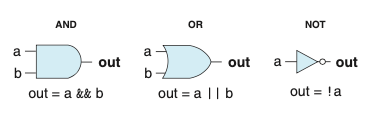
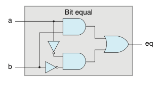
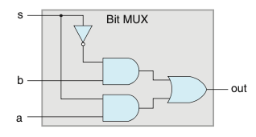
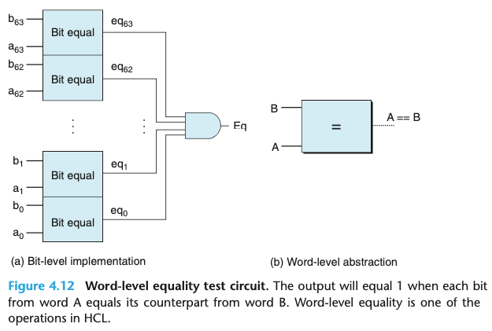
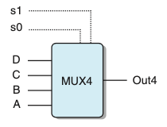
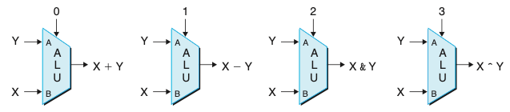
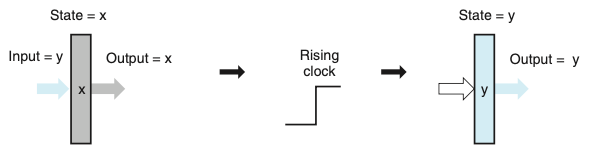
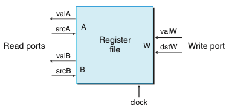
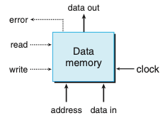

# Chapter 04. 프로세서 구조
- 4.1 Y86-64 인스트럭션 집합 구조
- 4.2 논리 설계와 하드웨어 제어 언어 HCL

# 4.2 논리 설계와 하드웨어 제어 언어 HCL

- 하드웨어를 설계할 때 전자회로를 사용해서 비트들의 함수를 계산하고 여러 가지 메모리 원소들에 비트들을 저장한다.
- 디지털 시스템을 만들기 위해서는 다음과 같은 세 개의 주요 컴포넌트가 있어야 한다.
    - 비트연산을 위한 조합회로 combinational logic
    - 비트를 저장하는 메모리 소자
    - 메모리 소자의 갱신을 조절하는 클럭 신호
    
## 4.2.1 논리 게이트
- 논리 게이트는 디지털 회로에서 기초 연산 소자들이다.
- 아래의 그림은 AND, OR, NOT 논리 게이트의 유형이다. 각 게이트는 입력들의 불 함수 같은 출력을 만든다.

## 4.2.2 조합회로와 HCL 불 수식

- 여러 가지 논리 게이트를 모아서 네트워크를 만들면 조합회로라고 알려진 계산 블록을 만들 수 있다.
- 어떻게 네트워크가 구성되는지와 관련해서 몇가지 제한이 있다.
    - 모든 논리 게이트 입력은 정확히 다음 중의 하나에 연결되어야 한다.
        1. 시스템 입력중의 하나(주요입력이라고 알려진)
        2. 일부 메모리 소자의 출력 연결
        3. 일부 논리게이트의 출력
    - 두 개 이상의 논리 게이트의 출력은 서로 연결될 수 없다.
    - 네트워크에는 순환회로가 없어야 한다.
    
- 아래의 그림은 비트 동일성을 시험하기 위한 조합회로이다. 출력은 입력이 모두 0이거나 1이면 1이된다.

- 아래의 그림은 멀티플렉서multiplexor로 알려진 간단하지만 유용한 조합회로의 에를 보여준다.
    - 멀티플렉서는 제어 입력 신호 값에 따라 여러 데이터 신호 중에서 한 값을 선택한다.
    - 제어신호 s가 1이면 출력은 a가 되고, s가 0이면 입력 b가 출력이된다.
    

- HCL 수식들은 조합논리회로와 C에서의 논리 수식 간에 분명한 연관관계를 보여준다.
    - 이들은 모두 입력에 대한 함수를 계산하기 위해 불 연산을 사용한다. 계산을 표현하는 이들 간의 차이를 살펴보는 것은 의미가 있다.                      
        - 조합회로가 일련의 논리 게이트로 이루어지기 때문에 출력들이 입력 변화에 연속적으로 반응하는 특성을 갖는다.
            - 반대로 C 수식은 프로그램 실행 중에 이 식을 마난야 계산이 이루어진다.
        - C에서 논리 수식을 0을 거짓으로, 다른 값들을 참으로 해석한다.
            - 반대로 논리 게이트는 비트 값 0과 1에 대해서만 연산을 한다.
    
## 4.2.3 워드수준 조합회로와 HCL 정수 수식
- 논리 게이트들의 커다란 네트워크를 연결해서 보다 복잡한 함수를 계산하는 조합회로를 구성할 수 있다.
- 데이터 워드를 가지고 동작하는 회로를 설계 하게 된다.
- HCL에서 워드 크기를 명시하지 않고 모든 워드수준 신호를 int로 선언한다.
    - 이것은 단순성을 위한 것이다.
    
- 아래의 그림은 워드수준 동일성 시험 회로다.

- 아래의 그림은 워드수준 멀티플렉서 회로다. 

- 멀티플렉서 함수는 HCL의 case 수식을 사용해서 기술된다. 
    - case 수식은 다음과 같은 일반 형태를 갖는다.
    - 이 수식은 여러 개의 case를 가지고 있으며, 각 case i는 언제 이 case가 선택되어야 하는지를 나타내는 불 수식 selecti와 결과 값을 나타내는 정수수식 expri로 구성된다.    

    [
        select1 : expr1;
        select2 : expr2;
          .
          .
          .
        selectk : exprk;
    ]

  
- 아래의 그림은 4입력 멀티플렉서이다. 제어신호 s1과 s2의 여러가지 조합에 의해 어떤 데이터 입력이 출력에 전송될지가 결정된다.
    - 그 아래의 수식은 그림에 해당하는 수식이다.


    ex = [
        !s1 && !s0  : A; #00
        !s1         : B; #01
        !s0         : C; #10
        1           : D; #11
    ]


- 조합논리회로는 워드수준 데이터에 대해 여러 가지 많은 연산을 수행하도록 설계될 수 있다.
- 아래의 그림은 산술/논리 유닛 ALU이다. 함수 입력의 설정에 따라 이 회로는 4개의 서로 다른 산술 및 논리연산을 실행하게 된다.
    - 제어 값들이 이 인스트럭션들을 위한 함수코드와 일치한다.

## 4.2.4 집합의 원소 관계
- 집합의 원소 여부를 시험하는 일반적인 형태는 다음과 같다.
    - iexpr in {iexprq, iexpr2, ... , iexprk}
    
## 4.2.5 메모리와 클럭
- 조합회로들은 근본적으로 정보를 저장하지 않는다.
- 이들은 단순히 입력 신호들에 반응하여 그 입력을 갖는 함수와 동일한 출력을 만들어 낸다.
- 순차회로, 즉 상태를 가지며 이 상태에 대해 계산을 하는 회로를 만들기 위해서는 비트로 표시된 정보를 저장하는 장치를 이용해야한다.
- 저장장치들은 로딩되는 때를 결정하는 주기적 신호인 한 개의 클럭에 의해 새 값들이 모두 제어된다.
    - 클럭을 사용하는 레지스터들 : 워드나 개별 비트를 저장한다.
    - 랜덤 액세스 메모리 : 워드를 읽거나 쓰기 위해 주소를 사용해서 여러 워드를 저장한다.
        - ex) 가상메모리 시스템, 레지스트 파일
- "레지스터"라는 단어는 하드웨어와 기계어 프로그램에서 사용할 때 다르다.
    - 하드웨어에서 레지스터는 입력과 출력 전선들로 회로의 나머지 부분과 직접 연결된다.
    - 기계어 수준 프로그래밍에서 레지스터는 주소가 레지스터의 ID인 CPU 내의 주소지정이 가능한 워드들의 작은 집합을 나타낸다.
    
- 아래의 그림은 레지스터 연산이다. 레지스터 출력은 클럭 신호가 상승할 때까지 현재 레지스터 상태를 유지한다. 클럭이 상승할 때, 레지스터의 입력 값들이 새로운 레지스터의 상태로 저장된다.

    
    
    - 하드웨어 레지스터의 보다 상세한 모습이다.
    - 레지스터는 어떤 고정된 상태(x로 나타냄)로 남는데, 자신의 현재 상태와 동일한 출력을 낸다.
    - 클럭이 올라가면 입력 신호들이 다음 상태(y)로 레지스터에 로딩되고, 이것이 다음 상승 클럭 에지edge까지 새로운 레지스터의 출력이된다.
    - 레지스터들이 회로의 여러 부분에서 조합논리 간에 장벽으로의 역할을 수행한다는 것이다.
    
- 아래의 그림은 전형적인 레지스터 파일을 보여준다.
  
    
  
    - 다중포트 랜덤 액세스 메모리는 여러 번의 읽기와 쓰기 연산이 동시에 일어날 수 있도록 해준다.
    - 레지스터 파일에서 이 회로는 두 프로그램 레지스터의 값을 읽을 수 있고 세 번째 레지스터의 상태를 갱신 할 수 있다.
    - 두 개의 읽기 포트는 주소 입력 srcA, srcB와 데이터 출력 valA, valB를 갖는다.
    - 쓰기 포트는 주소 입력 dstW, 데이터 입력 valW를 갖는다.
    - 레지스터 파일은 조합회로는 아닌데, 이는 레지스터 파일이 내부 저장장치를 가지고 있기 때문이다.
    - 데이터는 주소를 입력으로 가지며, 데이터를 출력으로 갖는 조합논리 블록인 것처럼 데이터가 레지스터 파일로부터 읽을 수 있다.
    - srcA, srcB가 어떤 레지스터 ID로 설정되었을 때, 해당 프로그램에 저장된 값은 valA, valB에 나타난다.
    - 레지스터 파일에 워드를 쓰는 작업은 클럭이 있는 레지스터에 값을 로딩하는 것과 비슷하게 클럭 신호에 의해 제어된다.
    
- 아래의 그림은 프로세서는 다음과 같이 도식적으로 나타낸 것처럼 프로그램 데이터를 저장하기 위해 랜덤 액세스 메모리를 갖는다.

    
  
    - 한 개의 주소 입력, 쓰기를 위한 데이터 입력, 읽기를 위한 데이터 출력을 갖는다.
    - 레지스터 파일처럼 우리의 메모리에서의 읽기 작업은 조합회로와 유사한 방식으로 동작한다.