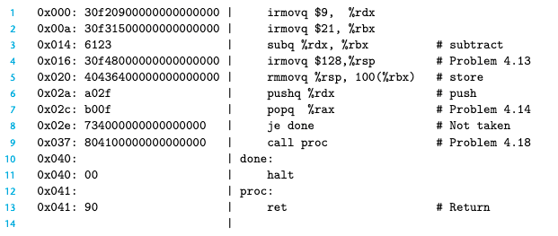
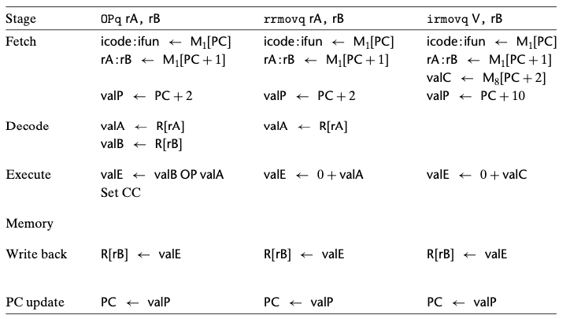
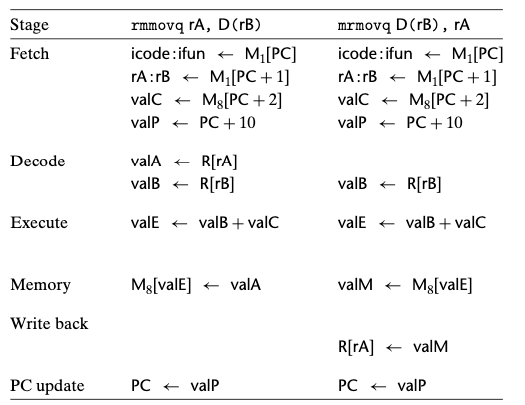
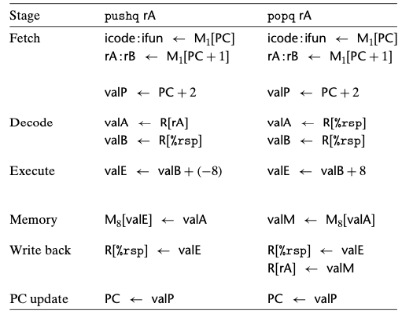
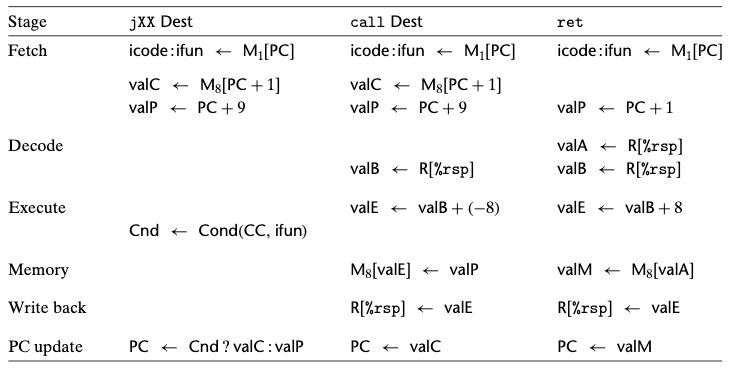

# Chapter 04. 프로세서 구조
- 4.1 Y86-64 인스트럭션 집합 구조
- 4.2 논리 설계와 하드웨어 제어 언어 HCL
- 4.3 순차적sequential Y86-64 구현

# 4.3 순차적sequential Y86-64 구현

- SEQ : sequential 프로세서를 의미 
- 매 클럭 사이클에 SEQ는 한 개의 완전한 인스트럭션을 처리하는 데 필요한 모든 단계를 수행한다.
- SEQ를 개발하는 목적은 효율적인 파이프라인 프로세서를 만들려는 우리의 최종목표로 가는 첫 단계이다.

## 4.3.1 작업을 단계로 구성하기

- 인스트럭션을 처리하는 데는 다수의 연산이 관련되어 있다.
- 이들은 특정한 단계들Stages로 구성해서 비록 인스트럭션들의 동작은 다를지라도 모든 인스트럭션들이 일정한 순서를 따르도록 한다.
- 각 단계에서의 세부 처리내용은 실행하는 인스트럭션에 따라 달라진다.
    - 선입 fetch
        - 프로그램 카운터 PC를 메모리주소로 사용해서 메모리로부터 인스트럭션 바이트들을 읽어들인다. 
        - icode(인스트럭션 코드)와 ifun(instruction function)을 추출한다.
        - 한 개의 레지스터 지시자 바이트를 선입해서 한 개 또는 두 개의 레지스터 오퍼랜드 지시자 rA와 rB를 얻어내는 경우도 있다. 또한 8바이트 상수 워드 valC를 선입할 수도 있다. 
        - 이것은 지금 실행 중인 인스트럭션의 순차적인 다음 인시트럭션의 주소가 되는 valP를 계산한다.    
    - 해독 decode
        - 레지스터 파일에서 최대 두 개의 오퍼랜드를 읽어서 valA, valB를 얻어온다. 
        - 일부 인스트럭션에 대해서는 레지스터 %rsp를 읽어온다.
    - 실행 excution
        - 산술/논리 연산 유닛(ALU)이 인스트럭션이 지시하는 연산을 수행하거나(ifun 값에 따라), 메모리 참조 시 유효주소를 계산하거나, 스택 포인터 값을 변경한다. 이 결과를 valE라고 부른다.
        - 조건 코드들은 이 경우에 설정될 수 있다. 조건부 이동 인스트럭션에 대해서 조건코드와 분기 조건(ifun에서 주어진)을 평가하고 조건이 참이 되는 경우에만 목적지 레지스터를 갱신한다. 점프 인스트럭션도 마찬가지이다.
    - 메모리
        - 데이터를 메모리에 쓰거나 메모리에서 데이터를 읽어올 수 있다. 이 값을 valM이라고 한다.
    - 재기록 write back
        - 두 결과를 레지스터 파일에 기록한다.
    - PC 갱신
        - PC는 다음 인스트럭션의 주소로 설정된다.
- 프로세서는 위의 사항들을 무한히 반복하면서 이 단계들을 실행한다.
- 한 개의 인스트럭션을 실행하는 데는 놀라운 양의 작업을 요구한다.
    - 각 인스트럭션에 대해 기술한 연산을 싫애해야하고
    - 주소를 계산하고
    - 스택 포인터를 갱신하고
    - 다음 인스트럭션을 결정해야 한다.

### Y86-64 인스트럭션 처리과정

- 위의 그림은 Y86-64 인스트럭션 예제이다. 해당 코드를 사용해서 여러가지 Y86-64 인스트럭션들의 처리과정을 그림으로 나타낸다.

  

- <strong>OPq 인스트럭션 타입(정수와 논리연산), rrmovq(레지스터-레지스터 이동), irmovq(상수-레지스터 이동)에 대해 요구되는 작업을 보여준다.</strong>
- 선입 단계에서 상수 워드는 필요하지 않기 때문에 valP는 PC+2로 계산된다.
- 해석 단계에서 두 개의 오퍼랜드를 읽어들인다.
- 실행단계에서 함수 지시자 ifun과 함께 ALU에 제공된다.
- valE는 인스트럭션 결과가 된다.
- rrmovq인스트럭션을 실행하면 산술연산과 매우 비슷하게 진행한다.
- irmovq의 경우에도 첫 번째 ALU 입력 대신에 상수 값 valC를 사용한다는 점을 제외하고는 유사한 처리가 발생한다.
    - 프로그램 카운터를 10 증가시켜야 하는데, 그 이유는 irmovq가 긴 인스트럭션 형식을 가지기 때문이다.
  

- <strong>메모리 쓰기와 읽기 인스트럭션인 rmmovq와 mrmovq를 위해 필요한 처리작업을 보여준다.</strong>
- valC를 valB에 더하기 위해 ALU를 사용해서 메모리 연산을 위한 유효주소를 만들어 낸다.

  

- <strong>pushq와 popq 인스트럭션을 처리하기 위해 요구되는 단계들을 보여준다.</strong>
- 메모리에 접근 하면서 동시에 스택 포인터를 변경한다.
- pushq 인스트럭션은 해석단계에서 %rsp를 두 번째 레지스터 오퍼랜드의 식별자로 사용해서 스택 포인터를 valB로 만든다.

  

- <strong>세 개의 제어 전환 인스트럭션에서의 처리과정을 나타낸다: jump, call, ret</strong>
- 정수연산에서처럼 분기를 할지 말지 결정할 때에만 이들이 다르기 때문에 모든 점프를 통합된 방법으로 처리할 수 있다.
- 점프 인스트럭션은 선입에서 해독까지는 레지스터 명시자를 필요로 하지 않는다.
- 실행단계에서 조건코드와 점프 조건을 체크해서 분기를 할지 말지 결정하고, 1비트 신호 Cnd를 만든다.
- PC갱신단계 동안에 이 플래그를 시험하고, 만일 플래그가 1이면 PC를 valC(점프 목적지)로 설정하고, 만일 0이면 valP(다음 인스트럭션의 주소)로 설정한다.
- 인스트럭션 call과 ret은 프로그램 카운터 값을 push, pop한다는점 외에는 pushq, popq와 약간의 유사성을 갖는다.
- call할 때는 call 인스트럭션의 다음 인스트럭션의 주소인 valP를 push한다.
- PC 갱신 단계 동안에 PC를 call 목적지인 valC로 설정한다.
- ret 인스트럭션에서 스택에서 pop한 값인 valM을 PC 갱신 단계에서 PC에 저장한다.

