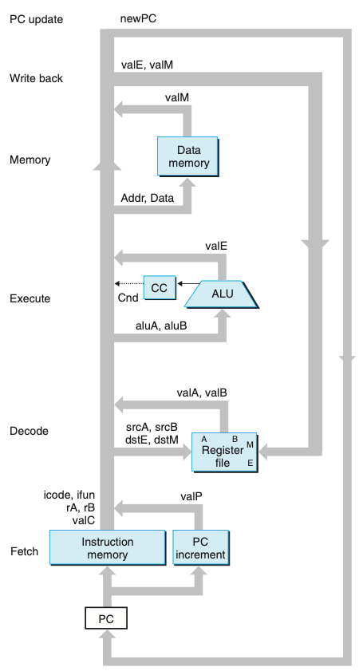
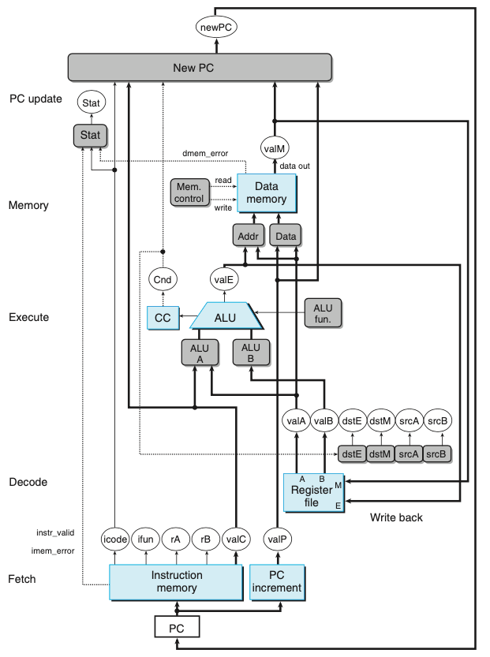
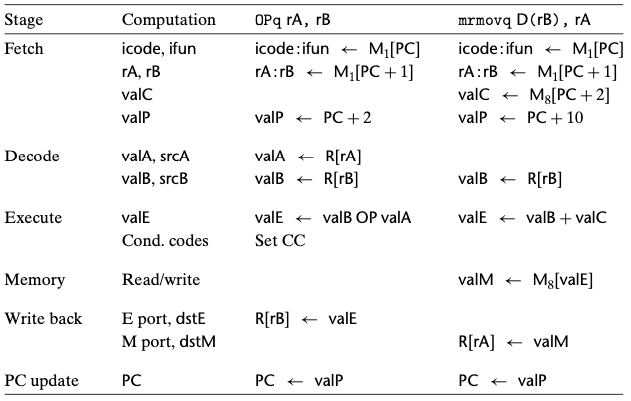
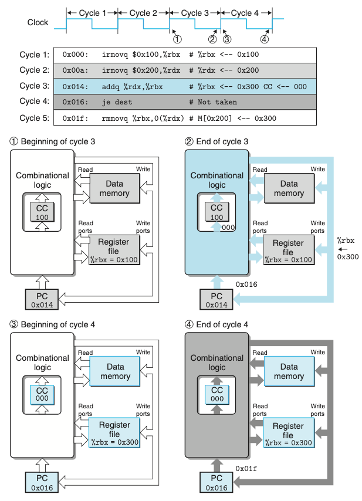

# Chapter 04. 프로세서 구조
- 4.1 Y86-64 인스트럭션 집합 구조
- 4.2 논리 설계와 하드웨어 제어 언어 HCL
- 4.3 순차적sequential Y86-64 구현

# 4.3 순차적sequential Y86-64 구현

- SEQ : sequential 프로세서를 의미 
- 매 클럭 사이클에 SEQ는 한 개의 완전한 인스트럭션을 처리하는 데 필요한 모든 단계를 수행한다.
- SEQ를 개발하는 목적은 효율적인 파이프라인 프로세서를 만들려는 우리의 최종목표로 가는 첫 단계이다.

## 4.3.2 SEQ 하드웨어 구조
- 인스트럭션을 구현하는 데 필요한 계산들은 여섯 개의 순차적인 기본 단계로 구성될 수 있다.
    1. 선입
    2. 해독
    3. 실행
    4. 메모리
    5. 재기록
    6. PC 갱신
- SEQ에서는 하드웨어 유닛에 처리되는 모든 일들은 하나의 클럭 사이클 내에서 일어난다.

  

- 위 그림은 순차적인 구현인 SEQ의 추상적인 모습이다. 
    - 인스트럭션을 실행하는 동안 처리된 정보는 그림의 좌측 하단 구석에 있는 PC를 사용해서 인스트럭션 선입으로 시작해서 시계방향을 따라 진행한다.
- 하드웨어 유닛들은 여러가지 처리 단계들과 연계되어있다.
    - 선입
        - 프로그램 카운터 레지스터를 주소로 사용해서 인스트럭션 메모리는 인스트럭션의 바이트들을 읽어들인다.
        - PC 가산기는 valP, 증가된 프로그램 카운터를 계산한다.
    - 해독
        - 레지스터 파일은 두 개의 읽기 포트 A,B를 가지고 있다.
        - 이를 통해서 레지스터 값 valA, valB를 동시에 읽어들일 수 있다.
    - 실행
        - 인스트럭션의 종류에 따라 여러 가지 목적을 위해 산술/유닛 유닛(ALU)을 사용한다.
        - 조건코드 레지스터(CC)는 세 개의 조건코드 비트를 저장한다. 목적지 레지스터를 갱신할지 여부를 결정하는 조건코드와 이동 조건에 의해 계산된다.
    - 메모리
        - 메모리 인스트럭션을 실행할 때 메모리 워드를 읽거나 쓴다.
        - 인스트럭션과 데이터 메모리는 같은 메모리 위치에 접근하지만, 목적은 서로 다르다.
    - 재기록
        - 레지스터 파일은 두 개의 쓰기 포트를 가지고 있다.
        - E 포트는 ALU가 계산한 값을 기록하기 위해 사용된다.
        - M 포트는 데이터 메모리에서 읽어온 값을 기록할 때 사용한다.
    - PC 갱신
        - 프로그램 카운터의 새로운 값은 다음 인스트럭션의 주소 valP, call이나 점프 인스트럭션에 의해 지정된 목적지 주소, 또는 메모리에서 읽어온 리턴주소 valM 중에서 선택된다.

- 위 그림은 SEQ, 순차적 구현의 하드웨어 구조이다.

  

- 위 표는 순차적 구현에서 여러가지 계산 단계 식별 표이다.
    - 두번째 열은 SEQ의 단계에서 계산되는 값 또는 수행되는 연산을 나타낸다.
    
## 4.3.3 SEQ 타이밍

- SEQ는 조합논리회로와 두 가지 형태의 메모리 장치로 이루어진다.
    - 레지스터(프로그램 카운터와 조건코드 레지스터)
    - 랜덤 액세스 메모리(레지스터 파일, 인스트럭션 메모리, 데이터 메모리)
- 조합논리회로는 순차처리나 제어를 필요로 하지 않는다.
    - 입력이 바뀔 때마다 논리 게이트의 네트워크를 통해 값들이 전파된다.
- 랜덤 액세스 메모리를 읽는 것은 출력 워드가 주소 입력에 따라 생성되는 방식으로 조합논리회로와 매우 유사하게 동작한다.
- 순차실행을 위해 명시적인 제어를 필요로 하는 네 개의 하드웨어 유닛
    - 프로그램 카운터, 조건코드 레지스터, 데이터 메모리, 레지스터 파일
    - 이들은 새로운 값을 레지스터에 로딩하는 것과 값들을 랜덤 액세스 메모리에 기록하는 작업을 만드는 한 개의 클럭 신호를 통해서 제어된다.
    - 프로그램 카운터 : 매 클럭 사이클마다 새로운 인스트럭션 주소를 적재한다.
    - 조건코드 레지스터 : 정수연산 인스트럭션이 실행될 때에만 값이 적재된다.
    - 데이터 메모리 : rmmovq, pushq, call 인스트럭션이 실행될 때에만 값이 기록된다.
    - 레지스터 파일 : 두 개의 쓰기 포트를 통해서 두 개의 프로그램 레지스터가 매 사이클마다 갱신될 수 있다.
- 위와 같이 레지스터들과 메모리에 클럭을 공급하는 것은 프로세서에서 여러 동작들을 순서대로 제어하기 위해 필요한 모든 거싱다.
- 프로세서는 인스트럭션의 처리를 완료하기 위해 어떤 인스트럭션에 의해 갱신된 상태를 다시 읽을 필요는 절대 없다.

  

- 위 그림은 SEQ의 두 실행 사이클 추적이다.
  - 각 사이클은 이전 인스트럭션에 의해 설정된 상태 원소들(프로그램 카운터, 조건코드 레지스터, 레지스터 파일, 데이터 메모리)을 가지고 시작된다.
  - 신호들은 이 상태 원소들을 위한 새로운 값을 만들면서 조합회로를 지나면서 전파된다.
  - 이 값들은 다음 사이클을 시작하기 위해 상태 원소들에 적재된다.
  
- 상태 원소들의 갱신을 제어하기 위해서 조합회로를 통한 값들의 전파와 함께 클럭을 사용하면 SEQ에서 각 인스트럭션을 위해 수행한 계산들을 충분히 제어할 수 있다.
- 클럭이 low에서 high로 전환이 이루어지는 매 시점마다 프로세서는 새 인스트럭션의 실행을 시작한다.

