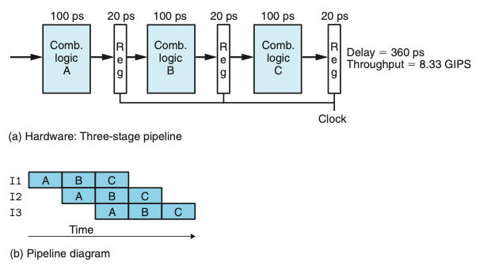
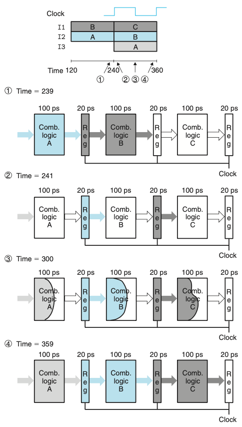
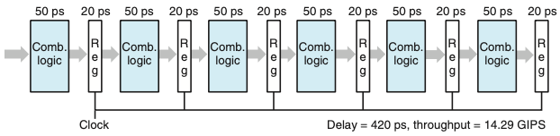

# Chapter 04. 프로세서 구조
- 4.1 Y86-64 인스트럭션 집합 구조
- 4.2 논리 설계와 하드웨어 제어 언어 HCL
- 4.3 순차적sequential Y86-64 구현

# 4.4 파이프라이닝의 일반 원리
- 파이프라인 시스템의 일반적인 특징과 원리들을 생각해보자.
    - 파이프라인 시스템에서 수행해야 할 일은 여러 개의 일련의 단계뜰로 나누어진다.
    - 식당의 예를들면, 샐러드를 먼저 제공하고, 메인 음식, 디저트 그리고 음료의 순으로 제공하는 것과 비슷하다.
    - 컨베이어 벨트와 비슷하게 여러 고객이 동시에 시스템을 진행하도록 한다.
    - 비록 어떤 사람은 일부 음식만을 원할지라도 모든 단계를 통과해 간다.
- 파이프라이닝의 주요 특징
    - 시스템 처리량(단위시간당 처리하는 고객의 수)을 증가시킨다.
    - 지연시간(고객을 지원하는 데 걸리는 시간)을 증가시킨다.
    
## 4.4.1 계산용 파이프라인
- 위의 식당의 예를 계산용 파이프라인으로 초점을 옮기면
    - "고객들"은 인스트럭션
    - 단계들은 인스트럭션 실행의 일부분을 수행한다.
    
  

- 위의 그림은 간단한 비파이프라인 하드웨어 시스템의 예이다.
    - 계산을 수행하는 일부 로직으로 이루어진다.
    - 계산 결과를 저장하는 레지스터가 따라온다.
    - 클럭 신호는 규칙적인 시간간격으로 레지스터에 로딩되는 것을 제어한다.
- 이 예제에서는 조합로직은 300ps를 필요로하고 레지스터 로딩은 20ps를 필요로 한다.
    - 이 시스템에서 처리량은 1/320 * 1,000 = 3.12
    - 이 시스템에서 지연시간은 320ps
    
  

- 위 그림은 3단계 파이프라인 계산 하드웨어이다.
    - 시스템에서 수행하는 계산을 세 단계 A,B,C로 나눌 수 있다고 가정한다.
    - 파이프라인 레지스터들을 단계 사이에 배치해서 각 인스트럭션이 3단계로 시스템을 통해 이동한다.
    - 시작부토 종료할 때까지 세 개의 클럭 사이클이 소요된다.
- 이 예제에서는 클럭을 매 100+20=120ps이고 한 개의 인스트럭션을 처리하는 데 3클럭 사이클이 필요하다.
    - 이 시스템에서 처리량은 1/120 * 1,000 = 8.33
    - 이 시스템에서 지연시간은 360ps
- 비파이프라인 보다 처리량은 빠르지만 지연시간이 증가한 이유는 추가된 파이프라인 레지스터에 의한 오버헤드 때문이다.

## 4.4.2 파이프라인 연산의 상세한 고찰
- 파이프라인 단계들 간에 인스트럭션의 이동은 위의 파이프라인 다이어그램에 나타낸 것과 같이 클럭 신호에 의해 제어된다.

  

- 위 그림은 한 사이클 동안의 파이프라인 동작이다.
    - 신호들은 파이프라인 레지스터 입력들로 전달되지만, 클럭이 상승할 때까지 레지스터의 상태는 바뀌지 않는다.
    - 클럭을 늦추는 것이 파이프라인의 동작을 변화시키지 않는다는 것을 알 수 있다.

## 4.4.3 파이프라이닝의 한계
- 파이프라인의 효과를 축소시키는 여러 요소들이 종종 발생한다.

### 비균일 분리 Nonuniform Partitioning

- 위의 그림은 계산을 이전처럼 세 단계로 나눈 시스템이지만 각 단계에서 발생하는 지연시간은 50에서 150 ps까지 변화한다.
- 우리가 구동할 수 있는 클럭의 속도는 가장 늦은 단계의 시간지연 값에 의해 결정된다.
- 실제 시스템 설계에서는 타이밍을 최적화하는 것이 중요하다.

### 줄어드는 깊은 파이프라이닝의 효과

- 위의 그림은 계산을 여섯 단계로 나누었고, 각각은 50ps를 소모한다.
- 이 시스템의 클럭 주기는 50+20=70ps, 처리량은 14.29, 지연시간은 480이다.
- 각 계산 블록에서 소요되는 시간을 2분의 1로 줄였지만 파이프라인 레지스터를 통과하는 시간지연으로 인해 처리량은 두 배를 얻지 못했다.
- 이 지연시간은 파이프라인의 처리량에 있어서 제한요소가 된다.
- 최신 프로세서들은 프로세서의 클럭속도를 최대로 올리기 위해 매우 깊은(15단계 이상) 파이프라인을 사용한다.

## 4.4.4 피드백을 갖는 파이프라인 시스템
- 기계어 프로그램을 실행하는 시스템에서는 연속적인 인스트럭션들 간에는 잠재적인 의존성이 있다.

- 예를들어 위의 코드 배열은 각각의 연속되는 인스트럭션들 간에 원으로 표시한 레지스터 이름에 데이터 의존성이 존재한다.

  

- 위의 그림은 피드백을 갖는 시스템에 파이프라인을 추가할 때의 위험을 보여준다.
  - 피드백이 있는 파이프라인을 사용하지 않는 시스템(a)에서 파이프라인 시스템(c)으로 전환하기 위해서 두 파이프라인 다이어그램에서 보는 바와 같이 계산적인 동작을 변경한다(b와d)
  

