# Chapter 04. 프로세서 구조
- 4.1 Y86-64 인스트럭션 집합 구조
- 4.2 논리 설계와 하드웨어 제어 언어 HCL
- 4.3 순차적sequential Y86-64 구현
- 4.4 파이프라이닝의 일반 원리
- 4.5 파이프라인형 Y86-64의 구현

# 4.5 파이프라인형 Y86-64의 구현
- 순차적 프로세서 SEQ를 약간 변형해서 PC의 계산을 선입 단계로 이동하는 것으로 프로세서를 변경한다.
- 이후 파이프라인 레지스터들을 단계별로 추가한다.

> 결국은 이 파이프라인형 Y86-64 "PIPE"를 만들기 위해 2장부터 4장까지 달려온 것이다. 
> 우선 컴퓨터가 해석할 수 있는 정수와 부동소수점 표현과 기본 산술에 대해서 2장에서 배웠고, 
> 3장에서는 프로그래머가 작성한 코드를 컴퓨터가가 해석할 수 있는 기계어로 변경하는 것을 배웠고, 
> 4장 초반에서는 해당 기계어를 컴퓨터가 해석할 수 있도록 인스트럭션 집합으로 변경하는 것을 배웠고, 
> 4장 후반 SEQ 구현에서는 해당 인스트럭션을 컴퓨터가 어떻게 해석하는지를 배웠고, 
> 4장 후반 파이프라인 구현에서는 인스트럭션을 해석하는데에 있어 속도를 증가시키기 위해서 SEQ에 파이프라인을 구축하고,
> 파이프라인 구축할 때의 예외처리를 다룬 뒤 프로세서를 완성시킨다.

## 4.5.1 SEQ+: 계산 단계들을 재배치하기
- PC 갱신 단계가 클럭 사이클의 마지막이 아니라 맨 처음에 오도록 한다.
    - 파이프라인 단계에서의 순차적인 동작을 더 잘 수행할 수 있다.
    - 수정된 설계를 "SEQ+"라고 부른다.

  
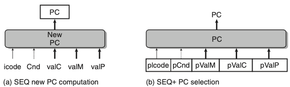
- 위의 그림은 PC 계산 타이밍의 변경이다.
    - SEQ+에서 인스트럭션 실행의 첫 단계로 현재 상태에 대한 프로그램 카운터 값을 계산한다.
    
## 4.5.2 파이프라인 레지스터의 삽입
- SEQ+의 단계들간에 파이프라인 레지스터들을 삽입하였으며 신호들을 재배치해서 PIPE- 프로세서를 만들었다.
- 파이프라인 레지스터들은 다음과 같이 명명하였다
    - F : 프로그램 카운터의 예측 값을 저장한다.
    - D : 선입과 해동 단계 사이에 위치한다. 해독 단계가 처리하기 위해서 가장 최근에 선입한 인스트럭션에 관한 정보를 저장한다.
    - E : 해독과 실행 단계 사이에 위치한다. 실행 단계가 처리하기 위해서 레지스터 파일로부터 읽어들인 값과 가장 최근에 해독한 인스트럭션에 관한 정보를 저장한다.
    - M : 실행과 메모리 단계 사이에 위치한다. 메모리 단계가 처리하기 위한 가장 최근에 실행 인스트럭션 결과와 조건부에 관한 정보를 저장한다.
    - W : 레지스터 파일에 기록을 위한 결과, 리턴주소, PC 선택 로직을 저장한다.
    
  
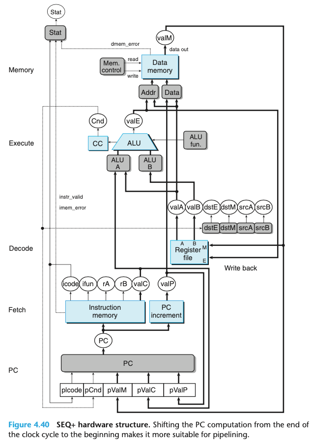
- 위의 그림은 SEQ+ 하드웨어 구조

  
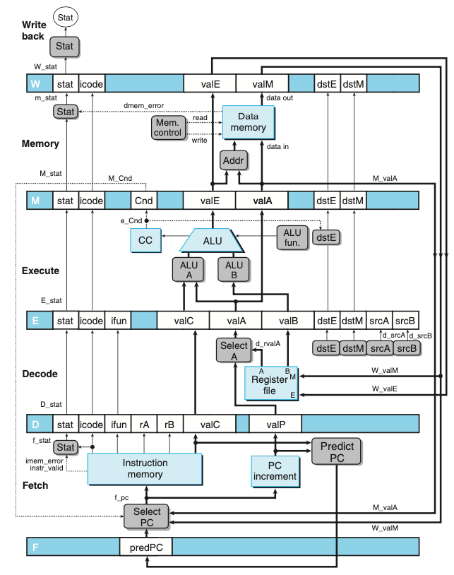
- 위의 그림은 PIPE- 의 하드웨어 구조, 초기 파이프라인 구현

  
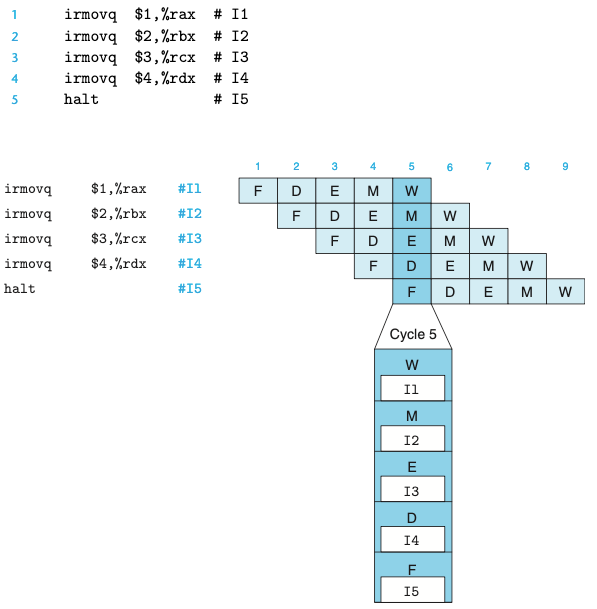
- 위의 그림은 코드 배열이 어떻게 5단계 파이프라인을 통해 흘러가는지를 보여준다.

## 4.5.3 신호의 재배치와 재명명
- SEQ에서는 한 번에 한 개의 인스트럭션만을 처리했지만, 파이프라인 설계에서는 인스트럭션에 연계된 여러 버전의 값이 존재한다.
- PIPE-의 상세 설계에서 네 개의 서로 다른 인스트럭션을 위한 상태코드를 저장하는 "Stat"이 있다.
- 파이프라인 레지스터의 이름은 대문자를 사용한다. D_stat, E_stat, M_stat, W_stat
- 계산된 일부 신호의 이름은 소문자를 사용한다 f_stat, m_stat
- 전체 프로세서의 실제 상태 Stat이 파이프라인 레지스터 W에 기록된 상태값에 따라 재기록 단계에서 계산된다.
- 일반적인 원칙으로 특정 인스트럭션에 관한 모든 정보를 한 개의 파이프라인 단계 내에 유지하는 것을 원한다.

## 4.5.4 다음 PC 값의 추정
- 파이프라인 설계의 목표는 매 클럭 사이클마다 새로운 인스트럭션을 실행하는 것이며, 새 인스트럭션이 실행 단계로 진행해서 궁극적으로는 완료되는 것을 의미한다.
- 리턴이나 조건부 점프 인스트럭션은 선입 단계에 계산된 정보를 사용해서 다음 인스트럭션의 주소를 결정할 수 없다.
- 따라서 매 클럭 사이클마다 하나의 새 인스트럭션을 실행하려는 우리의 목표를 달성하기 위해서 대부분의 경우에 PC의 새로운 값을 예측해야 한다.
> 이부분이 처음에 조금 이해가 안됐지만, 파이프라인 해저드를 공부하고 이해가 됐다. 해저드를 통해 이러한 분기예측을 제어한다.
- 분기의 방향을 추측하고 추측 결과에 따라 인스트럭션을 선입하는 기술을 분기예측branch prediction 이라고 한다.

## 4.5.5 파이프라인 해저드
- 피드백이 있는 시스템에 파이프라인을 도입하면 연속되는 인스트럭션들 간에 의존성이 존재할 때 문제가 발생할 수 있다.
- 의존성은 두 가지 형태를 띈다.
    - 데이터 의존성: 한개의 인스트럭션이 계산한 결과가 다음에 오는 인스트럭션을 위한 데이터로 사용되는 경우
    - 제어 의존성: jump, call, ret와 같이 한 개의 인스트럭션이 다음에 따라오는 인스트럭션의 위치를 결정하는 경우
- 의존성들이 파이프라인으로 인해 잘못된 계산을 야기할 가능서이 있을 때 해저드라고 부른다.
- 해저드 또한 데이터 해저드, 제어 해저드로 구분할 수 있다.

 

### 특별한 파이프라인 제어 없는 경우의 파이프라인 실행(에러X)
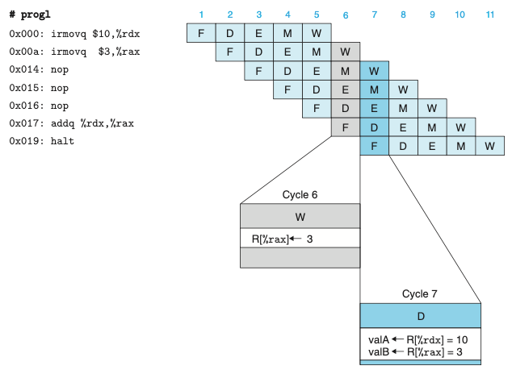

### 특별한 파이프라인 제어 없는 경우의 파이프라인 실행(에러O)
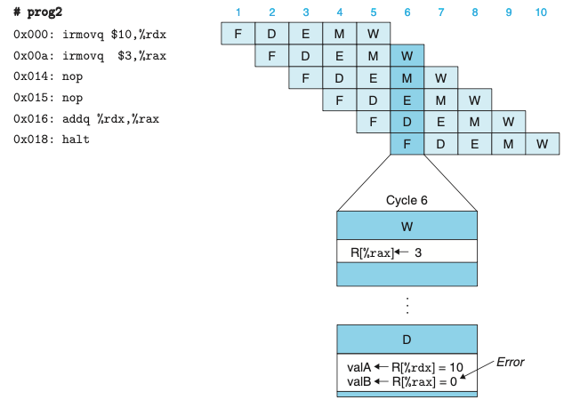

### 스톨을 사용한 데이터 해저드의 회피
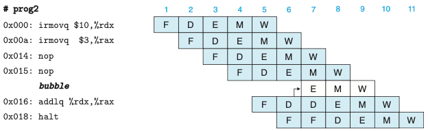

 
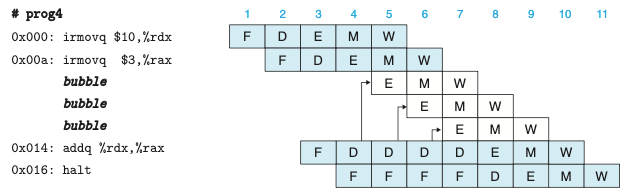

- 해저드를 회피하는 매우 일반적인 기술은 프로세서가 하나 또는 여러 인스트럭션을 해저드 조건이 사라질 때까지 파이프라인 내에 유지하는 스톨과 관련된다.
- 해독 단계에서 인스트럭션을 소스 오퍼랜드를 생성하는 인스트럭션들이 재기록 단계를 통과할 때까지 스톨시키는 방법으로 데이터 해저드를 회피할 수 있다.
- 스톨링은 한 그룹의 인스트럭션들을 이들의 단계에 붙잡아두지만, 다른 인스트럭션들은 파이프라인을 계속 흘러가도록 한다.
- 인스트럭션을 해독단계에 붙잡아 놓을 때마다 실행 단계에 버블을 삽입하는 방식으로 처리한다.
- 버블은 동적으로 생성된 nop 인스트럭션과 비슷하다.

### 포워딩Forwarding을 이용한 데이터 해저드의 회피
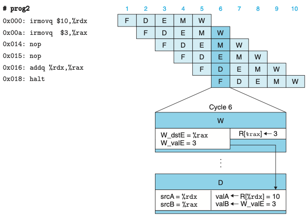

 
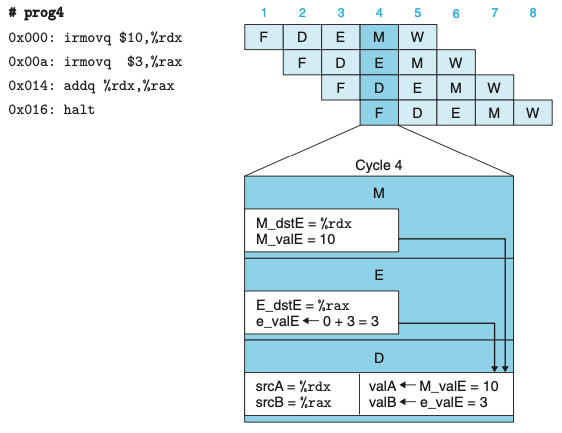

- 재기록 단계에서 이들 소스 레지스터 중의 하나에 대기하고 있는 쓰기 작업이 존재할 수 있다.
- 쓰기 작업이 완료될 때까지 스톨하기보다는 소스 오퍼랜드로 파이프라인 레지스터 E에 기록될 값을 단순히 전달할 수 있다.
- 데이터 포워딩은 메모리 단계에서 대기하고 있는 레지스터 쓰기 작업이 있을 때에도 사용될 수 있다.
- 위 그림은 해독 단계 로직이 레지스터 파일에서 온 값을 사용할지, 포워딩된 값을 사용할지 여부를 어떻게 결정할 수 있는지 보여준다.
    - 레지스터 파일에 재기록되는 모든 값과 관련된 것은 목적지 레지스터 ID이다.
    - 이 로직은 이 ID들을 소스 레지스터 ID인 srcA, srcB와 비교해서 포워딩을 위한 경우를 검출할 수 있다.
- 다섯개의 포워딩 소스가 해독 단계에 "Sel+Fwd A"와 "Fwd B" 두 블록으로 피드백 된다.

### 로드/사용 데이터 해저드
 
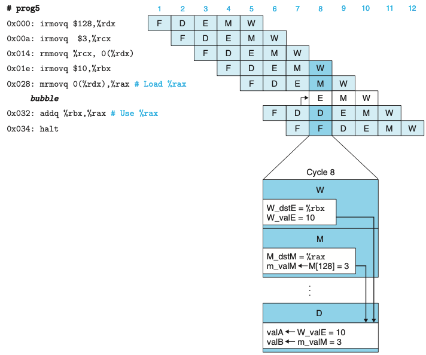

- 메모리 읽기가 파이프라인의 뒷부분에서 일어나기 때문에 데이터 해저드는 순수하게 포워딩만 가지고는 처리할 수 없다.
- 해당 경우는 스톨링과 포워딩을 함께 사용해서 로드/사용 데이터 해저드를 회피할 수 있다.
- 로드/사용 해저드를 처리하기 위해 스톨을 사용하는 것을 로드 인터록load interlock이라고 부른다.
- 포워딩과 결합된 로드 인터록은 가능한 모든 형태의 데이터 해저드를 충분히 처리할 수 있다.

### 제어 해저드의 회피
- 제어 해저드는 프로세서가 선입 단계에서 현재 인스트럭션에 기초하여 다음 인스트럭션의 주소를 안정적으로 결정할 수 없을 때 발생한다.
- 제어 해저드는 ret와 점프 인스트럭션에 대해서만 발생할 수 있다.

 
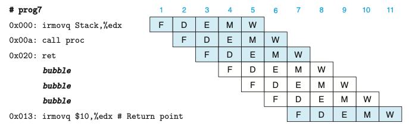
- 위의 그림은 ret 인스트럭션 처리과정이다.
  - 파이프라인은 ret가 해독, 실행, 메모리 단계를 통과하며 세개의 버블을 삽입하는 동안 스톨해야한다.
  - PC 선택 로직은 ret가 재기록 단계에 도착하면(사이클 7) 인스트럭션 선입 주소로 리턴주소를 선택하게 된다.
 

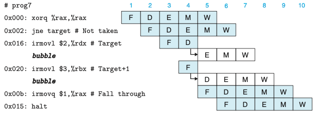
- 위의 그림은 잘못 예측한 분기 인스트럭션의 처리이다.
  - 파이프라인은 분기를 할 것이라고 예측하고, 따라서 점프 목적지에서 인스트럭션 선입을 시작한다.
  - 점프 인스트럭션이 실행 단계를 통해 흘러갈 때 두 인스트럭션은 사이클 4에서 예측오류가 검출되기 전에 선입된다.
  - 사이클 5에서 파이프라인은 해독과 실행단계에 버블을 삽입해서 두 목적지 인스트럭션을 취소하고, 점프 다음에 오는 인스트럭션을 선입한다.

 
- 간단히 두 개의 잘못 선입한 인스트럭션을 취소할 수 있다.
  - 인스트럭션 스쿼싱squashing이라고 불린다.
- programmers-visible state에는 아무런 영향을 주지 않지만 단점은 두 클럭 사이클 만큼의 인스트럭션 처리 능력이 낭비된다는 점이다.
- 스톨링과 파이프라인에 버블을 삽입하는 기술들은 특수한 상황이 발생할 때 파이프라인의 흐름을 동적으로 조절한다.

## 4.5.6 예외처리
- 프로세서의 다양한 동작은 예외적인 제어흐름을 발생시키며, 이 경우 정상적인 프로그램 실행의 연결은 끊어진다.
- 예외들은 프로그램 실행에 의해 내부적으로 발생하거나 외부 신호에 의해 외부적으로 생성될 수 있다.
- 세 가지 서로 다른 내부 생성 예외
  1. halt 인스트럭션에 의한 예외
  2. 인스트럭션과 함수코드의 잘못된 조합을 갖는 인스트럭션
  3. 인스트럭션 선입 또는 데이터 읽기나 쓰기를 위해 유효하지 않은 주소에 접근하려 하는 경우
- 프로세서가 예외를 만나면 정지하고 적절한 생태코드를 설정한다.
- 프로세서는 운영체제의 일부인 예외핸들러라는 프로시저를 계속 호출한다.

### 파이프라인과 예외처리
- 파이프라인을 사용한 시스템에서 예외처리는 여러 가지 미묘한 부분들이 관계되어 있다.

1. 예외상황이 다수의 인스트럭션들에 의해 동시에 발생할 수 있다.
  - 기본 규칙은 파이프라인에서 가장 멀리 있는 인스트럭션이 유발한 예외상황에 우선순위를 둔다.

2. 어떤 인스트럭션이 선입되고, 실행을 시작해서 예외를 발생시키고, 나중에 잘못 예측한 분기명령으로 인해 취소할 때 발생한다.
  - 파이프라인 제어로직은 인스트럭션을 취소한다.

3. 파이프라인 프로세서가 서로 다른 단계에서 시스템 상태의 서로 다른 부분을 갱신하기 때문에 발생한다.

 
- 파이프라인 제어로직은 메모리나 재기록 단계의 인스트럭션이 예외를 발생시켰을 때 데이터 메모리나 조건코드 레지스터를 갱신하는 것을 김지한다.
- 파이프라인의 하나 이상의 단계에서 예외가 발생할 때 정보는 단순히 파이프라인 레지스터의 상태 필드에 저장된다.

## 4.5.7 PIPE 단계의 구현
- 파이프라인 레지스터, 재구성 가능한 로직 블록, 추가적인 파이프라인 제어로직을 추가하고, 이전의 순차적 설계 같은 하드웨어 유닛들을 사용한다.

### PC 선택과 선입 단계
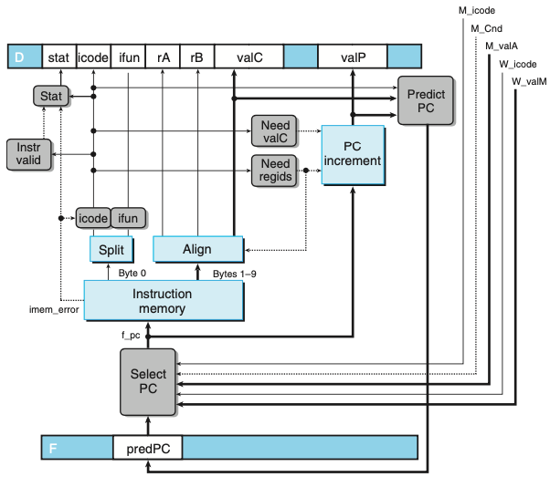

- 프로그램 카운터의 현재 값을 선택해야하며, 다음 PC 값을 예측해야 한다.
- 메모리에서 인스트럭션을 읽고 여러 가지 인스트럭션 필드들을 추출하기 위한 하드웨어 유닛들은 SEQ를 위해 고려한 것과 동일하다.
- 하나의 사이클 시간의 범위 내에 프로세서는 다음 인스트럭션의 주소를 예측만 할 수 있다.

### 해독 및 재기록 단계
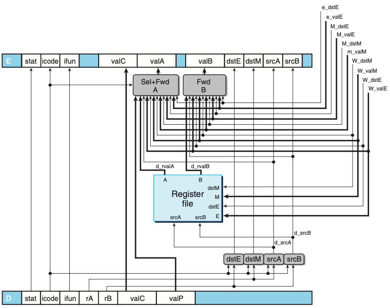
- valP와 레지스터 포트 A로부터 읽은 값을 동시에 요구하는 인스트럭션은 없으며 따라서 이들은 다음 단계를 위한 신호 valA를 구성하기 위해 통합할 수 있따.
  - "Sel+FwdA" 블록이 해당 일을 수행하고 valA를 위한 포워딩 로직을 구현한다.
  - "FwdB" 블록은 소스 오퍼랜드 valB를 위한 포워딩 로직을 구현한다.
- 레지스터 쓰기 위치는 해독 단계보다는 재기록 단계에서 가져온 dstE와 dstM으로 나타낸다.
  - 해독 단계가 현재 재기록 단계에 있는 인스트럭션의 결과를 기록하고 있기 때문이다.

 

- 위 HCL 코드에서 다섯 개의 포워딩 소스에 주어진 우선순위는 매우 종요하다.
- 우선순위는 HCL코드에서 다섯 개의 목적지 레지스터 ID가 시험되는 순서에 의해 결정된다.

### 실행 단계
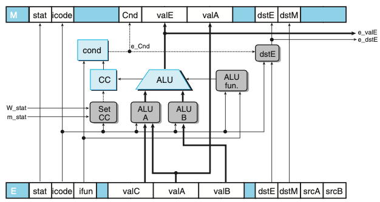
- PIPE 실행 단계 로직이다. 이 부분의 설계는 SEQ의 로직과 매우 유사하다.

### 메모리 단계
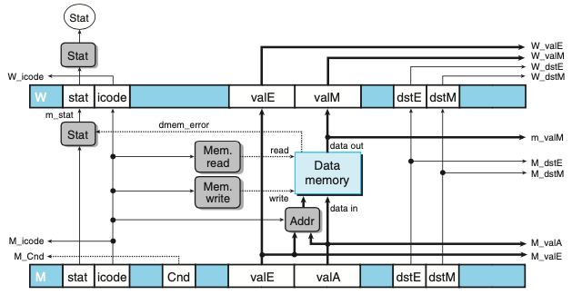
- PIPE 메모리 단계 로직이다. 
  - 파이프라인 레지스터 M, W의 많은 신호들이 앞 단계들로 전달되어 재기록한 결과, 인스트럭션 주소, 포워드된 값들을 제공한다.

## 4.5.8 파이프라인 제어로직
- 데이터 포워딩과 분기예측과 같이 다른 방법들로는 처리할 수 없는 다음과 같은 네 개의 제어 경우를 처리해야 한다.
  - 로드/사용 해저드 : 메모리에서 값을 읽은 인스트럭션과 이 값을 사용하는 인스트럭션 사이에 한 사이클 동안 스톨해야한다.
  - 잘못 예측한 분기 : 예측으로 인해 잘못 선입된 인스트럭션들은 취소되어야 하며, 선입 단계는 점프 인스트럭션 다음의 인스트럭션에서 시작해야한다.
  - 예외 : 어떤 인스트럭션이 예외를 발생시키면 programmer-visible state가 갱신되는 것을 막아야 한다.
  
### 특수한 제어 상황들의 바람직한 처리
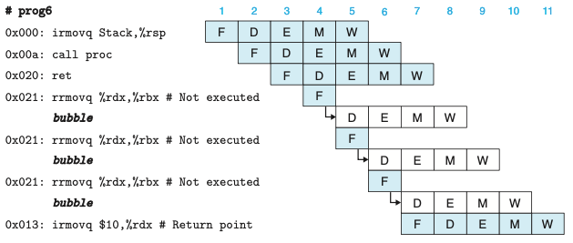
- 위의 그림은 ret 인스트럭션의 상세한 처리과정이다.
  - 선입 단계는 ret 인스트럭션 다음의 rrmovq 인스트럭션을 반복적으로 선입하지만, 파이프라인 제어회로는 rrmovq 인스트럭션이 진행하는 것을 허용하는 대신에 해독 단계에 한 개의 버블을 삽입한다.

 
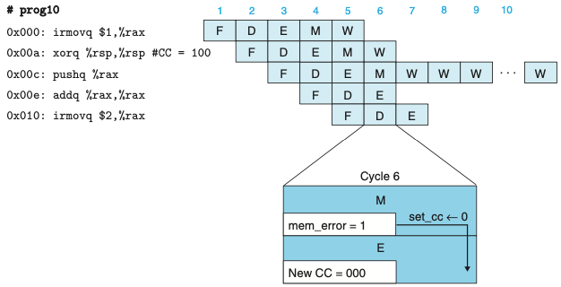
- 위의 그림은 유효하지 않은 메모리 참조 예외의 처리이다.
  - 사이클 6에서 pushq 인스트럭션으로 인한 유효하지 않은 메모리 차몾는 조건코드 갱신을 금지시킨다.
  - 파이프라인은 메모리 단계에 버블을 삽입하기 시작하고 재기록 단계에 있는 예외 인스트럭션을 스톨시킨다.

### 특수 제어 조건의 감지
- ret 인스트럭션이 파이프라인을 통과해 갈 때 검출하려면 해독, 실행, 메모리 단계에 있는 인스트럭션들의 인스트럭션 코드를 단순히 체크하면 된다.
- 로드/사용 해저드를 검출하려면 실행 단계에 있는 인스트럭션의 종류(mrmovq, popq)를 체크해야 하고, 해독 단계에 있는 인스트럭션의 소스 레지스터들과 목적지 레지스터들을 비교해야 한다.
- 파이프라인 제어로직은 인스트럭션이 해독 단계에 있는 동안 잘못 예측한 분기를 검출해야 한다.

### 파이프라인 제어 과정

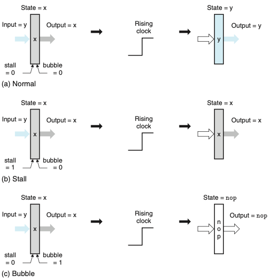
- 위의 그림은 파이프라인 레지스터 동작이다.
  - a. 정상 조건 시 레지스터의 상태와 출력은 클럭이 상승할 때 입력 값으로 설정된다.
  - b. 스톨 모드에서 동작할 때, 상태는 이전 값으로 고정된다.
  - c. 버블 모드에서 동작할 때 상태는 연산의 결과로 기록된다.

### 제어 조건들의 조합

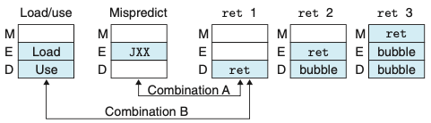
- 위의 그림은 특수한 제어 조건들에 대한 파이프라인 상태이다.
  - 표시한 두 쌍은 동시에 발생할 수 있다.

### 제어 로직의 구현

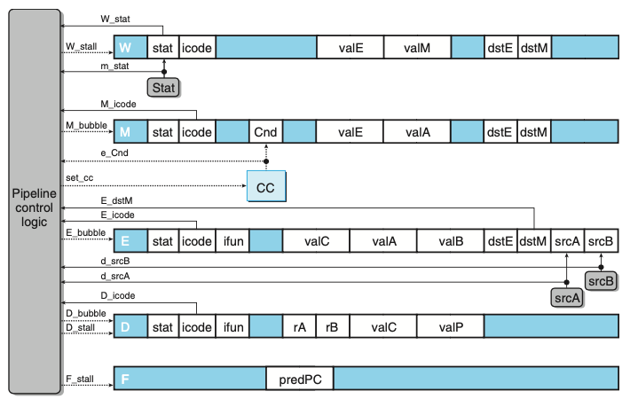
- 위의 그림은 PIPE 파이프라인 제어로직이다.
  - 이 로직은 프로시저 리턴, 잘못 예측한 분기, 로드/사용 해저드, 프로그램 예외 같은 특수한 조건들을 처리하기 위해서 정상적인 인스트럭션 흐름이 파이프라인을 통과하는 것을 정지시킨다.

## 4.5.9 성능 분석
- 인스트럭션마다 걸리는 평균 클럭 사이클 수는 CPIcycles per instruction라는 단위로 추정값을 계산한다.
  - Ci 인스트르럭션, Cb 버블을 처리한다면, 프로세서는 Ci + Cb개의 클럭 사이클을 필요로한다.
  - CPI = 1.0 + Cb/Ci 이다.
  - 오직 세개의 인스트럭션 타입만이 버블을 추가하기 때문에
    - CPI = 1.0 lr(load penalty) + mp(mispredicted branch penalty) + rp(return penalty)
  
## 4.5.10 남아 있는 작업
- 다중 사이클 인스트럭션
  - 다중 인스트럭션을 구현하는 한 가지 간단한 방법은 실행 단계 로직의 성능을 정수와 부동 소수점 산술연산 유닛들을 포함하도록 단순히 확장하는 것이다.
    - 한 개의 인스트럭션이 해독 단계에 들어갈 때 특수 유닛으로 보낸다.(ex. 부동소수점 유닛)
- 메모리 시스템과의 인터페이스

# 4.6 요약

- 해당 장을 통해 인스트럭션 집합 아키텍처 ISA는 프로세서의 동작과 프로세서가 어떻게 구현되는지 간에 추상화 계층을 제공한다는 것을 알 수 있었다.
- ISA는 프로그램 실행을 하나의 인스트럭션이 다음 인스트럭션이 시작되기 전에 실행되어 종료되는 순차적인 프로그램 실행의 모습을 제공한다.
- 여러 가지 인스트럭션들이 요구하는 처리작업을 5단계로 구성하였으며, 전체 인스트럭션이 다섯 단계를 통해 들어가서 매 클럭 사이클마다 실행된다.
- 파이프라인은 여러 단계들이 동시에 동작하도록 하여 시스템의 처리량 성능을 개선한다.
- 예외를 적절히 처리하는 것은 높은 파이프라인 단계와 병렬성을 사용하는 시스템에서 보다 복잡해진다.
- 교훈
  - 복잡성을 관리하는 것이 최우선순위를 갖는다.
    - 모든 인스트럭션 타입을 처리하기 위한 매우 간단하고 통일된 프레임워크를 만들어서 구현하였다.
  - ISA를 직접 구현할 필요는 없다.
    - 파이프라인 설계를 사용하였고 파이프라인 해저드를 처리할 수 있었다.
  - 하드웨어 설계자는 꼼꼼해야 한다.
