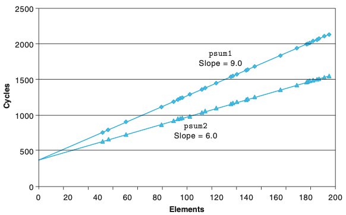

# Chapter 05. 프로그램 성능 최적화하기
- 프로그램을 작성하는 주목적은 모든 가능한 조건에서 프로그램이 정확하게 동작하도록 하는 것이다.
- 프로그래머는 명확하고 간결한 코드를 작성해야하고, 이해하기 쉽고, 코드를 검토할 때와 수정할 때 다른사람들도 코드를 읽고 이해할 수 있어야 한다.
- 효율적인 프로그램을 작성하는 방법
    1. 적절한 알고리즘과 자료구조를 선택해야한다.
    2. 컴파일러가 효과적으로 최적화해서 효율적인 실행코드로 바꿀 수 있는 소스코드를 작성해야 한다.
    3. 작업을 부분으로 나누어 멀티코어와 멀티프로세서의 조합을 갖는 컴퓨터에서 병렬로 계산한다.
- 프로그래머는 컴파일러를 도와서 쉽게 최적화될 수 있는 코드를 작성해야한다.
    1. 불필요한 작업 제거
        - 불필요한 함수호출 제거
        - 조건 테스트 제거
        - 메모리 참조 제거
    2. 인스트럭션-수준 병렬성을 제공
    
# 5.1 최적화 컴파일러의 능력과 한계
- 컴파일러는 프로그래머의 코드를 자동으로 최적화 해준다.
- 하지만 특정 코드는 컴파일러가 자동으로 최적화해줄 수 없다.
    - 두 개의 포인터가 같은 메모리 위치를 가리킬 수 있는 경우(메모리 연결memory aliasing)
    - 함수 호출
        - ex) 호출되는 횟수에 따라 프로그램의 동작이 변경 되는 경우(부가효과 side effect)
- 위 항목들이 '최적화 장애물blocker'이 되는데, 이것은 컴파일러가 최적화된 코드를 생성하기 위한 기회를 제한한다.

# 5.2 프로그램 성능의 표현
- CPE : 요소당 측정 사이클metric cycle

# 5.3 프로그램 예제
- 코드를 최적화하는 방법은 다음과 같은 방법들이 존재한다. 
    - 타깃 머신의 특징을 고려하지 않은 최적화 기법
        - 루프 비효율성 제거하기
        - 프로시저 호출 줄이기
    - 최신 프로세서의 인스트럭션 수준 병렬성을 고려한 최적화 기법
        - 루프풀기
        - 병렬성 높이기
        - 재결합 변환
    
# 5.4 루프 비효율성 제거하기
- 테스트 조건이 루프의 매 실행마다 평가된다.

- lower1은 n^2
- lower2는 n

- 겉보기에는 의미 없는 코드가 감춰진 잠재적 비효율성을 갖고 있다.
- 적은 데이터 셋으로 시험하고 분석되지만, 프로그램이 궁극적으로 배포되면, 프로시저가 백만 개 문자들의 스트리에 적용될 수 있다.
    - 이러한 상황에 안전했던 코드조각이 주요 성능 병목이 되게된다.
- <strong>경쟁력 있는 프로그래머 역할의 한 부분은 지속적으로 소개되는 그러한 잠재적 비효율성을 피하는것이다</strong>

