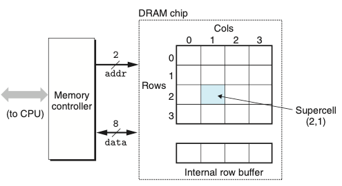
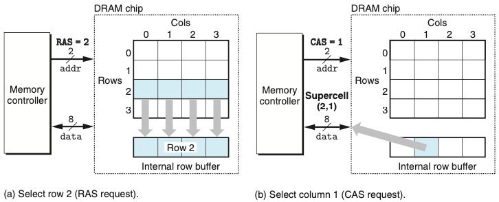
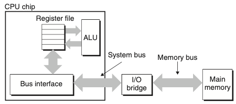
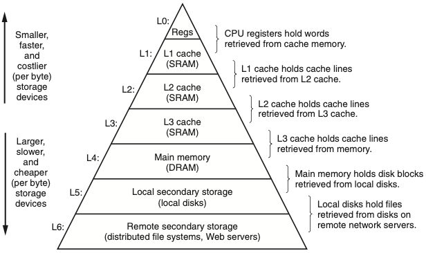
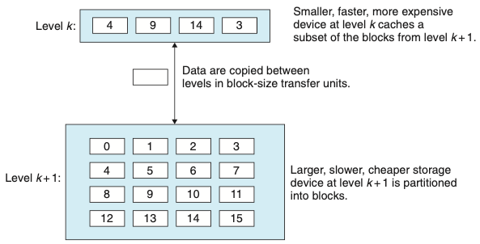

# Chapter 06. 메모리 계층구조
- 메모리 시스템은 용량, 비용, 접근시간을 갖는 저장장치들의 계층구조다.
    - 캐시메모리는 CPU 부근에서 비교적 느린 메인메모리에 대한 준비장소
    - 메인메모리는 크고 느린 디스크들에 대한 준비장소
    - 디스크들은 네트워크로 연결된 다른 머신들의 준비장소
- 메모리의 계층별로 접근 속도가 상이하다.
    - 레지스터가 가장 빠르고, 그 다음은 메인메모리, 그 다음은 디스크이다.
- 데이터를 계층의 상부에 저장시켜서 CPU가 보다 빨리 접근할 수 있도록 프로그램을 작성해야한다.
    - 이 개념은 지역성locality라고 알려진 컴퓨터 프로그램의 근본특징에 근거를 두고 있다.

# 6.1 저장장치 기술

## 6.1.1 랜덤-접근 메모리
- 랜덤-접근 메모리(RAM)은 두 종류를 가진다.
    - 정적 SRAM : 동적램 DRAM 보다 더 빠르고 훨 씬 비싸다. 캐시메모리로 사용된다.
    - 동적 DRAM : 메인메모리와 그래픽 시스템의 프레임 버퍼로도 사용된다.
    
### 정적 SRAM
- SRAM은 각 비트를 이중안정bistable 메모리 셀cell에 저장한다.
- SRAM은 전원이 공급되는 한 지속성을 갖는다.
- 리프레시가 필요없다.
- DRAM보다 트랜지스터를 더 많이 사용하여 밀도가 낮으며 비싸고 전력을 많이 사용한다.

### 동적 DRAM
- DRAM은 각 비트를 전하로 캐패시터에 저장한다.
- 리프레시가 필요하다.
    - 메모리 시스템은 주기적으로 메모리의 모든 비트를 읽었다가 다시 써 주는 방식

### 일반 DRAM

- 위의 그림은 DRAM 칩의 구조이다.
- DRAM 칩 내의 셀들은 d 슈퍼셀들로 나누어지며, 각각은 w DRAM 셀들로 이루어진다.
- 슈퍼셀 (i,j)의 내용을 읽으려면 메모리 컨트롤러는 행 주소 i를 DRAM에 보내고, 다음에 열 주소 j를 보낸다.

- 위의 그림은 DRAM 슈퍼셀의 내용을 읽는 과정이다.

### 메모리 모듈
- DRAM 칩은 메인 시스템(머더보드)의 확상슬롯에 꽂을 수 있는 메모리 모듈 형태로 패키징 된다.
- DRAM을 여러개 추가하여 바이트를 순서대로 저장한다. 

### 비휘발성 메모리
- DRAM과 SRAM은 전원이 꺼지면 정보도 잃어버리기 때문에 휘발성이다.
- 비휘발성 메모리는 이들의 전원 꺼져도 정보를 유지한다.
- Read-only memory : ROM 이라고 부른다.
- ROM 디바이스에 저장된 프로그램들은 종종 펌웨어firmware라고 부른다.

### 메모리에 접근하기
- 데이터는 '버스'라고 하는 공유된 전기회로를 통해서 프로세서와 DRAM메인메모리간에 앞뒤로 교환한다.
- CPU와 메모리 간의 매 전송은 버스 트랜잭션bus transaction이라고 부르는 일련의 단계들을 통해 이뤄진다.

- 위의 그림은 CPU와 메인메모리를 연결하는 버스 구조다.

- 읽기 트랜잭션(movq A,%rax)
    1. CPU는 주소 A를 시스템 버스에 보낸다. I/O브릿지는 신호를 메모리 버스를 따라 보낸다.
    2. 메인메모리는 메모리 버스에서 주소 신호를 감지하고, 메모리 버스로부터 주소를 읽고 DRAM에서 데이터 워드를 선입, 데이터를 메모리 버스에 쓴다.
    3. I/O 브릿지는 신호를 시스템 버스 신호로 변환해서 시스템 버스를 따라 보낸다. CPU는 시스템 버스에서 데이터를 감지하고 %rax에 복사한다.

- 쓰기 트랜잭션(movq %rax,A)
    1. CPU는 주소를 시스템 버스에 보낸다. 메모리는 메모리 버스에서 주소를 읽고 데이터가 도착하기를 기다린다. 
    2. CPU는 %rax에 있는 데이터를 시스템 버스에 복사한다.
    3. 메인메모리는 데이터를 메모리 버스에서 읽고 비트들을 저장한다.
    
## 6.1.2 디스크 저장장치
- 디스크는 RAM 메모리의 수천 메가바이트 단위에 비해 수백에서 수천 기가비이트 단위의 엄청난 양의 데이터를 저장하는 대표적인 저장장치다.
- 디스크 용량 
  - 기록밀도: 1인치의 트랙에 집어넣을 수 있는 비트의 수
  - 트랙밀도: 원판 중심에서 반지름의 1인치 길이에 넣을 수 있는 트랙의 수
  - 면적밀도: 기록밀도와 트랙밀도의 곱
- 디스크의 동작
  - 탐색시간: 섹터의 내용을 읽기위해 헤드를 타깃 섹터를 보유한 트랙 위로 위치시키는 시간
  - 회전 지연시간: 헤드가 트랙 위에 위치하면 타깃 섹터의 첫번째 비트가 헤드 아래로 지나가는 것을 기다리는 시간.(헤드의 위치와 디스크의 회전 속도 모두 관련됨)
  - 전송시간: 하나의 섹터를 전송하는 시간(회전속도와 트랙당 섹터 수에 관련됨)
- 디스크 접근하기(디스크 섹터 읽기)
  1. CPU는 명령어, 논리블록 번호, 목적지 메모리 주소를 디스크와 관련된 메모리 매핑한 주소에 써주어서 디스크 읽기를 개시한다.
  2. 디스크 컨트롤러는 이 섹터를 읽고 메인메모리로 DMA 전송을 수행한다.
  3. DMA 전송이 완료될 때, 디스크 컨트롤러는 CPU에 인터럽트로 알려준다.
  
# 6.2 지역성
- 잘 작성한 컴퓨터 프로그램은 좋은 지역성locality를 보여준다.
  - 최근에 참조했던 데이터 아이템 근처의 데이터 아이템이나 최근에 자신을 참조했던 데이터 아이템을 참조하려는 경향이 있다.
- 지역성은 두가지 형태가 있다.
  - 시간 지역성 : 한번 참조된 메모리 위치는 여러 번 참조될 가능성이 높다.
  - 공간 지역성 : 한번 참조된 메모리는 근처의 메모리 위치를 참조할 가능성이 높다.
- 캐시 메모리 : 가장 최근에 참조한 인스트럭션과 데이터 아이템의 블록을 저장
  - 캐시 메모리라는 작고 빠른 메모리를 도입하여 메인메모리를 빠르게 돌릴 수 있게 됐다.

## 6.2.1 프로그램 데이터 참조의 지역성

int i, j, sum=0;
for(i=0; i<M; i++){
  for(j=0; j<N; j++){
    sum += a[i][j];
  }
}


- 위의 코드는 좋은 지역성을 갖는다.
  - 행 우선 순서로 접근되기 때문이다.
  

int i, j, sum=0;
for(i=0; j<M; i++){
  for(j=0; i<N; j++){
    sum += a[i][j];
  }
}

- 위의 코드는 나쁜 지역성을 갖는다.


int i, j, sum=0;
for(i=0; j<M; i++){
  for(j=0; i<N; j++){
    sum += a[i][j];
  }
}



int i, j, sum=0;
for(i=0; j<M; i++){
  for(j=0; i<N; j++){
    sum += a[i][j];
    sum1 += b[i][j];
  }
}

- 위의 코드도 썩 좋은 지역성을 갖고 있지는 않다.
  - 보폭이 존재하기 때문
  
## 6.2.2 지역성 요약
- 동일한 변수들을 반복적으로 참조하는 프로그램은 좋은 시간 지역성
- Stride-k참조 패턴에서 stride가 적으면 적을수록 공간 지역성도 좋아진다.
- 루프는 인스트럭션 선입에 대해 좋은 시간 및 공간 지역성을 갖는다.

# 6.3 메모리 계층구조
- 아래 두가지를 보완하기 위해 '메모리 계층구조'라고 알려진 메모리 시스템 조직을 위한 접근 방법을 사용한다.
  - 저장장치 기술 : 다양한 저장장치 기술들은 매우 광범위한 접근시간을 갖는다.
  - 컴퓨터 소프트웨어 : 잘 작성한 프로그램들은 좋은 지역성을 나타내는 경향이 있다.

- 위의 그림은 메모리 계층구조이다.

## 6.3.1 메모리 계층구조에서의 캐시
- 캐시는 보다 크고 느린 디바이스에 저장된 데이터 객체를 위한 준비 영역으로 사용하는 작고 빠른 저장장치다.
- 메모리 계층구조의 중심 개념은, 레벨 k에 있는 보다 빠르고 더 작은 장치가 레벨 k+1을 위한 캐시 서비스를 제공한다는 것이다.

- 위의 그림은 메모리 계층구조에서 캐싱의 기본 원리이다.

### 캐시 적중
1. 레벨 k+1로부터 특정 데이터 객체 d를 필요로 한다.
2. 현재 레벨 k에 저장된 블록들 중의 하나에서 d를 찾는다.
3. 만일 d가 레벨 k에서 우연히 캐시되어 있다.

### 캐시 미스
1. 만일 d가 레벨 k에서 캐시되지 않는다면 '캐시 미스'가 발생한 것이다.
2. k+1에 있는 캐시로부터 d를 포함하는 블록을 가져온다.
3. 만일 레벨 k 캐시가 이미 꽉 찬 상태full라면 기존 블록에 덮어쓴다.
- 축출 : 기존 블록을 덮어쓰는 과정
- 희생블록 : 축출되는 블록
- 교체정책 : 어떤 블록을 교체할지에 관한 결정

### 캐시 미스 종류
- cold cache : 캐시가 비어있을 때
- 충돌미스conflict miss : 캐시의 배치 정책으로 인한 캐시 미스
  
### 캐시 관리
- 메모리 계층 구조의 핵심은 각 레벨에 있는 저장장치가 다음 낮은 레벨을 위한 캐시
- 레벨 L1,L2,L3의 캐시들은 캐시에 구현된 하드웨어 로직으로 전적으로 관리된다.
- 가상모메리를 사용하는 시스템에서 DRAM메인메모리는디스크에 저장된 데이터 블록에 대한 캐시 서비스를 제공한다.
