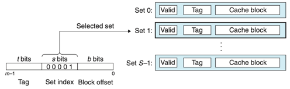

# Chapter 06 메모리 계층구조
1. 저장장치 기술
2. 지역성
3. 메모리 계층구조
4. 캐시메모리
5. 캐시 친화적 코드 작성하기
6. 프로그램 성능에 대한 캐시의 영향
7. 요약

# 6.4 캐시 메모리
- CPU와 메인메모리 사이의 성능 격차가 커짐에 따라 L1 캐시 및 L2 캐시를 삽입하였다.
- 캐시는 SRAM이다.

- 위의 그림은 캐시 메모리를 위한 일반적인 버스 구조이다.

## 6.4.1 기본 캐시 메모리 구조
- 캐시의 구성은 순서쌍 S,E,B,m 으로 규정할 수 있다.
    - S : 2^s개의 캐시 집합
    - E : 집합에 포함되는 캐시 라인
    - B : 2^b 바이트의 데이터 블록
    - m : M = 2^m 개의 교유의 주소를 구성하는 m비트
    - C : 모든 블록의 크기 S*E*B
- 캐시는 요청된 워드를 간단히 주소비트만 조사해서 찾아ㅓ낼 수 있도록 구성되어있다.
    - 해당 방식은 해시 함수를 사용하는 해시 테이블과 유사하다.
    

- 위의 그림은 캐시의 일반적인 구조이다.

## 6.4.2 캐시 종류
- 직접매핑 캐시
    - 집합당 정확히 한개의 라인을 갖는 경우
- 집합결합성 캐시
    - 집합당 k개의 라인을 갖는 경우
- 완전결합성 캐시
    - 모든 캐시 라인들을 갖는 하나의 집합으로 구성된 경우

## 6.4.3 캐시 동작 방법
- 캐시의 동작 방법은 세 단계로 이루어진다.
    1. 집합 선택
    2. 라인 매칭
    3. 워드 추출
    
    - 위와 같은 방법으로 캐시가 어떤 요청이 적중인지 미스인지 결정하고, 요청한 워드를 뽑아내기 위해 작업을 수행한다.

1. 집합 선택
    - s개의 집합 인덱스 비트를 w의 주소 중에서 뽑아낸다.
2. 라인 매칭
    - 워드 w의 사본이 집합 i에 포함된 캐시 라인에 들어 있는지 결정한다.
    - 유효비트 valid가 1이고, 태그비트들이 일치해야한다. -> 캐시 적중
3. 워드 선택
    - 캐시 적중이 발생하면 원하는 워드가 블록 내 어디에서 시작하는지 결정한다.

- 위의 그림은 집합 선택과 라인 매칭 그리고 워드 선택이다.(직접매핑 캐시)

- Thrashing : 캐시가 같은 집합의 캐시 블록들의 로드와 축출을 반복하는 경우
    - 해결 방법 : 예를들어 x배열, y배열에서 쓰레싱이 일어나면 x배열에 패딩을 주어 x[i]와 y[i]가 서로 다른 집합에 매핑되도록 한다.

- 인덱스를 중간 비트로 사용하는 이유
    - 연속적인 메모리 블록들은 동일한 캐시 집합으로 매핑된다. -> 어떠한 특정 순간에 한 개의 블록 크기의 배열 묶음만을 저장하게 되며 캐시를 비효율적으로 사용하게 된다.
    

- 위의 그림은 중간 비트로 캐시 인덱스를 사용하는 이유다.

- 집합결합성 캐시에서의 동작 방법
    - 직접매핑 캐시와 동작이 비슷하지만,
    - 라인 매칭에서 캐시 내 태그와 주소의 태그가 일치하는 라인을 찾기위해 탐색을 한다.
    - 캐시에서 미스 발생시 : LFU(최소 빈도 사용), LRU(최소 최근 사용) 정책 활용
- 완전결합성 캐시
    - 집합결합성 캐시와 동작이 비슷하지만,
    - 많은 수의 태그를 병렬로 검색해야 한다.
    
## 6.4.4 쓰기와 관련된 이슈
- Write-through: 즉시 w의 캐시 블록 전체를 다음 하위 레벨로 써준다.
    - 버스 트래픽을 발생시키는 단점이 있다.
- Write-back : 갱신을 지연시켜 이 블록이 블록 교체 알고리즘에 의해 캐시에서 축출될 때에만 하위 레벨에 써준다.
    - 캐시 블록이 수정되었는지 여부를 나타내는 dirty bit 을 각 라인마다 추가로 유지해야 한다.
- Write-allocate : 해당 블록을 다음 하위 레벨에서 캐시로 가져오고 난 뒤에 캐시 블록을 갱신한다.
- No-write-allocate : 캐시를 통과하고 워드를 직접 다음 하위 레벨에 써준다.
- Write-through & no-write-allocate, Write-back & Write-allocate

## 6.4.5 실제 캐시 계층구조의 해부
- i-cache : 인스트럭션만을 보관하는 캐시
- d-cache : 데이터만 보관하는 캐시

## 6.4.6 캐시 매개변수의 성능에 대한 효과
- 미스 비율 Miss rate : 미스하는 메모리를 참조하는 비율
- 적중 비율 Hit rate : 1 - miss rate
- 적중 시간 Hit Time : 캐시에 있는 워드를 CPU 로 전달하는 데 걸리는 시간
- 미스 비용 Miss Penalty : 미스로 인해서 추가적으로 요구되는 시간

### 캐시 크기의 영향
- 큰 캐시는 적중비율을 높여주지만 더 적중시간이 길어진다.

### 블록 크기의 영향
- 적중 비율을 높여주지만 전송시간이 길어진다. 
- 시간 지역성이 더 많은 프로그램에서 적중 비율에 타격을 줄 수 있다.

### 결합도의 영향
- 집합당 캐시 라인 수의 선택이 미치는 영향
- 충돌미스로 인해 쓰레싱하는 위험성을 감소시킨다
- 라인당 더 많은 태그비트 필요, LRU 상태비트 필요

# 6.5 캐시 친화적 코드 작성하기
- 좋은 프로그래머란 항상 캐시 친화적으로, 즉 좋은 지역성을 가지도록 프로그램을 작성해야 한다.
    - 공통적인 경우를 빠르게 동작하게 만들어야한다.
    - 각 내부 루프의 캐시 미스 수를 최소화 해야한다.
    - 지역변수들에 대한 반복적인 참조는 좋다.(시간 지역성)
    - Stride-1 참조 패턴은 좋다.(공간 지역성)

# 6.6 프로그램 성능에 대한 캐시의 영향
- 읽기 처리량 or 읽기 대역폭 : 프로그램이 메모리 시스템에서 데이터를 읽는 비율

# 6.7 요약
> 이렇게 메모리까지 하드웨어와 프로그램 사이의 상호작용에 대해 공부했다.
> 메모리에 대해서 좀 더 자세히 살펴볼 필요가 있어 보인다. 대학 2학년 때 컴구 수업에서 캐시 매핑 관련 내용이 생각나는데,
> 이 책에는 수록되어 있지 않은 것 같다. 