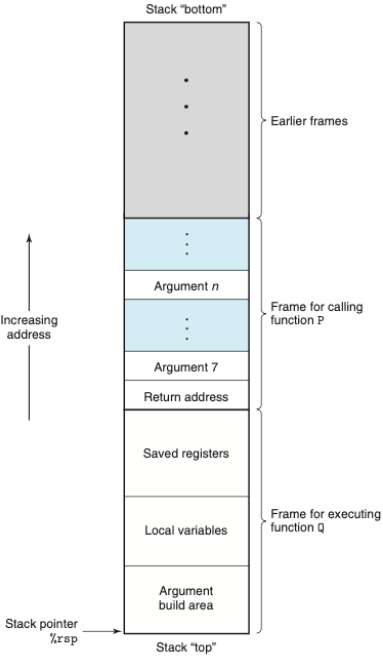
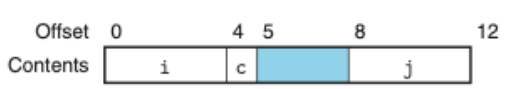
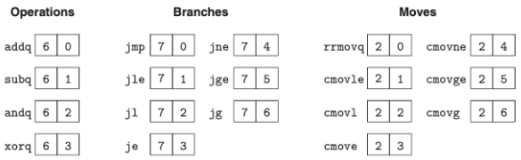
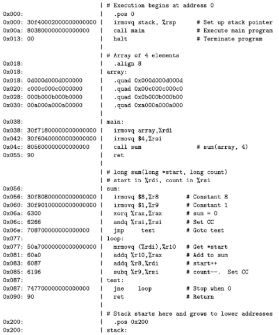
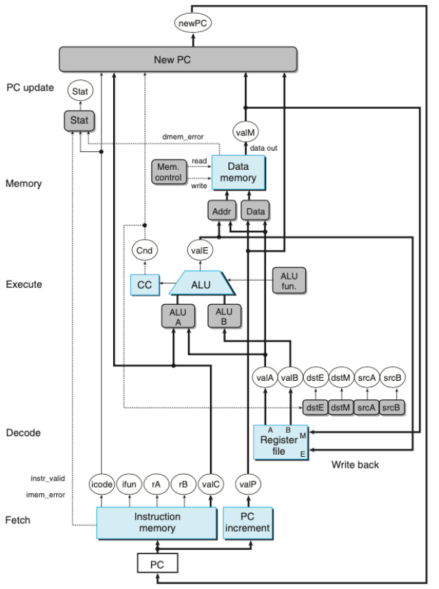
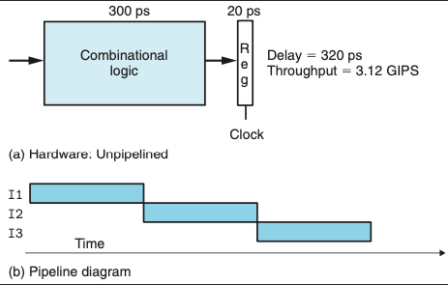
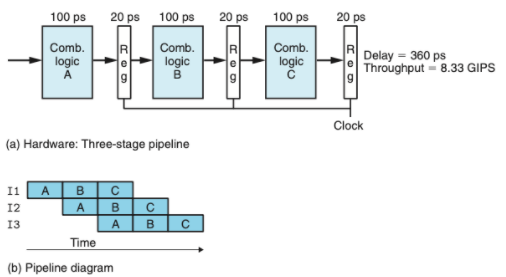
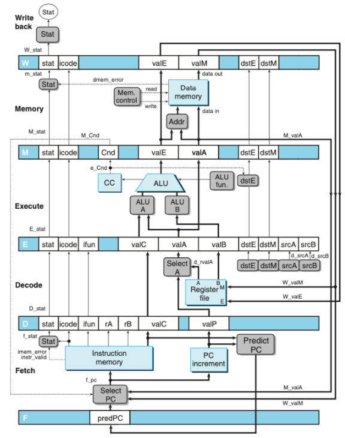
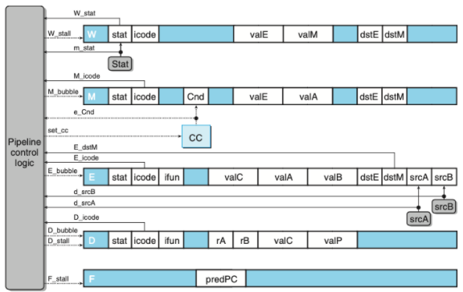

# 2 정보의 표현과 처리
> 컴퓨터가 실제로 해석하는 비트들과 연산들이 무엇이 있는지 배운다.

- 컴퓨터는 두 개의 값을 갖는 신호로 정보를 처리한다.
- 이러한 비트를 이진수 체계를 사용해서 양수들로 인코딩하여 사용한다.
    - 비부호형
    - 부호형(2의 보수)
    - 부동소수점

## 정보의 저장
- 2진수: 컴퓨터의 비트 표현
- 16진수: 비트 패턴을 표시하는데 사용됨(2진수와 10진수는 불편함)
- 비트 표시 방법(xw-1,xw-2,...,x1,x0)
    - 리틀 엔디안: 가장 덜 중요한 바이트가 먼저 온다.(x0,x1...)
    - 빅 엔디안: 가장 중요한 바이트가 먼저 온다.(xw-1,xw-2...)
- 비트 수준 연산
    - 부울 대수: `~`(not),`&`(and),`|`(or),`^`(exclusive-or)
    - 쉬프트
        - 좌측 쉬프트: << 우측에는 k개의 0 채워짐
        - 논리 우측 쉬프트 >> 좌측에는 k개의 0 채워짐
        - 산술 우측 쉬프트 >> 좌측에는 k개의 중요한 비트들이 채워짐
    
## 정수의 표시
> 비부호형과 부호형(2의보수)의 표현 방법에 차이점에 포인트를 두어야 한다.

- 부호형(2의 보수) : 맨 앞자리의 비트가 0이면 양수, 1이면 음수로 표현한다. 
    - ex) 1101 -> 앞자리가 1이므로 -8, 앞자리를 제외한 값이 5 -> -8+5=-3 이렇게 계산한다.
- 비부호형과 부호형 간의 변환과 확장, 절삭에서 부호형의 오버플로우가 발생한다.

## 정수의 계산
- 부호형의 덧셈, 곱셈에서 음의 오버플로우와 양의 오버플로우가 발생한다.
- 쉬프트를 사용해서 곱셈이 가능하다.(비용이 훨씬 적게 듬)
    - ex) 11(1011[2])*4 = 44(101100[2])

## 부동소수점
- 부동소수점 V = x*2^y 형태로 인코딩한다. y는 1/2, 1/4... 와 같은 값
- 근사법 rounding
  - 부동소수점은 정확한 값을 얻을 수 없다. 그렇기 때문에 근사 연산을 한다.
    - 짝수근사법, 영방향근사, 하향근사, 상향근사 모드가 있다.
  
# 3 프로그램의 기계수준 표현
> 우리가 코드를 작성하면 컴파일러는 소스파일의 어셈블러 버전을 생성한다. 어셈블러는 해당 어셈블리 코드를 바이너리 목적코드로 변환한다. 이후 목적코드를 컴퓨터가 해석한다.
> 이번 챕터에서는 어셈블리 코드에 대해 배운다. 이것을 배우게 되면 컴파일러의 최적화 방법을 알 수 있고 코드의 비효율성을 분석할 수 있게된다.

## 프로그램의 인코딩
- 프로그램 호출방법(c언어 기)
    1. C 전처리가 #include와 #define을 확장해준다.
    2. 컴파일러는 소스파일의 어셈블리 코드를 생성한다.(test.c -> test.s)
    3. 어셈블러는 어셈블리 코드를 바이너리 목적코드로 변환한다.(test.s -> test.o)
    4. 링커가 목적코드를 라이브러리 함수와 함꼐 최종 실행 파일인 test.p를 생성한다.
    
- ISA(Instruction Set Architecture): 인스트럭션 집합구조, 프로세서의 상태 및 인스트럭션 형식과 영향을 정의한다.
- 인스트럭션 특성 요약
    - 오퍼랜드: 데이터와 목적지 위치를 명시한다.
    - 레지스터나 메모리로부터 읽고 저장한다.
    - immediate(상수값), register, memory 세가지 타입이 존재한다.
     
## 인스트럭션 종류
- 데이터 이동: mov
    - 두 개의 오퍼랜드 모두 메모리 위치에 올 수 없다.
- 스택의 저장과 추출: push, pop
- 산술연산: add, sub, imul, idiv, sal(left shift), inc(++1), or, and...
- 유효주소 적재: leaq
    - 포인터 생성하기 위한 인스트럭션
- `조건코드`: CF(carry flag), ZF(zero flag), SF(sign flag), OF(overflow flag)
    - cf: 중요한 비트로부터 받아올림이 발생한 것을 표시(오버플로우 검출)
- 제어문: cmp, test, set
    - cmp는 두 오퍼랜드가 같으면 zf를 1로 설정
    - test는 조건 코드만 설정
    - set은 비교후 조건코드를 설정해줌
- 점프: jmp, je, jle...
- 조건부 이동: cmove, cmovg...
- 콜 리턴: call, ret
  
## 조건부 분기(if else)
- 조건제어: cmp와 jump를 사용함
- 조건부이동: cmove등을 사용함(더 빠름)
    - 경우를 다 계산하고 이동만함
    
## 반복문(for, while)
- cmp와 jump를 사용

## 프로시저
- call: call하게 되면 이전 주소와 함께 스택 메모리에 올라감
- return: 후입선출 구조이기 때문에 스택에 있던 이전 주소가 pop되며 retrun 하게됨
- 데이터 전송: 인자는 레지스터로 전송되지만, 6개 이상의 인자를 가지면 초과되는 인자는 스택으로 전달된다.
- 지역 변수: 지역변수 또한 스택 프레임 내에서 생성된다.
- 레지스터: 레지스터는 프로시저 모두가 굥유함. 기존에 사용하던 레지스터를 새로 호출한 함수에서 "saved registers"라는 스택의 일부분을 할당해서 저장하고 보존한다.

## 데이터의 정렬
- 사용 가능한 주소를 k의 배수가 되도록 요구한다.

## 버퍼 오버플로우
- 스택의 saved registers와 return address 범위를 침범하면 심각한 오류를 발생시킨다.
- 대응 방법
  - 스택 랜덤화: 스택의 위치를 프로그램 실행마다 다르게 해준다.
  - 스택 손상 검출: 스택에 canary값을 추가하여 손상되는 것을 감지한다.
  - 실행코드 영역 제한
  
## 부동소수점 
- 정수 연산과 유사하다.
- 부동소수점을 위한 레지스터를 따로 사용한다.

# 4 프로세서 구조
> 하드웨어 시스템이 ISA의 인스트럭션들을 어떻게 실행할 수 있는지를 학습한다. ISA인 "Y86-64"를 직접 만들어보며 학습한다.
> 이후 SEQ를 기초로 파이프라인형 프로세서 PIPE를 만들어본다. 프로세서는 각 인스트럭션의 실행단계를 5단계로 나누어 처리한다.

- 프로그래머-가시성 상태(programmer-visible state) : 프로그램 레지스터, CC(조건코드), PC, 메모리, Stat(상태코드)를 포함한다.

## 인스트럭션 집합(Y86-64)

- 위의 그림처럼 인스트럭션이 인코딩된다.
  - 인코딩에 1에서 10바이트가 소요된다.
  - OPq는 정수연산이며 ZF,SF,OF 조건코드를 결정한다.

- 위의 그림처럼 인스트럭션에 대한 상세한 특정 인코딩으로 변환된다.

## 예외상황(Y86-64)
- Stat(상태코드)를 나타낸다.
  - AOK: 정상 실행
  - HLT: halt 인스트럭션 실행(정지 인스트럭션)
  - ADR: 잘못된 메모리 주소를 읽거나 쓸 때
  - INS: 잘못된 인스트럭션을 만났을 때
  
## 어셈블러를 사용해 어셈블한 결과 == 목적코드

## SEQ 설계 1 (레지스터 파일)
> SEQ는 sequential 프로세서를 의미한다. SEQ를 설계하기 위해서는 SEQ 내에 있는 레지스터 파일을 이해해야 한다.
> 레지스터 파일을 이해하기 위해서는 논리게이트와 클럭을 이해해야한다.(레지스터 파일이 논리게이트로 이루어져있다.)
> 
> 논리게이트 -> 조합회로 -> (레지스터 연산 = 클럭) -> 레지스터 파일 -> SEQ -> SEQ+ -> PIPE

- 논리게이트: AND, OR, NOT등의 입력들의 불 함수 출력을 만들어낸다.
    - 출력과 입력은 0과 1이다.
- 조합회로: 여러 논리 게이트를 모아 네트워크를 만들어 계산 블록을 만든다.다
- 클럭: 주기적 신호인 한 개의 클럭에 의해 새 값들이 제어된다.
  - 클럭을 사용하는 레지스터: 워드나 개별 비트 저장
  - RAM: 주소를 사용해서 여러 워드를 저장
- 레지스터 연산: 클럭이 상승할 때 레지스터의 입력값이 새값을 가진다.
- 레지스터 파일: 

  
## SEQ 설계 2 (하드웨어 구조)

- 위의 그림은 SEQ 하드웨어 구조다.

- 작업 단계
  1. 선입 fetch: PC를 메모리주소로 사용해 인스트럭션 바이트를 읽어들인다.
  2. 해독 decode: 레지스터 파일에서 오퍼랜드를 읽어서 valA, valB를 얻는다.
  3. 실행 excution: ALU(산술/논리 연산)이 인스트럭션이 지시하는 연산을 수행하거나 유효주소 계산 및 스택 포인터 값 변경한다. 조건 코드 및 점프 인스트럭션도 갱신한다. valE
  4. 메모리 memory: 데이터를 메모리에서 쓰거나 읽어온다. valM
  5. 재기록 write back: 두 결과를 레지스터 파일에 기록한다.
  6. PC 갱신 PC update: PC는 다음 인스트럭션의 주소로 설정된다.
  
- SEQ 타이밍
  - 메모리와 레지스터에 클럭을 공급하며 프로세서의 여러 동작들을 순서대로 제어한다.
  - 인스트럭션에 의해 갱신된 상태를 다시 읽을 필요는 없다.
  
## 파이프라이닝 원리
> SEQ에서는 하나의 인스트럭션을 처리하는데 3~5 클럭정도 소요된다. 하지만, 다양한 단계에서 하나의 인스트럭션이 끝날 때 까지 쉬고 있는 단계가 많다.
> 이를 사용하기 위해 파이프라이닝 개념을 도입하였다.

- 파이프라이닝 주요 특징 : 시스템 처리량, 지연시간을 증가 시킨다.

- 위의 그림은 비파이프라인과 파이프라인
  - 수행 시간을 계산하면 파이프라인이 약 2.5배 빠르지만, 지연시간은 40ps정도 늘어났다.
  
## 파이프라이닝의 한계
- 각 단계별로 처리 시간이 다르면, 가장 늦은 단계의 시간지연 값에 의해 클럭의 속도가 결정된다.
- 인스트럭션들 간에 데이터 의존성이 존재하면 파이프라이닝이 제한된다.
  - 피드백을 갖는 파이프라인 시스템이라고도 한다.
  
## PIPE 설계
> SEQ 구조에서 PC갱신 단계를 맨 처음으로 바꾼 SEQ+를 설계한 후 파이프라인을 적용하여 PIPE구조를 설계한다.

- 위의 그림은 PIPE-의 하드웨어 구조이다.

## 다음 PC값의 추정
- 파이프라인 설계의 목표는 매 클럭 사이클마다 새로운 인스트럭션을 실행하는 것이다.
- 목표를 달성하기 위해서 PC의 새로운 값을 예측해야 한다.
  - 조건제어나 분기등으로 인해서
- 분기 방향을 추측하는 기술을 branch prediction이라고 한다.

## 파이프라인 해저드
- 피드백이 있는 시스템에 파이프라인을 도입하면 인스트럭션들 간에 의존성으로 인해 문제가 발생한다.
  - 데이터 의존성: 현재의 계산의 결과가 다음 인스트럭션을 위한 데이터로 사용되는 경우
  - 제어 의존성: jump, call, ret과 같은 인스트럭션을 처리할 경우
- 해저드: 의존성들이 파이프라인으로 인해 잘못된 계산을 하는 것

### 스톨을 사용한 데이터 해저드 회피
- 해저드 조건이 사라질 때 까지 파이프 라인 내에 유지한다.
- 스톨링동안 실행 단계에 버블을 삽입한다.
- 버블은 동적으로 생성된 nop인스트럭션과 비슷하다.

### 포워딩을 이용한 데이터 해저드 회피
- 소스 오퍼랜드로 이전에 실행된 인스트럭션 결과 값을 전달할 수 있다.
- "Sel+Fwd A"와 "Fwd B" 두 블록으로 피드백 된다.

### 로드/사용 데이터 해저드 회피
- 메모리 읽기가 파이프라인의 뒷부분에서 일어나기 때문에 포워딩으로 처리할 수 없다.
- 스톨링과 포워딩을 함께 사용한다.
- load interlock: 로드/사용 해저드를 처리하기 위해 스톨을 사용하는 것

### 제어 해저드의 회피
- ret: 스톨을 사용한다.
- jump: 분기할 것을 예측한다. -> 잘못 예측된 것을 확인한다. -> 버블을 삽입하여 인스트럭션을 취소한다. -> 점프 다음에 오는 인스트럭션을 선입한다.
- instruction squashing: 잘못 선입한 인스트럭션을 취소하는 것

## 파이프라인 예외처리

- 제어로직을 사용하여 예외처리를한다.

# 5 프로그램 성능 최적화하기
- 상위 수준 설계: 적절한 알고리즘과 자료구조 선택
- 최적화 장애물 피하기
  - 함수 호출제거
  - 계산은 루프 밖으로 이동
  - 불필요한 메모리 참조 제거
  - 중간 값을 저장하는 임시 변수 사용(데이터 의존성 피하기)
  - 최종 값이 계산되었을 때에만 전역변수나 배열에 결과 저장(load 의존성 피하기)
- 하위수준 최적화: 병렬성 이용
  - 루프풀기
  - 다중누산기와 재결합 기법 사용
  - statement 보다 expression 사용하기
  
# 6 메모리 계층구조
- 랜덤-접근 메모리(RAM)
  - SRAM: 캐시메모리로 사용
    - 메모리셀에 저장한다.
    - 지속성을 갖는다.
    - 리프레시가 필요없다.
  - DRAM: 메인메모리로 사용
    - 캐패시터에 저장한다.
    - 리프레시가 필요하다.
    - 메모리 컨트롤러는 행 주소 -> 열 주소를 보낸다.
  - RAM은 전원이 꺼지면 정보도 잃어버리기 때문에 휘발성이다.

- 비휘발성 메모리
  - 전원이 꺼져도 정보를 유지한다.
  - Read-only memory ROM이라고 부른다.
  
- 버스
  - 프로세서와 메인메모리간에 데이터를 교환한다.
  - 버스 트랜잭션이라고 부르는 일련의 단계들을 통해 이뤄진다.
  - 읽기와 쓰기 트랜잭션이 있다.

## 지역성
- 최근에 참조했던 데이터 아이템 근처나 자신을 참조하려는 경향이 있다.
- 종류
  - 시간 지역성: 한번 참조된 메모리 위치는 여러번 참조될 가능성이 높다.
  - 공간 지역성: 한번 참조된 메모리는 근처의 메모리 위치를 참조할 가능성이 높다.
- 캐시 메모리: 가장 최근에 참조한 인스트럭션과 데이터 아이템의 블록을 저장한다.

## 캐시
- 캐시 종류
  - 직접매핑 캐시
  - 집합결합성 캐시
  - 완전결합성 캐시

- 캐시 동작 방법
  1. 집합 선택
  2. 라인 매칭
  3. 워드 추출
  - Thrashing: 캐시가 같은 집합의 캐시 블록들의 로드와 축출을 반복하는경우
    - 해결법: 패딩을준다.
  - 인덱스를 중간비트로 쓰는 이유: 연속적인 메모리의 동일한 캐시 집합으로의 매핑을 피하기 위해
  
- 캐시 쓰기
  - Write-through: 즉시 하위 레벨로 쓴다. 버스 트래픽 일으키는 단점 있다.
  - Write-back: 갱신을 지연시켜 교체 알고리즘에 의해 축출될 때 쓴다. dirty bit을 라인마다 추가로 유지해야한다.
  - Write-allocate: 하위 레벨에서 캐시로 가져오고 난 뒤 캐시 블록을 갱신한다.
  - No-write-allocate: 캐시를 통과하고 직접 하위 레벨에 써준다.
  
# Part1 프로그램의 구조와 실행 리뷰
처음 csapp 책을 읽기 시작한 날이 1월 21일이다. 총 세파트로 나뉘어져 있는데, 파트1을 1회독한 시점이 3월 29일 대략 2개월정도 걸렸다.
CS부터 공부하기로 다짐했을 때 매일매일 공부하려고 노력했지만, 부트캠프 지원 이슈로 인해 대략 2-3주정도는 공부를 안한 것 같다. 
또 어려운 내용이 나오기 시작하면, 예를들어 부동소수점, 프로시저, SEQ구현 등... 책을 덮게되었던 것 같다. 
하루빨리 CS, OS, 네트워크, 디비 이론적인 부분들에 대해 공부를 마치고 지식적으로 성장하고 싶다. 컨디션 조절을 하되 2-3주동안 공부를 안했던 것은 반성하자.

SEQ 설계 단원을 공부하기 전까지는 공부하는 내용들이 머리속에서 잘 그려지지 않았다. 하지만 SEQ 설계를 공부하고 나니 그 이전에 공부했던 부분들에 대해 조금 더 이해가 되었고,
그 이후에 최적화 부분에서 정말 말 그대로 신이났다. CS의 매력에 흠뻑 빠지게 된 것 같다. 대학에서 컴구를 공부할 때는 이론적인 부분 또는 하드웨어적인 부분에서의 설명만 하고 
추가 설명은 없었다. 그래서, 나는 이런 하드웨어와 프로그램들이 어떻게 상호작용이 되는지 이해하지 못했고 재미도 못 느꼈던 것 같다. 하지만, csapp에서는 하드웨어와 프로그램의 상호작용에 대해 설명을 하면
그 이후에 실제 c코드로 예시를 들어준다. 이러한 예시코드가 프로그래밍과 접목도 되고 이해의 수준이 상승하는 것 같다.

앞으로 남은 part2,3를 4월 중순 안으로 끝마치고 운영체제 공부를 빨리 하고 싶다. 화이팅이다! 아자아자!
