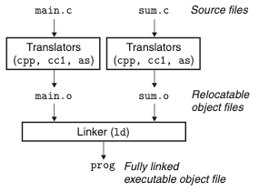
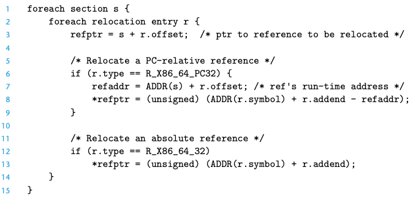
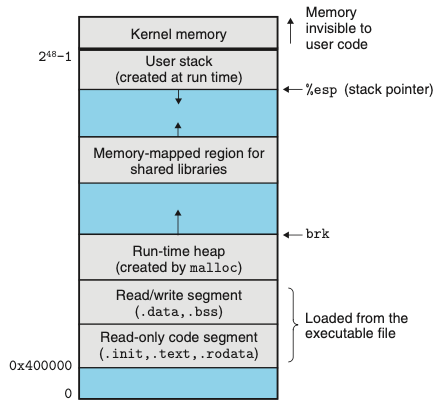
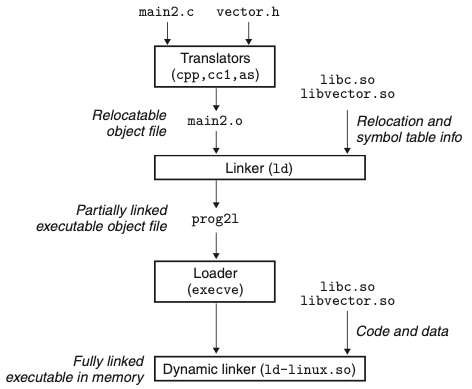

# Chapter 07. 링커
- 링킹은 여러 개의 코드와 데이터를 모아서 연결하여 메모리에 로드될 수 있고 실행될 수 있는 한 개의 파이로 만드는 작업이다. 
    - 링킹은 컴파일 시에 수행할 수 있다.
    - 로더에 의해 로드 타임에, 응용프로그램에 의해 실행 시에도 수행될 수 있다.
- 링커는 소프트웨어 개발 시에 중요한 역할: 독립적인 컴파일을 가능하게 하기 때문이다.
- 링커를 배우는 이유
    - 큰 프로그램을 작성하는 데 도움이 된다.
    - 위험한 프로그래밍 에러를 피할 수 있다.
    - 어떻게 언어의 변수 영역 규칙이 구현되었는지 이해하는 데 도움이 된다.
    - 다른 중요한 시스템 개념을 이해할 수 있게 된다.
    - 공유 라이브러리에 대해 이해할 수 있다.

# 7.1 컴파일러 드라이버
- 대부분의 컴파일 시스템은 사용자를 대신해서 언어 전처리기, 컴파일러, 어셈블러, 링커를 필요에 따라 호출하는 컴파일러 드라이버를 제공한다.
- 컴파일 순서
    1. C 전처리기(cpp)로 main.c -> ASCII 중간 파일인 main.i로 번역
    2. C 컴파일러(cc1)로 main.i -> ASCII 어셈블리 언어 파일인 main.s로 번역
    3. 어셈블러(as)로 main.s -> 재배치 가능한 바이너리 목적파일인 main.o로 번역
    4. 링커(ld)로 main.o & sum.o 두개를 연결 -> 실행 가능 목적파일 prog 생성
    5. 로더라고 부르는 운영체제 내의 함수를 호출 -> 로더는 실행파일 prog의 코드와 데이터를 메모리로 복사하고, 제어를 프로그램의 시작 부분으로 전환한다.

# 7.2 정적연결
- 정적 링커는 재배치 가능한 목적파일들과 명령줄 인자들을 받아들여 로드될 수 있고 실행될 수 있는 완전히 링크된 실행 가능 목적파일을 생성한다.
- 실행파일을 만들기 위해서 링커는 두 가지 주요 작업을 수행한다.
  1. 심볼 해석 symbol resolutions: 각각의 심볼 참조를 정확하게 하나의 심볼 정의에 연결하는 것이다.
  2. 재배치 Relocation: 링커는 섹션들을 각 심볼 정의와 연결시켜 재배치한다.
  
# 7.3 목적파일
- 세가지 목적파일이 있다.
  - 재배치 가능 목적파일 Relocatable object file: 다른 재구성가능 목적파일들과 결합될 수 있는 바이너리 코드와 데이터를 포함
  - 실행 가능 목적파일 Executable object file: 메모리에 직접 복사될 수 있고 실행될 수 있음
  - 공유 목적파일 Shared object file: 로드타임 또는 런타임 시에 동적으로 링크되고 로드될 수 있는 목적파일
- 컴파일러와 어셈블러는 재배치 가능 목적파일을 생성, 링커는 실행 가능한 목적파일을 생성

# 7.4 재배치 가능 목적파일 

- 위의 그림은 전형적인 ELF(Executable and Linkable Format) 재배치 가능 목적파일의 포맷이다.
  - .text: 컴파일된 프로그램의 머신 코드
  - .rodata: printf 문장의 포맷 스트링
  - .data: 초기화된 전역변수 및 정적변수
  - .bss: 초기화되지 않은 또는 0으로 초기화된 전역변수 및 정적변수
  - .symtab: 프로그램에서 정의되고 참조되는 전역변수들과 함수에 대한 정보를 가지고 있는 심볼 테이블
  - .rel.text: 다른 목적 파일들과 연결할 때 링커가 수정해야하는 .text 섹션 내 위치들의 리스트
  - .rel.data: 전역변수들에 대한 재배치 정보
  - .debug: 프로그램 내에서 정의된 지역변수들과 typedef
  - .line: 최초 소스 프로그램과 .text 섹션 내 머신 코드 인스트럭션 내 라인 번호들간의 매핑
  - .strtab: 섹션 이름들을 위한 스트링 테이블

# 7.5 심볼과 심볼 테이블
- 재배치 가능 목적 모듈 m은 m에 의해서 정의되고 참조되는 심볼들에 대한 정보를 포함하는 심볼 테이블을 가지고 있다.
  - m에 의해 정의되고 다른 모든 모듈들에 의해서 참조될 수 있는 전역 심볼
    - 전역
  - m에 의해 참조되지만 다른 모듈에 의해 정의된 전역 심볼
    - external
  - m에 의해서 배타적으로 참조되고 정의된 지역 심볼
    - static
  
> 지역 변수는 런타임에 스택에 의해서 관리되며 링커에는 관심거리가 아니다.

- .symtab 섹션의 ELF 심볼 테이블은 엔트리들의 배열을 포함하고 있다.

  

- 테이블 엔트리가 없는 의사 섹션pseudo section 이 존재한다.
  - ABS: 재배치해서는 안 되는 심볼
  - UNDEF: 정의되지 않은 심볼, 해당 모듈에서는 참조만 되고 다른 곳에서 정의된 심볼들을 위함
  - COMMON: 아직 할당되거나 초기화되지 않은 데이터 객체를 위함

> COMMON: 초기화하지 않은 전역변수들, .bss: 초기화하지 않은 정적변수들과 0으로 초기화된 전역변수나 정적변수들

# 7.6 심볼 해석
- 링커는 자신의 입력 재배치 가능 목적파일들의 심볼 테이블로부터 정확히 한 개의 심볼 정의에 각 참조를 연결시켜서 심볼 참조를 해석한다.
- 컴파일러가 현재 모듈에서 정의되지 않은 심볼을 만나면, 다른 모듈에서 정의되어 있다고 가정하고 링커 심볼 테이블 엔트리를 생성하며, 링커가 이것을 처리하도록 남겨둔다.

## 7.6.1 링커가 중복으로 정의된 전역 심볼을 해결하는 방법
- 링커의 입력은 여러 개의 재배치 가능한 오브젝트 모듈들이다. 
  - 일부는 지역적이다(정의된 모듈 내에서만 볼 수 있는).
  - 일부는 전역적이다(다른 모듈에서도 볼 수 있는).
- 컴파일러는 각 전역 심볼을 어셈블러로 강하게 또는 약하게 보내 심볼 테이블에 묵시적으로 인코딩하게 한다.
  - 함수들과 초기화된 전역변수들은 강한 심볼
  - 비초기화된 전역변수들은 약한 심볼이다.
- 링커는 중복된 심볼 이름을 처리하기 위해서 다음과 같은 규칙을 사용한다.
  1. 동일한 이름을 갖는 복수의 강한 심불은 허용 X
  2. 동일한 이름의 강한 심볼과 다수의 약한 심볼들이 있으면 강한 심볼 선택
  3. 동일한 이름의 여러 개의 약한 심볼이 있으면 어떤 약한 심볼을 선택해도 관계 X

## 7.6.2 정적 라이브러리와 링크하기
- 모든 컴파일 시스템은 관련된 객체 모듈들을 `정적 라이브러리`라고 부르는 한 개의 파일로 패키징하는 매커니즘을 제공한다.
  - 이 라이브러리는 다음에 링커의 입력으로 제공될 수 있다.
  
> 컴파일러 개발자들이 라이브러리의 다양한 함수들을 정적 라이브러리의 혜택 없이 사용자들에게 재공하려면 컴파일러가 직접 함수의 코드를 생성하거나 한 개의 재배치 가능 목적 모듈에
> 저장하거나 해야한다. 하지만 이런 방법들은 상당한 복잡성을 더하거나 디스크 공간을 극도로 낭비한다. 위와 같은 접근 방법의 단점들을 해겨하기 위해 정적 라이브러리 개념이 개발되었다.

- 위 그림은 정적 라이브러리 연결 시 링커의 동작을 요약한 것이다.

## 7.6.3 링커가 참조를 해석하기 위해 정적 라이브러리를 사용하는 방법
- 링커는 실행파일을 구성하기 위해 합쳐질 재배치 가능 목적파일들의 집합 E, 미해석 집합 U, 이전 입력파일에서 정의된 심볼 집합 D를 유지한다.
  1. 입력파일 f에 대해서 링커는 f가 목적파일 또는 아카이브인지 결정한다.
  2. f가 목적파일이면 f를 E에 추가하고 U와 D를 갱신한다.
  3. f가 아카이브라면, 링커는 U 안의 미해석 심볼들을 아카이브의 멤버들에 의해 정의된 심볼들과 매칭하려고 시도한다.
  4. 심볼을 정의한다면 m은 E에 추가되고 U와 D를 갱신한다.
  5. 위 과정을 U와 D가 더 이상 바뀌지 않는 일정 지점까지 반복 실행한다.
  6. 스캔을 끝마칠 때 U가 비어있지 않다면 에러 출력, 그렇지 않다면 E에 있는 목적파일들을 합치고 재배치해서 출력 실행파일을 만든다.

> 위의 알고리즘은 명령줄의 라이브러리와 목적파일의 순서가 중요한 이유가 된다.

# 7.7 재배치
- 링커가 심볼 해석 단계를 완료하면, 코드 내 각 심볼 참조는 정확히 한 개의 심볼 정의에 연결된다.(입력 모듈 중 하나의 심볼 테이블 엔트리로 연결됨)
- 이후 재배치를 하게 된다. 재배치는 두 단계로 구성된다.
  1. 섹션과 심볼 정의를 재배치한다.
  2. 섹션 내 심볼 참조를 재배치한다.

## 7.7.1 재배치 엔트리
- 어셈블러가 목적 모듈을 생성할 때, 어셈블러는 코드와 데이터가 궁극적으로 메모리 어디에 저장될지 알지 못한다.
  - 어셈블러가 위치를 알지 못하는 객체로의 참조를 만나면, 링커에게 이 참조를 어떻게 수정하는지 알려주는 재배치 엔트리를 생성한다.
  

  
- 재배치 타입
  - R_X86_64_PC32: 32비트 PC-상대주소를 사용하는 참조를 재배치한다.
  - R_X86_64_32: 32비트 절대주소를 사용하는 참조를 재배치한다.
  
## 7.7.2 심볼 참조의 재배치

- 위의 그림은 링커의 재배치 알고리즘을 위한 의사코드이다.

# 7.8 실행 가능한 목적파일

- 실행 가능 목적파일의 포맷은 재배치 가능한 목적파일의 포맷과 유사하다.
  - .text, .rodata, .data 섹션들이 각자의 최종 런타임 메모리 주소로 재배치되었다.
  - _init는 프로그램의 초기화 코드에서 호출한다.
  - 실행파일이 완전히 링크(재배치) 되었기 때문에, .rel 섹션을 필요로 하지 않는다.

- ELF 실행파일들은 연속적인 메모리 세그멘트에 매핑된 연속적인 실행 가능 파일들의 덩어리로 메모리에 로드하기 쉽도록 설계되었다.
  - 이 매핑은 프로그램 헤더 테이블에 설명되어 있다.
  
- 모든 세그먼트 s에 대해, 링커는 다음과 같이 시작주소를 선택해야 한다.
  - vaddr mod align = off mod align
  - align은 프로그램 헤더에 명시된 정렬(2^21 = 0x2000000)이다.
  - 이러한 정렬 요구사항은 프로그램이 실행될 때 목적파일의 세그먼트들이 메모리로 효과적으로 전송될 수 있도록 하는 최적화의 결과다.
    - 가상메모리가 크기가 큰 연속된 2의 제곱 크기의 바이트 묶음으로 구성되어 있는 방식이기 때문이다.

# 7.9 실행 가능 목적파일의 로딩
1. 실행 가능 목적파일 prog를 실행한다.
2. 쉘은 로더loader 라고 알려진 메모리 상주 운영체제 코드를 호출해서 prog를 실행한다.
3. 로더는 디스크로부터 실행 가능한 목적파일 내의 코드와 데이터를 메모리로 복사한다.
4. 해당 프로그램의 첫 번째 인스트럭션, 즉 엔트리 포인트로 점프해서 프로그램을 실행한다.

- 모든 실행 중인 리눅스 프로그램은 위의 그림과 유사한 런타임 메모리 이미지를 가진다.

# 7.10 공유 라이브러리로 동적 링크하기
- 정적 라이브러리들은 다른 모든 소프트웨어처럼 관리해야 하고 주기적으로 갱신해야한다.
- 공유 라이브러리들은 정적 라이브러리의 단점들을 극복한다.
  - 공유 라이브러리는 런타임이나 로드타임에 임의의 메모리 주소에서 로드되고, 메모리에서 프로그램으로 연결될 수 있는 목적 모듈이다.
  - 해당 과정을 동적 링킹이라고 한다.
  - 리눅스 시스템에서 .so 확장자, 윈도우 시스템에서 DLL(dynamic link libraries)이라고 부른다.
- 공유 라이브러리들은 두 가지 다른 방법으로 "공유"된다.
  1. 어떤 주어진 파일 시스템에서, 특정 라이브러리에 대해 정확히 한 개의 .so 파일만이 존재한다.
     - .so 파일 내의 코드와 데이터는 이 라이브러리를 참조하는 모든 실행 가능한 목적파일들에 의해 공유된다.
  2. 메모리에 있는 공유 라이브러리의 .text 섹션은 서로 다른 실행중의 프로세스들에 의해 공유될 수 있다.

- 위의 그림은 공유 라이브러리로 동적 링크 과정을 요약한 것이다.
- 기본 아이디어는 링킹의 일부는 실행 가능 파일이 생성될 때 정적으로 수행하고, 프로그램이 로드될 때 링킹 작업을 동적으로 완료하는 것이다.

# 7.11 Applications 으로부터 공유 라이브러리를 로드하고 링크하기
- 응용프로그램이 돌고 있는 동안에 동적 링커에게 응용프로그램을 컴파일 시에 라이브러리와 링크할 필요 없이 임의의 공유 라이브러리를 로드하고 링크할 것을 요청할 수도 있다.
- 기본 아이디어는 공유 라이브러리에서 동적 콘텐츠를 생성하는 각 함수들을 패키지 하는 것이다. 
  - 서버는 동적으로 적당한 함수를 로드하고 링크한 뒤에 직접 호출한다.
  - 함수는 서버의 주소공간에 캐시된 상태로 남으며, 후속 요청들은 간단한 함수 호출하는 비용만으로 처리될 수 있다.
  
# 7.12 위치-독립성 코드(PIC)
- 공유 라이브러리를 사용하는 주목적은 다수의 실행되고 있는 프로세스들이 메모리 내에서 동일한 라이브러리 코드를 공유하도록 하는 것이며, 귀중한 메모리 자원을 절약하는 것이다.
  - 한 가지 접근 방법은 공유 라이브러리를 사전에 정해진 주소공간 블록에 할당 하는 것이다.
    - 단점 : 사용하지 않을 때도 할당, 메모리 블록들이 중첩되지 않도록 보장해줘야 함
  
- 위의 문제점을 피하기 위해 공유 모듈들의 코드 일부분을 컴파일해서 링커에 의해 수정되지 않고도 이들이 메모리 어디든지 로드될 수 있도록 한다.
  - 어떠한 재배치 작업 없이 로드될 수 있는 코드는 위치-독립성코드라고 한다.(PIC)
  
>PIC와 GOT, PLT는 아직 이해를 하지 못해 좀 더 찾아보고 공부해야 한다.

# 7.13 라이브러리 삽입
- 컴파일 삽입
- 링크 삽입
- 런타임 삽입

# 7.14 요약
- 링킹은 컴파일 시에 정적 링커에 의해 수행될 수 있으며, 로드타임과 런타임에는 동적 링커에 의해 수행된다.
- 목적 파일들은 세 가지 형태로 나타난다.
  - 재배치 가능: 정적 링커에 의해 실행 가능 목적파일로 연결
  - 실행 가능: 메모리에 로드되고 실행
  - 공유: 공유 라이브러리
- 링커의 두 가지 주요 임무
  - 전역 심볼들이 유일한 정의에 연결되는 경우 심볼 해석
  - 재배치 작업
- 로더는 실행파일의 내용을 메모리로 매핑하고 프로그램을 실행한다.

