# Chapter 09. 가상메모리
- 시스템의 프로세스들은 CPU와 메인 메모리를 다른 프로세스들과 공유한다.
- 메모리를 보다 효율적이고 더 적은 에러를 갖도록 관리하기 위해서 현대의 시스템은 가상메모리 virtual memory VM 이라고 알려진 메인 메모리의 추상화를 제공한다.
- 가상메모리는 각 프로세스에 하나의 크고 통합된, 사적 주소공간을 제공한다.
- 가상 메모리의 중요한 세가지 기능
    1. 메인 메모리를 디스크에 저장된 주소공간에 대한 캐시로 취급해서 메인 메모리 내 활성화 영역만 유지하고, 데이터를 디스크와 메모리 간에 필요에 따라 전송하는 방법으로 메인 메모리를 효율적을 ㅗ사용
    2. 각 프로세스에 주소공간을 제공함으로써 메모리 관리를 단순화한다.
    3. 각 프로세스의 주소공간을 다른 프로세스에 의한 손상으로부터 보호한다.
    
> 가상 메모리를 이해하면 어떻게 시스템이 일반적으로 동작하는지 더 잘 이해할 수 있으며, 가상메모리의 강력한 성능을 응용프로그램에 적용할 수 있다. 또한 가상메모리는 
> 치명적인 에러를 발생시키는데 이를 방지할 수 있다.

# 9.1 물리 및 가상주소 방식
- 컴퓨터 시스템의 메인 메모리는 M개의 연속적인 바이트 크기 셀의 배열로 구성된다.
- 각 바이트는 고유의 물리 주소(PA physical address)를 가진다.

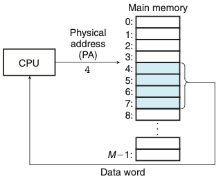
- 위의 그림은 <strong>물리 주소 방식</strong>이다.

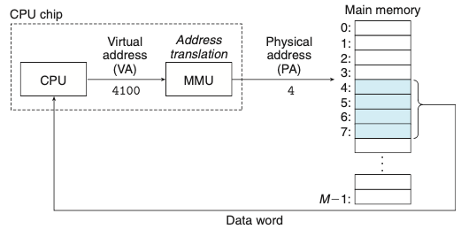
- 위의 그림은 <strong>가상주소방식</strong>이다.
    - CPU는 가상주소지정으로 가상주소(VA virtual address)를 생성해서 메인 메모리에 접근하다.
    - 가상주소를 물리 주소로 변환 하는 작업은 <strong>주소 번역</strong>이다.
    - CPU 칩 내에 <strong>메모리 관리 유닛(MMU)</strong>를 사용해서 가상주소로 번역한다. 

# 9.2 주소공간
- 메인 메모리의 각 바이트는 가상 주소공간으로부터 선택된 가상주소를 가진다.

# 9.3 캐싱 도구로서의 VM
- 가상메모리는 디스크에 저장된 N개의 바이트 크기의 셀 배열로 구성된다.
- <strong>VM system</strong>은 가상메모리를 규정된 사이즈 블록 단위로 분할하여 관리한다.
    - 분할된 블록들은 <strong>가상페이지</strong>라고 부른다.
- 가상페이지의 집합은 세 개의 중첩되지 않는 부분집합으로 나누어진다.
    - Unallocated: VM 시스템에 의해 아직까지 할당되지 않은 페이지들
    - Cached: 현재 물리 메모리에 캐시되어 할당된 페이지들
    - Uncached: 물리 메모리에 캐시되지 않은 할당된 페이지들
        
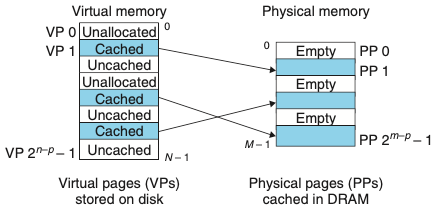
- 위의 그림은 여덟 개의 가상페이지를 갖는 작은 가상메모리를 보여준다.
    
## 9.3.1 DRAM 캐시의 구성
- DRAM 캐시의 미스 비용과 첫 번째 바이트를 접근하는 데 드는 비용은 크기 때문에 가상페이지 또한 커지고 있다.
- DRAM 캐시는 완전 결합성이기 때문에 모든 가상페이지는 물리페이지에 둘 수 있다.
- 디스크의 큰 접근 시간 때문에 DRAM은 항상 write-through 대신에 write-back을 사용하고 있다.

> 완전 결합성은 하나의 집합에 모든 라인이 들어있는 캐시 구조를 말한다.

## 9.3.2 페이지 테이블
- 모든 캐시에서처럼 VM 시스템은 가상페이지가 DRAM 어딘가에 캐시되었는지 결정하기 위한 방법을 갖고 있어야 한다.
- 이러한 기능은 <strong>운영체제 소프트웨어</strong>와 <strong>MMU 내의 주소 번역 하드웨어</strong>와 <strong>페이지 테이블</strong>의 조합으로 제공된다.
    - 페이지 테이블: 가상페이지를 물리페이지로 매핑하는 역할
    - 주소 번역 하드웨어: 가상주소를 물리 주소로 변환할 때마다 페이지 테이블을 읽는다.
    - 운영체제: 페이지 테이블의 콘텐츠 관리와 페이지들을 디스크와 DRAM 사이에서 왔다 갔다 하는 것을 관장한다.
    
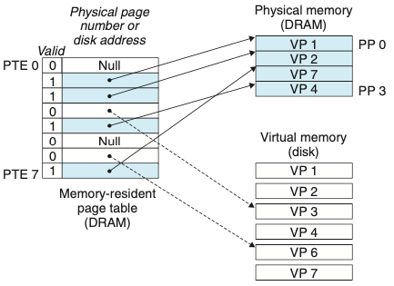
- 위의 그림은 페이지 테이블의 기분 구조를 보여준다.

- DRAM 캐시가 완전 결합성이므로 물리페이지가 모든 가상페이지를 포함할 수 있다.

## 9.3.3 페이지 적중
- PTE 내의 물리 메모리 주소를 사용해서 해당 워드의 물리 주소를 구성한다.을 관장한다.
    
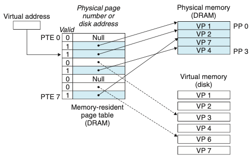

## 9.3.4 페이지 오류
- 가상메모리 용어에서 DRAM 캐시 미스는 페이지 오류page fault라고 알려져 있다.

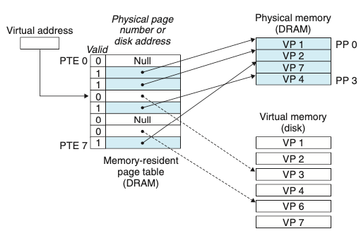
- VP3 내의 워드에 대한 참조는 미스가 되고 페이지 오류를 발생시킨다.
   

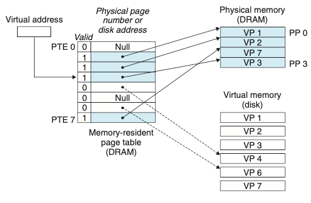
- 페이지 오류 핸들러는 VP4를 희생시키고 디스크로부터 VP3의 사본으로 교체한 뒤 정상적으로 읽는다.

- 페이지: 가상메모리 용어에서의 블록
- 스와핑(페이징): 디스크와 메모리 사이에 페이지를 전송하는 동작
- 요구 페이징 demand paging: 미스가 발생할 때, 하나의 페이지로 스와핑되어 들어오는 마지막 순간까지 기다리는 전략

## 9.3.5 페이지의 할당
- 운영체제가 가상메모리의 새로운 페이지를 할당할 때 디스크 상에 공간을 만들고 임의의 PTE를 디스크에 새롭게 만든 페이지를 가리키도록 할당한다.

## 9.3.6 문제해결을 위한 또 한 번의 지역성의 등장
- 가상메모리의 개념을 공부하면 비효율적인 것을 느낄 수 있다 하지만 실제로 가상메모리는 잘 동작하는데, 주로 <strong>지역성</strong> 문제 때문이다.
- 지역성의 원리는 시간상의 어느 시점에서라도 이들이 동작 집합working set 또는 거주 집합resident set이라고 알려진 보다 작은 활성화된 페이지 집합에서 동작하는 
경향을 보일 것이라는 점을 약속해준다.
- 쓰레싱thrashing: 동작 집합 크기가 물리 메모리보다 더 크면, 페이지들이 연속적으로 스왑을 반복하게 되는 불행한 상황

# 9.4 메모리 관리를 위한 도구로서의 VM
- 다수의 가상페이지들이 동일한 공유된 물리페이지에 매핑될 수 있다.
- 요구 페이징과 분리된 가상 주소공간의 조합은 메모리가 시스템에서 사용되고 관리되는 방식에 중요한 영향을 미친다.
- 특히 VM은 링킹과정과 로딩, 코드와 데이터의 공유, application으로의 메모리 할당을 단순화 해준다.
  - 링킹을 단순화한다: 별도의 주소공간은 각 프로세스들이 각 메모리 이미지에 대해서 코드와 데이터가 실제로 물리 메모리 내 어디에 위치하는지에 상관 없이 동일한 기본 포맷을 사용하도록 해준다. 이러한 통일성은 링커의 설계와 구현을 매우 단순화해준다.
  - 로딩을 단순화한다: 가상메모리는 실행파일과 공유 목적파일들을 메모리에 로드하기 쉽게 해준다.
  - 공유를 단순화한다: 운영체제는 다수의 프로세스가 서로 다른 프로세스에 들어 있는 가상페이지들을 동일한 물리페이지들로 적절하게 매핑해서 한 개의 사본을 공유하도록 할 수 있다.
  - 메모리 할당을 단순화한다: 운영체제는 적당한 수의 연속적인 가상메모리 페이지를 할당하고 이들을 물리 메모리 내에 위치한 k개의 임의의 물리페이지로 매핑한다.

# 9.5 메모리 보호를 위한 도구로서의 VM
- 컴퓨터 시스템은 운영체제가 메모리 시스템에 접근하는 것을 제어할 수 있는 수단을 제공한다.
- 별도의 가상 주소공간을 제공하면 사적 메모리를 다른 프로세스로부터 분리하는 것이 쉬워진다.

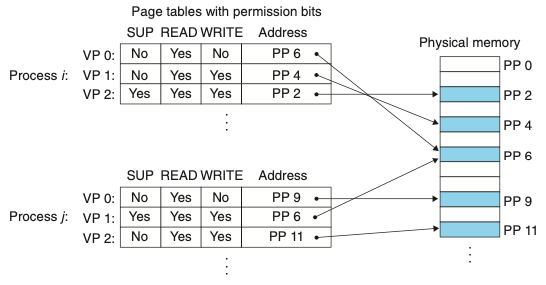
- 위 그림에서 SUP는 커널 모드(수퍼바이저)로 돌고 있는지를 나타내는 비트다. 
  - 만약 사용자모드에서 VP2에 접근하려 한다면 CPU는 일반 보호 오류를 발생해서 SIGSEGV 시그널을 위반한 프로세스로 보내 커널 내의 예외 핸들러로 제어를 이동시킨다.
  - 위와 같은 예외를 "세그먼트 오류segmentation fault"라고 보고한다.

# 9.6 주소의 번역
> 용어설명 
> - VA: virtual address
> - PETA: page table entry address
> - PTE: page table entry
> - PA: physical address

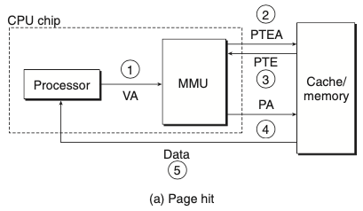
- 페이지 적중이 일어났을 때
  1. 프로세서는 가상주소를 생성하고 이것을 MMU로 보낸다.
  2. MMU는 PTE 주소를 생성하고 이것을 캐시/메인 메모리에 요청한다.
  3. 캐시/메인 메모리는 PTE를 MMU로 리턴한다.
  4. MMU는 물리 주소를 구성하고 이것을 캐시/메인 메모리로 보낸다.
  5. 캐시/메인 메모리는 요청한 데이터 워드를 프로세서로 보낸다.

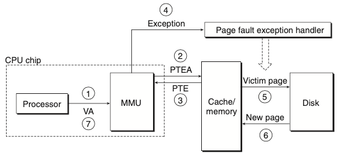
- 페이지 오류를 처리할 때
  1. 페이지 적중과 동일
  2. 페이지 적중과 동일
  3. 페이지 적중과 동일
  4. PTE의 유효비트는 0이므로 MMU는 예외를 발생시키고, CPU 내의 제어를 운영체제 커널의 페이지 오류 예외 핸들러로 이동시킨다.
  5. 오류 핸들러는 물리 메모리 내의 희생자 페이지를 결정하고, 만일 이 페이지가 수정되었다면 디스크로 페이지를 이동한다.
  6. 오류 핸들러는 새 페이지를 페이지 이동해서 들여오고, 메모리 내의 PTE를 갱신하다.
  7. 오류 핸들러는 처음의 프로세스로 돌아가고 오류 인스트럭션은 재시작된다.
 
## 9.6.1 캐시와 VM의 통합
- 대부분의 시스템은 SRAM 캐시에 물리 주소지정을 선택한다.
- 물리 주소를 사용하면 다중 프로세스들이 캐시에서 블록을 갖는 것과 마찬가지로 가상페이지로부터 블록을 공유하는 것이 단순해진다.
- 물리 주소를 사용하는 캐시가 가상메모리와 통합될 수 있는 이유는 <strong>주소 번역이 캐시 참조 이전에 일어나기 때문이다.</strong>
  - TLB를 사용하면 캐시 참조 이전에 주소 번역이 일어남
  
## 9.6.2 TLB를 사용한 주소 번역 속도의 개선
- 주소 번역의 비용을 줄이기 위해 MMU 내에 <strong>번역 참조 버퍼translation lookaside buffer(TLB)</strong>라고 부르는 작은 캐시를 포함한다.
- TLB는 작은 가상주소지정 캐시로, 각 라인은 하나의 PTE로 구성된 하나의 블록을 저장한다.

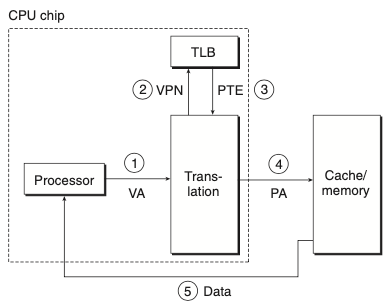
- TLB 적중이 발생할 때
  1. CPU는 가상주소를 생성한다.
  2. MMU는 적당한 PTE를 TLB로부터 선입한다.
  3. MMU는 적당한 PTE를 TLB로부터 선입한다.
  4. MMU는 가상주소를 물리 주소로 번역하고, 그것을 캐시/메인 메모리로 전송한다.
  5. 캐시/메인 메모리는 요청한 데이터 워드를 CPU로 리턴한다.
  
   

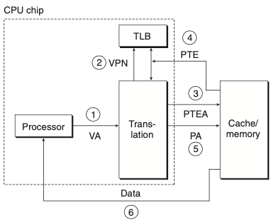
- TLB 미스가 발생하면, MMU는 PTE를 L1캐시에서 선입해야한다. 

