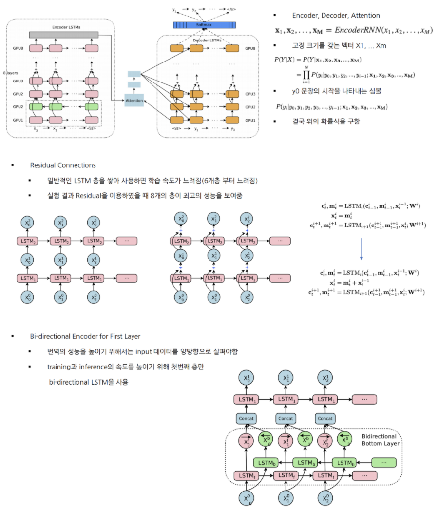
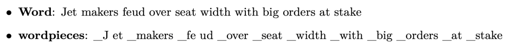
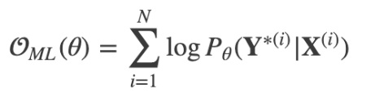
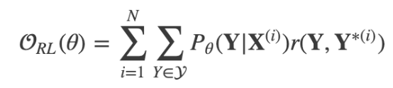
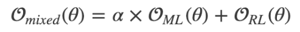
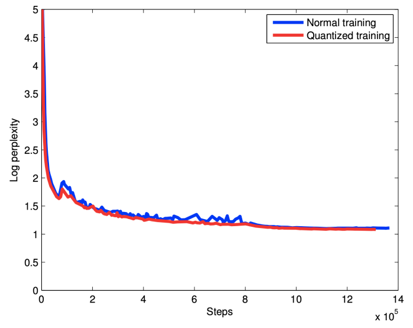
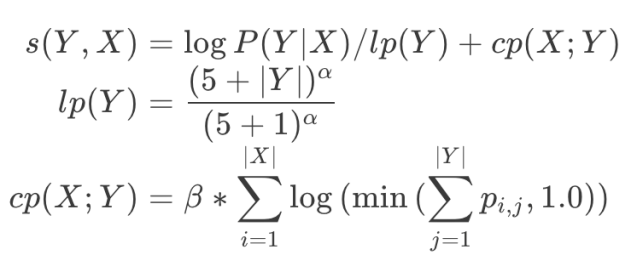
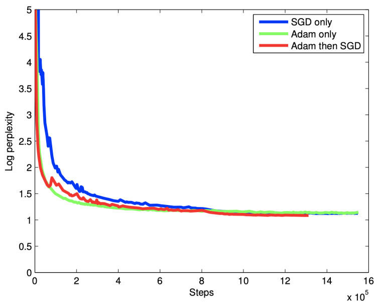
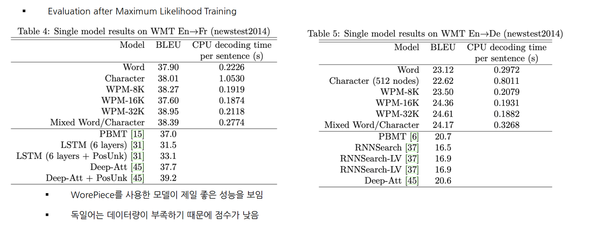
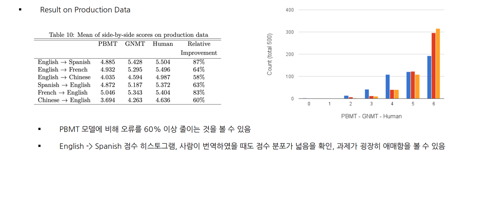

<h1>Introduction</h1>
- Neural Machine Translation
    - End-to-End 학습 접근 방식의 자동 번역
    - 기존 구문 기반 번역의 약점을 극복
- Neural Machine Translation 단점
    - 데이터 양과 매개변수가 많아 훈련과 추론 속도가 느림
    - Rare Word 처리의 문제점
    - 가끔씩 모든 단어에 대해 번역하지 못함
- Google’s Neural Machine Translation
    - LSTM으로 이루어져 있는 8개의 ENCODER와 8개의 DECODER
    - 병렬 처리 개선을 위해 DECODER의 최하층과 ENCODER의 최상층을 ATTENTION으로 연결
    - 번역속도를 높이기 위해 low-precision arithmetic, Rare Word 처리를 위해 WordPiece 사용

<h1>Model Architecture</h1>

- Model Parallelism
    - 모델 병렬화와 데이터 병렬화 모두 사용함
    - Downpour SGD를 사용하여 데이터 병렬화
        - 여러개의 모델로 나누어, 여러개의 머신에서 동시에 학습함, 각각 학습된 gradient를 평균내어 모델에 적용
        - 실험에서는 10개의 머신에서 128개의 문장을 Mini-batch로 사용
    - 모델 병렬화
        - 머신당 8개의 GPU 사용 ( 각 층 마다 서로 다른 GPU에 할당 )
        - i번째 레이어의 작업이 종료전에 i+1번째 작업 진행 가능

<h1>Segmentation Approches</h1>
- Wordpiece Model
    - 띄어쓰기는 _, 단어는 내부단어 통계에 기반하여 띄어쓰기로 분리
    - 띄어쓰기를 _로 치환한 이유는 차후에 문장 복원을 위해
    - 실험에서는 wordpiece를 8K~32K에서 좋은 결과 얻음
    - wordpiece로도 얻을 수 없었던 rare word는 copy model을 사용

- Mixed Word/Character Model
    - OOV 처리를 <UNK>로 하지 않고 문자 단위로 나누어 처리함
    - 시작 문자 <B>, 중간 문자 <M>, 끝 문자 <E>
    - 전체 작업 과정에서 유지한 채로 학습한 후 태그를 삭제함
    

<h1>Training Criteria</h1>
- Maximum-liklihood 학습 방식은 로그 확률 값을 최대화하는 목적 함수 ( BLUE 평가 지표와 부합되지 않음 )

- Reward개념의 목적함수 사용

- r은 문장 단위 점수 ( 출력 문서와 실제 문서의 차이 계산 )
- GLEU 점수 지표 사용 ( 출력 문장과 정답 문장을 1~4 토큰으로 만든 뒤 recall과 precision을 구한 뒤 더 작은 값을 GLEU로 정함 )
- ML방식과 RL 방식 혼합하여 사용 이 때, a는 0.017

<h1>Quantizable Model And Quantized Inference</h1>
- NMT은 연산량이 많아 Inference 시간이 오래 걸리는 것이 큰 단점
- 해결하기 위하여 Quantized inference 수행!

<h1>Decoder</h1>
- Beam Search를 사용하여 점수 함수를 최대화 하는 시퀀스 Y를 찾음
- Length normalization
    - 길이가 더 긴 문장의 확률이 떨어지기 때문에 이를 보정하기 위하여 사용
    - 하이퍼 파라미터 a 사용 ( 실험에서는 0.6 ~ 0.7 사용 )
- Coverage Panelty
    - source word xi로 부터 attention weight의 합을 구함
    - 로그를 취했기 때문에 attention weight이 편중되지 않은 source word의 값이 매우 작음 음수를 가지게 됨
    - 실험에서는 a는 0.6 b는 0.2 사용

<h1>Experiments And Results</h1>
- Data set
    - WMT En -> Fr 36M
    - WMT En -> De 5M
- Evaluation Metrics
    - BLUE
    - implicit human evaluation ( BLUE는 번역 점수 잘 못메김 )
- Training Procederue
    - TensorFlow 사용하여 구현
    - 12개의 머신으로 병렬화
    - [-0.04, 0.04] 사이로 매개변수를 균일하게 초기화
    - Adam Optimizer와 SGD 혼합하여 사용 ( 첫 60k는 Adam으로 그 후로는 SGD 사용)
- Learning Rate는 0.5 ( 1.2M 이후부터 200k 단위마다 반씩 줄여가며 학습 )

<h1>Conclusion</h1>
1. Wordpiece 모델은 번역 품질과 inference 속도를 효과적으로 높힘
2. 모델과 데이터의 병렬화는 sequence-to-sequence NMT 모델을 일주일 안으로 효율적으로 훈련시킬 수 있음
3. Model quantization은 inference 속도를 가속화할 수 있어 대형 모델에 사용하기 용이함
4. Length-normalization, coverage penalty 등과 같은 추가 세부 사항이 NMT 시스템을 잘 작동시키게 도와줌