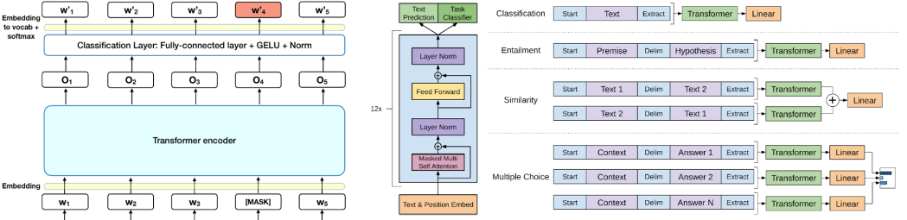
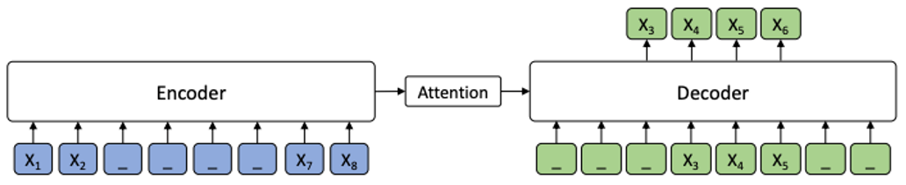
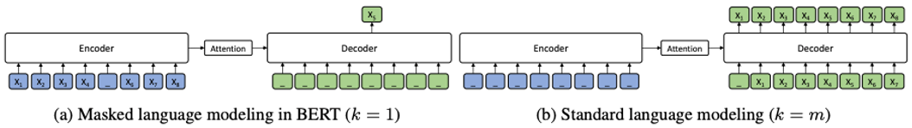
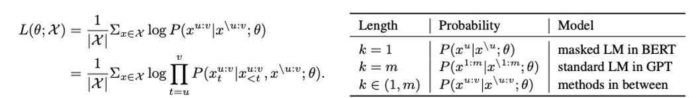
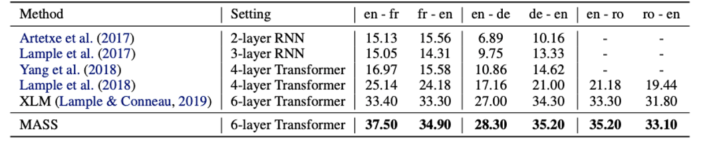
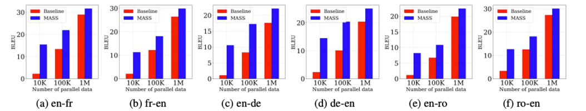
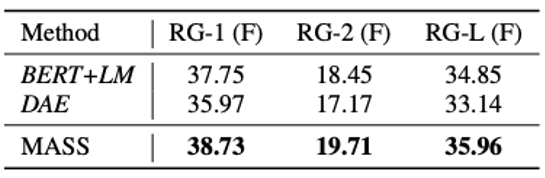
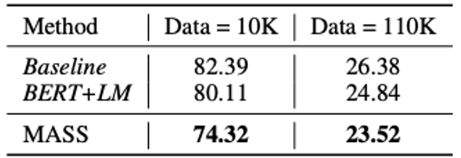
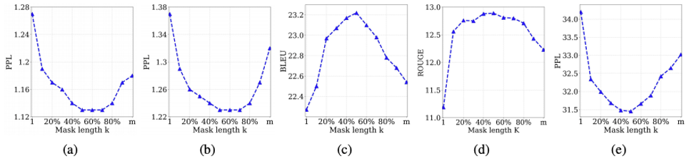

# Introduction
- Pre-training은 최근 NLP 분야에서 활발한 연구가 이루어지는 주제 중 하나
- Google의 Bert와 XLNet은 자연어 이해(NLU) Task에서 큰 성공을 거둔 모델
- NLU Task 외에 Sequence to Sequence를 기반으로 하는 자연어 생성 Task가 있음
    - Machine Translation, Abstract Text Summarization
- 자연어 생성 Task는 Encoder - Attention - Decoder 구조의 모델들이 사용됨

# Encoder-Attention-Decoder

- Encoder는 Source sequence X를 input으로 받은 후, 이를 hidden representations sequence로 변형
- Decoder는 Encoder로부터 hidden representations sequence를 전달 받아 Target Sequence Y를 생성하며, 이 때 Attention mechanism이 학습한 Input에 대한 정보를 함께 참조

  
# Related Works

- Bert와 XLNet은 Language Understanding을 위해 Encoder를 Pre-train 
- GPT는 Language Modeling을 위해 Decoder를 Pre-train 
- 이전 모델들은 Encoder, Attention, Decoder를 함께 Pre-train하지 못했음

  
# MASS:Masked Sequence to Sequence Pre-training

- 새로운 모델 MASS는 Masked Sequence to Sequence Pre-training의 약자 
- Input에서 K개의 토큰 Fragment를 임의로 지정해 Masking 
- 마스킹 된 Fragment를 Encoder-Attention-Decoder를 거쳐 예측하도록 훈련시킴
- Encoder에서 Masking되지 않은 토큰들이 Decoder에서 Masking됨에 따라, Decoder는 Encoder가 제공한 hidden representation과 Attention 정보만을 참고하여 Masking된 토큰들을 예측해야함, 이를 통해 Encoder-Attention-Decoder가 함께 Pre-train될 수 있는 환경을 제공 
- Encoder는 Encoder에서 Masking되지 않은 토큰들의 정보를 잘 추출할 수 있도록 학습, 이를 통해 Language Understanding 능력 개선 
- Decoder는 Encoder에서 Maksing된 토큰들에 대한 예측을 연속적으로 수행해야 하기 때문에 Language Modeling 능력을 학습하게 됨

- K는 Encoder에서 Masking되는 토큰 개수를 결정하는 하이퍼 파라미터 
- 하이퍼 파라미터 K를 조정함으로써 MASS는 BERT의 Masked LM과 GPT의 Standard LM을 모두 구현 가능 
- BERT Masked LM 
    - K=1일 때, Encoder에서는 하나의 토큰이 Masking되고, Decoder는 Masking된 하나의 토큰을 예측해야 하므로 BERT의 Masked LM과 같아짐 
- GPT Standard LM 
    - 하이퍼 파라미터 K가 Input 문장의 전체 길이인 m과 같을 때 Encoder의 모든 토큰들이 Masking됨 
    - Decoder는 Encoder로부터 어떠한 정보도 부여 받지 않은 채 모든 토큰을 예측해야 하므로, GPT의 Standard LM과 같아짐

- m - Input sequence의 전체길이 
- u - Maskinge된 Fragment의 시작점 
- v - Masking된 Fragment의 끝점 
- X^u - u부터 v까지의 fragment 
- X^\u:v - u부터 v까지 Making된 Input Sequence

  
# Experiments
- Model Configuration
    - 1024 embeding/hidden size, 4096 feed-forward filter size를 가진 6-layer encoder, 6-layer decoder로 구성된 기본 모델 구조 Transformer 
- Datasets 
    - 2007 - 2017 WMT News Crawl datasets 190M English, 62M French, German 270M 
    - MASS의 효과 검증을 위한 low-resource language Romanian 
- Pre-training Details 
    - Fragment length K의 길이를 문장에 있는 총 토큰 수의 약 50%로 설정하고 정확성의 변화를 비교하기 위하여 K를 바꿔가며 실험
    
  
# Experiment:Unsupervised Machine Translation

- Unsupervised Machine Translation Task에 있어 이전 모델들, 최근까지 SOTA였던 Facebook의 XLM모델과 MASS의 성능 비교를 수행 
- Facebook의 XLM은 Encoder와 Decoder를 각각 Bert의 Masked LM과 standard LM으로 Pre-train 시킨 모델 
- MASS는 6개의 Machine Translation Task에 있어 XLM을 능가하는 성능, SOTA 기록
    
  

# Experiment:Low-resource Translation

- Low-resource Machine Translation : bilingual 트레이닝 데이터셋이 부족한 환경에서의 기계번역 
- Englisgh-Fench, English-German, English-Romanian 데이터 셋을 10K, 100K, 1M의 사이즈로 늘려가며 Low-resource 환경에서의 Machine Translation 테스트 
- MASS는 모든 스케일에서 Low-resource MT의 baseline 성능을 능가 
- 데이터셋의 사이즈가 작을수록 더욱 두드러지게 나타남
    
  

# Experiment:Abstractive Summarization

- Pre-trained Bert를 인코더로 Pre-trained Language Model을 Decoder로 사용한 BERT+LM 모델과 DAE(Denoising Auto-Encoder), MASS의 Abstractive Summarization 성능을 Gigaword Corpus에 대해 비교 
- MASS는 BERT+LM과 DAE 두 모델의 Abstractive Summarization 성능을 모두 능가
    
  

# Experiment:Conversational Response Generation

- Abstractive Summarization 성능 비교에 사용되었던 BERT+LM 모델과 Baseline, MASS의 Conversational Response Generation 성능을 Cornell Movie Dialog Corpus에 대해 비교 
- MASS가 BERT+LM 모델과 Baseline 보다 낮은 Perplexity를 기록하며 더 좋은 성능을 보여줌
    
  

# The probability formulation

- (a) 영어-프랑스 번역의 영어, (b) 영어-프랑스 번역의 프랑스어, (c) 영어-프랑스 번역의 BLUE score (d) Text Summarization의 ROUGE score, (e) conversational response generation의 PPL 
- 하이퍼 파라미터 K를 다르게 설정해가며, MASS의 성능에 대한 다양한 실험 결과 
- 실험을 통해 K가 문장의 절반 정도 크기에 해당할 때, downstream task에서 가장 좋은 성능을 보임을 알게 됨 
    - 문장 내 절반의 토큰을 Masking하는 것이 Encoder와 Decoder의 Pre-training에 있어 적절한 균형을 제공 
- K가 1(BERT), K가 m(GPT) 이었을 때는 downstream task에서 좋은 성능이 나오지 않음 이 이유는 MASS가 Sequence to Sequence 기반의 Language Generation Task에 이점을 지니고 있음을 반증

  
# Couclusion
- MASS는 Sequence to Sequence 기반의 다양한 Language generation Task에 있어 좋은 성능 기록 
- Language generation에서 좋은 성능을 기록한 MASS가 BERT와 XLnet이 뛰어난 결과를 기록한 Natural Language Understanding Task에서도 좋은 성능을 보일 것인지 차후 실험해볼 예정 
- 또한 MASS 모델이 Image와 Video와 같은 NLP와 다른 도메인에서도 Sequence to Sequence 기반의 생성 Task를 수행해낼 수 있을지에 대한 추가 실험도 해볼 예정