# Introduction
- Pre-trained word representations are a key component in many neural language understanding models. 
- Our representations differ from traditional word type embeddings in that each token is assigned a representation that is a function of the entire input sentence.
- We use vectors derived from a bidirectional LSTM that is trained with a coupled language model (LM) objective on a large text corpus. 
- In many experiments, the ELMo representation has been shown to be very excellent, and the error rate is relatively reduced by 20%

  
# Related Works
- Pretrained word vector의 활용이 표준화 되었지만, 하나의 단어에 하나의 벡터를 부여하다보니 context-independent한 문제가 있었다. 
- 워드 임베딩을 풍부하게 하기 위해, subword information을 활용하거나 다의어의 경우 의미별로 다른 벡터를 학습시키는 방법이 등장하였다. 
    - context2vec 
    - CoVe 
- 이전 연구에 의하면 biRNN의 서로 다른 레이어가 다른 형태의 정보를 인코딩하는데, 본 연구에서도 유사한 효과가 나타났다.

  
# Model
- ELMO
    - ELMO word representations are functions of the entire input sentence. 
    - They are computed on top of two-layer biLMs with character convolutions, as a linear function of the internal network states. 
    - This setup allows us to do semi-supervised learning, where the biLM is pre-trained at a large scale and easily incorporated into a wide range of existing neural NLP architectures.
    
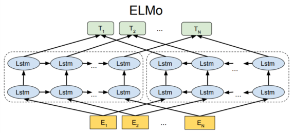

- Pretrained BiLM
  
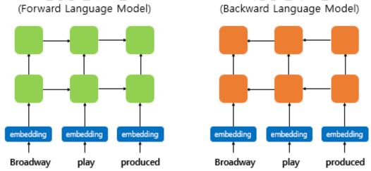
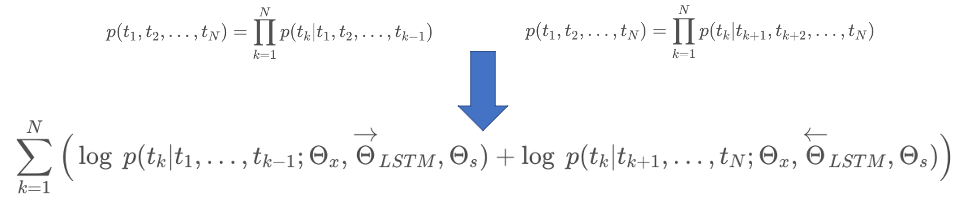

- Task-specific ELMo Embedding

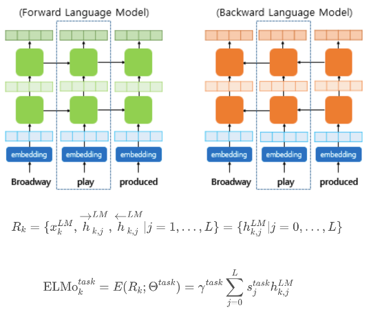

- Using biLMs for supervised NLP tasks
    - 기존의 임베딩 벡터와 함께 사용된다. 
    - ELMo 표현을 만드는데 사용된 사전 훈련된 언어 모델의 가중치는 고정시키고, 각 층의 가중치와 스칼라 파라미터는 훈련 과정에서 학습된다.

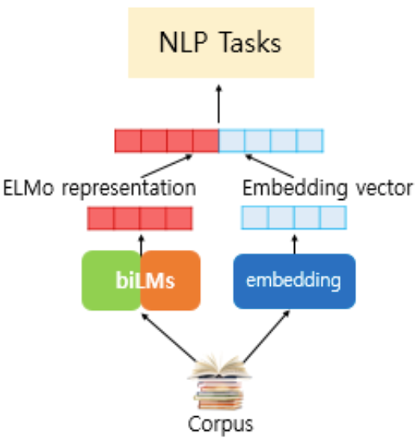
    

  
# Evaluation

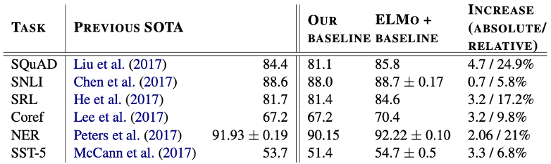

- 6개의 NLP task에서 에러율을 6~20% 줄였다. 
- 6개의 NLP task에서 높은 점수를 기록했다.
    
  

# Analysis

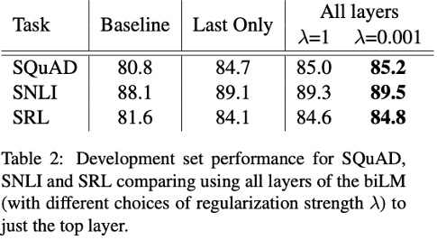
- 기존에 top layer output만 사용 한 것 대비 성능 향상을 검증했다. 
- 대부분의 경우 Regularization parameter λ 가 작을수록 성능이 더 좋아지는 경향이 있다.

 
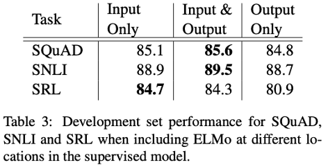
- 일부 task(SNLI, SQuAD) 에서는 ELMo 벡터를 Output에 다시 concat 시키는 것이 효과가 있다.

 
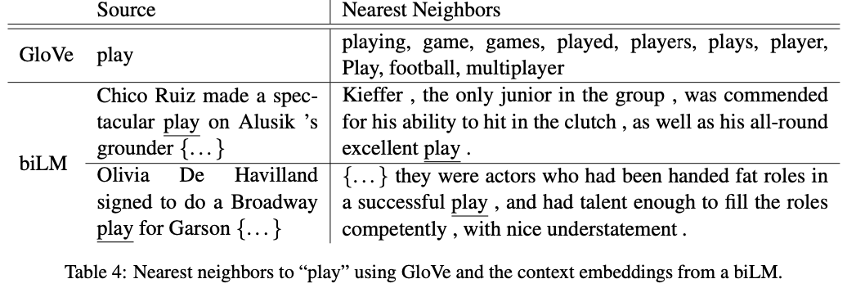
- GloVe 단어 벡터에서 ‘play’와 비슷한 단어는 품사를 변형한 것 또는 스포츠에 관한 유사 단어만 뜬다. 
- biLM에서는 문맥을 고려한다는 것을 알 수 있다.

 
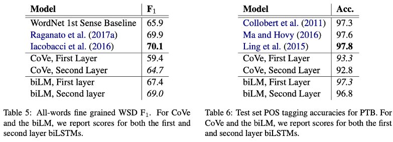
- biLM의 첫 번째 레이어는 syntactic 정보를, 두 번째 레이어는 semantic 정보를 더 잘 인코딩 하는 것으로 나타난다. 
- 이는 biLM의 모든 레이어를 사용하는 것이 성능향상에 도움이 된다는 것을 증명한다.

 
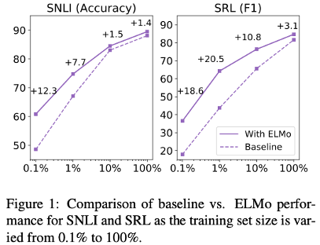
- ELMo를 활용하면 같은 성능을 내는 데에 있어 훨씬 학습이 효율적임을 알 수 있다.

    
  
# Conclusion
- We have introduced a general approach for learning high-quality deep context-dependent representations from biLMs, and shown large improvements when applying ELMo to a broad range of NLP tasks. 
- Through ablations and other controlled experiments, we have also confirmed that the biLM layers efficiently encode different types of syntactic and semantic information about words in-context, and that using all layers improves overall task performance.