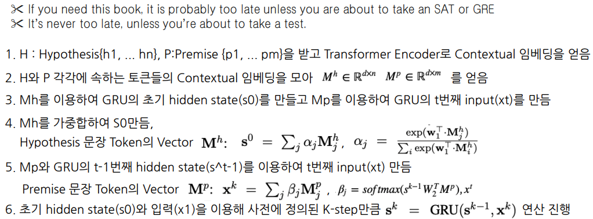

# Introduction
- Multi-Task Learning(MTL)은 새로운 Task를 학습하는 데 도움이 되도록 이전 작업에서 학습된 지식을 적용하는 인간 학습 활동에서 영감을 받음
- Deep neural networks(DNN)를 이용한 representation learning에 MTL을 적용하는 것에 대한 관심이 높아지고 있음
    - DNN을 이용한 representation learning은 많은 양의 데이터를 요구함, MTL은 많은 task에서의 supervised labeled data를 제공함
    - MTL은 특정 Task에 Overfitting 되지 않도록 Regularization 효과를 줌
- MTL과 대조적으로, Language Model은 대용량의 unsupervised dataset을 활용하여 모델을 학습함
    - ELMo, GPT, BERT
- MT-DNN은 Language Model Pre-Training을 활용한 BERT에 Multi-task learning을 적용하여 성능을 개선한 모델
  
  
# Tasks
- GLUE의 9개 task를 MTL에 활용
- Single Sentence Classification
    - 하나의 문장이 주어졌을 때 문장의 Class를 분류하는 Task
    - CoLA : 문장이 문법적으로 맞는지 분류 (True/False)
    - SST-2 : 영화 Review 문장의 감정 분류 (Poistive/Negative)
- Text Similarity
    - 문장 쌍이 주어졌을 때, 점수를 예측하는 Regression Task
    - STB-B : 문장 간의 의미적 유사도를 점수로 예측
- Pairwise Text Classification
  - 문장 쌍이 주어졌을 때, 문장의 관계를 분류하는 Task 
  - RTE, MNLI : 문장 간의 의미적 관계를 3가지로 분류 (Entailment, Contradiction, Neutral)
  – QQP, MRPC : 문장 간 의미가 같음 여부를 분류 (True/False)
– Relevance Ranking
  – QNLI : 질문과 해당 지문 중 한 문장이 쌍으로 주어졌을 때 해당 지문 문장에 질문의 답이 있는지 여부를 분류 (True/False)
  – MT-DNN에서는 이를 Rank 방식으로 바꾸어 모든 지문 문장에 정답이 있을 가능성을 Scoring 하여 가장 Score가 높은 지문 문장을 True로 분류하는 방식으로 Task 수행
  
    
# Model Architecture
  

- Lexicon Encoder
  - Token Embedding 
    - 맨 앞에 [CLS] 토큰을 추가. 추후 Output에서 Classification 등을 위해 사용됨 
    - 만약 문장쌍이 들어온다면 각 문장은 Wordpiece로 Toenization 되며 [SEP] Token이 두 문장 사이의 구분자로 사용됨
  - Sentence Embedding - 1번째 혹은 2번째 문장임을 표현하는 Vector
  - Positional Embedding - 각 Token의 위치 정보를 표현하는 Vector
  

- Transformer Encoder
  - Lexicon Encoder로 부터 각 Token의 Input Vector를 입력으로 받아 Ouput Vector 추출
  - BERT 모델과 달리 task별로 fine-tunning하지 않고 MTL로 fine-tunning 함

- Single-Sentence Classification Ouput
  - [CLS] Token과 Task Specific Parameter의 곱에 Softmax를 취하여 Ouput 추출

- Text Similarity Ouput
  - [CLS] Token을 활용하여 Task Specific Parameter와 곱한 후 sigmoid function을 사용하여 Score를 예측

- Pairwise Text Classification Ouput
  - BERT와 다르게 Stochastic Answer Network(SAN)를 이용함
    - NLI의 기존 SOTA 모듈, 주어진 문장들에 대한 Multi-step Reasoning을 모델링하는 구조 (한번에 classification 결과를 예측하지 않고 여러번의 예측을 통한 Reasoning으로 결과를 예측)
    - SAN은 GRU모듈에 주어진 문장쌍의 representation을 Input 및 hidden state로 넣는 과정을 k번 반복함으로써 정제된 representation을 얻고 이를 이용하여 최종 예측

- 각 step을 진행할때마다 linear classifier를 거쳐 각 클래스에 대한 확률 분포 계산

- 모든 K-step output을 평균하여 클래스에 대한 최종 확률 분포를 계산, averaging 연산 전에 stochastic prediction droput을 적용

- Relevance Ranking Ouput
  - Question과 문장 Pair Input으로 넣어 생성한 [CLS] Token에 Sigmoid를 취하여 문장 별로 점수를 Scoring하고 가장 높은 점수 만 Question에 해당하는 정답이 있다고 예측하는 방식