> lecture 5, 7, 13 ,17 을 리뷰 했는데,,, 17강 밖에 안남아있다...T.T

# The Limits of Single-task Learning
- Great performance improvements in recent years given 
    - dataset 
    - task 
    - model 
    - metric 
- Models typically start from ranbdom or are only partly pre-trained

# Pre-training and sharing knowledge is great!
- Computer Vision
    - ImageNet + CNN이 큰 성공을 거두었음
    - Classification task가 과거에 큰 장벽이었음
    - 이 문제가 해결되고 많은 문제들을 푸는 것이 가능해짐
- Natural Language Processing
    - Word2Vec, Glove
    - 최근 CoVe, ELMo, BERT 성공을 거두기 시작함

# Why has weight&model sharing not happened as much in NLP?
- NLP는 많은 종류의 추론이 요구됨
    - logical, linguistic, emotional, visual
- Short and long term memory가 요구됨
- NLP는 중간 단계 또는 분리된 Task로 많이 나누어져 있음
- 하나의 Unsupervised Task가 전체 문제를 해결할 수 없음
- 언어는 현실적으로 분명한 Supervision이 필요함

# Why a unified multi-task model for NLP
- Multi-task learning은 General NLP system이 넘어야할 장벽임
- 하나의 통합된 모델은 지식을 어떻게 전달할지 결정 가능
    - Domain adaptation, weight sharing, transfer and zero shot learning
- 하나의 통합된 Multi-task 모델은
    - 새로운 task가 주어졌을 때 쉽게 적응할 수 있음
    - 실제 production을 위해 deploy하는 것이 매우 간단해짐
    - 더 많은 사람들이 새로운 task를 해결할 수 있도록 도와줌
    - 잠재적으로 Continual learning으로 나아갈 수 있음
    - 모든 프로젝트를 계속 다시 시작하게 된다면 자연 언어의 복잡성을 점점 더 많이 포함하는 하나의 모델에 도달하지 못함
- 인공지능이 대화를 가능하게 하는 task를 진행할 때 사람의 언어처럼 순차적으로 처리하는 것 만큼 비효율적인 것은 없음. 컴퓨터가 인간의 언어를 supervision하지 않다면 훨씬 더많은 언어로 의사소통 가능.

# How to express many NLP tasks in the same framework?
- Sequence tagging
  - Named Entity Recognition, aspect specific sentiment
- Text classification
  - Dialogue state tracking, sentiment classification
- Seq2seq
  - Machine Translation, Summarization, Question Answering

# Three equivalent Supertasks of NLP
- Language Modeling
  - 다음 단어를 예측하는 것은 질문의 일종이다.
- Question Answering
  - 말 그대로 Question & Answering 이다.
- Dialogue System
  - 질문 답변, 답변에 대한 답변 형태이다.

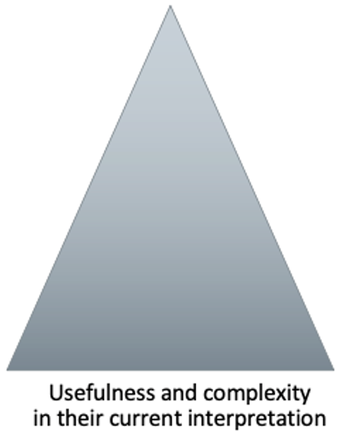

# The Natural Language Decathlon(decaNLP)
- The Natural Language Decathlon : Multitask Learning as Question Answering
  - 10개의 NLP Task를 하나의 Question Answering모델 학습만으로 풀 수 있도록 디자인
  - 이를 위해 모든 데이터 셋에 대하여 question, context, answer 형태로 전처리

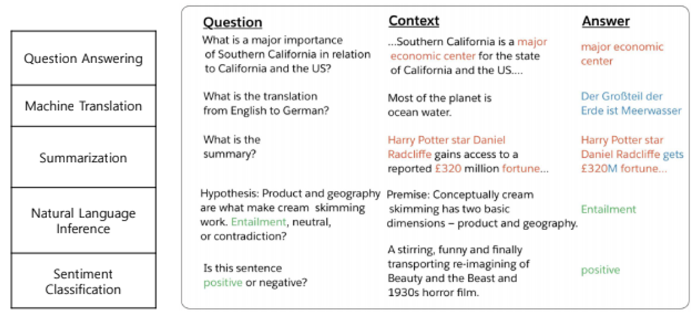

# Multitask Question Answering Network(MQAN)

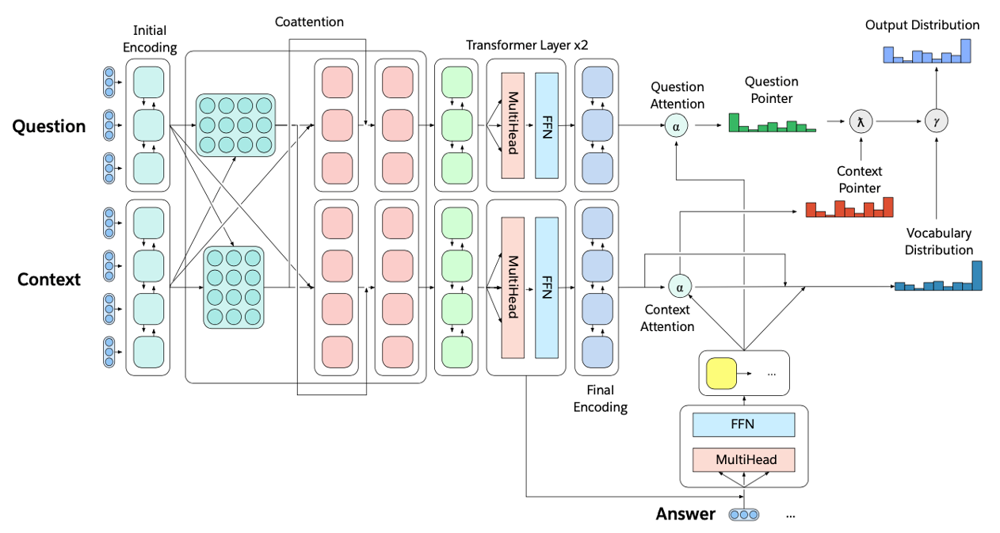

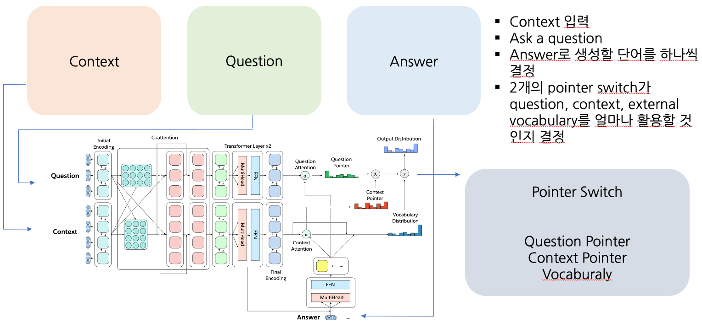

1. Fixed Glove+Character n-gram embeddings -> Linear -> Shared BiLSTM with skip connection
2. Attention summations from one sequence to the other and back again with skip connections
3. Separate BiLSTMs to reduce dimensionality, two transformer layers, another BiLSTM
4. Auto-regressive decoder :
  - Fixed GloVe, character n-gram embeddings
  - Two transformer layers
  - LSTM Layers (attend last 3 layers of encoder)

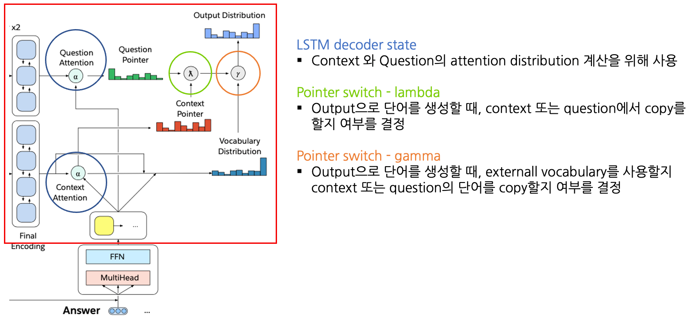

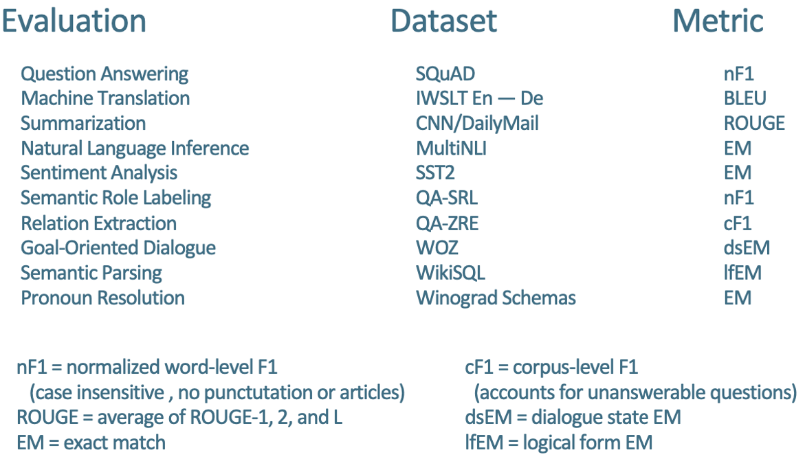

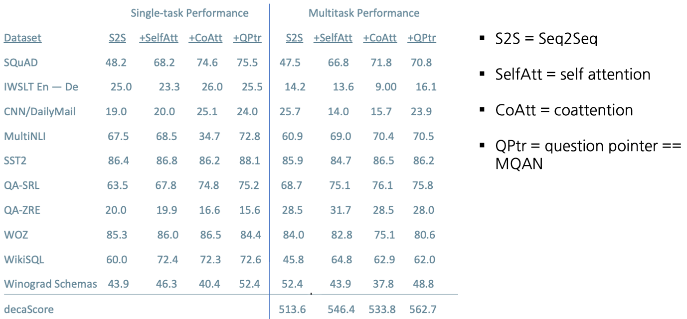

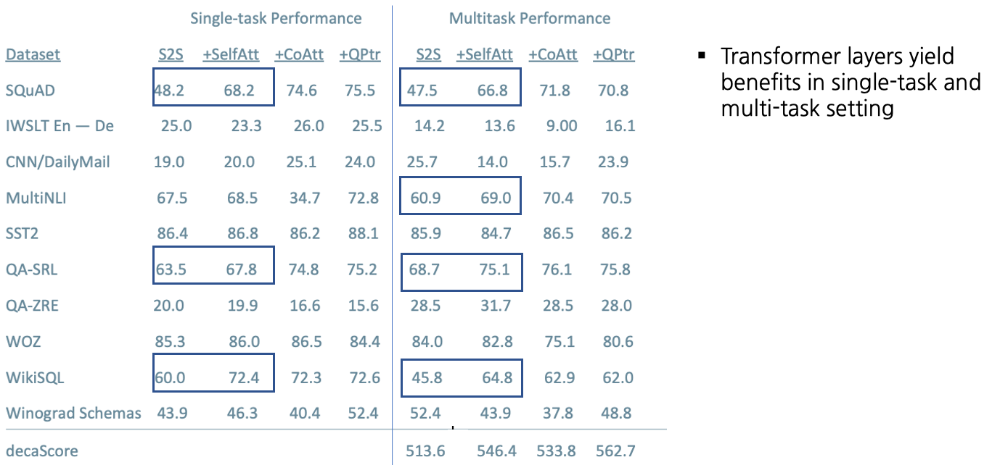

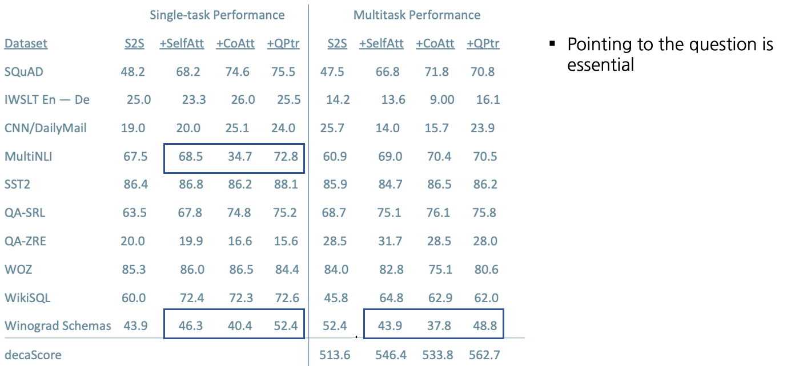

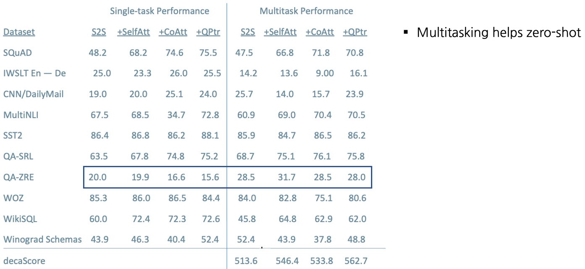

# Training Strategies: Fully Joint

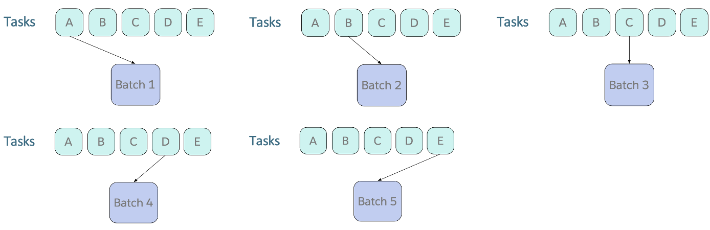
- Curriculum learning : 모델 학습시 전체 데이터를 한번에 학습시키지 않고 쉬운것->어려운 것 순서로 학습함
- Batch를 Sampling할 때, Fixed order로 계속 Round Robin하여 수집함
- 많은 양이 돌아 Converge되는 Task들은 잘 동작하지 않음

# Training Strategies: Anti-Curriculum Pre-training

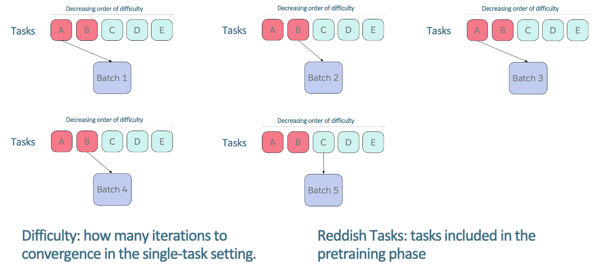

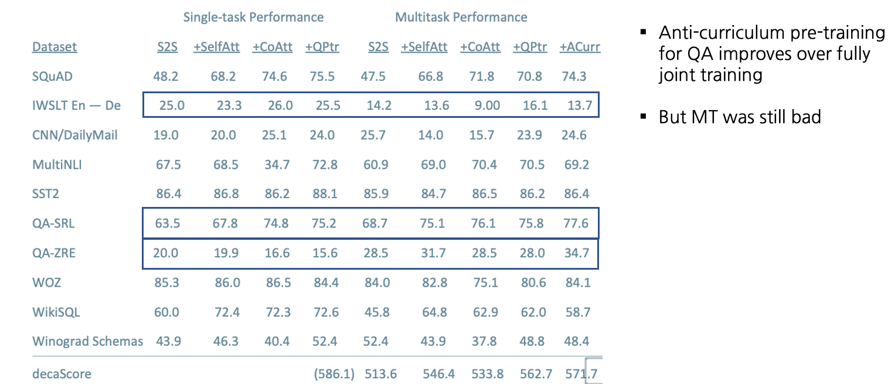

# Training Strategies: CoVe

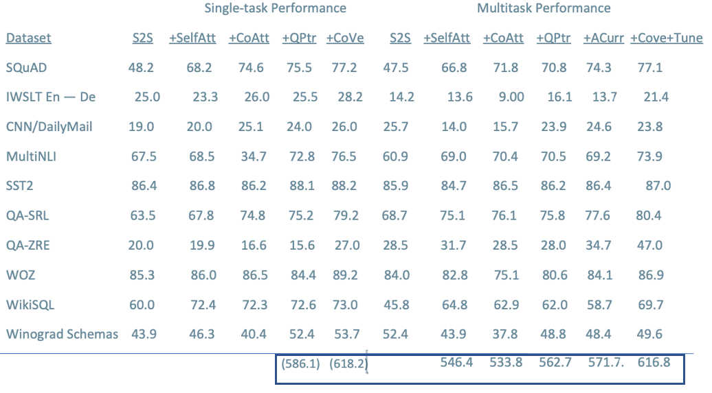

# What's next for NLP?

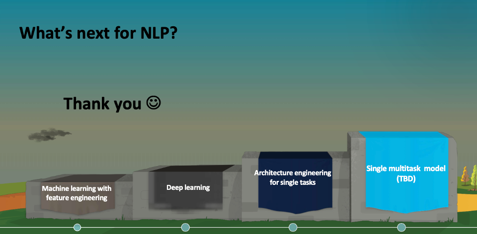