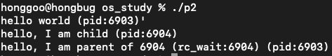

# 1.1 프로세스의 개념
- 운영체제는 <strong>실행 중인 프로그램</strong>의 개념을 제공하는데, 이를 <strong>프로세스(process)</strong>라고 한다.
- 프로세스의 구성 요소를 이해하기 위해서 <strong>하드웨어 상태</strong>를 이해해야 한다.
    - 메모리: 프로그램의 명령어와 데이터는 메모리에 저장된다. 
    - 레지스터: 프로그램의 많은 명령어들이 레지스터를 직접 읽거나 갱신한다.

# 1.2 프로세스 API
- 운영체제가 제공하는 API 중 중요한 다섯가지
    - 생성(Create): 운영체제는 새로운 프로세스를 생성할 수 있는 방법을 제공해야 한다.
    - 제거(Destroy): 운영체제는 프로세스를 강제로 제거할 수 있는 인터페이스를 제공해야 한다.
    - 대기(Wait): 프로세스의 실행 중지를 기다릴 필요가 있다.
    - 각종 제어(Miscellaneous Control): 일시정지나 재개등
    - 상태(Status): 프로세스 상태 정보를 얻어내는 인터페이스를 제공한다.
    
# 1.3 프로세스 생성: 좀 더 자세하게



    #include <stdio.h>
    #include <unistd.h>
    #include <stdlib.h>
    #include <string.h>
    #include <sys/wait.h>

    int main(int argc, const char * argv[]) {
        printf("hello world (pid:%d)'\n", (int)getpid());
        int rc = fork();
        if (rc < 0) {
            fprintf(stderr, "fork failen");
            exit(1);
        } else if (rc == 0){
            printf("hello, I am child (pid:%d)\n", (int)getpid());
            char *myargs[3];
            myargs[0] = strdup("wc");
            myargs[1] = strdup("main.c");
            myargs[2] = NULL;
            execvp(myargs[0], myargs);
            printf("this shouldn't print out");
        } else{
            int rc_wait = wait(NULL);
            printf("hello, I am parent of %d (rc_wait:%d) (pid:%d)\n", rc, rc_wait, (int)getpid());
        }
        return 0;
    }


