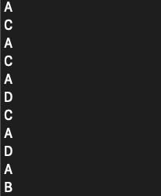
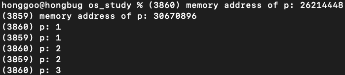
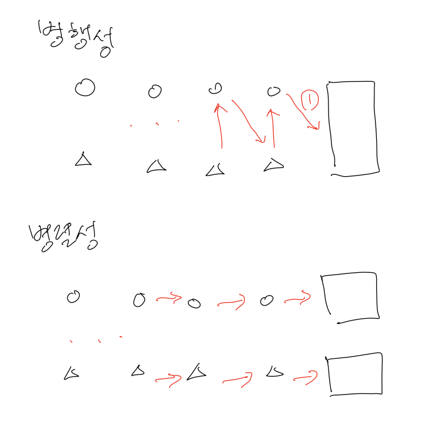

# 운영체제 개요
프로그램이 실행될 때 어떤일이 일어날까?
1. 명령어가 실행된다.
2. 프로세서는 명령어를 초당 수백만번 fetch, decode, execute 한다.

시스템을 사용하기 <strong>쉽게하기 위해(easy to use)</strong> 프로그램 실행 시 다양한 일들이 발생한다.
- 프로그램 간의 메모리 공유를 가능하게 한다.
- 프로그램이 장치와 상호작용을 가능하게한다.

시스템을 사용하기 편리하면서 정확하고 올바르게 동작시킬 책임이 있기 때문에 소프트웨어를 <strong>운영체제(operating stystem, OS)</strong>라고 부른다.

운영체제에는 세가지 기법을 사용한다.
- 가상화(virtualization)
- 병행성(concurrency)
- 영속성(persistence)

# 가상화
운영체제는 프로세서, 메모리, 또는 디스크와 같은 <strong>물리적(physical)</strong>인 자원을 이용하여 일반적이고 강력하고 사용이 편리한 <strong>가상(virtual)</strong> 형태의 자원을 생성한다.
때문에 운영체제를 때로는 <strong>가상 머신(virtual machine)</strong>이라고 부른다.

두가지 가상화가 존재한다.
- CPU 가상화
- 메모리 가상화

## CPU 가상화
여러개의 CPU가 존재하는 것처럼 변환하여 동시에 많은 수의 프로그램을 실행시키는 것을 <strong>CPU 가상화(virtualizing the CPU)</strong>라 한다.



    #include <stdio.h>
    #include <stdlib.h>
    #include <sys/time.h>
    #include <assert.h>
    int
    main(int argc, char *argv[]){
        if (argc != 2){
            fprintf(strderr, "usage: cpu <string>\n);
            exit(1);
        }
        char *str = argv[1]
        while (1){
            Spin(1);
            printf("%s\n", str);
        }
        return 0;
    
    /*
    입력:
    prompt> ./cpu A & ; ./cpu B & ./cpu C & ; ./cpu D &
    출력:
    (아래 그림)
    */
    }


## 메모리 가상화
물리 메모리 모델은 매우 단순한 바이트의 배열이다. 메모리는 프로그램이 실행되는 동안 항상 접근한다.



    #include <unistd.h>
    #include <stdio.h>
    #include <stdlib.h>
    int
    main(int argc, char *argv[]){
        int *p = malloc(sizeof(int));
        printf("(%d) memory address of p: %u\n", getpid(), (unsigned)p);
        *p = 0;
        int cnt = 0;
        while (cnt <= 20) {
            *p = *p + 1;
            printf("(%d) p: %d\n", getpid(), *p);
            cnt++;
        }
        return 0;
    }
    /*
    입력:
    prompt> ./mem & ; ./mem &
    출력:
    (24113) memory address of p: 0x20000
    (24114) memory address of p: 0x20000
    (24113) p:1
    (24114) p:1
    (24113) p:2
    (24114) p:2
    .
    .  
    .
    */


> 책에서는 위의 출력처럼 나온다고 했는데 나는 직접 해보니 아래의 그림처럼 다른 메모리값을 가지게 나왔다.
> 

위의 출력 예제와 같이 각각이 독립적으로 메모리 주소 번지의 값을 갱신한다. 물리 메모리를 다른 프로그램과 공유하는 것이 아니라 각자 자신의 메모리를 가지고 있는 것 처럼 보인다.
운영체제가 <strong>메모리 가상화(virtualiziang memory)</strong>을 하기 때문에 이런 현상이 생긴다.

각 프로세스는 자신만의 <strong>가상 주소 공간(virtual address space)</strong>을 갖는다.

# 병행성
프로그램이 한 번에 많은 일을 하려할 때 (즉, 동시에) 발생하는 그리고 반드시 해결해야 하는 문제들을 가리킬 때 <strong>병행성</strong> 용어를 사용한다.

> 병행성과 병렬성의 차이
> - 병행성: 동시에 처리 되는 것 '처럼' 보임
> - 병렬성: 진짜 동시에 처리 됨
> 

# 영속성
DRAM과 같은 장치는 데이터를 <strong>휘발성(volatile)</strong> 방식으로 저장하기 때문에 메모리의 데이터는 쉽게 손시로딜 수 있따.
데이터를 <strong>영속적(persistence)</strong>으로 저장할 수 있는 하드웨어와 소프트웨어가 필요하다.

