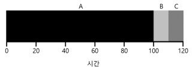

# gcc 컴파일 방법
- 옵션
    - -o: 오브젝트의 파일명 설정
    - -c: 소스파일과 같은 이름의 오브젝트 파일 생성
    - -I(대문자 i): 헤더파일을 검색할 디렉토리 명
    - -L: 라이브러리를 검색할 디렉토리명
    - -l(소문자 L): 링크할 라이브러리 파일명
    
- c 컴파일
    - gcc -o <출력파일명> <c 파일명>
    - ex) gcc -o main main.c

- 실행
    - ./<생성된 실행파일명>
    - ex) ./main
    

# fork() 시스템 콜
- 프로세스 생성에 fork() 시스템 콜이 사용된다.
- fork() 는 자신과 비슷한 자식 프로세스를 생성한다.
    - 자식 프로세스는 자신의 주소 공간, 자신의 레지스터, 자신의 PC 값을 가진다.



    #include <stdio.h>
    #include <stdlib.h>
    #include <unistd.h>

    int main(int argc, char *argv[]){
        printf("hello world (pid:%d)\n", (int)getpid());
        int rc = fork();
        if (rc < 0){
            fprintf(stderr, "fork failed\n");
            exit(1);
        } else if (rc == 0){
            printf("hello, I am child (pid:%d)\n", (int)getpid());
        } else {
            printf("hello, I am parent of %d (pid:%d)\n", rc, (int)getpid());
        }
        return 0;
    }


# fork()와 wait() 호출
- wait() 시스템 콜을 호출하여 자식 프로세스 종료 시점까지 자신의 실행을 잠시 중지시킨다.



    #include <stdio.h>
    #include <unistd.h>
    #include <stdlib.h>
    
    int main(int argc, const char * argv[]) {
        // insert code here...
        printf("hello world (pid:%d)'\n", (int)getpid());
        int rc = fork();
        if (rc < 0) {
            fprintf(stderr, "fork failen");
            exit(1);
        } else if (rc == 0){
            printf("hello, I am child (pid:%d)\n", (int)getpid());
        } else{
            int rc_wait = wait(NULL);
            printf("hello, I am parent of %d (rc_wait:%d) (pid:%d)\n", rc, rc_wait, (int)getpid());
        }
        return 0;
    }


- 결과를 보면 알 수 있듯이 fork() 함수만 사용했을 때는 부모 프로세스의 정보가 먼저 출력되었지만, wait()을 사용해서 자식 프로세스의 정보가 먼저 출력 되었다.

# exec() 시스템 콜
- 자기 자신이 아닌 다른 프로그램을 실행해야 할 때 사용한다.
- fork() 시스템 콜은 자신의 복사본을 생성하여 실행한다.
- exec() 시스템 콜은 자신의 복사본이 아닌 새로운 프로세스를 생성하여 실행한다.



    #include <stdio.h>
    #include <unistd.h>
    #include <stdlib.h>
    #include <string.h>
    #include <sys/wait.h>
    
    int main(int argc, const char * argv[]) {
        printf("hello world (pid:%d)'\n", (int)getpid());
        int rc = fork();
        if (rc < 0) {
            fprintf(stderr, "fork failen");
            exit(1);
        } else if (rc == 0){
            printf("hello, I am child (pid:%d)\n", (int)getpid());
            char *myargs[3];
            myargs[0] = strdup("wc");
            myargs[1] = strdup("main.c");
            myargs[2] = NULL;
            execvp(myargs[0], myargs);
            printf("this shouldn't print out");
        } else{
            int rc_wait = wait(NULL);
            printf("hello, I am parent of %d (rc_wait:%d) (pid:%d)\n", rc, rc_wait, (int)getpid());
        }
        return 0;
    }


- 결과를 보면 exec() 함수 호출 이후 "printf("this shouldn't print out");" 이 출력되지 않음을 확인할 수 있다.

# 왜, 이런 API를?
- Unix 쉘을 구현하기 위해서는 fork()와 exec()을 분리해야한다.
- 그래야만 쉘이 fork()를 호출하고 exec()를 호출해서 프로세스를 만들어낸다.