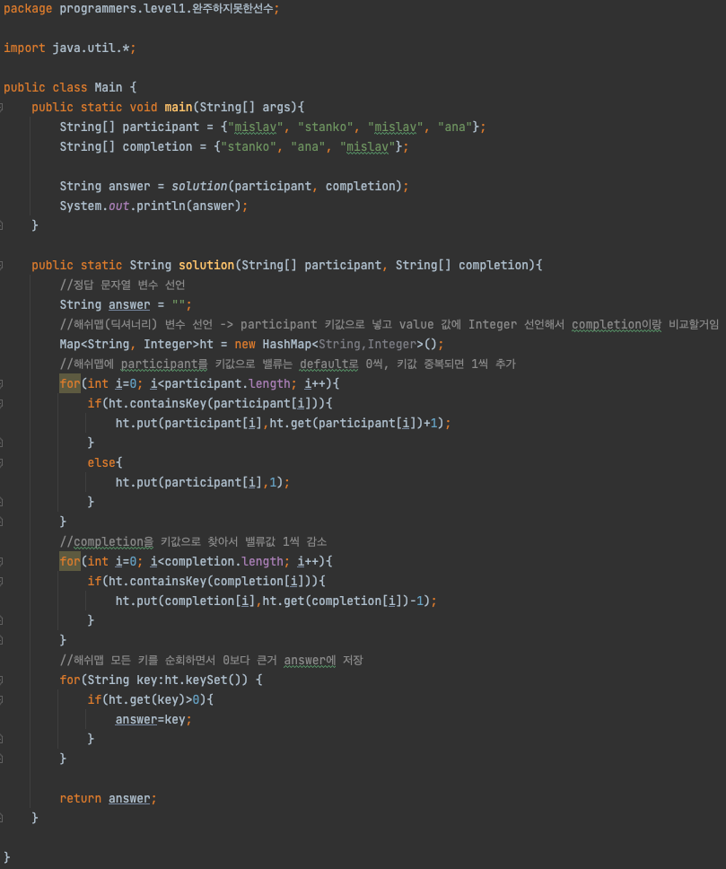

# 프로그래머스(Programmers) 코딩테스트 연습

## Level1 해시 완주하지 못한 선수 자바(Java) 풀이

- [풀이로 이동!](https://programmers.co.kr/learn/courses/30/lessons/42576?language=java)

## 문제풀이
> java 알고리즘 문제 풀이의 두번째 문제이다. 처음 풀어본 문제보다는 자바 문법이 조금 익숙했다. 하지만, 해시를 어떻게 선언하는지 조차 모르고 있어서, 이 부분은 구글링을 하며 풀었다.
> 이번 문제를 통해서 자바의 해쉬맵을 사용할 수 있게 되었다. 해쉬맵의 여러가지 method들을 숙지하고 있으면 코테에 많은 도움이 될 것 같다.

1. 참가자들이 저장되어 있는 String 배열을 HashMap에 옮겨 담는다.
2. 이 때 참가자들의 이름은 Key값으로 Value는 참가자들의 중복의 유무를 포함하기 위해 default 값을 0으로, 중복된 참가자가 있으면 value를 1씩 증가시킨다.
3. 완주한 참가자들의 이름을 containsKey를 사용하여 해당 Key값의 Value를 1씩 감소시킨다.
4. 해쉬맵의 모든 키를 순회하면서 value값이 0보다 큰 값을 찾는다.
5. 해당 키값을 answer에 저장한다.
6. return answer

## 코드

