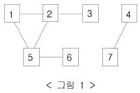

# BOJ

## 그리디 2606 바이러스
[문제로 이동!](https://www.acmicpc.net/problem/2606)

## 문제

신종 바이러스인 웜 바이러스는 네트워크를 통해 전파된다. 한 컴퓨터가 웜 바이러스에 걸리면 그 컴퓨터와 네트워크 상에서 연결되어 있는 모든 컴퓨터는 웜 바이러스에 걸리게 된다.

예를 들어 7대의 컴퓨터가 <그림 1>과 같이 네트워크 상에서 연결되어 있다고 하자. 1번 컴퓨터가 웜 바이러스에 걸리면 웜 바이러스는 2번과 5번 컴퓨터를 거쳐 3번과 6번 컴퓨터까지 전파되어 2, 3, 5, 6 네 대의 컴퓨터는 웜 바이러스에 걸리게 된다. 하지만 4번과 7번 컴퓨터는 1번 컴퓨터와 네트워크상에서 연결되어 있지 않기 때문에 영향을 받지 않는다.

어느 날 1번 컴퓨터가 웜 바이러스에 걸렸다. 컴퓨터의 수와 네트워크 상에서 서로 연결되어 있는 정보가 주어질 때, 1번 컴퓨터를 통해 웜 바이러스에 걸리게 되는 컴퓨터의 수를 출력하는 프로그램을 작성하시오.

## 입력

첫째 줄에는 컴퓨터의 수가 주어진다. 컴퓨터의 수는 100 이하이고 각 컴퓨터에는 1번 부터 차례대로 번호가 매겨진다. 둘째 줄에는 네트워크 상에서 직접 연결되어 있는 컴퓨터 쌍의 수가 주어진다. 이어서 그 수만큼 한 줄에 한 쌍씩 네트워크 상에서 직접 연결되어 있는 컴퓨터의 번호 쌍이 주어진다.
## 예제 입력


    """
    case 1:
    입력
    3
    7
    6
    1 2
    2 3
    1 5
    5 2
    5 6
    4 7
    출력
    4

    case 2:
    입력
    7   
    10
    7
    1 2
    2 3
    3 4 
    5 6
    7 8
    8 9
    9 1
    출력
    6
    """


## 풀이
> 1번 정점과 연결된 모든 정점의 개수를 찾는 문제이다. 입력은 각 연결된 정점 두개를 받는다. 이를 인접리스트로 변경한 후 dfs로 접근하여 방문했던 정점의 개수-1 을 출력하면된다.(1번 자기 자신은 포함하지 않기 때문에)

### solution
1. 인접리스트를 초기화해준다.
2. visited 리스트를 초기화해준다.
3. 입력받은 값을 각 값에 맞도록 인접리스트에 추가해준다.
4. dfs 함수를 정의해서 방문 노드를 조회한다.

## 코드



    def dfs(v):
        visited[v] = True
        for i in graph[v]:
            if not visited[i]:
                dfs(i)
    
    
    if __name__ == "__main__":
        n = int(input())
        m = int(input())
    
        graph = []
        for _ in range(n+1):
            graph.append([])
    
        visited = [False] * (n+1)
    
        for _ in range(m):
            x, y = map(int, input().split())
            graph[x].append(y)
            graph[y].append(x)
    
        dfs(1)
        print(visited.count(True) - 1)
