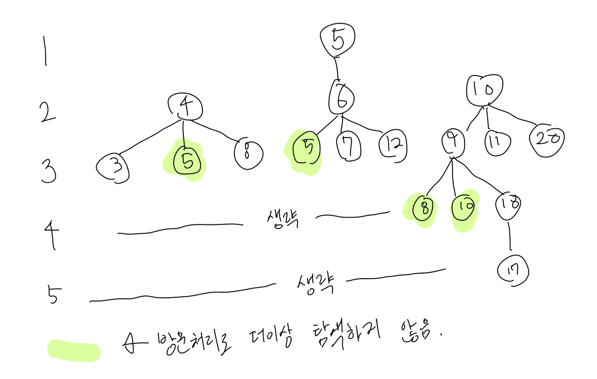

# BOJ

## DFS/BFS 1697 숨바꼭질
[문제로 이동!](https://www.acmicpc.net/problem/1697)

## 문제

수빈이는 동생과 숨바꼭질을 하고 있다. 수빈이는 현재 점 N(0 ≤ N ≤ 100,000)에 있고, 동생은 점 K(0 ≤ K ≤ 100,000)에 있다. 수빈이는 걷거나 순간이동을 할 수 있다. 만약, 수빈이의 위치가 X일 때 걷는다면 1초 후에 X-1 또는 X+1로 이동하게 된다. 순간이동을 하는 경우에는 1초 후에 2*X의 위치로 이동하게 된다.

수빈이와 동생의 위치가 주어졌을 때, 수빈이가 동생을 찾을 수 있는 가장 빠른 시간이 몇 초 후인지 구하는 프로그램을 작성하시오.

## 입력

첫 번째 줄에 수빈이가 있는 위치 N과 동생이 있는 위치 K가 주어진다. N과 K는 정수이다.

## 예제 입력



    """
    case 1:
    입력
    5 17
    출력
    4
    힌트
    5 -> 19 -> 9 -> 18 -> 17
    """


## 풀이

> 위의 그림에서 볼 수 있듯이 현재 값을 계속 큐에 집어 넣고 pop 해온 뒤 -1, +1, *2 계산한 값을 다시 큐에 집어넣고를 반복하면 모든 가능한 경우의 수를 구할 수 있다.
> 하지만, 한번 계산했던 값은 이미 계산을 해서 진행중이기 때문에 계산했던 값은 계산하지 않도록 분기 처리해준다.(visited 배열로 처리한다.)
> 또한 x의 범위가 0에서 100,000 이기 때문에 해당 조건을 만족해야하며 visited 배열은 모두 1로 초기화한 뒤 하나씩 더해가는 방식으로 진행한다.
> 탐색중에 k값을 만나게 되면 visited에 거리를 저장하고 바로 bfs 함수를 종료한다.(계산적 이점을 얻기 위해)

### solution
1. visited 배열을 max값인 100001로 초기화한다.
2. bfs함수를 정의한다.
3. 큐에 현재 n값을 넣는다.
4. while문을 queue에 원소가 없을 때 까지 돈다.
5. 분기를 *2, +1, -1 세가지로 처리한다.
6. 각각 dx(x*2, x+1, x-1) 이 범위에 포함되는지 체크한다.
7. visited[dx]가 1이라면(방문하지 않음) dx를 큐에 집어넣고, visited[dx]에 자신을 호출한 값을 더해준다.(visited[x])
8. 만약 dx가 k라면, visited 리스트를 업데이트 해주고 바로 break문으로 반복문을 빠져 나온다.
9. 모든 자기 자신에 2씩 더해졌으므로 visited[k] - 2 로 print 해준다.

## 코드



    from collections import deque
    
    
    def bfs(n, visited):
        queue = deque([n])
        visited[n] += 1
        while queue:
            x = queue.popleft()
            if 0 <= x*2 <= 100000:
                if visited[x*2] == 1:
                    visited[x*2] += visited[x]
                    if x*2 == k:
                        break
                    queue.append(x*2)
            if 0 <= x+1 <= 100000:
                if visited[x+1] == 1:
                    visited[x+1] += visited[x]
                    if x+1 == k:
                        break
                    queue.append(x+1)
            if 0 <= x-1 <= 100000:
                if visited[x-1] == 1:
                    visited[x-1] += visited[x]
                    if x-1 == k:
                        break
                    queue.append(x-1)
    
    
    if __name__ == "__main__":
        n, k = map(int, input().split())
        visited = [1] * 100001
        bfs(n,visited)
        print(visited[k] - 2)
