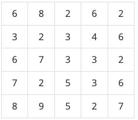
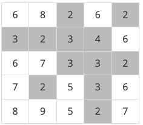
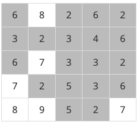

# BOJ

## DFS/BFS 2468 안전 영역
[문제로 이동!](https://www.acmicpc.net/problem/2468)

## 문제

재난방재청에서는 많은 비가 내리는 장마철에 대비해서 다음과 같은 일을 계획하고 있다. 먼저 어떤 지역의 높이 정보를 파악한다. 그 다음에 그 지역에 많은 비가 내렸을 때 물에 잠기지 않는 안전한 영역이 최대로 몇 개가 만들어 지는 지를 조사하려고 한다. 이때, 문제를 간단하게 하기 위하여, 장마철에 내리는 비의 양에 따라 일정한 높이 이하의 모든 지점은 물에 잠긴다고 가정한다.

어떤 지역의 높이 정보는 행과 열의 크기가 각각 N인 2차원 배열 형태로 주어지며 배열의 각 원소는 해당 지점의 높이를 표시하는 자연수이다. 예를 들어, 다음은 N=5인 지역의 높이 정보이다.

이제 위와 같은 지역에 많은 비가 내려서 높이가 4 이하인 모든 지점이 물에 잠겼다고 하자. 이 경우에 물에 잠기는 지점을 회색으로 표시하면 다음과 같다.

물에 잠기지 않는 안전한 영역이라 함은 물에 잠기지 않는 지점들이 위, 아래, 오른쪽 혹은 왼쪽으로 인접해 있으며 그 크기가 최대인 영역을 말한다. 위의 경우에서 물에 잠기지 않는 안전한 영역은 5개가 된다(꼭짓점으로만 붙어 있는 두 지점은 인접하지 않는다고 취급한다). 

또한 위와 같은 지역에서 높이가 6이하인 지점을 모두 잠기게 만드는 많은 비가 내리면 물에 잠기지 않는 안전한 영역은 아래 그림에서와 같이 네 개가 됨을 확인할 수 있다. 

이와 같이 장마철에 내리는 비의 양에 따라서 물에 잠기지 않는 안전한 영역의 개수는 다르게 된다. 위의 예와 같은 지역에서 내리는 비의 양에 따른 모든 경우를 다 조사해 보면 물에 잠기지 않는 안전한 영역의 개수 중에서 최대인 경우는 5임을 알 수 있다. 

어떤 지역의 높이 정보가 주어졌을 때, 장마철에 물에 잠기지 않는 안전한 영역의 최대 개수를 계산하는 프로그램을 작성하시오. 

## 입력

첫째 줄에는 어떤 지역을 나타내는 2차원 배열의 행과 열의 개수를 나타내는 수 N이 입력된다. N은 2 이상 100 이하의 정수이다. 둘째 줄부터 N개의 각 줄에는 2차원 배열의 첫 번째 행부터 N번째 행까지 순서대로 한 행씩 높이 정보가 입력된다. 각 줄에는 각 행의 첫 번째 열부터 N번째 열까지 N개의 높이 정보를 나타내는 자연수가 빈 칸을 사이에 두고 입력된다. 높이는 1이상 100 이하의 정수이다.

## 예제 입력



    """
    case 1:
    입력
    5
    6 8 2 6 2
    3 2 3 4 6
    6 7 3 3 2
    7 2 5 3 6
    8 9 5 2 7
    출력
    5

    case 2:
    입력
    7
    9 9 9 9 9 9 9
    9 2 1 2 1 2 9
    9 1 8 7 8 1 9
    9 2 7 9 7 2 9
    9 1 8 7 8 1 9
    9 2 1 2 1 2 9
    9 9 9 9 9 9 9
    출력
    6
    """


## 풀이
> 우리는 물에 잠기는 영역을 1부터 최대값 까지 조사하면서, 각각의 안전 영역들을 저장한 뒤 최대값을 구해주는 방식으로 접근할 것이다. 우선 graph 리스트의 최대값을 구해준다.
> 이후 1부터 최대값까지 물에 잠기면서 안전 영역을 구한다. 안전 영역을 구하는 방법은 graph의 (0,0) 부터 (n-1, n-1) 까지 탐색하며 잠기는 영역보다 초과한 값들을 탐색하고
> 해당 지역에서 상,하,좌,우를 탐색한 뒤 True로 리턴한다. True로 리턴하면 count값을 상승시켜준다. 해당 반복문이 돌면, k층까지 잠길 때의 안전영역이 구해진다. 현재 안전 영역 수와
> 이전의 안전 영역수를 비교해서 더 큰수를 max값에 저장한다. 

### solution
1. graph의 max값을 이중 반복문을 돌며 찾아준다.
2. 안전 영역의 초기 max_g 값을 0으로 정의한다.
3. graph를 copy한다.(할당 연산자를 사용하면 얕은 복사가 이루어지며, 복사된 graph의 값을 변경하면 원본 graph도 변경된다.) 
    - graph를 복사하는 이유는, dfs 함수에서 방문처리를 하기 위해 방문한 원소들을 0으로 변경해줄 것이기 때문이다.
4. max값 만큼 반복문을 돈다 : k
5. 이중 반복문을 돌며 graph의 모든 원소값들을 확인해준다.
6. dfs 함수에서는 x,y가 리스트의 범위를 벗어나거나 물에 잠긴 영역이라면 False로 리턴해준다.
7. 그렇지 않다면, 상,하,좌,우를 탐색하는 dfs 함수를 재귀적으로 호출하고 True로 리턴해준다.
8. graph의 모든 원소값들을 확인하며 return 받은 True의 개수를 세어 안전 영역 max 값과 비교해서 더 큰 수를 max_g에 집어 넣는다.
9. max_g를 print 한다.

## 새로 배운 것
- list.copy() <- 사용하면 깊은 복사가 가능하다.
- 2차원 리스트를 깊은 복사 하면, 내부의 리스트는 깊은 복사가 되지 않아, 반복문을 돌면서 내부의 리스트 하나하나 깊은 복사를 해주어야 한다.

## 코드



    import sys
    sys.setrecursionlimit(10**6)
    
    def dfs(x, y, k, graph_copy):
        if x < 0 or x >= n or y < 0 or y >= n:
            return False
        if graph_copy[x][y] <= k:
            return False
        graph_copy[x][y] = 0
        dfs(x-1, y, k, graph_copy)
        dfs(x+1, y, k, graph_copy)
        dfs(x, y-1, k, graph_copy)
        dfs(x, y+1, k, graph_copy)
        return True
    
    if __name__ == "__main__":
        n = int(input())
        graph = []
        for _ in range(n):
            graph.append(list(map(int, input().split())))
    
        max_v = max(graph[0])
        for g in graph:
            if max_v < max(g):
                max_v = max(g)
    
        max_g = 0
        for k in range(max_v):
            graph_copy = [g.copy() for g in graph]
            count = 0
            for i in range(n):
                for j in range(n):
                    if dfs(i, j, k, graph_copy):
                        count += 1
            if max_g < count:
                max_g = count
    
        print(max_g)
