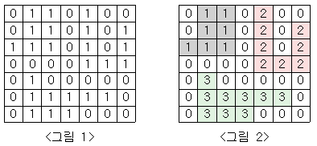

# BOJ

## DFS/BFS 2667 단지번호붙이기
[문제로 이동!](https://www.acmicpc.net/problem/2667)

## 문제

<그림 1>과 같이 정사각형 모양의 지도가 있다. 1은 집이 있는 곳을, 0은 집이 없는 곳을 나타낸다. 철수는 이 지도를 가지고 연결된 집의 모임인 단지를 정의하고, 단지에 번호를 붙이려 한다. 여기서 연결되었다는 것은 어떤 집이 좌우, 혹은 아래위로 다른 집이 있는 경우를 말한다. 대각선상에 집이 있는 경우는 연결된 것이 아니다. <그림 2>는 <그림 1>을 단지별로 번호를 붙인 것이다. 지도를 입력하여 단지수를 출력하고, 각 단지에 속하는 집의 수를 오름차순으로 정렬하여 출력하는 프로그램을 작성하시오.

## 입력

첫 번째 줄에는 지도의 크기 N(정사각형이므로 가로와 세로의 크기는 같으며 5≤N≤25)이 입력되고, 그 다음 N줄에는 각각 N개의 자료(0혹은 1)가 입력된다.

## 예제 입력


    """
    case 1:
    입력
    7
    0110100
    0110101
    1110101
    0000111
    0100000
    0111110
    0111000
    출력
    3
    7
    8
    9
    """


## 풀이
> 전체 graph의 인자를 하나씩 훑으면서 1을 만나게 되면 dfs로 접근하여 1과 인접한 1들을 모두 찾은 뒤 count를 세어준다(단지 하나의 크기를 세기 위해). 또한, 1을 찾게 되면 무조건 True로 리턴해서 전체 단지의 개수를 세준다.
> dfs 함수 내에서는 현재 위치의 상,하,좌,우를 탐색하여 인접한 1들을 찾아낸다.

### solution
1. graph 리스트의 인자값을 이중 반복문을 사용하여 전체 인자값을 탐색할 수 있도록 설정한다.
2. 단지내 집의 수를 세기 위해 전역변수 x_count를 정의한다.(재귀함수 내에서 count 해야하기 때문에 전역변수로 지정했다.)
3. 단지수를 세기 위해 지역변수 total_count를 정의한다.(재귀함수 내에서 1을 발견하면 True로 return 한 뒤 재귀함수 호출의 return 값이 True라면 total_count++을 해준다.)
4. 재귀 함수 내에서 현재 위치가 리스트 범위를 벗어나면 False로 return 한다.
5. 재귀 함수 내에서 현재 위치가 0이라면 False로 return 한다.
6. 재귀 함수 내에서 현재 위치가 1이라면 0으로 변경해준 뒤 x_count를 1 올려준다. 이후 현재 위치에서 상,하,좌,우로 dfs함수를 호출하여 재귀적으로 탐색한다. 이후 return 값은 True이다.
7. 호출한 dfs 리턴값이 True라면, total_count를 1 올려주고, count_list에 x_count를 저장해준다. 
8. graph의 이중반복문을 통해서 모든 위치에서 탐색이 완료되면, count_list는 정렬하고 print한다.

## 코드



    def dfs(x, y, graph):
        global x_count
        if x < 0 or x >= n or y < 0 or y >= n:
            return False
        if graph[x][y] == 0:
            return False
        else:
            graph[x][y] = 0
            x_count += 1
            dfs(x+1, y, graph)
            dfs(x-1, y, graph)
            dfs(x, y+1, graph)
            dfs(x, y-1, graph)
            return True
    
    
    if __name__ == "__main__":
        n = int(input())
        graph = []
        for _ in range(n):
            graph.append(list(map(int,input())))
    
        total_count = 0
        count_list = []
        global x_count
    
        for i in range(n):
            for j in range(n):
                x_count = 0
                if dfs(i, j, graph):
                    total_count += 1
                    count_list.append(x_count)
        count_list.sort()
        print(total_count)
        for c in count_list:
            print(c)
