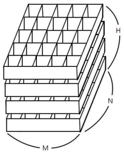
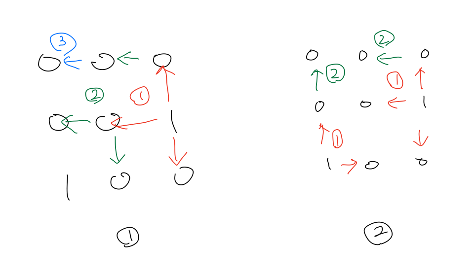

# BOJ

## DFS/BFS 7596 토마토
[문제로 이동!](https://www.acmicpc.net/problem/7596)

## 문제

철수의 토마토 농장에서는 토마토를 보관하는 큰 창고를 가지고 있다. 토마토는 아래의 그림과 같이 격자모양 상자의 칸에 하나씩 넣은 다음, 상자들을 수직으로 쌓아 올려서 창고에 보관한다.

창고에 보관되는 토마토들 중에는 잘 익은 것도 있지만, 아직 익지 않은 토마토들도 있을 수 있다. 보관 후 하루가 지나면, 익은 토마토들의 인접한 곳에 있는 익지 않은 토마토들은 익은 토마토의 영향을 받아 익게 된다. 하나의 토마토에 인접한 곳은 위, 아래, 왼쪽, 오른쪽, 앞, 뒤 여섯 방향에 있는 토마토를 의미한다. 대각선 방향에 있는 토마토들에게는 영향을 주지 못하며, 토마토가 혼자 저절로 익는 경우는 없다고 가정한다. 철수는 창고에 보관된 토마토들이 며칠이 지나면 다 익게 되는지 그 최소 일수를 알고 싶어 한다.

토마토를 창고에 보관하는 격자모양의 상자들의 크기와 익은 토마토들과 익지 않은 토마토들의 정보가 주어졌을 때, 며칠이 지나면 토마토들이 모두 익는지, 그 최소 일수를 구하는 프로그램을 작성하라. 단, 상자의 일부 칸에는 토마토가 들어있지 않을 수도 있다.

## 입력

첫 줄에는 상자의 크기를 나타내는 두 정수 M,N과 쌓아올려지는 상자의 수를 나타내는 H가 주어진다. M은 상자의 가로 칸의 수, N은 상자의 세로 칸의 수를 나타낸다. 단, 2 ≤ M ≤ 100, 2 ≤ N ≤ 100, 1 ≤ H ≤ 100 이다. 둘째 줄부터는 가장 밑의 상자부터 가장 위의 상자까지에 저장된 토마토들의 정보가 주어진다. 즉, 둘째 줄부터 N개의 줄에는 하나의 상자에 담긴 토마토의 정보가 주어진다. 각 줄에는 상자 가로줄에 들어있는 토마토들의 상태가 M개의 정수로 주어진다. 정수 1은 익은 토마토, 정수 0 은 익지 않은 토마토, 정수 -1은 토마토가 들어있지 않은 칸을 나타낸다. 이러한 N개의 줄이 H번 반복하여 주어진다.

토마토가 하나 이상 있는 경우만 입력으로 주어진다.

## 예제 입력



    """
    case 1:
    입력
    5 3 1
    0 -1 0 0 0
    -1 -1 0 1 1
    0 0 0 1 1
    출력
    -1
    
    case 2:
    입력
    5 3 2
    0 0 0 0 0
    0 0 0 0 0
    0 0 0 0 0
    0 0 0 0 0
    0 0 1 0 0
    0 0 0 0 0
    출력
    4
    """


## 풀이
> bfs로 접근한다. 토마토를 입력받을 때 1인 위치를 미리 큐에 모두 집어 넣는다.(이렇게 하는 이유는 이 문제에서 bfs로 탐색하는 순서가 중요하기 때문이다.) 3차원 리스트이기 때문에
> bfs의 탐색을 앞,뒤,좌,우,상,하 6개의 dx로 나누어 탐색한다. 범위를 벗어나거나 -1을 만나면 countinue 해준다.

> 1번 경우는 1을 미리 큐에 집어 넣지 않고, (단지번호붙이기 문제) 처럼 반복문을 통해 1을 찾고 해당 1에서 접근 가능한 노드를 탐색할 때의 순서이다.
> 2번 경우는 1을 미리 큐에 집어 넣고, 해당 큐로부터 bfs를 접근하는 순서이다.
> (0,0) 위치가 익은 토마토가 되기 까지에 2일이 걸리지만, 1번 경우에는 3일이 걸리게 되어 틀린 답이 도출된다.
> 또한 1번 경우에서 dfs 함수 내에 조건을 걸어 min()으로 예외 처리를 해준다면 시간초과로 인해 틀린 답이 도출된다.

### solution
1. box 리스트를 초기화 해주며 값이 1인 위치를 큐에 집어 넣는다.
2. bfs 함수를 호출한다.
3. 앞, 뒤, 상, 하, 좌, 우 위치를 탐색할 수 있는 dx, dy, dz를 정의한다. (6번의 반복문을 통해 접근할 것이다.)
4. 큐에서 x, y, z를 꺼낸 뒤 dx, dy, dz와 더해준다.
5. nx, ny, nz가 범위를 벗어나거나 -1을 만나면 continue 해준다.
6. 0이라면 x, y, z 의 값에 1을 더해준 값을 대입하고 큐에 추가해준다.
7. bfs함수가 종료되면, 반복문을 돌며 0인 값을 찾고 만약 있다면 -1을 print 해주고 종료해준다.
8. 최대값을 갱신해주며 마지막 최대값을 출력해준다.

## 코드



    from collections import deque
    
    
    def bfs(queue,box):
        dx = [1, -1, 0, 0, 0, 0]
        dy = [0, 0, 1, -1, 0, 0]
        dz = [0, 0, 0, 0, 1, -1]
        while queue:
            x, y, z = queue.popleft()
            for i in range(6):
                nx = x + dx[i]
                ny = y + dy[i]
                nz = z + dz[i]
                if nx < 0 or nx >= h or ny < 0 or ny >= n or nz < 0 or nz >= m:
                    continue
                if box[nx][ny][nz] == -1:
                    continue
                if box[nx][ny][nz] == 0:
                    queue.append((nx,ny,nz))
                    box[nx][ny][nz] = box[x][y][z] + 1
    
    
    if __name__ == "__main__":
        m, n, h = map(int, input().split())
        box = []
        queue = deque()
        for i in range(h):
            floor = []
            for j in range(n):
                floor.append(list(map(int, input().split())))
                for k in range(m):
                    if floor[j][k] == 1:
                        queue.append((i,j,k))
            box.append(floor)
    
        bfs(queue, box)
    
        max_count = 0
        for b in box:
            for f in b:
                if f.count(0) >= 1:
                    print(-1)
                    exit()
                if max_count < max(f):
                    max_count = max(f)
    
        print(max_count - 1)
