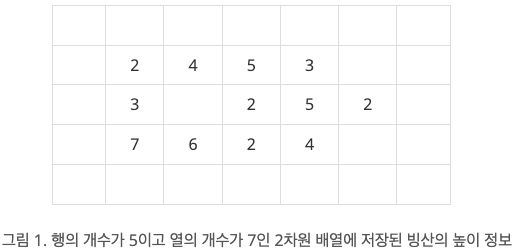
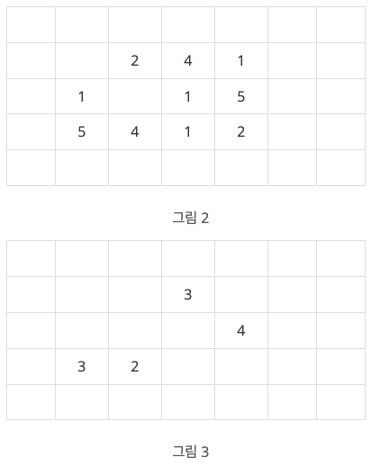

# BOJ

## DFS/BFS 2468 안전 영역
[문제로 이동!](https://www.acmicpc.net/problem/2468)

## 문제

지구 온난화로 인하여 북극의 빙산이 녹고 있다. 빙산을 그림 1과 같이 2차원 배열에 표시한다고 하자. 빙산의 각 부분별 높이 정보는 배열의 각 칸에 양의 정수로 저장된다. 빙산 이외의 바다에 해당되는 칸에는 0이 저장된다. 그림 1에서 빈칸은 모두 0으로 채워져 있다고 생각한다.

빙산의 높이는 바닷물에 많이 접해있는 부분에서 더 빨리 줄어들기 때문에, 배열에서 빙산의 각 부분에 해당되는 칸에 있는 높이는 일년마다 그 칸에 동서남북 네 방향으로 붙어있는 0이 저장된 칸의 개수만큼 줄어든다. 단, 각 칸에 저장된 높이는 0보다 더 줄어들지 않는다. 바닷물은 호수처럼 빙산에 둘러싸여 있을 수도 있다. 따라서 그림 1의 빙산은 일년후에 그림 2와 같이 변형된다.

그림 3은 그림 1의 빙산이 2년 후에 변한 모습을 보여준다. 2차원 배열에서 동서남북 방향으로 붙어있는 칸들은 서로 연결되어 있다고 말한다. 따라서 그림 2의 빙산은 한 덩어리이지만, 그림 3의 빙산은 세 덩어리로 분리되어 있다.

한 덩어리의 빙산이 주어질 때, 이 빙산이 두 덩어리 이상으로 분리되는 최초의 시간(년)을 구하는 프로그램을 작성하시오. 그림 1의 빙산에 대해서는 2가 답이다. 만일 전부 다 녹을 때까지 두 덩어리 이상으로 분리되지 않으면 프로그램은 0을 출력한다.

## 입력

첫 줄에는 이차원 배열의 행의 개수와 열의 개수를 나타내는 두 정수 N과 M이 한 개의 빈칸을 사이에 두고 주어진다. N과 M은 3 이상 300 이하이다. 그 다음 N개의 줄에는 각 줄마다 배열의 각 행을 나타내는 M개의 정수가 한 개의 빈 칸을 사이에 두고 주어진다. 각 칸에 들어가는 값은 0 이상 10 이하이다. 배열에서 빙산이 차지하는 칸의 개수, 즉, 1 이상의 정수가 들어가는 칸의 개수는 10,000 개 이하이다. 배열의 첫 번째 행과 열, 마지막 행과 열에는 항상 0으로 채워진다.

## 예제 입력



    """
    case 1:
    입력
    5 7
    0 0 0 0 0 0 0
    0 2 4 5 3 0 0
    0 3 0 2 5 2 0
    0 7 6 2 4 0 0
    0 0 0 0 0 0 0
    출력
    2
    """


## 풀이
> 전체 빙산의 정보를 저장하는 리스트(info)와 빙산의 방문처리(visited)를 위한 2차원 리스트를 생성한다.
> bfs를 돌기 전에 info의 길이를 구한다. 
> 무한 루프에서 bfs를 돌면서 방문 횟수를 count 한다.
> bfs 함수가 종료되면 count와 info의 길이를 비교한다.
> 같다면 빙산이 모두 이어져 있는 것이고, count가 더 작다면 2등분 된것으로 간주하고 반복문을 종료한다.

## 코드



    from collections import deque

    def bfs(x, y):
        global count
        info = []
    
        queue = deque()
        queue.append((x,y))
        visited[x][y] = True
    
    
        dx = [0, 0, 1, -1]
        dy = [1, -1 ,0, 0]
    
        while queue:
            x, y = queue.popleft()
            count += 1
            water_count = 0
            for i in range(4):
                nx = x + dx[i]
                ny = y + dy[i]
                if nx < 0 or nx >= n or ny < 0 or ny >= m:
                    continue
                if visited[nx][ny]:
                    continue
                if graph[nx][ny] > 0:
                    queue.append((nx,ny))
                    visited[nx][ny] = True
                if graph[nx][ny] == 0:
                    water_count += 1
            graph[x][y] -= water_count
            if graph[x][y] < 0:
                graph[x][y] = 0
            if graph[x][y] > 0:
                info.append((x,y))
    
        return info
    
    
    if __name__ == "__main__":
        n, m = map(int, input().split())
        graph = []
        info = []
        for i in range(n):
            graph.append(list(map(int, input().split())))
            for j in range(m):
                if graph[i][j] > 0:
                    info.append((i,j))
    
        total_count = 0
        flag = 0
        while True:
            visited = [[False] * m for _ in range(n)]
            x, y = info[0]
            length = len(info)
            count = 0
            info = bfs(x, y)
            if length > count:
                break
            if len(info) < 1:
                flag = 1
                break
            total_count += 1
        if flag == 1:
            print(0)
        else:
            print(total_count)
