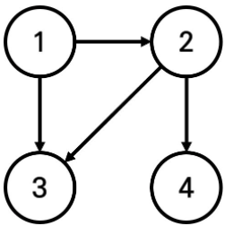

# BOJ

## DFS/BFS 18352 특정 거리의 도시 찾기
[문제로 이동!](https://www.acmicpc.net/problem/18352)

## 문제

어떤 나라에는 1번부터 N번까지의 도시와 M개의 단방향 도로가 존재한다. 모든 도로의 거리는 1이다.

이 때 특정한 도시 X로부터 출발하여 도달할 수 있는 모든 도시 중에서, 최단 거리가 정확히 K인 모든 도시들의 번호를 출력하는 프로그램을 작성하시오. 또한 출발 도시 X에서 출발 도시 X로 가는 최단 거리는 항상 0이라고 가정한다.

예를 들어 N=4, K=2, X=1일 때 다음과 같이 그래프가 구성되어 있다고 가정하자.

이 때 1번 도시에서 출발하여 도달할 수 있는 도시 중에서, 최단 거리가 2인 도시는 4번 도시 뿐이다.  2번과 3번 도시의 경우, 최단 거리가 1이기 때문에 출력하지 않는다.

## 입력

첫째 줄에 도시의 개수 N, 도로의 개수 M, 거리 정보 K, 출발 도시의 번호 X가 주어진다. (2 ≤ N ≤ 300,000, 1 ≤ M ≤ 1,000,000, 1 ≤ K ≤ 300,000, 1 ≤ X ≤ N) 둘째 줄부터 M개의 줄에 걸쳐서 두 개의 자연수 A, B가 공백을 기준으로 구분되어 주어진다. 이는 A번 도시에서 B번 도시로 이동하는 단방향 도로가 존재한다는 의미다. (1 ≤ A, B ≤ N) 단, A와 B는 서로 다른 자연수이다.

## 예제 입력


    """
    case 1:
    입력
    4 4 2 1
    1 2
    1 3
    2 3
    2 4
    출력
    4

    case 2:
    입력
    4 3 2 1
    1 2
    1 3
    1 4
    출력
    -1

    case 3:
    입력
    4 4 1 1
    1 2
    1 3
    2 3
    2 4
    출력
    2
    3   
    """


## 풀이
> BFS로 해결하였다. 이 문제는 단방향이기 때문에 graph 리스트에 원소를 삽입할 때 주의해서 삽입해야한다. (양방향이었다면, i j를 입력 받았을때 graph[i] = j, graph[j] = i 둘 모두 입력 해줫어야 하지만,
> 단방향이기 때문에 i -> j 인, graph[i] = j 만 입력해준다.) 이후 BFS 함수를 사용해서 방문처리와 거리 계산을 동시에 해주면 된다. 

## 코드



    from collections import deque
    
    
    def bfs(s, graph, visited, k):
        queue = deque([s])
        visited[s] = 0
        answer = []
        while queue:
            x = queue.popleft()
            for v in graph[x]:
                if visited[v] == -1:
                    visited[v] = visited[x] + 1
                    queue.append(v)
    
        return answer
    
    
    if __name__ == "__main__":
        n, m, k, x = map(int, input().split())
        graph = [[] for _ in range(n+1)]
        visited = [-1] * (n+1)
        for _ in range(m):
            i, j = map(int, input().split())
            graph[i].append(j)
    
        bfs(x, graph, visited, k)
    
        flag = False
        for i in range(1, n + 1):
            if visited[i] == k:
                print(i)
                flag = True
    
        if not flag:
            print(-1)
