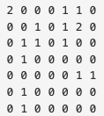
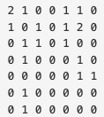
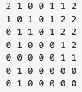

# BOJ

## DFS/BFS 14502 연구소
[문제로 이동!](https://www.acmicpc.net/problem/2644)

## 문제

인체에 치명적인 바이러스를 연구하던 연구소에서 바이러스가 유출되었다. 다행히 바이러스는 아직 퍼지지 않았고, 바이러스의 확산을 막기 위해서 연구소에 벽을 세우려고 한다.

연구소는 크기가 N×M인 직사각형으로 나타낼 수 있으며, 직사각형은 1×1 크기의 정사각형으로 나누어져 있다. 연구소는 빈 칸, 벽으로 이루어져 있으며, 벽은 칸 하나를 가득 차지한다. 

일부 칸은 바이러스가 존재하며, 이 바이러스는 상하좌우로 인접한 빈 칸으로 모두 퍼져나갈 수 있다. 새로 세울 수 있는 벽의 개수는 3개이며, 꼭 3개를 세워야 한다.

예를 들어, 아래와 같이 연구소가 생긴 경우를 살펴보자.

이때, 0은 빈 칸, 1은 벽, 2는 바이러스가 있는 곳이다. 아무런 벽을 세우지 않는다면, 바이러스는 모든 빈 칸으로 퍼져나갈 수 있다.

2행 1열, 1행 2열, 4행 6열에 벽을 세운다면 지도의 모양은 아래와 같아지게 된다.

바이러스가 퍼진 뒤의 모습은 아래와 같아진다.

벽을 3개 세운 뒤, 바이러스가 퍼질 수 없는 곳을 안전 영역이라고 한다. 위의 지도에서 안전 영역의 크기는 27이다.

연구소의 지도가 주어졌을 때 얻을 수 있는 안전 영역 크기의 최댓값을 구하는 프로그램을 작성하시오.

## 입력

첫째 줄에 지도의 세로 크기 N과 가로 크기 M이 주어진다. (3 ≤ N, M ≤ 8)

둘째 줄부터 N개의 줄에 지도의 모양이 주어진다. 0은 빈 칸, 1은 벽, 2는 바이러스가 있는 위치이다. 2의 개수는 2보다 크거나 같고, 10보다 작거나 같은 자연수이다.

빈 칸의 개수는 3개 이상이다.

## 예제 입력


    """
    case 1:
    입력
    7 7
    2 0 0 0 1 1 0
    0 0 1 0 1 2 0
    0 1 1 0 1 0 0
    0 1 0 0 0 0 0
    0 0 0 0 0 1 1
    0 1 0 0 0 0 0
    0 1 0 0 0 0 0
    출력
    27

    case 2:
    입력
    4 6
    0 0 0 0 0 0
    1 0 0 0 0 2
    1 1 1 0 0 2
    0 0 0 0 0 2
    출력
    9

    case 3:
    입력
    8 8
    2 0 0 0 0 0 0 2
    2 0 0 0 0 0 0 2
    2 0 0 0 0 0 0 2
    2 0 0 0 0 0 0 2
    2 0 0 0 0 0 0 2
    0 0 0 0 0 0 0 0
    0 0 0 0 0 0 0 0
    0 0 0 0 0 0 0 0
    출력
    3
    """


## 풀이

첫번째, 벽을 만든다. 
두번째, 바이러스를 상하좌우로 확산시킨다.  
세번째, 바이러스가 확산되지 않은 빈 공간을 조사한다.

이렇게 세단계로 풀이를 나뉠 수 있다. 두번째와 세번째는 bfs를 사용해서 간단하게 해결할 수 있다. 하지만 첫번째 단계인 벽을 만드는 방법은 조금 까다롭다.
벽과 벽 사이를 조사해야할 수도 있고, 벽이 없는 모서리를 조사해야할 수도 있으며 벽이 대각선으로 이루어져있는 부분을 조사해야할 수도 있다.
이런 이유 때문에 벽을 만드는 방법은 brute force를 사용해서 해결한다. graph의 빈 부분들을 미리 리스트에 저장한 뒤, 3중 반복문을 돌며 빈 부분들에 벽을 차례대로 하나씩 세운다.
이후 bfs를 돌아 바이러스를 확산시킨후 빈 공간을 조사하고, 빈 공간의 수 중에서 가장 큰 수를 정답으로 도출한다. 

## 코드



    from collections import deque
    
    
    def bfs(replica):
        queue = deque()
        for virus in virus_list:
            queue.append(virus)
    
        dx = [0, 0, 1, -1]
        dy = [1, -1, 0, 0]
    
        while queue:
            x, y = queue.popleft()
            for i in range(4):
                nx = x + dx[i]
                ny = y + dy[i]
                if nx <0 or nx >= n or ny <0 or ny >= m:
                    continue
                if replica[nx][ny] == 0:
                    queue.append((nx,ny))
                    replica[nx][ny] = 2
    
        count = 0
        for r in replica:
            count += r.count(0)
        return count
    
    
    def make_wall(graph, virus_list, blank_list, n, m):
        count_list = []
        blank_length = len(blank_list)
        for i in range(blank_length):
            for j in range(i + 1, blank_length):
                for k in range(j + 1, blank_length):
                    replica = []
                    for g in graph:
                        replica.append(g.copy())
                    replica[blank_list[i][0]][blank_list[i][1]] = 1
                    replica[blank_list[j][0]][blank_list[j][1]] = 1
                    replica[blank_list[k][0]][blank_list[k][1]] = 1
                    count_list.append(bfs(replica))
    
        return count_list
    

    if __name__ == "__main__":
        n, m = map(int, input().split())
        graph = []
        virus_list = []
        blank_list = []
    
        for i in range(n):
            graph_row = list(map(int, input().split()))
            graph.append(graph_row)
            for j in range(m):
                if graph[i][j] == 0:
                    blank_list.append((i,j))
                elif graph[i][j] == 2:
                    virus_list.append((i,j))
    
        answer = make_wall(graph, virus_list, blank_list, n, m)
        print(max(answer))

