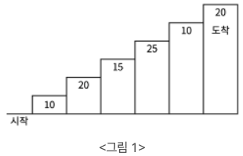
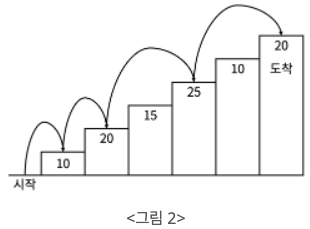

# BOJ

## DP 2579 계단 오르기 

[문제로 이동!](https://www.acmicpc.net/problem/2579)

## 문제

계단 오르기 게임은 계단 아래 시작점부터 계단 꼭대기에 위치한 도착점까지 가는 게임이다. <그림 1>과 같이 각각의 계단에는 일정한 점수가 쓰여 있는데 계단을 밟으면 그 계단에 쓰여 있는 점수를 얻게 된다.

예를 들어 <그림 2>와 같이 시작점에서부터 첫 번째, 두 번째, 네 번째, 여섯 번째 계단을 밟아 도착점에 도달하면 총 점수는 10 + 20 + 25 + 20 = 75점이 된다.

계단 오르는 데는 다음과 같은 규칙이 있다.

계단은 한 번에 한 계단씩 또는 두 계단씩 오를 수 있다. 즉, 한 계단을 밟으면서 이어서 다음 계단이나, 다음 다음 계단으로 오를 수 있다.

1. 연속된 세 개의 계단을 모두 밟아서는 안 된다. 단, 시작점은 계단에 포함되지 않는다.
2. 마지막 도착 계단은 반드시 밟아야 한다.
3. 따라서 첫 번째 계단을 밟고 이어 두 번째 계단이나, 세 번째 계단으로 오를 수 있다. 하지만, 첫 번째 계단을 밟고 이어 네 번째 계단으로 올라가거나, 첫 번째, 두 번째, 세 번째 계단을 연속해서 모두 밟을 수는 없다.

각 계단에 쓰여 있는 점수가 주어질 때 이 게임에서 얻을 수 있는 총 점수의 최댓값을 구하는 프로그램을 작성하시오.

## 입력

입력의 첫째 줄에 계단의 개수가 주어진다.

둘째 줄부터 한 줄에 하나씩 제일 아래에 놓인 계단부터 순서대로 각 계단에 쓰여 있는 점수가 주어진다. 계단의 개수는 300이하의 자연수이고, 계단에 쓰여 있는 점수는 10,000이하의 자연수이다.

## 예제 입력


    """
    case 1:
    입력
    6
    10
    20
    15
    25
    10
    20
    출력
    75 
    """


## 풀이

DP를 사용해서 문제를 해결한다. 보텀업 방식을 사용할 것이고, 점화식 또는 규칙을 찾아야한다.

계단을 오르는 규칙은 문제에 나와있듯이

1. 두 계단씩 연속으로 오를 수 있다.
2. 마지막 계단은 밟아야한다.

2번 규칙을 통해 마지막 계단을 꼭 밟아야 하기 때문에, 경우의 수는 두가지가 생긴다. 마지막 계단을 n이라 하자.

1. n을 밟고, n-1을 밟고(연속으로 밟았다.) n-2는 건너 뛰고 n-3을 밟은 경우
2. n을 밟고, n-1을 건너 뛰고 n-2를 밟은 경우

첫번째 경우는 n-1은 연속으로 밟기 때문에 array에서 값을 가져오고 n-3은 이전부터 max 값이 저장된 값인 dp값을 가져온다.
- dp[n] = array[n] + array[n-1] + dp[n-3]

두번째 경우는 n-2를 이전부터 max 값이 저장된 값인 dp 값을 가져온다. 
- dp[n] = array[n] + dp[n-2]

이 두 경우중 max인 값을 찾아 dp[n]에 저장하면된다.

## 코드



    def solution(array, n):
        dp = [0] * (n+1)
        if n >= 1:
            dp[0] = array[0]
        if n >= 2:
            dp[1] = array[1] + array[0]
        if n >= 3:
            dp[2] = max(array[0]+array[2], array[1]+array[2])
            for i in range(3,n):
                left = array[i]+array[i-1]+dp[i-3]
                right = array[i]+dp[i-2]
                dp[i] = max(left, right)
        return dp
    
    
    if __name__ == "__main__":
        n = int(input())
        array = [int(input()) for _ in range(n)]
        dp = solution(array, n)
        print(dp)
        print(dp[n-1])
