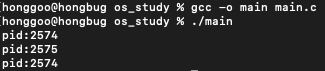

# 공유하는 파일 테이블
프로세스들이 열린 파일 테이블을 공유하는 경우가 있다. 부모 프로세스가 fork()를 사용하여 자식 프로세스를 생성하는 것이 그런 경우중 하나이다.
그렇다면 부모 프로세스가 먼저 파일을 열고 "A" 라고 파일을 작성하고 자식 프로세스를 생성한 뒤 자식 프로세스에서 "B" 라고 파일에 작성한 뒤 자식 프로세스는 종료,
자식 프로세스가 종료될 때 까지 부모 프로세스가 wait 하다가 자식 프로세스가 종료되면 "C" 라고 작성하게 된다면 파일에는 어떻게 문자열이 저장될까?
바로 코드를 작성해서 확인해보자!

# 왜 파일에는 네개의 문자열이 저장되고 터미널에서 출력은 세번 되지?!


    int main(int argc, const char * argv[]) {
        FILE *fp;
        int rc;
        fp = fopen("file.txt", "w");
        fputs("PARENT1 ", fp);
        printf("pid:%d\n", (int)getpid());
        rc = fork();
        if (rc == 0){
            fputs("CHILDREN ", fp);
            printf("pid:%d\n", (int)getpid());
        }
        else if(rc > 0){
            (void) wait(NULL);
            fputs("PARENT1 ", fp);
            printf("pid:%d\n", (int)getpid());
        }
        return 0;
    }


위의 코드를 작성하고 터미널에서 gcc 컴파일러를 사용하여 실행시켜보았다. 

- 출력은 위의 그림처럼 부모 프로세스는 두번 자식 프로세스는 한번 출력되었다.

    // file.txt
    PARENT1 CHILDREN PARENT1 PARENT2

- 텍스트 파일은 위의 그림처럼 PARENT1이 하나 더 많은 총 네개의 문자열이 저장되었다.

 
이유가 무엇일까...? 자식 프로세스를 생성하면 자식 프로세스는 fork() 이후의 코드만 실행한다. 하지만 어째서인지 텍스트 파일에 저장된 문자열은 PARENT1이 하나 더 많다...
너무나도 궁금해서 구글링을 열심히 해봤지만... 답을 찾을 수는 없었다. 그래서 c언어 오픈채팅에 열심히 질문글을 작성했다.. 오픈채팅방에서 한 초초초초고수님께서 답변을 달아주셨다.
이 답변을 한번 정리해보겠다.

# 터미널 출력 버퍼와 파일 출력 버퍼의 차이
터미널 출력과 특스트 파일에 저장된 문자열의 개수가 다른 이유는 <strong>터미널 출력 버퍼</strong>와 <strong>파일 출력 버퍼</strong>의 단위가 다르기 때문이다.
터미널 출력 버퍼는 엔터를 만나면 출력 버퍼를 비운다. 하지만 파일 출력 버퍼는 좀 더 넓은 버퍼 범위를 갖고 있는다.
그렇기 때문에 내 코드에서 pid를 출력하는 코드는 한번씩 알맞게 출력되어 터미널 상에 출력되었다.
하지만, PARENT1은 출력을 한번 하였지만 파일 출력 버퍼에서 아직 사라지지 않은 상태로 fork()를 만나고 자식 프로세스에 함께 복사되었다. 이후에 자식 프로세스에서 
CHILDREN을 출력하고 버퍼에 남아있는 PARENT1을 출력하게 되어 "PARENT1 CHILDREN PARENT1 PARENT2"가 출력된 것이다.

조금 더 요약하자면,
PARENT1(부모 프로세스, 자식 프로세스 분개 전) CHILDREN(자식 프로세스) PARENT1(자식 프로세스, 아직 파일 출력 버퍼에 남아있는) PARENT2(부모 프로세스, 자식 프로세스가 종료되고 출력)
이다.



    FILE *fp;
    int rc;
    fp = fopen("file.txt", "w");
    fputs("PARENT1 ", fp);
    printf("pid:%d\n", (int)getpid());
    rc = fork();
    if (rc == 0){
        printf("pid:%d\n", (int)getpid());
    }
    else if(rc > 0){
        (void) wait(NULL);
        fputs("PARENT2 ", fp);
        printf("pid:%d\n", (int)getpid());
    }
    return 0;

    // file.txt
    // PARENT1 PARENT2

- 위의 코드는 자식 프로세스에서는 파일에 쓰기하지 않았다.



    int main(int argc, const char * argv[]) {
        FILE *fp;
        int rc;
        fp = fopen("file.txt", "w");
        fputs("PARENT1 ", fp);
        printf("pid:%d\n", (int)getpid());
        rc = fork();
        if (rc == 0){
            fputs("CHILDREN ", fp);
            printf("pid:%d\n", (int)getpid());
        }
        else if(rc > 0){
            (void) wait(NULL);
            printf("pid:%d\n", (int)getpid());
        }
        return 0;
    }

    // file.txt
    // PARENT1 CHILDREN PARENT1

- 위의 코드는 자식 프로세스가 종료된 이후 파일에 쓰지 않았다.

위의 두 코드의 결과를 보고 더 명확하게 이해할 수 있었다.