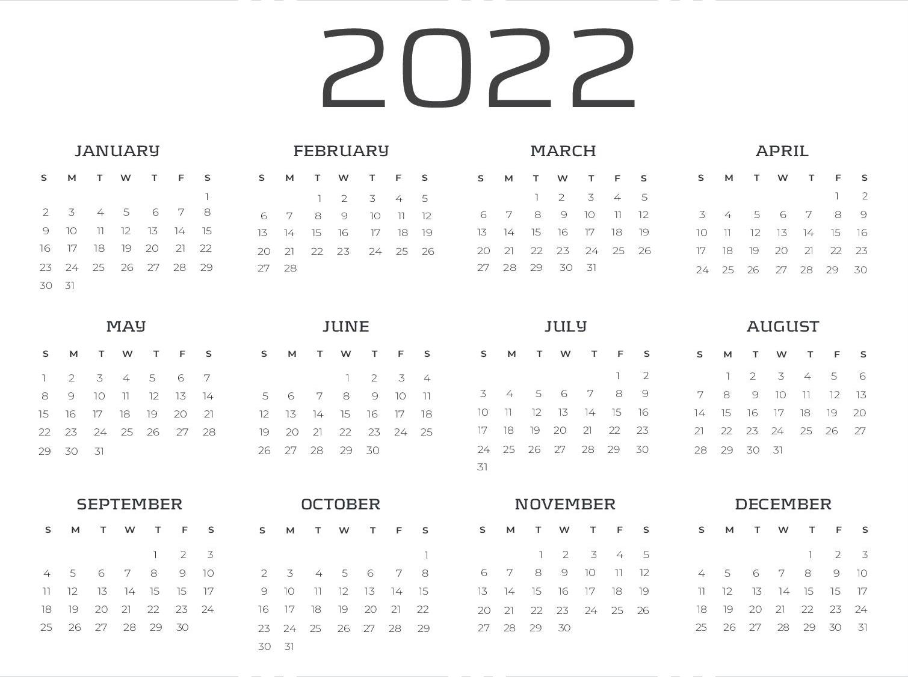
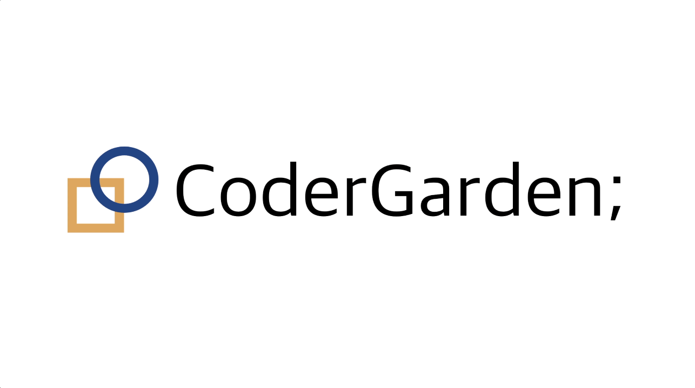
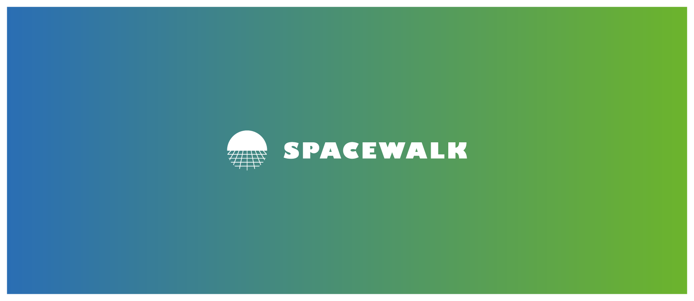
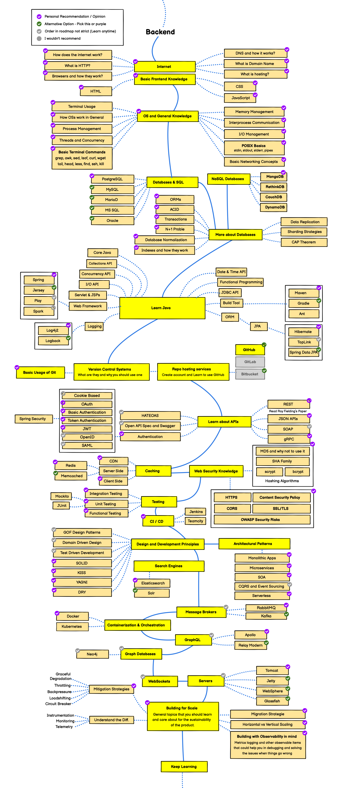

곧 2022년이다. 2021년 한해를 마무리해보자.  

<strong>2021년 : 마무리</strong>

3月-6月 졸업작품

7月-12月 인턴생활

졸업작품 하얗게 불태우고 바로 인턴 생활을 했다. 현업이 되게 궁금했는데 이 부분에 대해서는 굉장히 많은 도움이 된 것 같다.
그리고 Data Engineering 직무도 굉장히 관심 있었는데 직접 경험할 수 있어서 좋았다. 나는 조금 더 다양한 경험을 하고 싶어서 
Back End 직무를 공략할 생각이다. 언어는 아무래도 java가 강력하다고 생각해서 java 공부를 시작할 것 같다. 

<strong>2022년 : 11월 전까지 아래 서류들을 준비해보자</strong>

1. 졸업요건 맞추기 
2. 토익 또는 오픽 
3. 정보처리기사 
4. CS 
5. Algorithm 
6. Java 스킬 
7. ~2022년 포트폴리오 정리 
8. 코딩 캠프(네이버부캠,우테코 등등...) 준비 

<strong>Java Backend Roadmap</strong>
