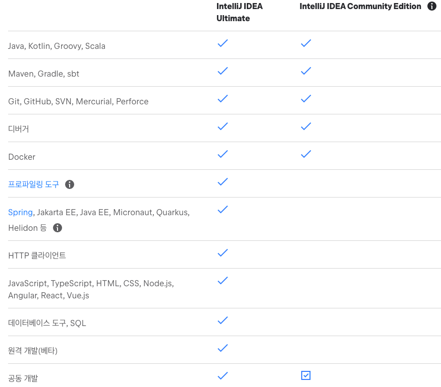
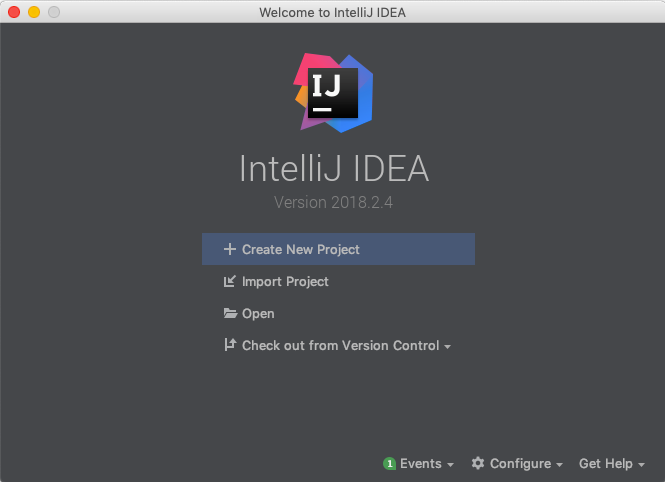
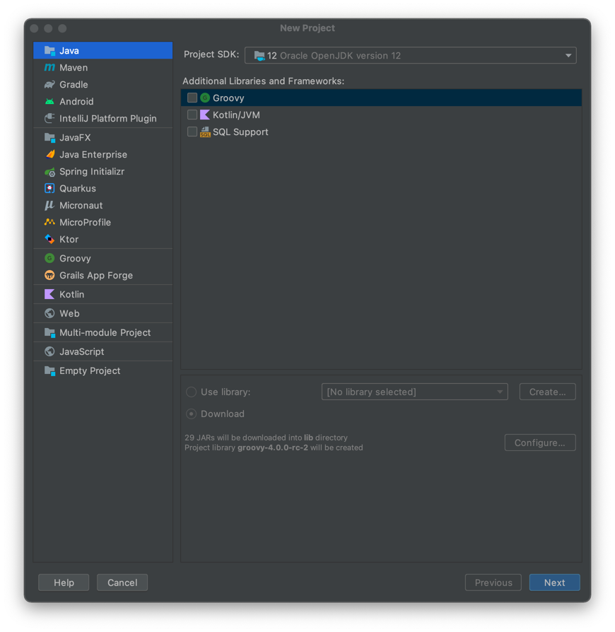
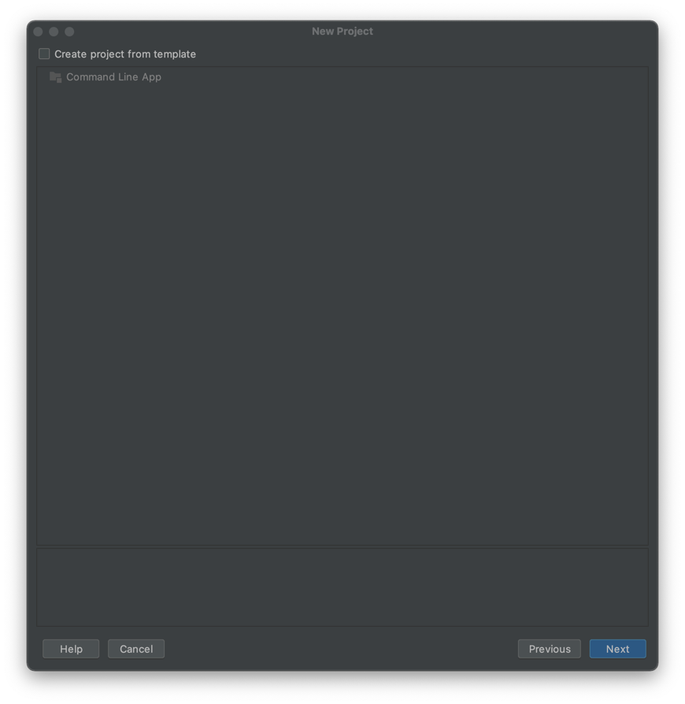
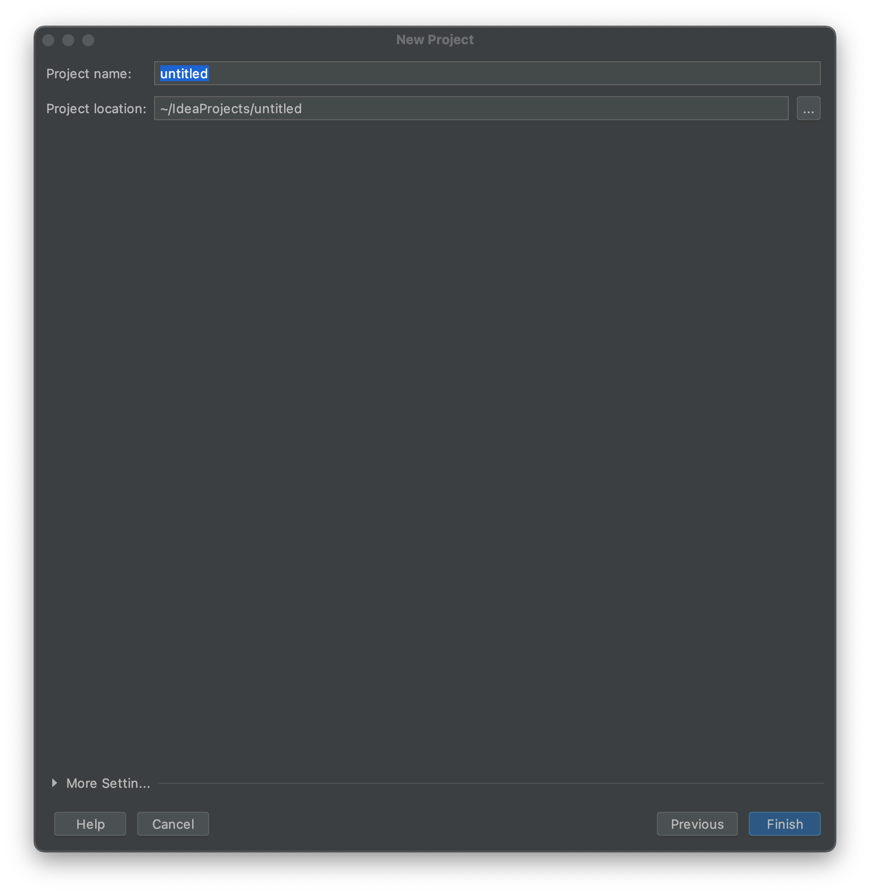
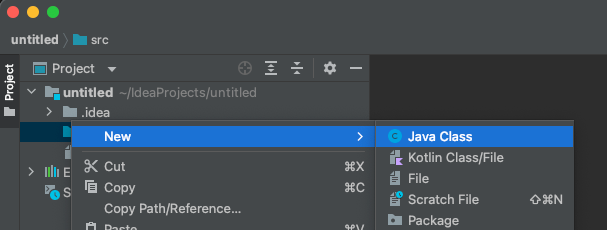
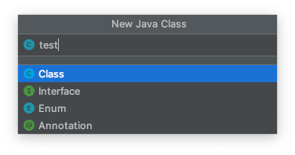
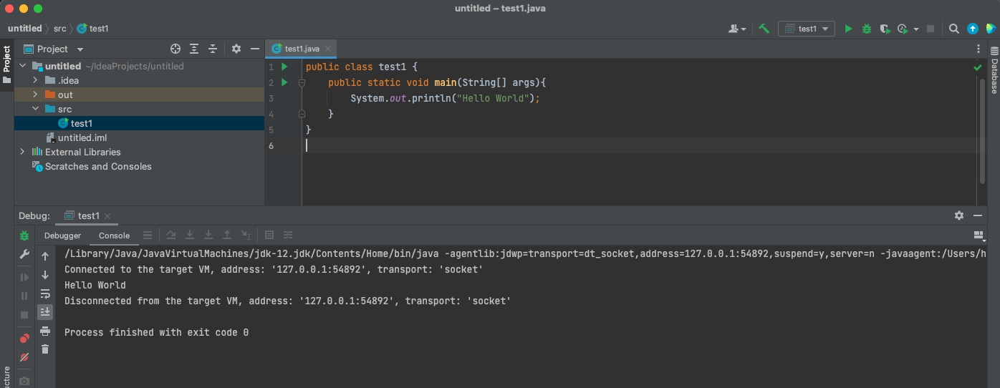
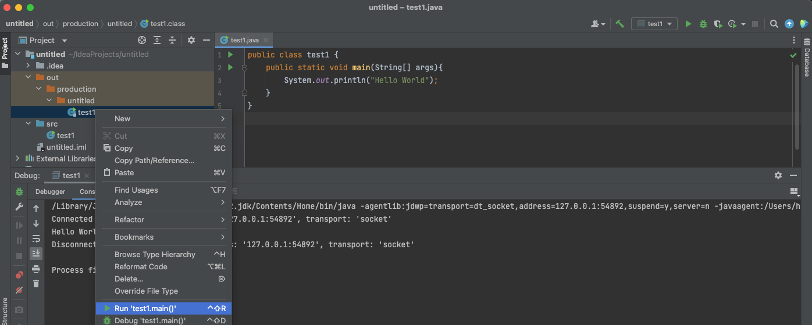

# IntelliJ
학교에서는 java를 배울 때 이클립스(Eclipse)를 사용했다. 하지만 python을 주로 다루면서 파이참(Pycharm)에 익숙해졌다. 
java 공부를 하면서 좀 더 친숙한 JetBrains 회사의 개발도구를 사용하려고 한다. 정보를 조금 찾아보니 IntelliJ가 현재 내가 사용하고 있는 환경인
Mac Os에서 이클립스보다 오류가 덜 발생한다고 한다. 통합 개발 환경도 제공한다고 하니 이보다 더 좋을 수가 없다! 
 
해당 포스트는 Mac Os 환경에서 진행되었다.

### 1. IntelliJ 설치
우선 IntelliJ Mac Os 버전을 설치하려면 
[IntelliJ 설치 링크](https://www.jetbrains.com/ko-kr/idea/download/#section=mac)
에 접속한다. 
각자 Mac 환경에 맞는 파일을 다운로드한다.

   
java 학습을 위해선 Community Edition으로도 충분하다고 한다. 하지만 본인이 학생 신분이라면 학생 라이센스를 이용한
Ultimate 버전을 추천한다.

   
아래와 같은 창이 뜨면 설치 성공!

### 2. Java Project 만들기
위의 창에서 Create New Project를 누르면 아래와 같은 창이 열린다.  
왼쪽의 리스트에서는 Java 선택, 오른쪽 리스트에서는 아무것도 선택하지 않고, 오른쪽 아래의 "Next" 버튼을 누른다.

   
Java 프로젝트를 생성할 때 샘플코드를 생성할지 여부.  
본인이 직접 생성할 것이기 때문에 아무것도 선택하지 않고 "Next" 버튼을 누른다.

   
프로젝트 이름을 정하고 "Next" 버튼을 누른다.

### 3. Hello World 출력하기
프로젝트 생성이 완료되면, main 메소드가 있는 새로운 Java 클래스를 생성하기 위해 src 폴더를 우클릭한다. 
New > Java Class 를 선택한다.

   
새로 생성할 Java Class 이름을 설정하고 Enter를 친다.

   
Hello World 출력 코드를 작성한다. 
상단의 망치 버튼을 클릭하여 빌드하거나 "control + option + R"키를 눌러 빌드한다.

   
혹은 out > production > "project_name" > "Class_name" 우클릭 후 Run을 선택해도 된다.

   
이제 IntelliJ와 함께 Java 공부를 시작해보자,,,!
