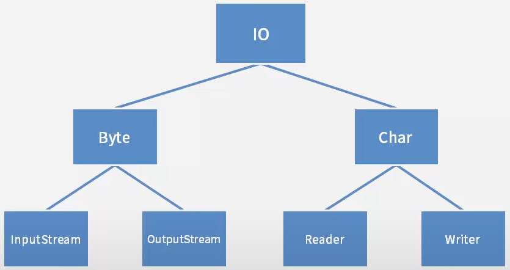
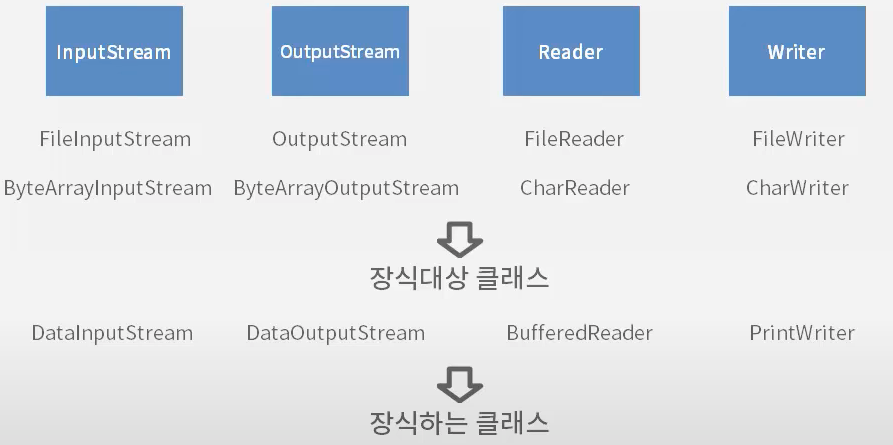

# Part5 IO

## 자바IO
입출력을 위한 인터페이스와 클래스들
- 자바 IO는 크게 byte단위 입출력과 문자 단위 이출력 클래스로 나뉜다.
    - byte단위 입출력클래스는 모두 InputStream과 OutputStream이라는 추상클래스를 상속받아 만들어진다.
    - 문자(char)단위 입출력클래스는 모두 Reader와 Writer라는 추상클래스를 상속받아 만들어진다.
- 4가지 추상클래스(InputStream, OutputStreamReader,Reader,Writer)를 받아들이는 생성자가 있다면, 다양한 입출력방법을 제공하는 클래스다.
- 4가지 클래스를 받아들이는 생성자가 없다면, 어디로부터 입력받을 것인지, 어디에 쓸것인지를 나타내는 클래스다.
- 파일로부터 입력받고 쓰기 위한 클래스 : FileInputStream, FileOutputStream, FileReader, FileWriter
- 배열로부터 입력받고 쓰기 위한 클래스 : ByteArrayInputStream, ByteArrayOutputStream, CharReader, CharWriter
    - 해당 클래스들은 어디로부터, 어디에라는 대상을 지정할 수 있는 IO클래스다. 이런 클래스를 장식대상 클래스라고 한다.
- DataInputStream, DataOutputStream같은 클래스를 보면 다양한 데이터 형을 입력받고 출력한다.
- PrintWriter는 다양하게 한줄 입력받는 readLine() 메소드를 가진다.
- BufferedReader는 한줄 입력받는 readLine() 메소드를 가진다.
    - 이런 클래스들은 다양한 방식으로 입력하고, 출력하는 기능을 제공한다. 이런 클래스를 장식하는 클래스라고 한다.
    

>  데코레이터 패턴(Decorator Pattern) : 하나의 클래스를 장식 하는 것처럼 생성자에서 감싸서 새로운 기능을 계쏙 추가 할 수 있도록 클래스를 만드는 방식

## Byte 단위 입출력
Byte 단위 입출력 클래스는 클래스의 이름이 InputStream 이나 OutputStream으로 끝난다.
- 파일로부터 1byte씩 읽어들여 파일에 1byte씩 저장하는 프로그램을 작성
    - 파일로부터 읽어오기 위한 객체 - FileInputStream
    - 파일에 쓸 수 있게 해주는 객체 - FileOutputStream
- read() 메소드
    - byte를 리턴한다면 끝을 나타내는 값을 표현할 수가 없기때문에, byte가 아닌 int를 리턴한다.
    - 음수의 경우 맨 좌측 비트가 1이 된다. 읽어들일 것이 있다면 항상 양수를 리턴한다고 볼 수 있다.
- FileInputStream과 FileOutputStream을 이용하여, 1바이트씩 읽어들여 1바이트씩 저장
    - read()메소드가 리턴하는 타입은 정수인데, 정수 4바이트중 마지막 바이트에 읽어들인 1바이트를 저장한다.
    - read()메소드는 더이상 읽어들일 것이 없을 때 -1을 리턴한다.


    public class ByteIOExam1 {
        public static void main(String[] args){     
            FileInputStream fis = null; 
            FileOutputStream fos = null;        
            try {
                fis = new FileInputStream("src/javaIO/exam/ByteExam1.java");
                fos = new FileOutputStream("byte.txt");

                int readData = -1; 
                while((readData = fis.read())!= -1){
                    fos.write(readData);
                }           
            } catch (Exception e) {
                // TODO Auto-generated catch block
                e.printStackTrace();
            }finally{
                try {
                    fos.close();
                } catch (IOException e) {
                    // TODO Auto-generated catch block
                    e.printStackTrace();
                }
                try {
                    fis.close();
                } catch (IOException e) {
                    // TODO Auto-generated catch block
                    e.printStackTrace();
                }
            }
        }
    }


## Byte 단위 입출력 심화
Byte단위 입출력 클래스는 클래스의 이름이 InputStream이나 OutputStream으로 끝난다.

- 파일로부터 512byte씩 읽어들여 파일에 512byte씩 저장하는 프로그램을 작성
    - byte[] buffer = new byte[512];
    - 512byte만큼 읽어 들이기 위해 byte배열을 사용


    public class ByteIOExam1 {
        public static void main(String[] args){     
            //메소드가 시작된 시간을 구하기 위함
            long startTime = System.currentTimeMillis();        
            FileInputStream fis = null; 
            FileOutputStream fos = null;        
            try {
                fis = new FileInputStream("src/javaIO/exam/ByteExam1.java");
                fos = new FileOutputStream("byte.txt");

                int readCount = -1; 
                byte[] buffer = new byte[512];
                while((readCount = fis.read(buffer))!= -1){
                    fos.write(buffer,0,readCount);
                }
            } catch (Exception e) {
                // TODO Auto-generated catch block
                e.printStackTrace();
            }finally{
                try {
                    fos.close();
                } catch (IOException e) {
                    // TODO Auto-generated catch block
                    e.printStackTrace();
                }
                try {
                    fis.close();
                } catch (IOException e) {
                    // TODO Auto-generated catch block
                    e.printStackTrace();
                }
            }
        //메소드가 끝났을때 시간을 구하기 위함. 
        long endTime = System.currentTimeMillis();
        //메소드를 수행하는데 걸린 시간을 구할 수 있음. 
        System.out.println(endTime-startTime); 
        }
    }


## 다양한 타입의 출력
- try-with-resources 블럭 선언
    - java io 객체는 인스턴스를 만들고, 모두 사용하면 close()메소드를 호출해야 한다.
    - close() 메소드를 사용자가 호출하지 않더라도, Exxception이 발생하지 않았다면 자동으로 close()가 되게 할 수 있는 방법

        try(
                //io객체 선언
        ){
                //io객체 사용
        }catch(Exception ex){
            ex.printStackTrace();
        }

      
- 다양한 타입으로 저장할 수 있는 DataOutputStream
    - writeInt() - 정수값으로 저장
    - writeBoolean() - boolean값으로 저장
    - writeDouble() - double값으로 저장

    import java.io.DataOutputStream;
    import java.io.FileOutputStream;    
    public class ByteExam3 {    
        public static void main(String[] args) {
            try(
                    DataOutputStream out = new DataOutputStream(new FileOutputStream("data.txt"));
            ){
                out.writeInt(100);
                out.writeBoolean(true);
                out.writeDouble(50.5);
            }catch (Exception e) {
                e.printStackTrace();
            }
        }   
    }


## 다양한 타입의 입력
- data.dat로부터 값을 읽어들여 화면에 출력하는 클래스
- 다양한 타입의 데이터를 읽어낼 수 있는 DataInputStream
    - readInt() - 정수를 읽어들이는 메소드
    - readBoolean() - boolean 값을 읽어들이는 메소드
    - readDouble() - double 값을 읽어들이는 메소드

    import java.io.DataInputStream;
    import java.io.FileInputStream;

    public class ByteIOExam4 {

        public static void main(String[] args) {
            try(
                    DataInputStream out = new DataInputStream(new FileInputStream("data.dat"));
            ){
                int i = out.readInt();          
                boolean b = out.readBoolean();          
                double d = out.readDouble();

                System.out.println(i);
                System.out.println(b);
                System.out.println(d);
            }catch(Exception ex){
                ex.printStackTrace();
            }
        }
    }
 

> 파일에 저장된 순서대로 읽어 들여야한다.

## Char 단위 입출력(Console)
char 단위 입출력 클래스는 클래스 이름이 Reader나 Writer로 끝이 난다.
- char 단위 입출력 클래스를 이용해서 키보드로부터 한줄 입력 받아서 콘솔에 출력
    - System.in - 키보드를 의미(InputStream)
    - BufferedReader - 한줄씩 입력 받기위한 클래스
    - BufferedReader 클래스의 생성자는 InputStream을 입력받는 생성자가 없다.
    - System.in은 InputStream 타입이므로 BufferedReader의 생성자에 바로 들어갈 수 없으므로 InputStreamReader 클래스를 이용해야함

    import java.io.BufferedReader;
    import java.io.FileWriter;
    import java.io.IOException;
    import java.io.InputStreamReader;
    import java.io.PrintWriter; 
    public class CharIOExam01 {
        public static void main(String[] args) {
            BufferedReader br = new BufferedReader(new InputStreamReader(System.in));
            //키보드로 입력받은 문자열을 저장하기 위해 line변수를 선언               
            String line = null;     
            try {
                line = br.readLine()
            } catch (IOException e) {
                e.printStackTrace();
            }
            //콘솔에 출력 
            System.out.println(line);
        }
    }
 

## Char 단위 입출력(File)
char 단위 입출력 클래스는 클래스 이름이 Reader나 Writer로 끝이 난다.
- 파일에서 한 줄씩 입력 받아서 파일에 출력
    - 파일에서 읽기 위해서 FileReader 클래스 이용
    - 한 줄 읽어 들이기 위해서 BufferedReader 클래스 이용
        - BufferedReader 클래스가 가지고 있는 readLine() 메소드가 한줄씩 읽게 해준다.
        - readLine() 메소드는 읽ㅇ낼 때 더 이상 읽어 들일 내용이 없ㅇ르 때 mnull을 리턴한다.
    - 파일에 쓰게하기 위해서 FileWriter 클래스 이용
    - 편리하게 출력하기 위해 PrintWritier 클래스 이용

    import java.io.BufferedReader;
    import java.io.FileReader;
    import java.io.FileWriter;
    import java.io.IOException;
    import java.io.PrintWriter; 
    public class CharIOExam02 {
        public static void main(String[] args) {
            BufferedReader br = null; 
            PrintWriter pw = null;
            try{        
                br = new BufferedReader(new FileReader("src/javaIO/exam/CharIOExam02.java"));
                pw = new PrintWriter(new FileWriter("test.txt"));
                String line = null;
                while((line = br.readLine())!= null){
                    pw.println(line);
                }
            }catch(Exception e){
                e.printStackTrace();
            }finally {
                pw.close();
                try {
                    br.close();
                } catch (IOException e) {
                    e.printStackTrace();
                }
            }
        }
    }
 

# Part6 어노테이션

## 어노테이션 
어노테이션은 Java5에 추가된 기능
- 어노테이션은 클래스나 메소드 위에 붙는다. @(at)기호로 이름이 시작한다.
- 어노테이션을 클래스나 메타코드에 붙인 후, 클래스가 컴파일되거나 실행될 때 어노테이션의 유무나 어노테이션에 설정된 값을 통하여 클래스가 좀 더 다르게 실행되게 할 수 있다. 이런 이유로 어노테이션을 일정의 설정파일처럼 설명하는 경우도 있다.
- 어노테이션은 자바가 기본으로 제공해주는 것도 있고, 사용자가 직접 만들 수도 있다.
    - 사용자가 직접 작성하는 어노테이션을 Custom 어노테이션이라고 한다.
- 커스텀 어노테이션을 이용하는 방법
    1. 어노테이션을 정의한다.
    2. 어노테이션을 클래스에서 사용한다. (타겟에 적용)
    3. 어노테이션을 이용하여 실행
- 패키지 익스플로러에서 [new - Annotation]을 이용하여 Count100이라는 어노테이션 생성
    - Count100어노테이션을 JVM 실행시에 감지할 수 있도록 하려면 @Retention(RetentionPolicy.RUNTIME)를 붙여줘야 한다.

    import java.lang.annotation.Retention;
    import java.lang.annotation.RetentionPolicy;

    @Retention(RetentionPolicy.RUNTIME)
    public @interface Count100 {

    }
 
  
- "hello"를 출력하는 hello() 메소드를 가지는 MyHello라는 클래스를 작성
    - hello 메소드 위에 @Count100어노테이션을 붙힌다

    public class MyHello {
        @Count100
        public void hello(){
            System.out.println("hello");
        }
    }
 
  
- MyHello 클래스를 이용하는 MyHelloExam클래스를 작성
    - MyHello의 hello 메소드가 @Count100어노테이션이 설정되어 있을 경우, hello()메소드를 100번 호출하도록 한다.

    import java.lang.reflect.Method;

    public class MyHelloExam {
        public static void main(String[] args) {
            MyHello hello = new MyHello();

            try{
                Method method = hello.getClass().getDeclaredMethod("hello");
            if(method.isAnnotationPresent(Count100.class)){
                    for(int i = 0; i < 100; i++){
                        hello.hello();
                    }
                }else{
                    hello.hello();
                }
            }catch(Exception ex){
                ex.printStackTrace();
            }       
        }
    }
 
