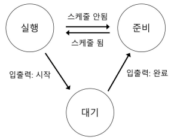
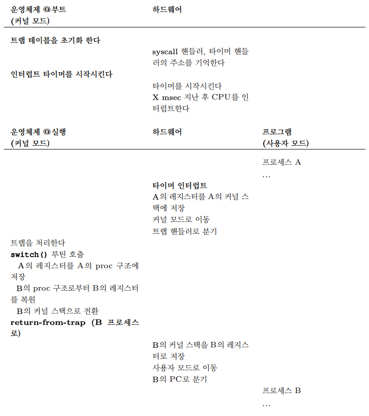

# 1. 프로세스의 개념 

## 1.1 프로세스의 개념
- 운영체제는 <strong>실행 중인 프로그램</strong>의 개념을 제공하는데, 이를 <strong>프로세스(process)</strong>라고 한다.
- 프로세스의 구성 요소를 이해하기 위해서 <strong>하드웨어 상태</strong>를 이해해야 한다.
    - 메모리: 프로그램의 명령어와 데이터는 메모리에 저장된다. 
    - 레지스터: 프로그램의 많은 명령어들이 레지스터를 직접 읽거나 갱신한다.

## 1.2 프로세스 API
- 운영체제가 제공하는 API 중 중요한 다섯가지
    - 생성(Create): 운영체제는 새로운 프로세스를 생성할 수 있는 방법을 제공해야 한다.
    - 제거(Destroy): 운영체제는 프로세스를 강제로 제거할 수 있는 인터페이스를 제공해야 한다.
    - 대기(Wait): 프로세스의 실행 중지를 기다릴 필요가 있다.
    - 각종 제어(Miscellaneous Control): 일시정지나 재개등
    - 상태(Status): 프로세스 상태 정보를 얻어내는 인터페이스를 제공한다.
    
## 1.3 프로세스 생성: 좀 더 자세하게
- 프로그램 실행을 위하여 운영체제가 하는 첫 번째 작업은 프로그램 코드와 정적 데이터(static data)를 메모리, 프로세스의 주소공간에 <strong>탑재(load)</strong>하는 것이다.
- 코드와 정적 데이터가 메모로 탑재된 후 운영체제는 다음과 같은 일을 한다.
    - 운영체제는 특정 크기의 메모리 공간이 프로그램에 <strong>스택(run-time stack)</strong> 용도로 할당되어야 한다.
    - 운영체제는 프로그램의 <strong>힙(heap)</strong>을 위한 메모리 영역을 할당한다.
    - 운영체제는 입출력과 관계된 초기화 작업을 수행한다.
    - 위의 세가지 일을 끝마치면 main() 루틴으로 분기함으로써 프로그램 실행이 시작된다.

## 1.4 프로세스 상태
- 프로세스 상태
    - 실행(Running): 프로세스는 프로세서에서 실행 중이다. 즉, 명령어를 실행하고 있다.
    - 준비(Ready): 프로세스는 실행할 준비가 되어 있지만, 운영체제가 다른 프로세스를 실행하고 있는 등의 이유로 대기 중이다.
    - 대기(Blocked): 프로세스가 다른 사건을 기다리는 동안 프로세스의 수행을 중단시키는 연산이다. 예: 입출력을 요청하고 블락됨

- 프로세스는 운영체제의 스케줄링 정책에 따라 <strong>스케줄</strong>이 되면 준비 상태에서 실행 상태로 전이한다.

- 위의 그림은 "프로세스: 상태 전이" 이다.

## 1.5 자료 구조
- 운영체제도 일종의 프로그램으로서 다양한 정보를 유지하기 위한 자료 구조를 가지고 있따.
  - ex1: 프로세스 상태를 파악하기 위해 준비 상태의 프로세스들을 위한 <strong>프로세스 리스트(process list)</strong>를 유지한다.
  - ex2: 실행 중 프로세스를 명시하기 위한 부가적인 자료 구조도 유지한다.
  - ex3: 대기 상태인 프로세스들에 대한 정보도 관리한다.
  
## 1.6 요약
- 프로세스는 간단히 말하면 실행 중인 프로그램이다.
- 프로세스의 핵심 사항
  - 프로세스 구현에 필요한 기법
  - 구현한 프로세스를 스케줄링하는 정책

# 2. 제한적 직접 실행 원리(Limited Direct Execution)
- CPU를 가상화하기 위해서 운영체제는 여러 작업들이 동시에 실행되는 것처럼 보이도록 물리적인 CPU를 공유한다.
  - <strong>CPU 시간을 나누어 씀</strong>으로써 가상화를 구현할 수 있다.
- 위와 같은 가상화 기법을 구현하기 위해서는 몇 가지 문제를 해결해야 한다.
  1. 성능 저하 : 시스템에 과중한 오버헤드를 주어선 안됨
  2. 제어 문제 : CPU에 대한 통제를 유지하면서 프로세스를 효율적으로 실행시켜야함
  
## 2.1 기본 원리: 제한적 직접 실행(LDE)
- 운영체제 개발자들은 프로그램을 빠르게 실행하기 위하여 <strong>제한적 직접 실행(Limited Direct Excution, LDE)</strong>라는 기법을 개발하였다.
  - "직접 실행": 프로그램을 CPU 상에서 그냥 직접 실행

- 제한적 직접 실행 접근법은 CPU를 가상화함에 있어 몇가지 문제를 일으킨다.
  1. 프로그램을 직접 실행시킨다면 프로그램이, 운영체제가 원치않는 일을 하지 않는다는 것을 어떻게 보장할 수 있는가?
  2. 프로세스 실행시, 운영체제는 어떻게 프로그램의 실행을 중단하고 다른 프로세스로 전환시킬 수 있는가
    - 즉, CPU를 가상화하는 데 필요한 <strong>시분할(time sharing)</strong>기법을 어떻게 구현하는가

## 2.2 문제점 1: 제한된 연산
- 직접 실행의 장점은 빠르게 실행된다는 것이다.
- 하지만 프로세스가 디스크에 대하여 입출력을 제한하지 않으면 운영체제의 접근 권한 기능이 의미가 없다.
  - 이 때문에 <strong>사용자 모드(user mode)</strong>가 도입되었다.
- 사용자 모드(user mode): 사용자 모드에서 실행되는 코드는 할 수 있는 일이 제한된다.
- 커널 모드(kernel mode): 사용자 모드와 대비되는 모드로서 운영체제의 중요한 코드들이 실행된다.

- 사용자 모드에서 운영체제의 도움이 필요할 때 <strong>시스템 콜</strong>을 사용한다.
- 커널은 시스템 콜을 통하여 자신의 주요 기능을 사용자 모드 프로그램에게 제공한다.
- 시스템 콜을 실행하기 위해 프로그램은 trap 특수 명령어를 실행해야 한다.
- 호출한 프로세스의 필요한 레지스터들을 저장해야 한다.
  - 운영체제가 return-from-trap 명령어 실행 시 사용자 프로세스로 제대로 리턴할 수 있어야 하기 위함이다.
  - PC, 플래그, 레지스터를 각 프로세스의 <strong>커널 스택</strong>에 저장한다.
- 커널은 부팅 시에 <strong>트랩 테이블</strong>을 만들고 이를 이용하여 시스템을 통제한다.
- 운영체제는 특정 명령어를 사용하여 하드웨어에게 <strong>트랩 핸들러(trap handler)</strong>의 위치를 알려준다.

- 모든 시스템 콜은 자신의 고유 번호를 갖고 있따.

- LDE 방식은 두 단계로 진행된다.
  1. 전반부에서(부팅 시) 커널은 트랩 테이블을 초기화하고 CPU는 나중에 사용하기 위하여 테이블의 위치를 기억한다.
  2. 후반부에서(프로세스를 실행할 때) return-from-trap을 이용하여 사용자 프로세스를 시작할 때 몇 가지 작업을 수행한다.
    - 프로세스 리스트 삽입, 메모리 할당 등
  
## 2.3 문제점 2: 프로세스 간 전환
- 직접 실행의 두 번째 문제점은 프로세스 전환이 가능해야한다는 점이다.

### 협조 방식: 시스템 콜 호출시 까지 대기
- 협조 방식은 각 사용자 프로세스가 비정상적인 행동은 하지 않을것으로 가정한다.
  - 프로세스들이 CPU를 사용 완료하면 CPU를 반납할 것이라 믿는다.
- 이 방식의 문제점은 프로세스가 무한 루프에 빠져 시스템 콜을 호출할 수 없다면 문제가 발생할 수 있다.

### 비협조 방식: 운영체제가 제어권 확보
- <strong>타이머 인터럽트</strong>를 이용한다.
  - 타이머는 수 밀리 초마다 인터럽트라 불리는 하드웨어 신호를 발생시킨다.
  
- 인터럽트가 발생하면 운영체제는 현재 수행 중인 프로세스를 중단시키고 해당 인터러븥에 대한 <strong>인터럽트 핸들러(interrupt handler)</strong>를 실행한다.
- 운영체제는 타이머 인터럽트가 발생 시 실행해야 할 코드의 주소를 기록해두어야 한다.

### 문맥의 저장과 복원
- 시스템 콜을 통하여 협조적으로 하던, 타이머 인터럽트를 통하여 약간은 강제적으로 하던, 운영체제가 제어권을 다시 획득하면 중요한 결정을 내려야 한다.
  - 현재 실행 중인 프로세스를 계속 실행할 것인지 아니면 다른 프로세스로 전환될 것인지를 결정해야 한다.
  - 이결 정은 운영체제의 <strong>스케줄러(scheduler)</strong>라는 부분에 의해 내려진다.
  
- 현재 프로세스를 중단하고 다른 프로세스를 실행하기로 결정을 하면 운영체제는 <strong>문맥 교환(context switch)</strong>이라 불리는 코드를 실행한다.
  - 현재 실행 중인 프로세스의 레지스터 값들을 커널 스택에 저장하고, 새로 실행될 프로세스의 커널 스택으로부터 레지스터 값을 복원하는 것이다.
  

- 위의 그림은 제한적 직접 실행 방식(타이머 인터럽트)의 예시이다.