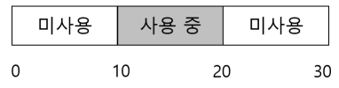
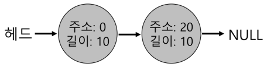
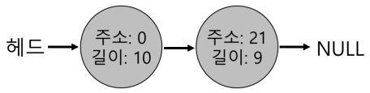
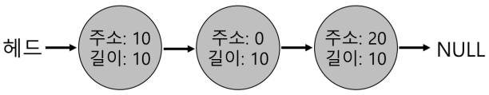
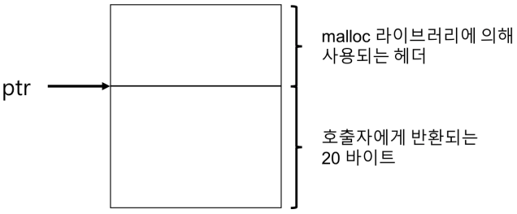
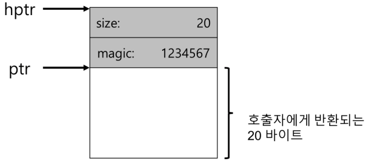
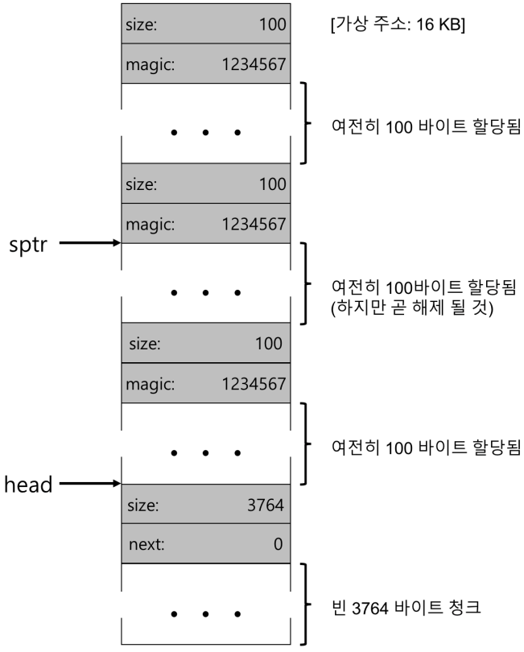

# 1. 빈 공간 관리
- 빈 공간 관리가 더 어렵고 흥미로운 경우는 관리하는 공간이 가변-크기 빈 공간들의 집합으로 구성되어 있는 경우이다.
    - malloc(), free(), 세그멘테이션으로 물리 메모리를 관리하는 운영체제에서 발생한다.
- 어느 경우에도 <strong>외부 단편화</strong>가 존재한다.
    - 빈 공간은 다양한 크기의 작은 조각으로 분할되어 결국 단편화된다.
    

# 1.1 가정
- 힙의 <string>빈 공간</strong>을 관리하는 데는 일반적인 링크드리스트가 사용된다.
    - 이 자료 구조는 영역 내의 모든 빈 청크에 대한 주소를 갖고 있다.

# 1.2 저수준 기법들
- 대부분의 할당기에서 사용되는 일반적인 기법
    1. <strong>분할(splitting)</strong>과 <strong>병합(coalescing)</strong>
    2. 할당된 영역의 크기를 빠르고 상대적으로 쉽게 파악할 수 있는 방법
    3. 빈 공간과 사용 중인 공간을 추적하기 위해 빈 공간 내에 간단한 리스트를 구현하는 방법
    
## 분할과 병합
    
### 분할

- 위의 예제를 메모리를 1바이트만 요청했다고 가정하자. 이 경우 할당기는 <strong>분할(splitting)</strong>로 알려진 작업을 수행한다. 요청을 만족시킬 수 있는 빈 청크를 찾아 이를 둘로 분할한다.

### 병합

- 위의 예제를 병합하는 예이다.
    - 메모리 청크를 반환할 때 해제되는 청크의 주소와 바로 인접한 빈 청크의 주소를 검사한다. 새로 해제된 빈 공간이 기존에 존재하는 빈 청크와 바로 인접해 있다면 더 큰 빈 공간으로 병합한다.

## 할당된 공간의 크기 파악
- malloc 라이브러리는 해제되는 메모리 영역의 크기를 신속히 파악하여 그 공간을 빈 공간 리스트에 추가시킬 수 있다고 가정한다.
    - 이 작업을 위해 대부분의 할당기는 추가 정보를 <strong>헤더(header)</strong> 블럭에 저장한다.
    - 헤더 블럭은 메모리에 유지되며 보통 해제된 청크 바로 직전에 위치한다.

- 위의 그림은 할당된 영역과 헤더이다.

- 위의 그림은 특정 값이 저장된 헤더이다.

- 헤더는 적어도 할당된 공간의 크기는 저장해야한다. 또한, 해제 속도를 향상시키기 위한 추가의 포인터, 부가적인 무결성 검사를 제공하기 위한 매직 넘버, 및 기타 정보를 저장할 수 있다.

## 빈공간 리스트 내장

- 위의 그림은 3개의 할당 청크를 가진 빈 공간
    - 100바이트씩 할당되는 것을 확인할 수 있다.

- 위의 그림은 병합되지 않은 빈 공간 리스트
    - 100바이트씩 할당된 청크가 반납되어 해제된 상태를 보여준다.
    - 빈 공간 리스트를 순회하며 해제된 청크를 병합하면 힙은 전체 하나의 큰 청크가 된다.

## 힙의 확장
- 힙 공간이 부족한 경우에 어떻게 할 것인가?
    - 가장 쉬운 방법은 단순히 실패를 반환하는 것이다.
- 대부분의 전통적인 할당기는 적은 크기의 힙으로 시작하여 모두 소진하면 운영체제로부터 더 많은 메모리를 요청한다.
    - sbrk 시스템콜을 호출한다.
    - sbrk 요청을 수행하기 위해 운영체제는 빈 물리 페이지를 찾아 요청 프로세스의 주소 공간에 매핑한 후, 새로운 힙의 마지막 주소를 반환한다.
    
# 1.3 빈 공간 할당의 기본 전략
- 이상적인 할당기는 속도가 빠르고 단편화를 치ㅗ소로 해야 한다.
    - 최적 적합(Best Fit)
    - 최악 적합(Worst Fit)
    - 최초 적합(First Fit)
    - 다음 적합(Next Fit)
  
## 최적 적합
- 후보자 그룹 중에서 가장 작은 크기의 청크를 반환한다.
- 빈 공간 리스트를 한번만 순회하면 반환할 정확한 블럭을 찾을 수 있다.
- 빈 블럭을 찾기 위해 항상 전체를 검색해야 하기 때문에 엄청난 성능 저하를 초래한다.

## 최악 적합
- 가장 큰 빈 청크를 찾아 요청된 크기 만큼 반환하고 남는 부분은 빈 공간 리스트에 계속 유지한다.
- 최악 적합의 목적은 최적 적합 방식에서 발생될 수 있는 작은 청크들을 방지하는 것이다.

## 최초 적합
- 요청보다 큰 첫 번째 블럭을 찾아서 요청만큼 반환한다.
- 최초 적합은 속도가 빠르다는 것이 장점이다.
- 할당기가 빈 공간 리스트의 순서를 관리하는 방법이 쟁점이다.
  - 한가지 방법은 주소-기반 정렬을 사용한다.
  
## 다음 적합
- 마지막으로 찾았던 원소를 가리키는 추가의 포인터를 유지한다.
- 전체 탐색을 하지 않기 때문에 최초 적합의 성능과 비슷하고 빈 공간 탐색을 리스트 전체에 더 균등하게 분산시킬 수 있다.

    
