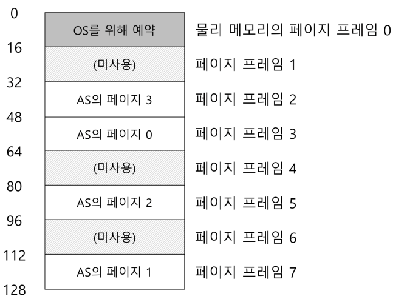
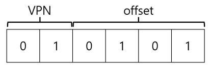
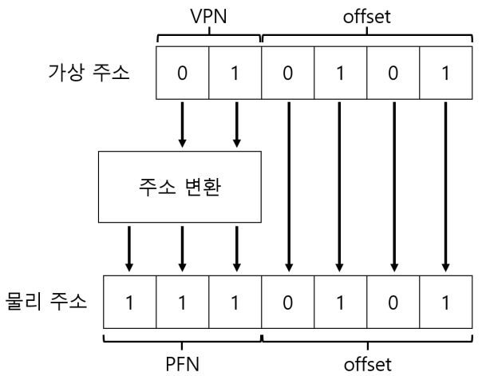

# 1. 페이징: 개요
- 세그멘테이션은 공간을 다양한 크기의 청크로 분할할 때 공간 자체가 <strong>단편화(fragmented)</strong>될 수 있고, 할당은 점점 더 어려워진다.
- 다른 방법은 공간을 동일 크기의 조각으로 분할하는 <storng>페이징(paging)</strong> 기법이다.
    - 프로세스의 주소 공간을 몇개의 가변 크기의 논리 세그멘트(코드, 힙, 스택)로 나누는 것이 아니라 고정 크기의 단위로 나눈다. 이 각각의 단위를 <strong>페이지(page)</strong>라고 부른다. 상응하여 물리 메모리도 <strong>페이지 프레임(page frame)</strong>이라고 불리는 고정 크기의 슬롯의 배열이라고 생각한다.
    
## 1.1 간단한 예제 및 개요

- 위의 그림은 128바이트 물리 메모리에 탑재된 64바이트 주소 공간이다.
  
- 페이징의 가장 큰 장점은 유연성이다.
    - 힙과 스택이 어느 방향으로 커지는가, 어떻게 사용되는가에 대한 가정을 하지 않아도 된다.
- 페이징의 또 다른 장점은 단순함이다.
    - 물리 메모리에 주소 공간을 배치하기 위해서는 운영체제는 비어 있는 네 개의 페이지만 찾으면된다. 운영체제는 모든 비어 있는 페이지의 <strong>빈 공간 리스트</strong>를 유지하고 리스트의 첫 네 개 페이지를 선택한다.
  
- 주소 공간의 각 가상 페이지에 대한 물리 메모리 위치 기록을 위하여 운영체제는 프로세스 마다 <strong>페이지 테이블(page table)</strong>이라는 자료 구조를 유지한다.
    - 페이지 테이블의 주요 역할은 주소 공간의 가상 페이지 <strong>주소 변환(address translation)</strong>정보를 저장하는 것이다.
    - 페이지 테이블은 프로세스마다 존재한다.
  
- 프로세스가 생성한 가상 주소의 <strong>변환</strong>을 위해 먼저 가상 주소를 <strong>가상 페이지 번호(virtual page number, VPN)</strong>와 페이지 내의 <strong>오프셋</strong> 2개의 구성 요소로 분할한다.

- 위의 그림은 `movl 21, %eax`를 이진 형식으로 변환한 뒤 가상페이지 번호와 오프셋으로 나눈 예이다.

- 위의 그림은 주소 변환 과정이다.
    - 페이지 테이블에서 VPN을 PFN으로 교체하여 가상 주소를 변환한다. offset은 그대로 사용한다.

# 1.2 페이지 테이블은 어디에 저장되는가
- 물리주소로의 변환 정보와 다른 필요한 정보를 저장하기 위하여 각 프로세스의 <strong>페이지 테이블</strong>을 메모리에 저장한다.

# 1.3 페이지 테이블에는 실제 무엇이 있는가
- 페이지 테이블은 가상 주소를 물리 주소로 매핑(mapping)하는 데 사용되는 자료 구조이다.
- 가장 간단한 형태는 <strong>선형 페이지 테이블(linear page table)</strong>이다.

- <strong>페이지 테이블 엔트리(page table entry, PTE)</strong>에는 여러가지 비트들이 존재한다.
    - Valid bit: 특정 변환의 유효 여부를 나타내기 위하여 포함된다. Valid bit은 할당되지 않은 주소 공간을 표현하기 이ㅜ해 반드시 필요하다.
    - Protection bit: 페이지가 읽을 수 있는지, 쓸 수 있는지, 또는 실행될 수 있는지를 표시한다.
    - Present bit: 페이지가 물리 메모리에 있는지 혹은 디스크에 있는지(즉, 스왑 아웃되었는지) 가리킨다.
        - 스와핑은 운영체제가 드물게 사용되는 페이지를 디스크로 이동시켜 물리 메모리를 비울 수 있게 한다.
    - dirty bit: 메모리에 반입된 후 페이지가 변경되었는지 여부를 나타낸다.
    - reference bit: 페이지가 접근되었는지를 추적하기 위해 사용된다.
