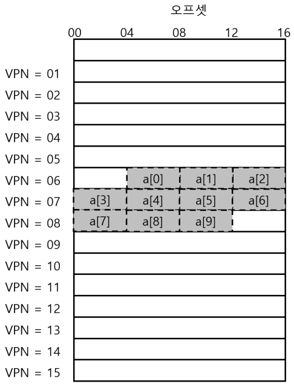
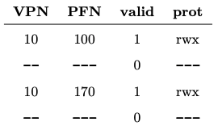
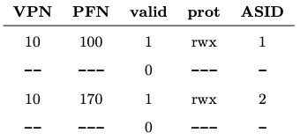
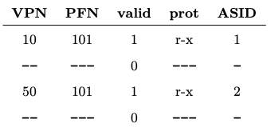
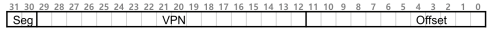
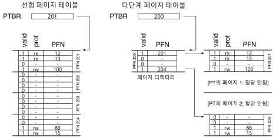

# 1. 페이징: 더 빠른 변환(TLB)
- 페이징은 주소 공간을 작은 크기(페이지)로 나누고 각 페이지의 실제 위치(매핑 정보)를 메모리에 저장한다. 매핑 정보를 저장하는 자료 구조를 페이지 테이블이라 한다.
- 페이징은 성능 저하를 유발할 수 있다. 
    - 가상 주소에서 물리 주소로의 주소 변환을 위해 메모리에 존재하는 매핑 정보를 읽어야 한다는 사실은 페이지 테이블 접근을 위한 메모리 읽기 작업이며 이는 엄청난 성능 저하를 유발한다.  

 
- 주소 변환을 빠르게 하기 위해서 우리는 <strong>변환-색인 버퍼(translation-lookaside buffer)</strong> 또는 <strong>TLB</strong>를 도입한다.
    - TLB는 칩의 <strong>메모리 관리부(memory-management unit, MMU)</strong>의 일부이다. 
    - 자주 참조되는 VirtualMemory-PhysicalMemory 변환 정보를 저장하는 하드웨어 캐시이다.
    - 가상 메모리 참조 시, 하드웨어는 먼저 TLB에 원하는 변환 정보가 있는지를 확인한다. 만약 있다면 페이지 테이블을 통하지 않고 변환을 빠르게 수행한다. 실질적으로 TLB는 페이징 성능을 엄청나게 향상시킨다.
    
## 1.1 TLB의 기본 알고리즘
- 주소 변환부는 단순한 <strong>선형 페이지 테이블</strong>(배열로 이루어진 페이지 테이블) 과 <strong>하드웨어로 관리되는 TLB</strong>로 구성되어 있다.
- 하드웨어 부분의 알고리즘은 다음과 같이 동작한다. (TLB Hit 과 Miss로 나뉨)
- TLB Hit
    1. 가상주소에서 가상 페이지 번호(virtual page nubmer, <strong>VPN</strong>)을 추출한 후, 해당 VPN을 TLB 존재 여부를 검사한다.
    2. 만약 존재한다면 <strong>TLB 히트</strong>이고 TLB가 변환 값을 갖고 있다는 것을 뜻한다.
    3. 해당 TLB 항목에서 페이지 프레임 번호(page fame number, PFN)을 추출한다.
    4. 해당 페이지에 대한 접근 권한 검사가 성공하면
    5. 그 정보를 원래 가상 주소의 오프셋과 합쳐서 원하는 물리 주소를 구성하고 메모리에 접근한다.
- TLB Miss
    1. 위의 2번에서 TLB Miss되면
    2. 하드웨어가 변환 정보를 찾기 위해서 페이지 테이블에 접근한다.
    3. 프로세스가 생성한 가상 메모리 참조가 유효하고 접근 가능하다면
    4. 해당 변환정보를 TLB로 읽어들인다.(시간이 많이 소요되는 작업, 테이블 접근을 위한 메모리 참조 때문)
    5. TLB가 갱신되면 하드웨어는 명령어를 재실행한다.
- TLB는 프로세싱 코어와 가까운 곳에 위치하고 있고, 매우 빠른 하드웨어로 구성되기 때문에, 주소 변환 작업은 그다지 부담스러운 작업이아니다.
- TLB 미스가 많이 발생할수록 메모리 접근 횟수가 많아진다.
    - TLB 미스가 발생하는 경우를 최대한 피해야 한다.
  
## 1.2 예제: 배열 접근

- 위의 그림과 같이 배열의 데이터가 저장되어 있다고 가정하자.
  - index 0부터 9까지 배열을 읽으면 index0을 읽을 때 TLB는 초기화 되어있기 때문에 TLB미스가 발생하고 VPN 06번 페이지를 TLB를 가져온다.
  - 이후 1번과 2번 index를 읽을 때는 TLB히트가 발생하여 바로 가져올 수 있다.
  - 다시 3번 index를 읽을 때는 TLB미스가 발생하여 VPN 07번 페이지를 TLB로 가져온다.

- 위의 예제를 통해 배열이 처음으로 접근되었지만, TLB는 <strong>공간 지역성</strong>으로 인해서 성능을 개선할 수 있다.
- 만약 TLB가 모든 주소 변환 정보를 저장할 정도로 충분히 크다면 히트, 히트, 히트, 히트, ... 히트 를 얻는다.
  - 이 경우에는 <strong>시간 지역성</strong>으로 인해 TLB의 히트율이 높아진다.
- 프로그램이 공간 혹은 시간 지역성을 보이는 경우, TLB 사용 효과가 더욱 두드러지게 나타날 것이다.

## 1.3 TLB 미스는 누가 처리할까
- TLB 미스의 처리는 두 가지 방법이 있다.
  - 하드웨어와 소프트웨어이다.
  
### CISC(complex-instruction set computers): TLB 미스를 하드웨어가 처리하도록 설계
- 이를 위해서 하드웨어가 페이지 테이블에 대한 명확한 정보를 가지고 있어야 한다.
  - 메모리 상 위치(<strong>page-table base register</strong>를 통해서)와 정확한 형식을 파악하고 있어야 한다.
- 미스 발생시 다음과 같은 일을 한다.
  1. 페이지 테이블에서 원하는 페이지 테이블 엔트리를 찾고
  2. 필요한 변환 정보를 추출하여
  3. TLB를 갱신한 후
  4. TLB 미스가 발생한 명령어를 재실행한다.
- x86 CPU가 하드웨어로 관리 되는 TLB의 대표적인 예다.
  - 멀티 레벨 페이지 테이블을 사용한다.
  
### RISC(reduced instruction set computing): 소프트웨어 관리 TLB 사용
- RISC 기반 컴퓨터에서 TLB 미스를 처리하는 과정은 다음과 같다.
  1. TLB에서 주소 찾는 것이 실패하면, 하드웨어는 예외 시그널을 발생시킨다.
  2. 예외 시그널을 받은 운영체제는 명령어 실행을 잠정 중지하고, 실행 모드를 커널 모드로 변경하여, 커널 코드 실행을 준비한다.
    - 실행 모드를 커널 모드로 변경하는 작업의 핵심은 커널 주소 공간을 접근할 수 있또록 특권 레벨(privilege level)로 상향 조정하는 것이다.
  3. 커널 모드로 변경이 되면 <strong>트랩 핸들러(trap handler)</strong>를 실행한다.
    - 이 때 실행되는 트랩 핸들러는 TLB 미스의 처리를 담당하는 운영체제 코드이다.
  4. 이 트랩 핸들러는 페이지 테이블을 검색하여 변환 정보를 찾고, TLB 접근이 가능한 "특권" 명령어를 사용하여 TLB를 갱신한 후에 리턴한다.
  5. 트랩 핸들러에서 리턴되면 하드웨어가 명령어를 재실행한다.

- TLB 미스를 처리하는 트랩 핸들러는 시스템 콜 호출 시 사용되는 트랩 핸들러와의 차이가 있다.
  - TLB 미스 처리의 경우 다음 명령어의 PC값을 트랩을 발생시킨 명령을 다시 실행해야한다.
- TLB 미스 핸들러를 실행할 때, TLB 미스가 무한 반복되지 않도록 주의해야 한다.

- TLB를 소프트웨어로 관리하는 방식의 주된 장점은 유연성과 단순함이다.

## 1.4 TLB의 구성: 무엇이 있나?
- TLB는 32, 64, 또는 128개의 엔트리를 가지며, <strong>완전 연관(fully associative)</strong> 방식으로 설계된다.
  - 완전 연관 방식에서 변환 정보는 TLB 내에 어디든 위치할 수 있으며, 원하는 변환 정보를 찾는 검색은 TLB 전체에서 병렬적으로 수행된다.
- TLB의 구성: VPN \ PFN \ offset(다른 비트들)
  - 하드웨어 측면에서 보자면, TLB는 <strong>완전 연관</strong> 캐시이다.
- TLB는 일반적으로 <strong>valid bit</strong>을 갖고 있다. 
  - 특정 항목이 유효한 변환 정보를 갖고 있는지 여부를 나타낸다.
- <strong>보호(protection)</strong>비트라는 것도 있다.
  - 보호 비트들은 페이지가 어떻게 접근될 수 있는지를 나타낸다.
- <strong>더티 비트(dirty bit)</strong>라는 것도 있다.
  - 페이지가 변경되었는지에 대한 정보를 가지고 있다.
  
## 1.5 TLB의 문제: 문맥 교환
- TLB에 있는 가상 주소와 실제 주소 간의 변환 정보는 그것을 탑재시킨 프로세스에서만 유효하다.
  - 새로운 프로세스에서는 이전에 실행하던 프로세스의 변환 정보를 사용하지 않도록 주의해야 한다.

- 위의 그림은 TLB의 예이다.(문제가 있음)
  - 하지만 위의 TLB에서는 VPN이 10이 두개가 있으며(process 1과 2의 가상 주소 10) 어떤 프로세스의 가상주소인지 확인할 수 없다.

- TLB가 정확하고 효율적으로 멀티 프로세스 간의 가상화를 지원하기 위해서는 추가적 기능이 필요하다.

- 한 방법은 문맥 교환을 수행할 때 다음 프로세스가 실행되기 전에 기존 TLB 내용을 비우는 것이다.
  - 하지만 TLB 내용이 비어지면 문맥 교체가 빈번히 발생되면 TLB 미스가 많아진다.
- 다른 방법은 TLB 내에 <strong>주소 공간 식별자(address space identifier, ASID)</strong> 필드를 추가하는 것이다.
  - ASID는 <strong>프로세스 식별자(process identifier, PID)</strong>와 대략적으로 유사하다.
  

- 위의 그림은 ASID가 추가된 TLB의 모습이다. 
  - ASID로 프로세스를 구분할 수 있게 됐다.

- ASID를 사용하면 코드 페이지를 위의 그림처럼 공유하여 프로세스가 사용하는 물리 페이지의 수를 줄일 수 있다.

## 1.6 이슈: 교체 정책
- 모든 캐시가 그러하듯이 TLB에서도 <strong>캐시 교체(cache replacement)</strong> 정책이 매우 중요하다.

- 한 가지 흔한 방법은 가장 오래 전부터 사용되었던 <strong>최저 사용 빈도(least-recently-used, LRU)</strong> 항목을 교체하는 것이다.
  - LRU는 메모리 참조 패턴에서의 지역성을 최대한 활용하는 것이 목적이다.
- 다른 방법은 랜덤(random) 정책이다.
  - 랜덤 정책에서는 교체 대상을 무작위로 정한다.
  - 랜덤 교체 정책은 구현이 간단하고 예상치 못한 예외 상황의 발생을 피할 수 있다는 장점이 있다.
  
## 1.7 요약
- 지금까지 주소 변환을 더 빠르게 처리하기 위한 하드웨어 기법에 대해 살펴보았따.
- TLB를 주소 변환 캐시로 사용하여 대부분의 메모리 참조들은 메인 메모리 상의 페이지 테이블을 읽지 않고도 처리가 가능하게 되었따.
- 프로그램이 짧은 시간 동안 접근하는 페이지들의 수가 TLB에 들어갈 수 잇는 수보다 많다면 TLB 미스를 발생할 것이고 느리게 동작하게 될 것이다.

# 2. 페이징: 더 작은 테이블
- 페이징의 두 번째 문제점은 페이지 테이블의 크기이다. 페이지 테이블이 크면 많은 메모리 공간을 차지한다.
  - 단순한 배열 기반의 페이지 테이블은(흔히 선형 페이지 테이블이라고 불림) 크기가 크며 일반적인 시스템에서 메모리를 과도하게 차지한다.

## 2.1 간단한 해법: 더 큰 페이지
- 페이지 테이블의 크기를 간단하게 줄일 수 있는 방법이 한 가지 있다.
  - 페이지 크기를 증가시키면 된다.
- 하지만 페이지 크기의 증가는 부작용을 수반한다.
  - 가장 큰 문제는 페이지 내부의 낭비 공간이 증가하는 것이다.
  - 이를 <strong>내부 단편화</strong>라 한다(할당된 페이지 <strong>내부</strong>에서 낭비가 발생하기 때문이다).
  
## 2.2 하이브리드 접근 방법: 페이징과 세그멘트
- 페이징과 세그멘테이션을 결합하여 페이지 테이블 크기를 줄이는 아이디어가 있다.
- 결합 방식을 생각해 보자. 프로세스의 전체 주소 공간을 위해 하나의 페이지 테이블을 두는 대신, 논리 세그멘트마다 따로 페이지 테이블을 두면 어떨까?
  - 코드, 힙 그리고 스택 세그멘트에 대해 페이지 테이블을 각각 두는 것이다.
  - 세그멘트와 비슷하게 <strong>베이스</strong> 레지스터와 <strong>바운드</strong> 또는 <strong>리미트</strong> 레지스터를 사용하여 페이지 테이블의 시작과 끝을 나타낸다.
  

- 위의 그림은 페이징과 세그먼트를 이용한 주소 공간이다.
  - 상위 2비트를 소속 세그멘트를 나타내기 위해 사용한다.

- 하지만, 하이브리드 접근 방법 또한 문제가 있다.
  - 여전히 세그멘테이션을 사용한다 ; 빈 공간이 많은 힙의 경우에는 테이블의 낭비를 면치 못할 수가 있다.
  - 하이브리드 기법은 외부 단편화를 유발한다.
  
## 2.3 멀티 레벨 페이지 테이블
- <strong>멀티 레벨 페이지 테이블</strong>에서는 선형 페이지 테이블을 트리 구조로 표현한다.
- 멀티 레벨 페이지 테이블의 기본 개념은 간단하다.
  1. 먼저, 페이지 테이블을 페이지 크기의 단위로 나눈다.
  2. 그다음, 페이지 테이블의 페이지가 유효하지 않은 항목만 있으면, 행당 페이지를 할당하지 않는다.
- <strong>페이지 디렉터리(page directory)</strong>라는 자료 구조를 사용하여 페이지 테이블 각 페이지의 할당 여부와 위치를 파악한다.
  - 페이지 디렉터리는 페이지 테이블을 구성하는 각 페이지의 존재 여부와 위치 정보를 가지고 있다.
  

- 위의 그림은 선형 테이블과 멀티 레벨 페이지 테이블이다.
- 간단한 2단계 테이블에서, 페이지 디렉터리의 각 항목은 페이지 테이블의 한 페이지를 나타낸다.
  - 페이지 디렉터리는 <strong>페이지 디렉터리 항목(page directory entries, PDE)</strong>들로 구성된다.
  - <strong>유효(valid)</strong> 비트와 <strong>페이지 프레임 번호(page frame number, PFN)</strong>을 갖고 있다.

- 멀티 레벨 페이지 테이블의 장점
  - 사용된 주소 공간의 크기에 비례하여 페이지 테이블 공간이 할당된다.
    - 보다 작은 크기의 페이지 테이블로 주소 공간을 표현할 수 있다.
  - 페이지 테이블을 페이지 크기로 분할함으로써 메모리 관리가 매우 용이하다.
    - 페이지 테이블을 할당하거나 확장할 때, 운영체제는 free페이지 풀에 잇는 빈 페이지를 가져다 쓰면 된다.
  - 페이지 테이블의 각 페이지들이 물리 메모리에 산재해 있더라도 페이지 디렉터리를 이용하여 그 위치를 파악할 수 있으므로 ,페이지 테이블을 위한 공간 할당이 매우 유연하다.
- 멀티 레벨 페이지 테이블의 유의 사항
  - TLB 미스 시, 주소 변환을 위해 두 번의 메모리 로드가 발생하여 추가 비용이 발생한다.
  - 복잡도
  