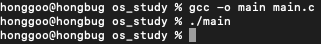
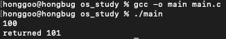
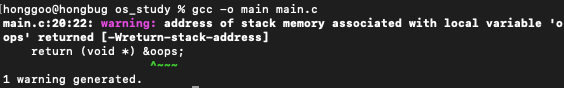
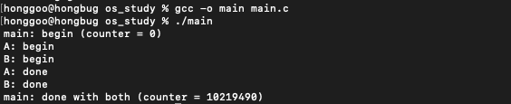
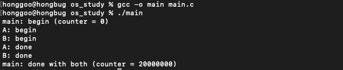

# 1. 쓰레드 API
- 쓰레드 API의 주요 부분을 간략하게 사용해보고 결과를 확인해볼 것이다.
- 생성, 종료, 락 세가지에 대해서 사용해 볼 것이다.

## 1.1 쓰레드 생성

### 쓰레드 생성



    #include <stdio.h>
    #include <pthread.h>
    
    typedef struct {
        int a;
        int b;
    } myarg_t;
    
    void *mythread(void *arg) {
        myarg_t *args = (myarg_t *) arg;
        printf("%d %d\n", args->a, args->b);
        return NULL;
    }
    
    int main(int argc, char *argv[]) {
        pthread_t p;
        myarg_t args = {10, 20};
        
        int rc = pthread_create(&p, NULL, mythread, &args);
    }


- 위의 코드는 쓰레드를 생성하는 코드이다. 하지만, 실행했을 때 args가 출력되지 않는 것을 볼 수 있다.
    - 이 이유는 쓰레드가 생성했지만, 쓰레드 실행 전에 메인 쓰레드인 main() 문이 종료되었기 때문이다.
    
## 1.2 쓰레드 종료

### 쓰레드 종료 기다리기



    #include <stdio.h>
    #include <pthread.h>
    
    typedef struct {
        int a;
        int b;
    } myarg_t;
    
    void *mythread(void *arg) {
        myarg_t *args = (myarg_t *) arg;
        printf("%d %d\n", args->a, args->b);
        return NULL;
    }
    
    int main(int argc, char *argv[]) {
        pthread_t p;
        myarg_t args = {10, 20};
        
        int rc = pthread_create(&p, NULL, mythread, &args);
        pthread_join(p, (void**)&args);
    }


- pthread_join 문을 추가하여 부모 쓰레드인 main에게 자식 쓰레드인 p가 종료할 때 까지 기다리라고 지시했다.
    - 결과는 args인 10과 20이 잘 출력되는 모습을 볼 수 있다.
    
### 쓰레드에게 간단한 인자 전달하기



    #include <stdio.h>
    #include <pthread.h>
    
    typedef struct { int x; int y; } myarg_t;
    typedef struct { int x; int y; } myret_t;
    
    void *mythread(void *arg) {
        long long int value = (long long int) arg;
        printf("%lld\n", value);
        return (void *) (value + 1);
    }
    
    int main (int argc, char *argv[]) {
        pthread_t p;
        long long int rvalue;
        pthread_create(&p, NULL, mythread, (void *)100);
        pthread_join(p, (void **) &rvalue);
        printf("returned %lld\n", rvalue);
        return 0;
    }


- 위의 코드는 쓰레드에게 간단한 인자를 전달하는 코드이다.
    - 결과로 100이 출력되고 101이 잘 리턴 된 것을 볼 수 있다.
    
### 쓰레드에게 간단한 인자 전달하기(잘못된 방법)



    #include <stdio.h>
    #include <pthread.h>
    
    typedef struct { int x; int y; } myarg_t;
    typedef struct { int x; int y; } myret_t;
    
    void *mythread(void *arg) {
        myarg_t *args = (myarg_t *) arg;
        printf("%d %d\n", args->x, args->y);
        myret_t oops;
        oops.x = 1;
        oops.y = 2;
        return (void *) &oops;
    }
    
    int main (int argc, char *argv[]) {
        pthread_t p;
        long long int rvalue;
        pthread_create(&p, NULL, mythread, (void *)100);
        pthread_join(p, (void **) &rvalue);
        printf("returned %lld\n", rvalue);
        return 0;
    }


- 위의 코드에서는 리턴되는 값을 스택에 할당했기 때문에 에러가 발생하는 것을 볼 수 있다.
    - 스택에 할당되면 해당 값은 쓰레드가 리턴할 때 자동적으로 해제된다.
    - 해제된 변수를 가리키는 포인터를 반환하는 것은 좋지 않은 결과를 가져온다.
    
## 1.3 락

### 락이 없는 코드의 문제점



    #include <stdio.h>
    #include <pthread.h>
    
    static volatile int counter = 0;
    
    // mythread()
    // 반복문을 사용하여 단순히 1씩 더하기
    // 10,000,000을 변수 counter에 더하는 방법이 아니다.
    // 하지만, 문제가 무엇인지 명확하게 해준다.
    void *mythread(void *arg) {
        printf("%s: begin\n", (char *) arg);
        int i;
        for (i=0; i < 1e7; i++){
            counter = counter + 1;
        }
        printf("%s: done\n", (char *) arg);
        return NULL;
    }
    
    // main()
    // 두 개의 쓰레드를 실행하고 (pthread_create)
    // 대기한다 (pthread_join)
    int main (int argc, char *argv[]) {
        pthread_t p1, p2;
        printf("main: begin (counter = %d)\n", counter);
        pthread_create(&p1, NULL, mythread, "A");
        pthread_create(&p2, NULL, mythread, "B");
        // 종료할 수 있도록 대기 중인 쓰레드 병합하기
        pthread_join(p1,NULL);
        pthread_join(p2,NULL);
        printf("main: done with both (counter = %d)\n", counter);
        return 0;
    }


- 위의 코드는 락이 없을 때 임계 영역에 두 쓰레드가 동시 접근을 하게 되어 예상한 결과값인 20000000이 나오지 않는 모습을 볼 수 있다.
    - 예상한대로 코드를 실행시키기 위해 락을 추가하여 임계 영역을 보호해준다.
    
### 락을 사용한 코드



    #include <stdio.h>
    #include <pthread.h>
    #include <assert.h>
    
    static volatile int counter = 0;
    pthread_mutex_t mutex_lock;
    
    // mythread()
    // 반복문을 사용하여 단순히 1씩 더하기
    // 10,000,000을 변수 counter에 더하는 방법이 아니다.
    // 하지만, 문제가 무엇인지 명확하게 해준다.
    void *mythread(void *arg) {
        printf("%s: begin\n", (char *) arg);
        pthread_mutex_lock(&mutex_lock);
        int i;
        for (i=0; i < 1e7; i++){
            counter = counter + 1;
        }
        pthread_mutex_unlock(&mutex_lock);
        printf("%s: done\n", (char *) arg);
        return NULL;
    }
    
    // main()
    // 두 개의 쓰레드를 실행하고 (pthread_create)
    // 대기한다 (pthread_join)
    int main (int argc, char *argv[]) {
        pthread_t p1, p2;
        printf("main: begin (counter = %d)\n", counter);
        int rc = pthread_mutex_init(&mutex_lock,NULL);
        assert(rc == 0);
        pthread_create(&p1, NULL, mythread, "A");
        pthread_create(&p2, NULL, mythread, "B");
        // 종료할 수 있도록 대기 중인 쓰레드 병합하기
        pthread_join(p1,NULL);
        pthread_join(p2,NULL);
        printf("main: done with both (counter = %d)\n", counter);
        return 0;
    }


- 위의 코드는 락을 추가하여 임계 영역을 보호해주었다.
    - 결과로는 우리가 예상한 20000000이 출력되는 것을 확인할 수 있다.

### 위의 코드에서 시간 비교를 해보자!
두개의 쓰레드를 사용하고 counter에 접근할 때 락을 이용하여 임계 영역을 보호한다. 이 말의 의미는 A 쓰레드와 B 쓰레드가 차례로 번갈아가면서 counter에 접근한다는 의미가 된다.
그렇다면 이런 경우에서는 굳이 멀티 쓰레드를 사용할 필요가 있을까? 궁금한건 못참는다!! 바로 해보자!! 

위의 락을 사용한 코드에서 코드의 실행시간을 계산하는 코드를 추가하고, 쓰레드를 두개 사용하는 경우와 하나를 사용하는 경우로 나누어 실험을 진행하였다. 또한 캐시 때문에 실행시간에 차이가 있을 수 있어서 5번씩 실행한 결과로 비교를 하였다.
추가적으로 연산횟수룰 20억으로 늘려서 진행하였다.

- 위는 멀티쓰레드, 아래는 단일쓰레드다. 결과를 봤을 땐 단일쓰레드가 아주 미세하게 더 빠르다는 것을 확인할 수 있다.

왜 이런 결과가 나왔을까? count에 접근하는 해당 로직은 사실상 사실상 멀티 쓰레드를 이용해도 두개의 쓰레드가 차례로 번갈아가면서 counter에 접근한다. 단일 쓰레드를 사용했을 때와 마찬가지인 것이다.
하지만 락에 의해서 지연이 조금 늘어나게 되고 이를 통해서 단일쓰레드보다 멀티쓰레드가 성능이 더 저하되는 것이다.

