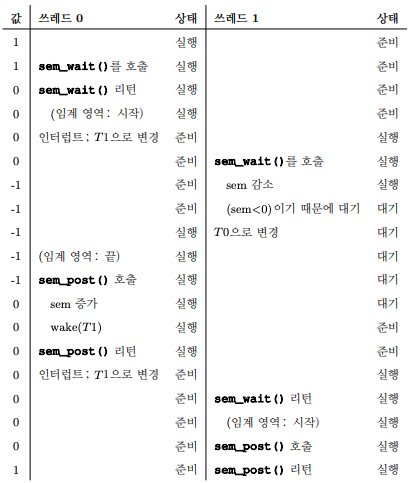
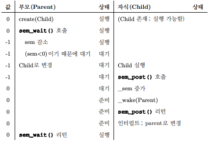
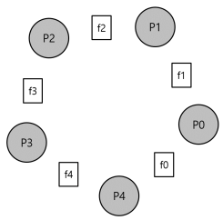

# 1. 세마포어(semaphore)
- 세마포어는 락과 컨디션 변수로 모두 사용할 수 있다.
- 세마포어를 어떻게 사용하는가?
    - 락과 컨디션 변수 대신에 세마포어를 사용하는 방법은 무엇인가?
    - 세마포어의 정의는 무엇인가?
    - 이진 세마포어는 무엇인가?
    - 락과 컨디션 변수를 사용하여 세마포어를 만드는 것이 가능한가?

## 1.1 세마포어: 정의
- 세마포어는 정수 값을 갖는 객체로서 두 개의 루틴으로 조작할 수 있다.
    - POSIX 표준에서 이 두 개의 루틴은 sem_wait()와 sem_post()이다.
    - 세마포어는 초기값에 의해 동작이 결정되기 때문에, 사용하기 전 "제일 먼저" 값을 초기화해야 한다.
    

    #include <semaphore.h>
    sem_t s;
    sem_init(&s, 0, 1);


- 3번째 인자로 1을 전달하여 세마포어의 값을 1로 초기화한다.
- 2번째 인자는 0인데, 같은 프로세스 내의 쓰레드 간에 세마포어를 공유한다는 것을 의미한다.


    int sem_wait(sem_t *s){
        decrement the value of semaphore s by one;
        wait if value of semaphore s is negative;
    }
    int sem_post(sem_t *s){
        increment the value of semaphore s by one;
        if there are one or more threads waiting, wake one;
    }

- 세마포어: sem_wait()과 sem_post()의 정의이다.
- sem_wait()
    - 함수는 즉시 리턴하거나(세마포어의 값이 1 이상이면) 아니면 해당 세마포어 값이 1 이상이 될 때 까지 호출자를 대기시킨다.
    - 다수의 쓰레드들이 sem_wait()을 호출할 수 있기 때문에, 대기큐에는 다수의 쓰레드가 존재할 수 있다.(대기하는 법에는 회전과 재우기의 두 가지가 있다.)
- sem_post()
    - 함수는 대기하지 않는다.
    - 세마포어 값을 증가시키고 대기 중인 쓰레드 중 하나를 깨운다.
- 세마포어가 음수라면 그 값은 현재 대기 중인 쓰레드의 개수와 같다.
- 이 두개의 함수는 원자적으로 실행된다고 가정한다.

## 1.2 이진 세마포어(락)

    sem_t m;
    sem_init(&m, 0, 1);
    sem_wait(&m);
    // 임계 영역 부분은 이곳에 배치
    sem_post(&m);

- 위의 코드는 이진 세마포어이다.

- 위의 그림은 이진 세마포어를 사용하는 두 개의 쓰레드의 흐름이다.

## 1.3 순서 보장을 위한 세마포어
- 자식이 끝나기를 기다리는 부모 쓰레드의 대기를 위해서 세마포어를 어떻게 사용할까


    sem_t s;
    
    void *child(void *arg){
        printf("child\n");
        sem_post(&s);
        return NULL;
    }
    
    int main(int argc, char *argv[]){
        sem_init(&s, 0, 0);
        printf("parent: begin\n");
        pthread_t c;
        pthread_create(c, NULL, child, NULL);
        sem_wait(&s);
        printf("parent: end\n");
        return 0;
    }


- 이경우에는 세마포어의 초기값을 0으로 해야한다. 부모 쓰레드가 자식 쓰레드를 생성하고 자식 쓰레드가 아직 실행하지 않을 경우에도 부모 쓰레드는 대기해야한다. 
  그렇기 때문에 0으로 초기화하면 부모 쓰레드는 wait을 만나자마자 -1로 인해 대기된다. 이후 자식이 실행되면 세마포어의 값을 0으로 올려주고 부모가 실행할 수 있는 조건이 만족된다.

## 1.4 생산지/소비자(유판 버퍼) 문제
- 세마포어로 생산자/소비자를 구현하기 위해선 세가지 기법이 필요하다.
    1. full, empty 조건 추가(두개의 세마포어 값을 사용한다.)
    2. 상호 배제 추가하기
    3. 교착 상태 방지
    
### full, empty 조건 추가
- 생산자는 소비자의 세마포어에만 영향을 주어야하고, 반대로 소비자는 생산자의 세마포어에만 영향을 주어야한다.
    - 그렇기 때문에 생산자는 empty를 wait하고 full을 post한다.
    - 소비자는 full을 wait하고 empty를 post한다.
    - 생산자는 empty 락을 획득해야지 값들을 버퍼에 추가할 수 있으며, 버퍼가 다차면 소비자에게 락을 전달해 버퍼에 값을 소비하라고 요청해야한다.
    - 소비자는 full 락을 획득해야지 버퍼에 있는 값들을 소비할 수 있으며, 버퍼가 비게 되면 생산자에게 락을 전달해 버퍼에 값을 넣어달라고 요청해야한다.
    
### 상호 배제의 추가
- 두 개의 생산자 pa, pb가 동시에 put()을 호출하게 되면 pa가 버퍼에 값을 넣고 fill 카운터 변수를 1로 증가시키기 전에 인터럽트가 발생하고 pb가 이어서 같은 버퍼 공간에 값을 덮어 쓰게 된다.
- 버퍼를 채우고 버퍼에 대한 인덱스를 증가하는 해당 동작은 임계 영역이 된다.
- 아래의 코드와 같이 락을 put()과 get() 앞 뒤로 추가해준다.

    void *producer(void *arg){
        int i;
        for(i=0; i<loops; i++){
            sem_wait(&mutex);
            sem_wait(&empty);
            put(i);
            sem_post(&full);
            sem_post(&mutex);
        }
    }
    
    void *consumer(void *arg){
        int i;
        for(i=0; i<loops; i++){
            sem_wait(&mutex);
            sem_wait(&full);
            int tmp = get();
            sem_post(&empty);
            sem_post(&mutex);
            printf("%d\n", tmp);
        }
    }

- 하지만 위의 코드는 교착상태로 인해 코드가 동작하지 않는다.

### 교착 상태의 방지
- 생산자와 소비자 쓰레드 중 소비자가 먼저 실행되었다. mutex를 획득 후 full 변수에 대하여 sem_wait()을 호출한다. 버퍼가 비어있다. 소비자는 대기모드로 전환된다. CPU를 양보하게 되는데
여기서 중요한 것은 소비자가 아직 mutex 락을 보유하고 있기 때문에 생산자는 실행할 수 없다.
- 이를 해결하기 위해서 mutex의 순서를 아래와 같이 변경해준다.

    void *producer(void *arg){
        int i;
        for(i=0; i<loops; i++){
            sem_wait(&empty);
            sem_wait(&mutex);
            put(i);
            sem_post(&mutex);
            sem_post(&full);
        }
    }
    
    void *consumer(void *arg){
        int i;
        for(i=0; i<loops; i++){
            sem_wait(&full);
            sem_wait(&mutex);
            int tmp = get();
            sem_post(&mutex);
            sem_post(&empty);
            printf("%d\n", tmp);
        }
    }

  
## 1.5 Reader-Writer 락
- 다양한 자료구조를 접근할 때, 각 자료 구조의 특성과 접근 방식을 적절히 고려한 여러 종류의 락 기법이 필요하다.
- 다수의 쓰레드가 연결 리스트에 노드를 삽입하고 검색을 하는 상황을 가정해보자.
    - 삽입 연산이 없다는 보장만 된다면, 다수의 검색 작업을 동시에 수행할 수 있다.(삽입은 리스트를 변경하기 때문에 임계영역이 된다.)
    - 이와 같은 경우를 위해 만들어진 락이 <strong>reader-writer 락</strong>이다.
- 자료구조를 "갱신" 하려면 배타적 접근권한을 갖는 락을 사용한다.
- 읽기 락은 동시에 여러 쓰레드가 락을 보유할 수 있다.
- 읽기 락을 획득시 ㅈritelock 세마포어에 대해 sem_wait()을 호출하여 쓰기 락을 함께 획득한다.
    - 획득한 쓰기 락은 읽기 락을 해제할 때 sem_post()로 다시 해제한다.
- 쓰기 락을 획득하려는 쓰기 쓰레드들은 모든 읽기 쓰레드가 끝날 때 까지 대기하여야 한다.

## 1.6 식사하는 철학자

- 철학자 p0~p4 가 양쪽에 있는 포크 f0~f4를 양 손으로 들고 내려두는 행동을 모든 철학자가 할 수 있도록 코드를 작성해야한다.
    - 이 포크를 잡기 위한 경쟁과 그에 따른 동기화 문제가 병행 프로그래밍에서 다루려는 식사하는 철학자 문제이다.

### 불완전한 해답

    void get_forks(int p){
        sem_wait(fork->left(p))
        sem_wait(fork->right(p))
    }
    void put_forks(int p){
        sem_post(fork->left(p))
        sem_post(fork->right(p))
    }

- 위와 같은 코드로 순서대로 왼쪽 포크와 오른쪽 포크를 한 사람씩 든다고 가정해보자.
- 간단히 해결될 것 같아도, 1번 철학자가 f1을 든 상황에서 인터럽트가 발생하고, 2번 철학자가 f2를 들게 된다면, 1번 철학자는 f2를 들지 못해 락을 반납하지 못하고 교착 상태에 빠지게 된다.

### 해답: 의존성 제거
- 이 문제를 해결하기 위한 가장 간단한 방법은 최소한 하나의 철학자가 다른 순서로 포크를 집도록 하면 된다.

    void get_forks(int p){
        if(p==4){
            sem_wait(fork->right(p))
            sem_wait(fork->left(p))
        }
        sem_wait(fork->left(p))
        sem_wait(fork->right(p))
    }

- 한번 그림을 그려보며 어떻게 동작하는지 확인해보자!

## 1.7 쓰레드 제어
- 문제: "과도하게 많은" 쓰레드가 동시에 수행되면 시스템의 효율이 매우 나빠진다.
- 정답: "과도하게 많은" 에 임계값을 정하고, 세마포어를 사용하여 문제가 되는 코드를 동시에 실행하는 쓰레드 개수를 제한한다.
- 우리는 이 접근법을 <strong>제어(throttling)</strong>라고 부르며 <strong>수락 제어</strong>의 한 형태로 간주한다.

## 1.8 세마포어 구현
- 저수준 동기화 기법인 락과 컨디션 변수를 사용하여 우리만의 세마포어를 만들어 본다.

    void struct __Zem_t{
        int value;
        ptrhead_cond_t cond;
        pthread_mutex_t lock;
    } Zem_t;
    
    // 오직 하나의 쓰레드만 이 문장을 호출할 수 있음
    void Zem_init(Zem_t *s, int value){
        s->value = value;
        cond_init(&s->cond);
        Mutexinit(&s->lock);
    }
  
    void Zem_wait(Zem_t *s){
        Mutex_lock(&s->lock);
        while (s->value <= 0)
            Cond_wait(&s->cond, &s->lock);
        s->value--;
        Mutex_unlock(&s->lock);
    }
    
    void Zem_post(Zem_t *s){
        Mutex_lock(&s->lock);
        s->value++;
        Cond_signal(&s->cond);
        Mutex_unlock(&s->lock);
    }

