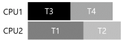

# 1. 병행성 관련 버그
- 핵심 질문: 일반적인 병행성 관련 오류들을 어떻게 처리하는가
    - 병행성 버그는 몇 개의 전형적인 패턴을 갖고 있다.
    - 튼튼하고 올바른 병행 코드를 작성하기 위한 가장 첫 단계는 어떤 경우들을 피해야 할지 파악하는 것이다.

## 1.1 오류의 종류
- 오류의 종류는 교착 상태 관련 오류와 비 교착 상태 관련 오류로 나뉜다.

## 1.2 비 교착 상태 오류
- 대표적인 오류는 <strong>원자성 위반(atomicity violation)</strong> 오류와 <strong>순서 위반(order violation)</strong>이다.

### 원자성 위반 오류

    Thread 1::
    if (thd−>proc_info) {
        fputs(thd−>proc_info, . . . ) ;
    }
    
    Thread 2::
    thd−>proc_info = NULL;

- 위의 코드에서 문제점을 확인해보자
    - 첫 번째 쓰레드가 검사를 완료한 후 fputs를 호출하기 전에 인터럽트로 인해서 두 번째 쓰레드가 그 사이에 실행될 수가 있다.
    - 두 번째 쓰레드가 실행되면 필드이ㅡ 값을 NULL로 설정하기 때문에 fputs 함수는 NULL 포인터 역참조를 하게 되어 프로그램은 크래시될 것이다.
- 원자성 위반에 대한 정의: "다수의 메모리 참조 연산들 간에 있어 예상했던 직렬성(serializability)이 보장되지 않았다!"
- 해결책은 공유 변수 참조 앞뒤에 락을 추가하는 것이다.


    pthread_mutex_lock(&mutex)
    Thread 1::
    if (thd−>proc_info) {
        fputs(thd−>proc_info, . . . ) ;
    }
    pthread_mutex_unlock(&mutex)
    
    Thread 2::
    pthread_mutex_lock(&mutex)
    thd−>proc_info = NULL;
    pthread_mutex_unlock(&mutex)


### 순서 위반 오류

    Thread 1::
    void init() {
        mThread = PR_CreateThread(mMain, . . . ) ;
    }
    Thread 2::
    void mMain ( . . . ) {
        mState = mThread−>State;
    }

- 위의 코드에서 문제점을 확인해보자
    - 쓰레드 2의 코드는 mThread 변수가 이미 초기화가 된 것을 가정하고 있다.
    - 하지만, 만약 쓰레드 1이 먼저 실행되지 않았다면 쓰레드 2는 NULL 포인터를 사용하기 때문에 크래시될 것이다.
- 순서 위반의 공식 정의: "두 개의(그룹의) 메모리 참조 간의 순서가 바뀌었다."
- 해결책은 <strong>컨디션 변수</strong>를 사용한다.

    Thread 1::
    void init() {
        mThread = PR_CreateThread(mMain, . . . ) ;
        pthread_mutex_lock(&mtLock);
        mtInit = 1;
        pthread_cond_signal(&mtCond);
        pthread_mutex_unlock(&mtLock);
    }
    Thread 2::
    void mMain ( . . . ) {
        pthread_mutex_lock(&mtLock);
        while (mtInit == 0)
            pthread_cond_wait(&mtCond, &mtLock);
        pthread_mutex_unlock(&mtLock);
        mState = mThread−>State;
    }

  
## 1.3 교착 상태 오류
- 복잡한 락 프로토콜을 사용하는 다수의 병행 시스템에서 <strong>교착 상태(deadlock)</strong>라는 고전적 문제가 발생한다.
    - 예를 들어 락 L1을 갖고 있는 쓰레드1이 또 다른 락 L2를 기다리는 상황에서 불행하게도 락 L2를 갖고 있는 쓰레드2가 락 L1이 해제되기를 기다리고 있을 때 교착 상태가 발생한다.

- 위의 그림은 교착 상태 의존성 그래프이다.

### 교착 상태는 왜 발생하는가
- 한가지 이유는 코드가 많아지면서 구성 요소 간에 복잡한 의존성이 발생하기 때문이다.
- 코드 상에서 자연스럽게 존재하는 순환 의존성이 교착 상태를 야기시키는 것을 방지하기 위해서 대형 시스템의 락 사용 전략의 설계는 매우 신중해야 한다.
- 또 다른 이유는 <strong>캡슐화(encapulation)</strong>의 성질 때문이다.
    - 모듈화와 락은 잘 조화되지 않는다.
    
### 교착 상태 발생 조건
교착 상태가 발생하기 위해서는 네 가지 조건이 충족되어야 한다.
- <strong>상호 배제(Mutual Exclusion)</strong>: 쓰레드가 자신이 필요로 하는 자원에 대한 독자적인 제어권을 주장한다.
- <strong>점유 및 대기(Hold-and-wait)</strong>: 쓰레드가 자신에게 할당된 자원을 점유한 채로 다른 자원을 대기한다.
- <strong>비 선점(No preemption)</strong>: 자원(락)을 점유하고 있는 쓰레드로부터 자원을 강제적으로 빼앗을 수 없다.
- <strong>순환 대기(Circular wait)</strong>: 각 쓰레드는 다음 쓰레드가 요청한 하나 또는 그 이상의 자원(락)을 갖고 있는 쓰레드들의 순환 고리가 있다.

### 교착 상태의 예방
- <strong>순환 대기</strong>
    - 가장 실용적이고 교착 상태 예방 기법은 순환 대기가 절대 발생하지 않도록 락에 관련된 코드를 작성하는 것이다.
    - 간단한 방법은 락 획득을 하는 <strong>전체 순서</strong>를 정하는 것이다.
        - ex) L1을 획득하고 L2를 획득해야 한다.
    - <strong>부분 순서</strong>만을 정의할 수도 있다.
    - 락의 순서를 결정하기 위해서는 다양한 루틴 간의 상호 호출 관계를 이해해야 한다.
- <strong>점유 및 대기</strong>
    - 교착 상태가 발생하는 조건인 점유 및 대기는 원자적으로 모든 락을 단번에 획득하도록하면 예방할 수 있다.
    - 락을 획득하는 과정 중에 쓰레드의 문맥 교환이 발생하는 것을 방지하고, 결과적으로 교착 상태의 발생 가능성을 차단한다.
    - 락이 실제 필요할 때 요청하는 것이 아니라 미리 모든 락을 획득하기 때문에 병행성이 저하되는 문제도 있다.
- <strong>비선점(No Preemption)</strong>
    - 락은 한번 획득하게 되면 이를 명시적으로 반납하기 전까지는 락을 보유하고 있는 것이 된다.
    - 때문에 여러개의 락을 보유한 상태에서 추가로 락을 요청할 경우 문제발생의 소지가 있다.
    - pthread_mtex_trylock() 루틴을 사용해서 해결한다.
- <strong>상호 배제(Mutual Exclusion)</strong>
    - 상호 배제 자체를 없애는 방법이다. 일반적 코드는 모두 임계 영역을 포함하고 있기 때문에 어려운 일이다.
    - <strong>락이 없는(lock-free)</strong> 자료 구조 접근법의 아이디어는 간단하다.
        - 강력한 하드웨어 명령어를 사용하면 명시적인 락킹이 필요 없이도 접근할 수 있는 자료구조를 만들 수 있다.
    - 락을 획득하여 값을 갱신한 후에 락을 해제하는 대신, Compare-And-Swap 명령어를 사용하여 값에 새로운 값을 갱신하도록 반복적으로 시도한다.
        - 이와 같은 방식을 사용하면 락을 획득할 필요가 없으며 교착 상태가 발생할 수도 없다.
    
### 스케줄링으로 교착 상태 회피하기
- 어떤 시나리오에서는 교착 상태를 예방하는 대신 <strong>회피</storng>하는 것이 더 유용할 때가 있다.
- 회피하기 위해서는 실행 중인 여러 쓰레드가 어떤 락을 획득하게 될 것인지에 대해 전반적으로 파악하고 있어야 하며 그것을 바탕으로 쓰레드들은 스케줄링하여 교착 상태가 발생하지 않도록 그때그때 보장한다.

- 위의 스케줄을 스케줄링 한다면 다음과 같다.

- 하지만 병행성에 제약을 가져 올 수도 있기 때문에 스케줄링으로 교착 상태를 회피하는 것은 보편적으로 사용되는 방법은 안디ㅏ.

### 발견 및 복구
- 마지막 전략은 교착 상태 발생을 허용하고, 교착 상태를 발견하면 복구토록 하는 방법이다.
- 많은 데이터베이스 시스템들이 교착 상태를 발견하고 회복하는 기술을 사용한다.

## 1.4 요약
- 비 교착 상태 오류는 상당히 흔하지만 대체적으로 고치기 쉬운 오류들이다.
    - 원자성 위반이나 순서 위반 오류를 포함한다.
- 교착 상태 오류의 가장 좋은 해법은 조심하는 것과 락 획득 순서를 정해서 애초에 교착 상태가 발생하지 않도록 예방하는 것이다.