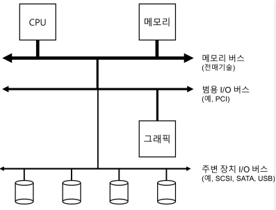
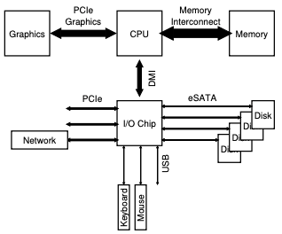
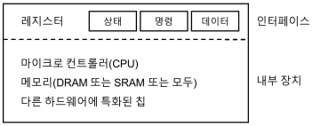
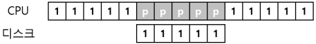
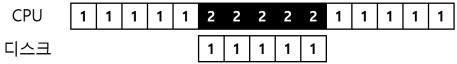
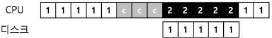
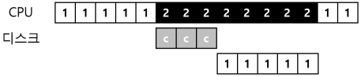

# 1. I/O 장치
I/O는 컴퓨터 시스템에서 상당히 중요한 부분이다.
- 시스템에 I/O를 어떻게 통합해야 하는가?
- 일반적인 방법은 무엇인가?
- 어떻게 효율적으로 통합할 수 있을까?

## 1.1 시스템 구조
- CPU와 주메모리가 <strong>메모리 버스</strong>로 연결되어 있다.
- 몇가지 장치들이 범용 <strong>I/O 버스</strong>에 연결이 되어 있는데, 많은 현대의 시스템에서는 <strong>PCI</strong>(또는 다른 파생된 형태의 버스)를 사용하고 있다.
    - 그래픽이나 다른 고성능 I/O 장치들이 여기에 연결될 수 있다.
- 그 아래에는 <strong>SCSI</strong>나 <strong>SATA</strong> 또는 <strong>USB</strong>와 같은 <strong>주변장치용 버스</strong>가 있다.
    - 이 버스들을 통해 <strong>디스크, 마우스, 키보드</strong>와 같은 느린 장치들이 연결된다.
    

- 위의 그림은 시스템 구조 모형이다.

- 위의 그림은 현대 시스템의 구조이다.

## 1.2 표준 장치
- 장치를 효율적으로 활용하기 위해 필요한 것은 무엇인지 알아보자.
    1. 시스템의 다른 구성 요소에게 제공하는 하드웨어 <strong>인터페이스</strong>이다.
        - 소프트웨어가 인터페이스를 제공하듯이 하드웨어도 인터페이스를 제공하여 시스템 소프트웨어가 동작을 제어할 수 있도록 해야 한다.
    2. <strong>내부 구조</strong> 또한 갖고 있어야 한다.
    

- 위의 그림은 표준 장치이다.

## 1.3 표준 방식
- 위에서 봉본 그림에서 (단순화된) 장치의 인터페이스는 세 개의 레지스터로 구성되어 있다.
    - <strong>상태(status)</strong> 레지스터는 장치의 현재 상태를 읽을 수 있다.
    - <strong>명령어(command)</strong> 레지스터는 장치가 특정 동작을 수행하도록 요청할 때 사용 된다.
    - <strong>데이터(data)</strong> 레지스터는 장치에 데이터를 보내거나 받거나 할 때 사용한다.
    - 이 레지스터들을 읽거나 쓰는 것을 통해 운영체제는 장치의 동작을 제어할 수 있다.
    
- 운영체제와 장치 간에 일어날 수 있는 상호 동작의 과정
    1. 먼저 반복적으로 장치의 상태 레지스터를 읽어 명령의 수신 가능 여부를 확인한다.
        - 이 동작을 장치에 대해 <strong>폴링(polling)</strong> 한다고 표현한다.
    2. 운영체제가 데이터 레지스터에 어떤 데이터를 전달한다.
        - 데이터 전송에 메인 CPU가 관여하는 경우를 <strong>programmed I/O</strong> 라고 한다.
    3. 운영체제가 명령 레지스터에 명령어를 기록한다.
        - 이 레지스터에 명령어가 기록되면 데이터는 이미 준비되었다고 판단하고 명령어를 처리한다.
    4. 운영체제는 디바이스가 처리를 완료했는지를 확인하는 폴링 반복문을 돌면서 기다린다.
        
## 1.4 인터럽트를 이용한 CPU 오버헤드 개선
- 장치와의 상호작용을 개선하기 위해 <strong>인터럽트</strong>라는 것을 개발하였다.
- 디바이스를 폴링하는 대신 운영체제는 입출력 작업을 요청한 프로세스를 블록 시키고 CPU를 다른 프로세스에게 양도한다.
- 장치가 작업을 끝마치고 나면 하드웨어 인터럽트를 발생시키고 CPU는 운영체제가 미리 정의해 놓은 <strong>인터럽트 서비스 루틴(interrupt service routine, ISR)</strong> 또는 간단하게
<strong>인터럽트 핸들러(interrupt handler)</strong>를 실행한다.
- 인터럽트 핸들러는 입출력 요청의 완료, I/O 대기 중인 프로세스 깨우기 등을 담당한다.
- 깨어난 프로세스가 작업을 계속할 수 있도록 한다.
  
 
- 사용률을 높이기 위한 핵심 방법 중 하나는 인터럽트를 활용하여 CPU 연산과 I/O를 <strong>중첩</strong>시키는 것이다.

- 위의 그림은 인터럽트가 없다면 시스템은 I/O가 완료될 때까지 반복적으로 장치의 상태를 폴링한다(p로 표현).

- 인터럽트를 사용함여 연산과 I/O 작업을 중첩시킬 수 있다면 운영체제는 디스크의 응답을 기다리면서 다른 일을 할 수 있다.

 
- 인터럽트가 항상 최적의 해법은 아니란 것에 유의해야 한다.
    - 예를 들어 대부분 작업이 한번의 폴링만으로 끝날 정도로 매우 빠른 장치라고 해보자.
    - 이 경우 인터럽트를 사용하면 시스템이 느려지게 된다.
    - 그렇기 때문에, 짧은 시간 동안만 폴링을 하다가 처리가 완료되지 않으면 인터럽트를 사용하는 <strong>하이브리드</strong> 방식을 채용하는 것이 최선이다.
- 인터럽트를 사용하지 않는 다른 이유는 네트워크 환경에서 찾아볼 수 있다.
    - 패킷이 대량으로 도착할 때를 생각해보며느, 각 패킷이 도착할 때마다 인터럽트가 발생된다.
    - <strong>무한반복(livelock)</strong>에 빠질 가능성이 있다.
- 또 다른 인터럽트 기반의 최적화 기법은 <strong>병합(coalescing)</strong>이다.
    - 이 경우는 CPU에 인터럽트를 전달하기 전에 잠시 기다렸다가 인터럽트를 발생시킨다.

## 1.5 DMA를 이용한 효율적인 데이터 이동
- 많은 양의 데이터를 디스크로 전달하기 위해 programmed I/O(PIO)를 사용하면 또 다시 단순 작업 처리에 CPU가 소모된다.

- 위의 그림은 I/O를 발생시켜서 명시적으로 데이터를 메모리에서 디스크로 한 워드씩 복사한다.

- 위의 그림은 <strong>직접 메모리 접근 방식(Direct Memory Access, DMA)</strong> 이라고 부른다.
    - DMA 엔진은 시스템 내에 있는 특수 장치로서 CPU의 간섭없이 메모리와 장치 간에 전송을 담당한다.
    - 흐름표에서 데이터의 복사는 DMA 컨트롤러가 처리하고 있는 것을 알 수 있다.

## 1.6 디바이스와 상호작용하는 방법
- 이제까지 장치와 통신하는 두 가지 기본적인 방법이 개발되었다.
1. 가장 오래된 방법으로 <strong>I/O 명령</strong>을 명시적으로 사용하는 것이다.
    - 이 명령어들은 운영체제가 특정 장치 레지스터에 데이터를 전송할 수 있는 방법을 제공한다.
    - 이 명령어들은 대부분 <strong>특권(privileged)</strong> 명령어들이다.
    - 운영체제가 장치를 제어하는 역할을 한다. 때문에 운영체제만이 장치들과 직접 통신할 수 있다.
2. <strong>맵 입출력(memory mapped I/O)</strong> 을 사용하는 것이다.
    - 이 접근법에서 하드웨어는 장치의 레지스터들이 마치 메모리 상에 존재하는 것처러 만든다.
    - 특정 레지스터를 접근하기 위해서 운영체제는 해당 주소에 load 또는 store를 하면 된다.
    - 하드웨어는 load/store 명령어가 주 메모리를 향하는 대신 장치롱 연결되도록 한다.
    
## 1.7 운영체제에 연결하기: 디바이스 드라이버
- 최종적으로 다룰 문제는 서로 다른 인터페이스를 갖는 장치들과 운영체제를 연결시키는 가능한 일반적인 방법을 찾는 것이다.
- <strong>추상화(abstraction)</strong>라는 고전적 방법을 사용하여 이 문제를 해결할 수 있다.
- 운영체제 최하위 계층의 일부 소프트웨어는 장치의 동작 방식을 반드시 알고 있어야 한다.
- 이 소프트웨어를 우리는 <strong>디바이스 드라이버(device driver)</strong>라고 부르며 장치와의 상세한 상호작용은 그 안에 캡슐화되어 있다.

- 위의 그림은 대략적인 Linux 소프트웨어 구조에 대한 그림이다.
    - 파일 시스템은 어떤 디스크 종류를 사용하는지 전혀 알지 못한다.
    - 파일 시스템은 범용 블럭 계층(generic block layer)에 read/write 요청할 뿐이다.
    - 범용 블럭 계층은 적절한 디바이스 드라이버로 받은 요청을 전달하며, 디바이스 드라이버는 특정 요청을 장치에 내리기 위해 필요한 일들을 처리한다.
    - 특정 응용 프로그램(파일 시스템 검사기(file-system checker), 디스크 조각 모음(disk defragmentation)등)은 파일 추상화를 사용하지 않고 직접 디스크의 블록에 쓸 수 있도록 하는 미가공 인터페이스(raw interface)로 표시되어 있다.

## 1.8 요약
- 운영체제가 장치들과 어떻게 상효작용하는지에 대한 아주 기본적인 내용이었다.
- 두 가지 기술인 인터럽트와 DMA는 장치의 효율을 높이기 위해 도입되었다.
- 디바이스 드라이버의 개념으로 하위 계층의 세부적인 내용을 운영체제가 캡슐화 할 수 있으며, 이를 활용하여 운영체제의 나머지를 장치 중립적으로 구현할 수 있다는 것을 보였다.
