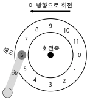
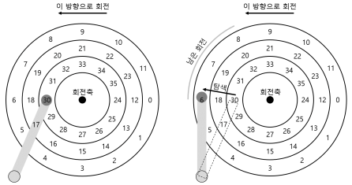
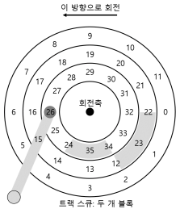
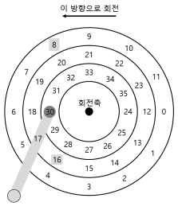

# 1. 하드 디스크 드라이브
- <strong>하드 디스크 드라이브</strong>는 수세기 동안 컴퓨터 시스템의 영구적인 데이터 저장소였으며 파일 시스템 기술은 거의 대부분 하드 디스크 드라이브의 동작에 기반을 두고 개발되었다.

## 1.1 인터페이스
- 모든 현대 드라이브의 기본적인 인터페이스는 단순하다.
- 드라이브는 읽고 쓸 수 있는 매우 많은 수의 섹터들로 이루어져 있다.
    - 그렇기 때문에 디스크를 섹터들의 배열로 볼 수 있으며 0부터 n-1이 드라이브의 <strong>주소 공간</strong>이 된다.

- 디스크 드라이브의 "계약 불문율"
    - 드라이브의 주소 공간에서 가깝게 배치되어 있는 두 개의 블럭을 접근하는 것은 멀리 떨어져 있는 두 개의 블럭을 접근하는 것보다 빠르다고 가정한다.
    - 연속적인 청크의 블럭을 접근하는 것(순차 읽기 쓰기)이 가장 빠르며 어떤 랜덤 접근 패턴보다 매우 빠르다는 것이다.

## 1.2 기본 구조
- <strong>플래터(platter)</strong>
    - 원형의 딱딱한 표면을 갖고 있는 플래터에 자기적 성질을 변형하여 데이터를 지속시킨다.
    - 디스크는 하나 또는 그 이상의 플래터를 갖고 있으며 각각은 2개의 <strong>표면(surface)</strong>을 갖고 있다.
- <strong>회전축(spindle)</strong>
    - 플래터들은 회전축이라는 것으로 고정되어 있는데, 이 축은 모터와 연결 되어 있어서 플래터를 일정한 속도로 회전시킨다.
    - 회전의 속도는 <strong>분당 회전 수(rotation per minute, RPM)</strong>로 측정된다.
- <strong>트랙(track)</strong>
    - 각 표면에 동심원을 따라 배치되어 있는 섹터들 위에 데이터가 부호화된다. 이 때 동심원 하나를 트랙이라고 한다.
- <strong>디스크 헤드(disk head)</strong>
    - 읽기와 쓰기 동작은 디스크 헤드를 통해 할 수 있고, 각 표면마다 헤드가 하나씩 존재한다.
- <strong>디스크 암(disk arm)</strong>
    - 디스크 헤드는 디스크암에 연결이 되어 있으며 이것을 통해서 헤드가 원하는 트랙 위에 위치하도록 이동시킬 수 있다.
    
## 1.3 간단한 디스크 드라이브

- 위의 그림은 트랙 하나와 헤드가 있는 디스크의 모습이다.

- 트랙이 하나 뿐인 간단한 디스크에서 요청이 어떻게 처리되는지 알아보자. 

### 단일 트랙 지연 시간: 회전 지연
- 디스크 헤드 아래에 원하는 섹터가 위치하기를 기다린다.
    - 이러한 기다림은 현대 드라이브에서도 흔하게 발생하며 I/O 서비스 시간에서 중요한 요소이기 때무에 <strong>회전형 지연(rotational delay)</strong> 때로는 <strong>회전 지연(rotation delay)</strong>라고도 한다.

### 멀티 트랙: 탐색 시간

- 읽기 요청을 처리하기 위해서 드라이브는 디스크 암을 먼저 올바른 트랙 위에 위치시킨다.
    - 이 과정을 <strong>탐색(seek)</strong>이라고 한다.
    - 회전과 더불어서 탐색은 가장 비싼 디스크 동작 중 하나다.
- 탐색은 여러 단계로 되어 있다.
    1. 가속 단계로 디스크 암이 움직이기 시작한다.
    2. 활주 단계로 디스크 암이 최고 속도로 움직인다.
    3. 감속 단계 이후에 안정화 단계에서 정확한 트랙위에 헤드가 조심스럽게 위치하게 된다.
    - 드라이브가 정확한 트랙 위에 확실히 위치해야 하기 때문에 <strong>안정화 시간(settling time)</strong>은 중요하다.

### 그 외의 세부 사항

- 위의 그림은 <strong>트랙 비틀림(track skew)</strong>이라 불리는 기술을 채용하여 트랙의 경계를 지나서 순차적으로 존재하는 섹터들을 올바르게 읽을 수 있게 한다.

 
- 바깥 측에 공간이 더 많다는 구조적인 이유 때문에 바깥 측 트랙들에는 안쪽 트랙들보다 더 많은 섹터들이 있다는 것이 현실이다. 
  - 이러한 트랙들은 흔히 <strong>멀티 구역(multi-zoned)</strong> 디스크 드라이브라고 부른다.

 
- 마지막으로 현대 디스크 드라이브의 가장 중요한 부분은 <strong>캐시(cache)</strong>로서, <strong>트랙 버퍼(track buffer)</strong>라고도 부른다.
  - 작은 크기의 메모리로 드라이브가 디스크에서 읽거나 쓴 데이터를 보관하는 데 사용한다.

## 1.4 디스크 스케줄링
- I/O 비용이 크기 때문에 운영체제는 디스크에게 요청되는 I/O의 순서를 결정하는 데에 중요 역할을 담당했다.
  - I/O 요청이 주어졌을 때 <strong>디스크 스케줄러</strong>는 요청을 조사하여 다음에 어떤 I/O를 처리할지 결정한다.
- 각 작업의 길이가 얼마나 될지 알 수 없는 작업 스케줄링과 다르게 디스크 스케줄링의 경우, 디스크 요청 작업이 얼마나 길지를 꽤 정확히 예측할 수 있다.
  - 디스크 스케줄러는 <strong>SJF(shortest job first)</strong>의 원칙을 따르려고 노력한다.
  
### SSTF: 최단 탐색 시간 우선
- <strong>최단 탐색 시간 우선(shortest-seek-time-first, SSTF)</strong>는 트랙을 기준으로 I/O 요청 큐를 정렬하여 가장 가까운 트랙의 요청이 우선 처리되도록 한다.
- 하지만, 드라이브의 구조는 호스트 운영체제에게 공개되어 있지 않으며 운영체제는 그저 블럭들의 배열로만 인식한다.
  - 운영체제는 SSTF를 사용하는 대신 <strong>가장 가까운 블럭 우선(Nearest-block-first, NBF)</strong> 방식을 사용하면 된다.
- 하지만 이 탐색 방법은 <strong>기아 현상(starvation)</strong>이 발생한다.
  - 계속해서 인접한 트랙만 왔다 갔다 하면 저 멀리 있는 트랙은 접근할 수 없다.
  
### 엘리베이터(SCAN 또는 C-SCAN)
- <strong>SCAN</strong>이라고 불렸던 이 알고리즘은 트랙의 순서에 따라 디스크를 앞뒤로 가로지르며 요청을 서비스한다.
  - 디스크를 한번 가로지르는 것을 스위프(seep)라고 부른다.
- <strong>F-SCAN</strong>은 스위프하는 동안에 큐를 동결시킨다.
  - 디스크를 스위프 하는 동안에 새로운 요청이 도착하면 다음 번 서비스 될 큐에 삽입된다.
- <strong>C-SCAN</strong>은 또 다른 일반적인 변종으로 <strong>Circular SCAN</strong>의 약자이다.
  - 밖에서 안으로만 스위프한다.
  - 그리고 한번 스위프하면 다시 밖으로 돌아간다.
  
### SPTF: 최단 위치 잡기 우선
- <strong>최단 위치 잡기 우선(shortest positioning time first)</strong> 또는 <strong>SPTF</strong>(때로는 <strong>최단 접근 시간 우선(shortest access time first, SATF</strong>)을 알아보자

- 만약 위의 그림에서 블럭 16이 회전으로 인해 대기시간이 길어진다면 8을 먼저 접근하는 것이 비용이 저렴해진다.
  - 이러한 문제를 해결하기 위한 개념이다.
  - 하지만 트랙의 경계가 어디인지 현재 디스크 헤드가 어디에 있는지를 정확히 알 수 없기 때문에 운영체제에서 이것을 구현하기 매우 어렵다.
  - 그렇기 때문에 SPTF는 드라이브 내부에서 실행된다.

### 다른 스케줄링 쟁점들
- 현대 시스템에서 디스크는 대기 중인 여러 개의 요청들을 수용할 수 있으며 복잡한 내부 스케줄러를 자체적으로 갖고 있다.
- 디스크는 상세한 트랙 배치 정보와 헤드의 위치에 대한 내부 지식을 사용하여 최선의(SPTF) 순서로 정렬한다.
- 디스크 스케줄러가 수행하는 중요한 또 다른 관련 작업은 <strong>I/O병합(I/O merging)</strong>이다.
  - 예를들어 33번, 8번 그리고 34번을 읽는 연속된 요청이라면, 33번과 34번을 병합하여 두 블럭의 길이의 요청으로 만든다.
  - 오버헤드를 줄일 수 있기 때문에 운영체제에서 병합은 특히 중요하다.
  
